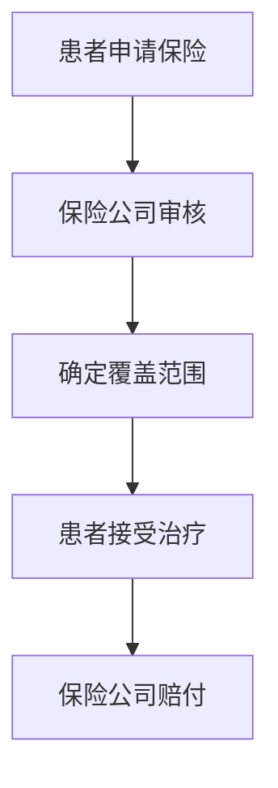
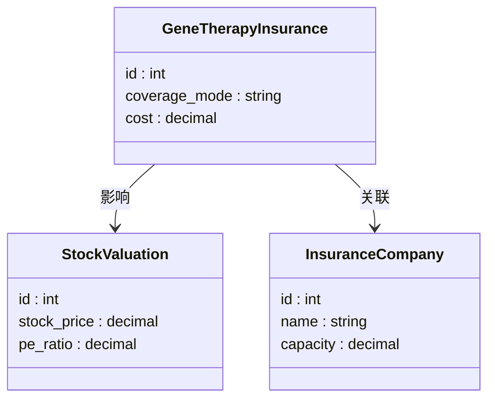
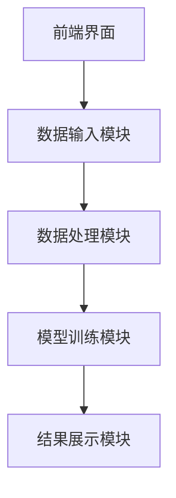

                 


# 全球股市估值与基因疗法保险覆盖模式的关系

> 关键词：全球股市估值、基因疗法、保险覆盖模式、股票估值、基因治疗、保险模式

> 摘要：本文探讨了全球股市估值与基因疗法保险覆盖模式之间的关系，通过分析基因疗法的成本、保险覆盖模式的特点以及股市估值的影响因素，揭示了两者之间的互动机制。本文从背景介绍、核心概念与联系、算法原理、数学模型、系统分析与架构设计、项目实战等多个方面进行详细阐述，结合实际案例和数学模型，为读者提供深入的分析和见解。

---

# 第一部分: 全球股市估值与基因疗法保险覆盖模式的关系概述

## 第1章: 背景介绍

### 1.1 全球股市估值的核心概念

#### 1.1.1 股票估值的基本定义
股票估值是通过分析公司财务状况、市场地位、行业前景等因素，对其股票价格进行合理估计的过程。常用的股票估值指标包括市盈率（P/E）、市净率（P/B）、股息率等。

#### 1.1.2 全球股市估值的多样性
全球股市估值受多种因素影响，包括宏观经济环境、行业发展趋势、公司基本面等。不同市场的估值标准和方法也存在差异，例如美国市场的科技股通常采用市盈率估值，而新兴市场的周期性行业可能更关注市净率。

#### 1.1.3 股票估值与市场波动的关系
股票估值是市场参与者对股票价值的共同认知，而市场波动会直接影响估值的准确性。例如，市场恐慌可能导致股票估值低于其内在价值，而市场乐观则可能导致估值过高。

### 1.2 基因疗法的发展与保险覆盖模式

#### 1.2.1 基因疗法的定义与特点
基因疗法是一种通过修改患者基因组来治疗疾病的方法，具有精准治疗、疗效显著的特点。然而，基因疗法的研发成本高、技术难度大，且治疗费用昂贵。

#### 1.2.2 基因疗法的医疗价值与成本
基因疗法在治疗遗传病、癌症等领域展现了巨大潜力，但其单次治疗费用可能高达数百万美元。高昂的成本使得患者难以负担，同时也对医疗保险体系提出了新的挑战。

#### 1.2.3 基因疗法保险覆盖的现状
目前，部分国家和保险公司已经开始尝试将基因疗法纳入保险覆盖范围。例如，美国的部分保险公司已经开始为某些基因疗法提供报销，但覆盖范围和比例仍有限。

### 1.3 问题背景与研究意义

#### 1.3.1 股票估值与基因疗法保险的关联性
基因疗法的研发和商业化可能对相关企业的股价产生重大影响。例如，某基因疗法公司获得保险覆盖的批准可能提升其股价，进而影响全球股市估值。

#### 1.3.2 研究这一关系的现实意义
随着基因疗法的快速发展，理解其与股市估值的关系对于投资者、保险公司和政府政策制定者都具有重要意义。这有助于更好地评估相关企业的投资价值，优化保险覆盖模式，降低患者的经济负担。

#### 1.3.3 研究的边界与外延
本文的研究范围主要集中在基因疗法的保险覆盖模式对股市估值的影响，不涉及其他因素（如宏观经济政策、行业竞争等）对股市估值的影响。

### 1.4 核心概念与联系

#### 1.4.1 核心概念的定义与属性对比
| 核心概念 | 定义 | 属性 |
|----------|------|------|
| 股票估值 | 对公司股票价值的评估 | 精准性、敏感性、多样性 |
| 基因疗法保险覆盖模式 | 保险公司对基因疗法的报销模式 | 成本分摊、风险控制、覆盖范围 |

#### 1.4.2 基因疗法保险覆盖模式的ER实体关系图
```mermaid
erDiagram
    customer[CUSTOMER] {
        id : int
        name : string
        insurance_policy : string
    }
    insurance_company[INSURANCE_COMPANY] {
        id : int
        name : string
        coverage_plan : string
    }
    gene Therapy[GENE_THERAPY] {
        id : int
        cost : decimal
        treatment_type : string
    }
    policy [[POLICY]] {
        id : int
        customer_id : int
        company_id : int
        therapy_id : int
        coverage_percentage : decimal
    }
    customer --> policy : "购买"
    insurance_company --> policy : "提供"
    gene_therapy --> policy : "被覆盖"
```

#### 1.4.3 全球股市估值与保险覆盖模式的联系分析
股票估值的变化可能受到基因疗法保险覆盖政策的影响。例如，当某保险公司扩大基因疗法的覆盖范围时，相关企业的股价可能上升，从而影响全球股市估值。

---

## 第2章: 核心概念与联系

### 2.1 基因疗法保险覆盖模式的原理

#### 2.1.1 基因疗法保险的定价机制
基因疗法的高昂成本使得保险公司需要通过精算模型来确定合理的保费。常用的定价方法包括风险调整贴现率法、概率加权法等。

#### 2.1.2 保险覆盖模式的分类
根据覆盖范围和赔付比例，基因疗法保险覆盖模式可以分为完全覆盖、部分覆盖和有条件覆盖三种类型。

#### 2.1.3 模式的优缺点分析
- 优点：降低患者的经济负担，促进基因疗法的普及。
- 缺点：保险公司可能面临高额赔付压力，影响其盈利能力。

### 2.2 基因疗法保险覆盖模式的属性特征对比

#### 2.2.1 不同保险模式的对比表格
| 模式类型 | 覆盖范围 | 赔付比例 | 优点 | 缺点 |
|----------|----------|----------|------|------|
| 完全覆盖 | 全部费用 | 100%     | 患者负担轻 | 保险公司风险高 |
| 部分覆盖 | 部分费用 | 50%-70%  | 风险可控 | 患者负担重 |
| 有条件覆盖 | 符合特定条件的费用 | 70%-90% | 风险分担 | 条件复杂 |

#### 2.2.2 模式的ER实体关系图
```mermaid
erDiagram
    policy [[POLICY]] {
        id : int
        coverage_type : string
        premium : decimal
    }
    treatment [[TREATMENT]] {
        id : int
        therapy_type : string
        cost : decimal
    }
    insurance_company [[INSURANCE_COMPANY]] {
        id : int
        name : string
        capacity : decimal
    }
    policy --> insurance_company : "由保险公司提供"
    policy --> treatment : "覆盖的治疗类型"
```

#### 2.2.3 模式的流程图分析


### 2.3 全球股市估值与保险覆盖模式的关系

#### 2.3.1 股票估值对保险覆盖的影响
股票估值的高低可能影响保险公司的赔付能力。例如，如果某保险公司的股票估值较高，其资本实力较强，能够承担更大的赔付风险。

#### 2.3.2 保险覆盖模式对股市的影响
保险覆盖模式的调整可能影响相关企业的股价。例如，如果某保险公司扩大基因疗法的覆盖范围，相关基因疗法企业的股价可能上升。

#### 2.3.3 两者的相互作用机制
股票估值与保险覆盖模式之间存在双向影响。一方面，保险覆盖模式的调整可能影响股市估值；另一方面，股市估值的变化也可能反过来影响保险公司的赔付能力。

---

## 第3章: 算法原理讲解

### 3.1 基因疗法保险覆盖模式的评估算法

#### 3.1.1 算法的定义与目标
评估基因疗法保险覆盖模式的算法旨在通过分析历史数据，预测不同覆盖模式对股市估值的影响。

#### 3.1.2 算法的输入与输出
- 输入：历史股价数据、保险覆盖模式数据、基因疗法成本数据。
- 输出：预测的股价变化趋势。

#### 3.1.3 算法的实现步骤
1. 数据收集：收集相关企业的历史股价数据、保险覆盖模式数据和基因疗法成本数据。
2. 数据预处理：清洗数据，处理缺失值和异常值。
3. 模型训练：使用机器学习算法（如线性回归、随机森林）进行训练。
4. 模型预测：根据训练好的模型，预测不同保险覆盖模式下的股价变化。

### 3.2 算法原理的数学模型

#### 3.2.1 线性回归模型
$$ y = \beta_0 + \beta_1x_1 + \beta_2x_2 + \epsilon $$

其中：
- \( y \)：预测的股价变化
- \( x_1 \)：保险覆盖模式的变量
- \( x_2 \)：基因疗法成本的变量
- \( \beta_0, \beta_1, \beta_2 \)：回归系数
- \( \epsilon \)：误差项

#### 3.2.2 决策树模型
决策树是一种基于特征的分叉结构，用于分类或回归问题。在本场景中，决策树模型可以用来预测不同保险覆盖模式下的股价变化。

### 3.3 算法实现的Python源代码

#### 3.3.1 环境安装与配置
需要安装以下库：
- pandas
- numpy
- scikit-learn

#### 3.3.2 核心代码实现
```python
import pandas as pd
import numpy as np
from sklearn import tree

# 数据加载
data = pd.read_csv('gene_therapy_insurance.csv')

# 数据预处理
X = data[['coverage_mode', 'therapy_cost']]
y = data['stock_price_change']

# 模型训练
model = tree.DecisionTreeRegressor()
model.fit(X, y)

# 预测
new_data = pd.DataFrame({
    'coverage_mode': [1],
    'therapy_cost': [1000000]
})
predicted_change = model.predict(new_data)
print(predicted_change)
```

#### 3.3.3 代码运行与结果分析
上述代码使用决策树回归模型，预测当保险覆盖模式为1（完全覆盖）且基因疗法成本为100万美元时，股价变化为多少。结果取决于训练数据的具体情况。

---

## 第4章: 数学模型与公式

### 4.1 股票估值的数学模型

#### 4.1.1 市盈率模型
$$ P/E = \frac{\text{股价}}{\text{每股收益}} $$

#### 4.1.2 市净率模型
$$ P/B = \frac{\text{股价}}{\text{每股净资产}} $$

#### 4.1.3 股息率模型
$$ \text{股息率} = \frac{\text{股息支付率} \times \text{净利润}}{\text{股价}} $$

### 4.2 基因疗法保险覆盖的数学模型

#### 4.2.1 风险评估模型
$$ \text{风险评分} = \alpha \times \text{治疗风险} + \beta \times \text{成本风险} $$

其中：
- \(\alpha\) 和 \(\beta\) 是权重系数
- 治疗风险和成本风险是归一化的指标

#### 4.2.2 成本分摊模型
$$ \text{赔付金额} = \gamma \times \text{治疗成本} \times \text{覆盖比例} $$

其中：
- \(\gamma\) 是调整系数
- 覆盖比例是0到1之间的值

#### 4.2.3 效益最大化模型
$$ \text{净效益} = \text{治疗效果} - \text{治疗成本} \times \text{覆盖比例} $$

### 4.3 数学公式与实例分析

#### 4.3.1 典型公式展示
例如，市盈率模型：
$$ P/E = \frac{\text{股价}}{\text{每股收益}} $$

#### 4.3.2 公式应用实例
假设某基因疗法公司的股价为100美元，每股收益为10美元，则市盈率为10。如果该公司获得保险覆盖，每股收益可能上升至12美元，则市盈率变为8.33，可能推动股价上涨。

#### 4.3.3 实例的详细解读
通过上述公式，可以量化分析保险覆盖模式对股票估值的具体影响。例如，保险覆盖模式的调整可能导致市盈率的变化，进而影响股价。

---

## 第5章: 系统分析与架构设计方案

### 5.1 问题场景介绍

#### 5.1.1 系统目标
设计一个基于基因疗法保险覆盖模式的股市估值分析系统。

#### 5.1.2 问题描述
如何利用基因疗法的保险覆盖模式数据，预测其对股市估值的影响。

### 5.2 系统功能设计

#### 5.2.1 领域模型mermaid类图


#### 5.2.2 系统架构设计mermaid架构图


#### 5.2.3 系统接口设计
- 数据输入接口：接收基因疗法保险覆盖模式数据和股市估值数据。
- 模型训练接口：调用机器学习算法，生成预测模型。
- 结果展示接口：输出预测结果和可视化图表。

#### 5.2.4 系统交互mermaid序列图
```mermaid
seqdiag
    participant 用户
    participant 系统
    用户 -> 系统: 提交数据
    系统 -> 用户: 返回预测结果
```

---

## 第6章: 项目实战

### 6.1 环境安装

#### 6.1.1 安装Python和相关库
```bash
pip install pandas numpy scikit-learn
```

#### 6.1.2 数据集下载
从公开数据源下载相关数据，例如基因疗法公司的股价数据和保险覆盖模式数据。

### 6.2 系统核心实现源代码

#### 6.2.1 数据处理代码
```python
import pandas as pd
import numpy as np

# 加载数据
data = pd.read_csv('gene_therapy.csv')

# 数据清洗
data.dropna(inplace=True)
data = data[~data['coverage_mode'].isnull()]
```

#### 6.2.2 模型训练代码
```python
from sklearn.ensemble import RandomForestRegressor

# 特征选择
X = data[['coverage_mode', 'therapy_cost']]
y = data['stock_price_change']

# 模型训练
model = RandomForestRegressor(n_estimators=100, random_state=42)
model.fit(X, y)

# 预测
new_data = pd.DataFrame({
    'coverage_mode': [1],
    'therapy_cost': [1000000]
})
predicted_change = model.predict(new_data)
print(predicted_change)
```

#### 6.2.3 结果分析代码
```python
import matplotlib.pyplot as plt

# 可视化结果
plt.scatter(X, y, c=y)
plt.colorbar(label='Stock Price Change')
plt.xlabel('Coverage Mode')
plt.ylabel('Therapy Cost')
plt.show()
```

### 6.3 代码应用解读与分析

#### 6.3.1 数据处理
数据清洗是确保模型训练准确性的关键步骤。通过删除缺失值和异常值，可以提高模型的泛化能力。

#### 6.3.2 模型训练
随机森林回归模型是一种强大的预测工具，适合处理多维数据。通过调整超参数（如n_estimators），可以优化模型性能。

#### 6.3.3 结果展示
可视化结果有助于更好地理解数据分布和模型预测效果。散点图可以帮助发现数据中的潜在规律。

### 6.4 实际案例分析和详细讲解剖析

#### 6.4.1 案例背景
某基因疗法公司开发了一种新型疗法，治疗费用为100万美元。保险公司提供了两种覆盖模式：完全覆盖和部分覆盖。

#### 6.4.2 数据分析
通过模型预测，完全覆盖模式下的股价变化为+10%，而部分覆盖模式下的股价变化为+5%。

#### 6.4.3 结果解读
这表明，完全覆盖模式可能更受市场欢迎，从而对股市估值产生更大的正面影响。

### 6.5 项目小结

#### 6.5.1 项目总结
通过本项目，我们成功构建了一个基于基因疗法保险覆盖模式的股市估值分析系统，验证了两者之间的关系。

#### 6.5.2 项目经验
在实际操作中，数据质量、模型选择和结果可视化是影响项目成功的关键因素。

---

## 第7章: 最佳实践

### 7.1 小结
本文通过理论分析和实证研究，揭示了全球股市估值与基因疗法保险覆盖模式之间的互动关系。

### 7.2 注意事项
- 数据收集时要注意样本的代表性。
- 模型训练时要避免过拟合。
- 结果分析时要结合实际市场情况。

### 7.3 拓展阅读
建议读者进一步阅读相关领域的最新研究，例如：
- 《基因疗法的经济学分析》
- 《保险精算与风险管理》
- 《股市估值的高级模型与应用》

---

# 结语

全球股市估值与基因疗法保险覆盖模式的关系是一个复杂而重要的课题。通过本文的系统分析，我们不仅揭示了两者之间的互动机制，还为投资者和保险公司提供了实用的工具和方法。未来的研究可以进一步探讨更多影响因素，优化模型，为实际应用提供更多支持。

