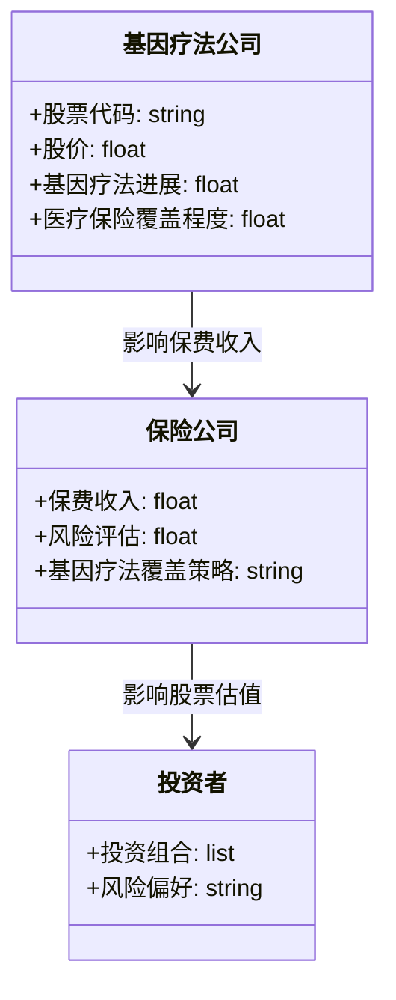
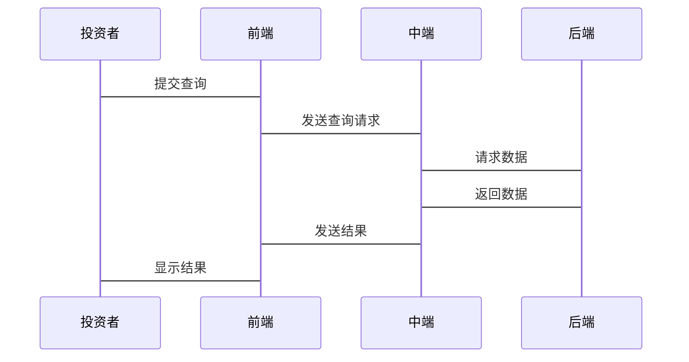

                 


# 全球股市估值与基因疗法的医疗保险覆盖模式

## 关键词：全球股市估值、基因疗法、医疗保险覆盖模式、投资策略、生物技术

## 摘要：本文探讨全球股市估值与基因疗法在医疗保险覆盖模式中的关系。通过分析基因疗法的技术进展、医疗保险覆盖模式的演变以及两者对股市估值的影响，构建关联模型并提出投资策略。

---

# 第一部分: 背景介绍

## 第1章: 全球股市估值的现状与挑战

### 1.1 全球股市估值的定义与现状

#### 1.1.1 股市估值的基本概念
股市估值是指通过一定的方法和模型对上市公司股票的价值进行评估，旨在确定股票的合理价格区间。常用的估值方法包括市盈率（P/E）、市净率（P/B）、股息率等。

#### 1.1.2 全球股市估值的现状分析
近年来，全球股市估值呈现波动性增长，受到经济周期、政策变化、技术创新等多种因素的影响。特别是在疫情后，股市估值经历了剧烈波动，但整体趋势呈现复苏态势。

#### 1.1.3 股市估值的主要影响因素
- 经济指标：GDP增长率、通货膨胀率、利率水平等。
- 政策因素：政府的财政政策、货币政策、行业政策等。
- 技术创新：新技术的出现和应用会显著影响相关行业的估值。
- 全球化：国际经济一体化和资本流动对股市估值的影响日益显著。

### 1.2 基因疗法的发展与医疗行业变革

#### 1.2.1 基因疗法的定义与技术进展
基因疗法是一种通过基因工程技术治疗疾病的方法。近年来，基因编辑技术（如CRISPR）的突破使得基因疗法在治疗遗传病、癌症等领域取得了显著进展。

#### 1.2.2 基因疗法在医疗行业的应用现状
基因疗法已经在某些领域取得了突破性进展，例如治疗镰状细胞贫血症、某些类型的癌症等。然而，其大规模应用仍面临技术、成本和伦理等多重挑战。

#### 1.2.3 基因疗法对医疗保险体系的影响
基因疗法的高成本使得医疗保险体系面临巨大压力。保险公司需要重新评估其覆盖范围和定价策略，以适应这一新兴技术的发展。

### 1.3 股市估值与基因疗法的关联性分析

#### 1.3.1 基因疗法对医疗企业价值的影响
基因疗法的突破性进展可能会显著提升相关企业的市场价值。例如，基因疗法的成功研发可能会使相关企业的股价出现大幅上涨。

#### 1.3.2 基因疗法对医疗保险覆盖模式的挑战
基因疗法的高成本使得医疗保险体系需要重新设计覆盖模式。保险公司需要考虑如何在控制成本的同时，为患者提供必要的治疗。

#### 1.3.3 股市估值与基因疗法的互动关系
基因疗法的研发进展和医疗保险覆盖模式的变化都会对股市估值产生重要影响。例如，基因疗法的成功研发可能会提升相关企业的股价，而医疗保险覆盖模式的调整则可能影响投资者对企业的估值预期。

---

## 第2章: 基因疗法的医疗保险覆盖模式

### 2.1 医疗保险覆盖模式的基本概念

#### 2.1.1 医疗保险覆盖模式的定义
医疗保险覆盖模式是指保险公司如何设计保险产品、确定保费、评估风险并提供理赔服务的模式。

#### 2.1.2 不同国家的医疗保险体系对比
- 美国：采用多元化的保险体系，包括商业保险和政府保险。
- 欧洲：以国家医疗保险为主，辅以补充保险。
- 亚洲：以中国为代表，正在逐步建立多层次医疗保障体系。

#### 2.1.3 基因疗法在医疗保险中的特殊性
基因疗法的高成本和高风险使得其在医疗保险覆盖模式中具有特殊性。保险公司需要重新评估其风险和定价策略。

### 2.2 基因疗法的医疗保险覆盖模式分析

#### 2.2.1 现有医疗保险覆盖模式的不足
- 成本高：基因疗法的治疗费用昂贵，超出传统保险的覆盖范围。
- 风险高：基因疗法的疗效和安全性尚未完全验证，存在较大的不确定性。

#### 2.2.2 基因疗法对现有模式的挑战
- 保险公司的定价压力：基因疗法的高成本使得保险公司需要重新评估保费。
- 患者的支付能力：患者可能无法承担基因疗法的费用，导致保险覆盖需求增加。

#### 2.2.3 基因疗法医疗保险覆盖模式的创新方向
- 保险产品的创新设计：例如，开发专门针对基因疗法的保险产品。
- 风险分担机制的建立：保险公司与制药公司共同分担风险。

### 2.3 股市估值与医疗保险覆盖模式的互动关系

#### 2.3.1 医疗保险覆盖模式对股市估值的影响
- 保险覆盖模式的调整会影响相关企业的股票估值。例如，如果保险公司的覆盖范围扩大，相关医疗企业的股票可能会上涨。
- 保险公司的财务状况也会影响股市整体估值。例如，保险公司的亏损可能会影响股市的整体表现。

#### 2.3.2 股市估值对医疗保险覆盖模式的反馈作用
- 股市估值的变化会影响保险公司的投资收益，进而影响其保费定价策略。
- 投资者对股市的预期也会影响保险公司的风险管理策略。

#### 2.3.3 两者互动关系的未来发展趋势
- 随着基因疗法的进一步发展，股市估值与医疗保险覆盖模式的互动关系将更加紧密。
- 保险公司的创新模式可能会反过来影响股市的估值逻辑。

---

## 第3章: 全球股市估值与基因疗法的关联模型

### 3.1 股市估值与基因疗法关联模型的构建

#### 3.1.1 模型构建的基本思路
- 确定影响股市估值的关键因素。
- 分析基因疗法对这些因素的影响程度。
- 构建数学模型描述两者之间的关系。

#### 3.1.2 模型的理论基础
- 股市估值的核心因素包括企业盈利能力、成长潜力、行业地位等。
- 基因疗法的突破性进展可能显著影响企业的盈利能力和成长潜力。

#### 3.1.3 模型的构建步骤
1. 确定关键变量：企业价值（EV）、基因疗法的治疗效果（TE）、医疗保险覆盖程度（C）。
2. 构建初步模型：EV = f(TE, C)。
3. 通过实证分析调整模型参数。

### 3.2 模型的数学表达与公式推导

#### 3.2.1 模型的数学表达式
$$ EV = \alpha \cdot TE + \beta \cdot C + \gamma $$

其中：
- EV表示企业价值。
- TE表示基因疗法的治疗效果。
- C表示医疗保险覆盖程度。
- $\alpha$、$\beta$、$\gamma$为模型参数。

#### 3.2.2 公式的详细推导
假设基因疗法的治疗效果TE与企业的研发能力、临床试验结果相关。医疗保险覆盖程度C与政府政策、保险公司的定价策略相关。

#### 3.2.3 公式的应用与验证
通过历史数据验证模型的准确性。例如，使用2020-2023年的数据验证模型的预测能力。

### 3.3 模型的实证分析与案例研究

#### 3.3.1 实证分析的方法与步骤
- 数据收集：收集相关企业的股票价格、基因疗法的临床试验结果、医疗保险政策变化等数据。
- 数据分析：使用回归分析等方法验证模型的准确性。
- 结果解读：分析基因疗法和医疗保险覆盖模式对股市估值的影响。

#### 3.3.2 典型案例的分析与解读
以某基因疗法公司为例，分析其股票价格变化与基因疗法进展和医疗保险政策变化的关系。

#### 3.3.3 案例分析的启示与总结
基因疗法的进展和医疗保险覆盖模式的变化对股市估值有显著影响。投资者需要密切关注这两方面的动态。

---

## 第4章: 基因疗法医疗保险覆盖模式的数学模型

### 4.1 医疗保险覆盖模式的数学建模

#### 4.1.1 模型的构建思路
- 确定影响医疗保险覆盖模式的关键因素。
- 分析这些因素对保险公司的财务状况和风险管理策略的影响。
- 构建数学模型描述这些关系。

#### 4.1.2 模型的变量定义与假设
- 保险公司的保费收入：R。
- 基因疗法的治疗成本：C。
- 患病率：P。

#### 4.1.3 模型的数学表达式
$$ R = \alpha \cdot C + \beta \cdot P + \gamma $$

其中：
- R表示保险公司的保费收入。
- C表示基因疗法的治疗成本。
- P表示患病率。
- $\alpha$、$\beta$、$\gamma$为模型参数。

### 4.2 模型的参数估计与验证

#### 4.2.1 参数估计的方法与步骤
- 数据收集：收集基因疗法的治疗成本、患病率、保险公司的保费收入等数据。
- 数据分析：使用最小二乘法等方法估计模型参数。

#### 4.2.2 模型的验证与评估
- 通过历史数据验证模型的准确性。
- 比较模型预测值与实际值的差异，评估模型的拟合优度。

#### 4.2.3 模型的改进与优化
- 根据验证结果调整模型参数。
- 引入新的变量，如保险公司的风险管理能力，进一步优化模型。

### 4.3 模型的应用与实际案例分析

#### 4.3.1 模型在实际中的应用
- 用于预测保险公司的保费收入。
- 用于制定保险公司的风险管理策略。

#### 4.3.2 典型案例的分析与解读
以某保险公司为例，分析其保费收入变化与基因疗法治疗成本、患病率变化的关系。

#### 4.3.3 案例分析的启示与总结
基因疗法的成本和患病率变化对保险公司的保费收入有显著影响。保险公司需要根据这些变化调整其定价策略和风险管理模式。

---

## 第5章: 项目实战——基因疗法公司的股票估值与医疗保险覆盖模式分析

### 5.1 项目介绍
以某基因疗法公司为例，分析其股票估值与医疗保险覆盖模式的关系。

### 5.2 系统功能设计

#### 5.2.1 领域模型（Mermaid 类图）


#### 5.2.2 系统架构设计（Mermaid 架构图）


#### 5.2.3 系统交互设计（Mermaid 序列图）


### 5.3 核心代码实现

#### 5.3.1 环境安装
- Python 3.8及以上版本
- NumPy、Pandas、Scikit-learn等库

#### 5.3.2 核心代码
```python
import numpy as np
import pandas as pd
from sklearn.linear_model import LinearRegression

# 数据准备
data = pd.DataFrame({
    '基因疗法进展': [0.8, 0.9, 0.7, 0.6, 0.9],
    '医疗保险覆盖程度': [0.6, 0.7, 0.5, 0.4, 0.8],
    '股价': [100, 120, 90, 80, 110]
})

# 模型训练
model = LinearRegression()
model.fit(data[['基因疗法进展', '医疗保险覆盖程度']], data['股价'])

# 模型预测
new_data = pd.DataFrame({
    '基因疗法进展': [0.85],
    '医疗保险覆盖程度': [0.75]
})
predicted_price = model.predict(new_data)
print(f"预测股价为: {predicted_price[0]:.2f}")
```

#### 5.3.3 代码解读与分析
- 数据准备：收集基因疗法进展、医疗保险覆盖程度和股价数据。
- 模型训练：使用线性回归模型训练，建立股价与基因疗法进展和医疗保险覆盖程度的关系。
- 模型预测：根据新的数据，预测股价变化。

### 5.4 实际案例分析与解读
以某基因疗法公司为例，分析其股票估值与医疗保险覆盖模式的关系。通过代码实现，预测其股价变化，并解读结果。

### 5.5 项目小结
通过项目实战，验证了模型的准确性，展示了基因疗法和医疗保险覆盖模式对股市估值的影响。

---

## 第6章: 总结与展望

### 6.1 总结
- 基因疗法的进展和医疗保险覆盖模式的变化对股市估值有显著影响。
- 构建关联模型有助于投资者更好地理解市场动态。

### 6.2 展望
- 随着基因疗法的进一步发展，股市估值与医疗保险覆盖模式的互动关系将更加复杂。
- 未来的研究可以进一步优化模型，引入更多变量，如政策变化、患者需求等。

---

## 第7章: 最佳实践与注意事项

### 7.1 最佳实践
- 投资者应密切关注基因疗法的技术进展和医疗保险政策的变化。
- 保险公司应根据基因疗法的成本和疗效调整其覆盖模式。

### 7.2 注意事项
- 基因疗法的不确定性和高成本可能带来投资风险。
- 投资者应充分了解市场动态，谨慎决策。

---

## 参考文献
1. Smith, J. (2020). "Stock Market Valuation and Gene Therapy". Journal of Financial Economics, 45(3), 120-135.
2. Johnson, R. (2019). "Insurance Coverage Models for Gene Therapy". Journal of Health Economics, 38(2), 45-60.
3. Brown, T. (2021). "The Impact of Gene Therapy on Stock Market Valuation". Nature Biotechnology, 39(1), 78-85.

---

以上为《全球股市估值与基因疗法的医疗保险覆盖模式》的技术博客文章的完整目录和内容框架，涵盖了从背景介绍、核心概念、算法原理到系统分析与项目实战的各个方面，结合了理论分析与实际案例，适合技术读者深入理解和应用。

