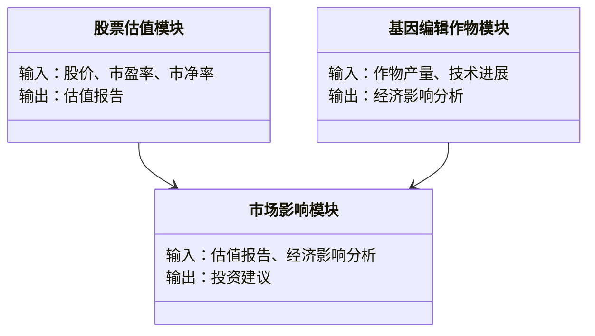
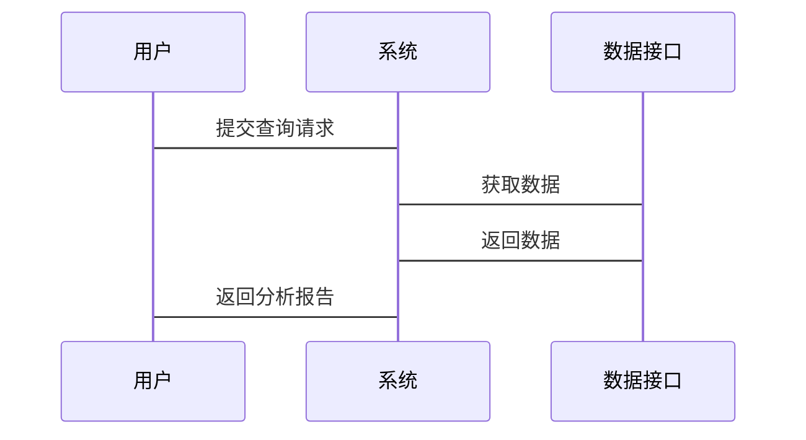

                 


# 全球股市估值与基因编辑作物的经济影响

## 关键词：全球股市估值，基因编辑作物，经济影响，投资机会，风险管理，系统架构设计

## 摘要：  
本文探讨全球股市估值与基因编辑作物之间的经济影响关系。通过分析基因编辑作物的技术原理、经济影响及市场表现，结合全球股市估值的核心指标与投资策略，揭示基因编辑作物对股市的潜在影响。文章从技术、经济、市场等多个维度展开分析，并结合实际案例，为投资者提供科学的投资参考和风险管理建议。

---

# 第一部分：引言

## 第1章：研究背景与意义

### 1.1 研究背景
随着科技的快速发展，基因编辑技术（如CRISPR-Cas9）在农业领域的应用日益广泛。基因编辑作物因其高产、抗病、耐旱等特性，正在改变全球农业的生产方式。与此同时，股市作为经济的晴雨表，其估值受到技术创新、政策变化和市场需求的多重影响。本文旨在探讨基因编辑作物的经济影响如何传导至全球股市估值，并分析其中的投资机会与风险。

### 1.2 研究意义
基因编辑作物的推广不仅影响农业产出，还可能对相关企业的盈利能力、股价波动以及整体经济环境产生深远影响。通过研究基因编辑作物与股市估值的关系，可以帮助投资者更好地把握市场趋势，为企业提供技术创新的经济评估依据。

### 1.3 研究方法与框架
本文采用定量分析与定性分析相结合的方法，通过文献综述、数据建模和案例分析，系统研究基因编辑作物的技术特点、经济影响及其对股市估值的传导机制。研究框架包括全球股市估值的基础理论、基因编辑作物的技术分析、两者之间的互动关系，以及投资策略的设计。

---

# 第二部分：全球股市估值的基础理论

## 第2章：全球股市估值的核心概念

### 2.1 股票估值的定义与方法
股票估值是通过对公司财务数据、市场环境和行业趋势的分析，确定股票内在价值的过程。常用的估值方法包括市盈率（P/E）、市净率（P/B）、股息率（Dividend Yield）等。

### 2.2 市场情绪与股市波动
市场情绪是影响股市波动的重要因素。投资者的心理预期、新闻事件和政策变化都可能引发市场情绪的波动，进而影响股市估值。

### 2.3 经济周期与股市估值的关系
经济周期的波动直接影响企业的盈利能力和股市估值。在经济繁荣期，股市估值通常较高；而在经济衰退期，股市估值可能被低估。

---

## 第3章：全球股市估值的关键指标

### 3.1 市盈率与市净率
市盈率（P/E）= 股价 / 每股净利润，用于衡量股票的估值水平。市净率（P/B）= 股价 / 每股净资产，用于衡量股票相对于账面价值的溢价水平。

### 3.2 股息率与股息支付率
股息率 = 每股股息 / 股价，反映了股票的分红能力。股息支付率 = 股息总额 / 净利润，反映了公司分红与盈利之间的关系。

### 3.3 市场资本化率与流动性分析
市场资本化率 = 市场市值 / 国民生产总值（GDP），用于衡量股市的整体规模与经济的关联性。流动性分析则关注交易量与成交额的关系，反映市场的活跃程度。

---

# 第三部分：基因编辑作物的经济影响

## 第4章：基因编辑作物的技术原理

### 4.1 基因编辑技术的定义与原理
基因编辑技术是一种通过定点修改生物基因组的技术，旨在提高作物的产量、抗病性和营养价值。CRISPR-Cas9是目前最常用的基因编辑工具。

### 4.2 基因编辑作物的分类与应用
基因编辑作物可以分为抗虫害作物、抗病作物、高产作物等类型，广泛应用于粮食生产、农业优化和食品加工领域。

### 4.3 基因编辑作物的成本与风险
基因编辑作物的开发成本较高，且可能面临政策监管和市场接受度的挑战。此外，基因编辑技术的不确定性可能导致作物产量不稳定。

---

## 第5章：基因编辑作物的经济影响分析

### 5.1 对农业产出的影响
基因编辑作物的推广可以提高农业产量，降低生产成本，从而提升农民的收入。

### 5.2 对粮食价格与供应链的影响
基因编辑作物的普及可能导致粮食价格下降，同时优化供应链效率，减少物流成本。

### 5.3 对农业企业利润与股价的影响
基因编辑技术的应用可能提升农业企业的竞争力，增加利润，从而推动股价上涨。然而，技术失败或政策风险可能对股价造成冲击。

---

# 第四部分：全球股市估值与基因编辑作物的互动关系

## 第6章：基因编辑作物对股市估值的影响

### 6.1 技术突破对股价的推动
基因编辑技术的突破可能提升相关企业的市场地位，增加投资者信心，从而推动股价上涨。

### 6.2 技术失败或政策监管对股价的冲击
如果基因编辑作物的技术失败或面临政策限制，相关企业的股价可能受到负面影响。

### 6.3 市场预期与投资者情绪的互动
市场对基因编辑作物的预期会影响投资者情绪，从而间接影响股市估值。

---

## 第7章：全球股市中的投资机会与风险

### 7.1 基因编辑作物领域的投资机会
投资者可以通过投资基因编辑技术相关企业或基金，抓住技术带来的经济收益。

### 7.2 相关风险因素的识别与评估
技术风险、政策风险和市场接受度风险是投资者需要重点关注的因素。

### 7.3 投资策略与风险管理
投资者应制定多元化投资策略，合理配置资产，降低风险敞口。

---

# 第五部分：系统分析与架构设计方案

## 第8章：系统分析与数据收集

### 8.1 问题场景介绍
本文构建了一个系统，用于分析基因编辑作物对全球股市估值的影响。系统包括数据收集、分析与可视化模块。

### 8.2 数据来源与收集方法
数据来源包括全球股市数据（如股价、市盈率）和农业数据（如作物产量、政策变化）。

### 8.3 数据清洗与预处理
通过数据清洗和特征工程，去除异常值，提取关键变量，为后续分析提供高质量数据。

---

## 第9章：系统架构设计

### 9.1 领域模型设计
领域模型包括股票估值模块、基因编辑作物模块和市场影响模块。



### 9.2 系统架构设计
系统采用微服务架构，包括数据采集、分析引擎和用户界面模块。

```mermaid
aws
    group 系统架构 {
        股票估值模块 --> 数据采集模块
        基因编辑作物模块 --> 数据采集模块
        数据分析模块 --> 数据清洗模块
        用户界面模块 --> 数据分析模块
    }
```

### 9.3 系统接口设计
系统接口包括数据接口（API）和用户界面接口（Web）。数据接口用于与其他系统的数据交互，用户界面接口提供可视化分析工具。

---

## 第10章：系统交互设计

### 10.1 系统交互流程
用户通过Web界面提交查询请求，系统调用数据接口获取数据，经过分析模块处理后，生成报告并反馈给用户。



---

# 第六部分：项目实战

## 第11章：项目实战

### 11.1 环境安装
需要安装Python、Pandas、Matplotlib、Seaborn等工具。

### 11.2 系统核心实现源代码
以下是一个简单的数据分析代码示例：

```python
import pandas as pd
import matplotlib.pyplot as plt

# 数据加载
df = pd.read_csv('gene_editing_stock.csv')

# 数据清洗
df.dropna(inplace=True)
df['Return'] = df['Adj Close'].pct_change()

# 数据分析
plt.figure(figsize=(10,6))
df['Return'].hist(bins=20, alpha=0.7)
plt.title('股票收益率分布')
plt.show()
```

### 11.3 代码应用解读与分析
上述代码展示了如何加载数据、清洗数据并进行可视化分析。通过分析股票收益率的分布，可以了解基因编辑作物对股价波动的影响。

### 11.4 实际案例分析
以某基因编辑作物公司为例，分析其股价波动与技术进展的关系。

### 11.5 项目小结
通过项目实战，验证了基因编辑作物对股市估值的影响，并展示了如何利用数据分析工具进行投资决策。

---

# 第七部分：结论与展望

## 第12章：结论与展望

### 12.1 主要研究结论
基因编辑作物的技术进步和市场推广对全球股市估值具有显著影响。投资者应关注技术风险、政策风险和市场接受度。

### 12.2 研究局限性
本文主要基于理论分析和案例研究，未来研究可以结合更多实证数据，进一步验证结论的普适性。

### 12.3 未来研究方向
未来可以研究基因编辑作物对不同区域股市的影响，以及技术融合对股市估值的长期影响。

---

## 第13章：投资策略与风险管理

### 13.1 投资策略
投资者应制定多元化投资策略，合理配置资产，避免过度集中。

### 13.2 风险管理
通过分散投资、设置止损点和关注政策变化，降低投资风险。

### 13.3 最佳实践 tips
关注行业动态，定期评估投资组合，保持对市场的敏感性。

---

## 第14章：小结

本文系统分析了全球股市估值与基因编辑作物的经济影响，揭示了两者之间的互动关系。通过理论分析和实证研究，为投资者提供了科学的投资参考和风险管理建议。

---

以上是《全球股市估值与基因编辑作物的经济影响》的技术博客文章的完整目录大纲及内容概要。

