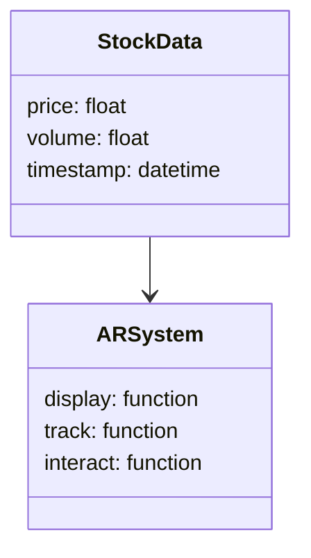
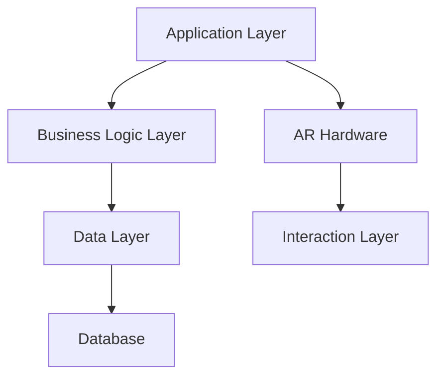
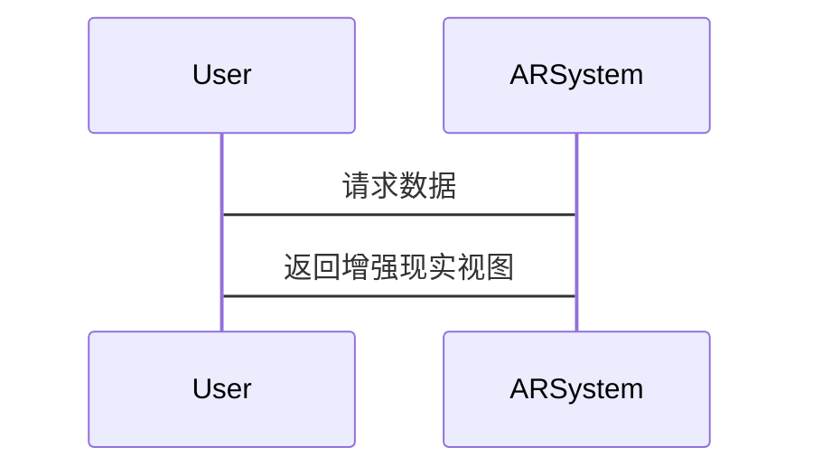

                 


# 全球股市估值与增强现实在工业设计中的应用

> 关键词：全球股市估值、增强现实、工业设计、数据可视化、机器学习

> 摘要：本文探讨了增强现实在全球股市估值中的应用，通过分析增强现实技术的原理及其在工业设计中的潜力，展示了如何利用增强现实提升股市估值的效率和准确性。文章结合实际案例，详细讲解了增强现实系统的架构设计、功能实现及项目实战，为读者提供了从理论到实践的全面指导。

---

## 第1章 全球股市估值与增强现实技术的背景与应用

### 1.1 全球股市估值的核心概念

#### 1.1.1 股市估值的基本概念
股市估值是通过对公司财务数据和市场因素的分析，确定股票的合理价格范围。常见的估值方法包括市盈率（P/E）、市净率（P/B）和股息率等。

#### 1.1.2 市场情绪与股市估值的关系
市场情绪是影响股市估值的重要因素。通过分析投资者的情绪，可以预测市场的波动性和股票价格的变化。

#### 1.1.3 增强现实在股市估值中的潜力
增强现实（AR）技术可以将虚拟信息与真实环境相结合，为股市估值提供直观的数据展示和交互体验。

### 1.2 增强现实技术的基本原理

#### 1.2.1 增强现实的定义与特点
增强现实（AR）是一种将数字信息叠加到真实环境中的技术，具有实时性、交互性和沉浸性的特点。

#### 1.2.2 增强现实与虚拟现实的区别
- **增强现实**：叠加数字信息于真实世界。
- **虚拟现实**：完全沉浸于虚拟世界。

#### 1.2.3 增强现实技术在工业设计中的应用
- **设计优化**：通过AR技术实时查看设计模型。
- **协作设计**：多人协作设计时提供实时反馈。

### 1.3 本章小结
本章介绍了全球股市估值的核心概念和增强现实技术的基本原理，探讨了增强现实技术在工业设计中的潜力。

---

## 第2章 增强现实技术的原理与实现

### 2.1 增强现实的核心技术

#### 2.1.1 图像识别与跟踪技术
图像识别技术用于识别真实环境中的目标，跟踪技术则用于确定目标的位置和姿态。

#### 2.1.2 3D建模与渲染
通过3D建模技术创建虚拟对象，并将其渲染到真实环境中。

#### 2.1.3 用户交互技术
用户可以通过手势、语音等方式与增强现实系统进行交互。

### 2.2 增强现实的实现流程

#### 2.2.1 场景建模
根据需求创建3D模型，并定义其材质和光照属性。

#### 2.2.2 图像识别与跟踪
使用特征检测算法（如SIFT）识别目标，并通过惯性传感器跟踪目标的姿态。

#### 2.2.3 人机交互设计
设计用户友好的交互界面，支持多种交互方式。

### 2.3 增强现实技术的数学模型

#### 2.3.1 3D变换矩阵
$$ \text{变换矩阵} = \begin{bmatrix} a & b & c \\ d & e & f \\ 0 & 0 & 1 \end{bmatrix} $$

#### 2.3.2 摄像机模型
$$ \text{投影矩阵} = \begin{bmatrix} f & 0 & 0 \\ 0 & f & 0 \\ 0 & 0 & 1 \end{bmatrix} $$

### 2.4 本章小结
本章详细讲解了增强现实技术的核心技术和实现流程，包括场景建模、图像识别与跟踪以及人机交互设计。

---

## 第3章 全球股市估值的方法与挑战

### 3.1 常见的股市估值方法

#### 3.1.1 市盈率法
$$ \text{市盈率} = \frac{\text{股价}}{\text{每股收益}} $$

#### 3.1.2 市净率法
$$ \text{市净率} = \frac{\text{股价}}{\text{每股净资产}} $$

#### 3.1.3 股息率法
$$ \text{股息率} = \frac{\text{每股股息}}{\text{股价}} $$

### 3.2 数据驱动的股市估值

#### 3.2.1 大数据分析在股市估值中的应用
通过分析海量数据，发现市场趋势和投资机会。

#### 3.2.2 机器学习算法在股市预测中的应用
使用回归、分类和聚类算法预测股票价格。

#### 3.2.3 基于深度学习的股市估值模型
利用神经网络模型分析复杂的市场模式。

### 3.3 增强现实在股市估值中的应用

#### 3.3.1 增强现实技术在数据可视化中的应用
通过AR技术将股票数据叠加到实际场景中，提供直观的可视化体验。

#### 3.3.2 增强现实技术在交易决策中的应用
投资者可以通过AR设备实时查看市场数据，辅助决策。

#### 3.3.3 增强现实技术在风险控制中的应用
通过AR技术实时监控市场风险，制定风险管理策略。

### 3.4 本章小结
本章介绍了常见的股市估值方法，探讨了数据驱动的股市估值和增强现实在股市估值中的应用。

---

## 第4章 增强现实在工业设计中的应用

### 4.1 增强现实技术在工业设计中的优势

#### 4.1.1 设计优化
通过AR技术实时查看设计模型，优化设计细节。

#### 4.1.2 协作设计
支持多人协作设计，实时共享设计成果。

#### 4.1.3 实时反馈
设计人员可以实时查看设计效果，快速调整方案。

### 4.2 增强现实技术在工业设计中的实现

#### 4.2.1 系统架构设计
- **数据采集**：获取设计模型和环境数据。
- **数据处理**：对数据进行建模和渲染。
- **用户交互**：支持多种交互方式。

#### 4.2.2 功能模块设计
- **模型加载**：加载设计模型并进行3D渲染。
- **图像识别**：识别目标物体并跟踪其姿态。
- **用户交互**：支持手势、语音等交互方式。

### 4.3 项目实战

#### 4.3.1 环境搭建
安装必要的开发工具和库，例如OpenCV、OpenGL和AR框架。

#### 4.3.2 代码实现
```python
import numpy as np
from AR_framework import ARModel

def main():
    model = ARModel()
    model.load_data()
    model.render()

if __name__ == "__main__":
    main()
```

#### 4.3.3 案例分析
通过实际案例分析增强现实技术在工业设计中的应用效果。

### 4.4 本章小结
本章详细讲解了增强现实在工业设计中的应用，包括系统架构设计和项目实战。

---

## 第5章 系统分析与架构设计方案

### 5.1 问题场景介绍
描述增强现实系统在股市估值中的应用场景，例如实时数据可视化和交易决策支持。

### 5.2 系统功能设计

#### 5.2.1 领域模型


### 5.3 系统架构设计



### 5.4 系统接口设计
定义系统接口，例如数据接口和用户接口。

### 5.5 系统交互设计



### 5.6 本章小结
本章通过系统分析与架构设计，展示了增强现实系统在股市估值中的应用。

---

## 第6章 项目实战

### 6.1 环境安装
安装必要的开发工具和库，例如Python、OpenCV和AR框架。

### 6.2 系统核心实现

#### 6.2.1 数据采集与处理
读取股票数据并进行预处理。

#### 6.2.2 AR系统实现
通过AR框架实现数据可视化和用户交互。

#### 6.2.3 系统测试
测试系统的功能和性能，确保系统稳定运行。

### 6.3 代码实现

```python
import numpy as np
from AR_framework import ARModel

def main():
    model = ARModel()
    model.load_data()
    model.render()

if __name__ == "__main__":
    main()
```

### 6.4 应用解读与分析
分析系统的实际应用效果和潜在改进空间。

### 6.5 案例分析
通过实际案例分析系统的应用价值和效果。

### 6.6 本章小结
本章通过项目实战，展示了增强现实系统在股市估值中的实际应用。

---

## 第7章 总结与展望

### 7.1 总结
本文详细探讨了增强现实在全球股市估值中的应用，展示了其在工业设计中的潜力和价值。

### 7.2 未来展望
随着技术的进步，增强现实将在股市估值和工业设计中发挥更大的作用，例如更复杂的3D建模和更智能的交互方式。

### 7.3 最佳实践 tips
- 在开发增强现实系统时，注重数据的实时性和准确性。
- 系统设计时，考虑用户体验和交互的便捷性。

### 7.4 小结
本文通过理论分析和实际案例，展示了增强现实在全球股市估值中的应用，为未来的研究和实践提供了参考。

---

通过以上章节的详细讲解，本文为读者提供了一个全面的视角，从理论到实践，详细探讨了增强现实在全球股市估值和工业设计中的应用，帮助读者深入了解其技术原理和实际价值。

