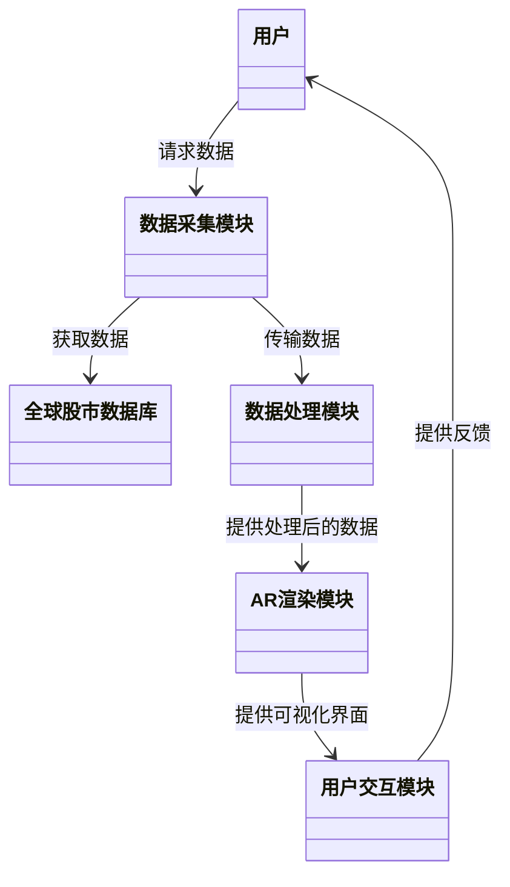
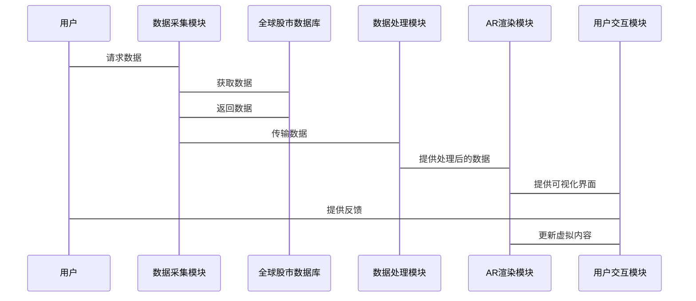

                 


# 全球股市估值与增强现实在教育培训中的应用

## 关键词：全球股市估值，增强现实，教育培训，金融数据分析，技术应用

## 摘要

本文探讨了全球股市估值与增强现实在教育培训中的应用，分析了增强现实技术如何提升金融数据的可视化和交互性，从而优化教育培训体验。文章详细介绍了全球股市估值的核心模型、增强现实技术的基本原理，以及它们在教育培训中的融合应用。通过具体案例分析和系统架构设计，展示了如何利用增强现实技术提升金融数据的教育效果。

---

# 第1章: 全球股市估值与增强现实在教育培训中的应用概述

## 1.1 全球股市估值的核心概念

### 1.1.1 股市估值的基本原理

股市估值是通过对公司基本面、市场环境和财务指标等多方面因素的分析，评估股票的内在价值。常见的估值方法包括：

1. **市盈率（P/E）**：计算公式为：$$ P/E = \frac{\text{股价}}{\text{每股收益}} $$
2. **市净率（P/B）**：计算公式为：$$ P/B = \frac{\text{股价}}{\text{每股净资产}} $$
3. **股息率**：计算公式为：$$ \text{股息率} = \frac{\text{每股股息}}{\text{股价}} $$

### 1.1.2 市场情绪对估值的影响

市场情绪是影响股市估值的重要因素，投资者的心理预期和行为会通过买盘和卖盘影响股价。例如，当市场情绪乐观时，投资者倾向于高估股票价值；反之，市场情绪悲观时，股票价值可能被低估。

### 1.1.3 增强现实在教育中的潜力

增强现实（AR）技术通过将虚拟信息叠加到真实环境中，提供沉浸式的交互体验。在教育培训中，AR技术可以用于金融数据的动态可视化，帮助学生更好地理解复杂的金融概念。

---

## 1.2 增强现实技术的基本原理

### 1.2.1 AR技术的定义与特征

增强现实（AR）是一种通过计算机生成的虚拟信息叠加在真实环境中的技术，其核心特征包括实时性、交互性和沉浸性。

### 1.2.2 AR在教育培训中的优势

1. **直观性**：AR技术将抽象的金融数据转化为可视化形式，帮助学生更好地理解。
2. **互动性**：通过AR技术，学生可以与虚拟数据进行互动，提升学习兴趣。
3. **实时性**：AR技术可以实时更新数据，帮助学生掌握最新的市场动态。

### 1.2.3 全球股市与AR技术的结合点

1. **金融数据可视化**：通过AR技术，将全球股市数据以3D形式呈现，帮助学生更好地理解市场波动。
2. **投资决策辅助**：AR技术可以提供实时的市场分析工具，辅助投资者做出更明智的投资决策。

---

## 1.3 本书的核心目标与框架

### 1.3.1 问题背景与目标

随着全球金融市场的日益复杂化，传统的金融教学方式难以满足学生对动态数据的实时理解和分析需求。通过结合AR技术，可以提升金融数据的教育效果。

### 1.3.2 本书的结构安排

本文将从全球股市估值的核心模型、增强现实技术的原理入手，分析两者的融合应用，并通过具体案例展示AR技术在金融教育中的实际应用。

### 1.3.3 预期读者与应用价值

本文适合金融从业者、教育工作者以及对AR技术感兴趣的读者阅读，旨在为他们提供一种全新的金融教学方式。

---

# 第2章: 全球股市估值模型与增强现实技术的融合

## 2.1 全球股市估值的关键模型

### 2.1.1 常见的股市估值方法

1. **相对估值法**：通过比较公司与同行业公司的估值指标来确定其价值。
2. **绝对估值法**：通过现金流折现模型（DCF）等方法估算公司的内在价值。

### 2.1.2 市盈率与市净率的计算公式

1. **市盈率（P/E）**：$$ P/E = \frac{\text{股价}}{\text{每股收益}} $$
2. **市净率（P/B）**：$$ P/B = \frac{\text{股价}}{\text{每股净资产}} $$

### 2.1.3 时间序列分析在估值中的应用

时间序列分析是一种通过历史数据预测未来趋势的方法，常用于股票价格预测。常见的模型包括ARIMA和LSTM。

---

## 2.2 增强现实技术的核心组件

### 2.2.1 标记识别与追踪技术

AR技术通过识别特定的标记（如二维码）来定位和跟踪真实环境中的物体，确保虚拟内容与真实环境的准确叠加。

### 2.2.2 三维建模与渲染技术

通过三维建模技术，将金融数据转化为虚拟模型，并通过实时渲染技术叠加到真实环境中。

### 2.2.3 用户交互与反馈机制

AR技术通过用户与虚拟内容的交互，提供实时反馈，增强用户的沉浸式体验。

---

## 2.3 股市估值与AR技术的融合场景

### 2.3.1 AR在金融数据可视化中的应用

通过AR技术，将全球股市数据以3D形式呈现，帮助学生直观理解市场波动。

### 2.3.2 AR技术辅助投资决策的潜力

AR技术可以提供实时的市场分析工具，辅助投资者做出更明智的投资决策。

### 2.3.3 教育培训中的互动式学习体验

通过AR技术，学生可以与虚拟数据进行互动，提升学习兴趣和效果。

---

# 第3章: 增强现实在全球股市估值中的算法原理

## 3.1 基于AR的金融数据可视化算法

### 3.1.1 数据采集与处理流程

1. **数据采集**：从全球股市数据库中获取实时数据。
2. **数据处理**：对数据进行清洗、转换和标准化处理。

### 3.1.2 三维数据可视化算法实现

通过三维建模技术，将金融数据转化为虚拟模型，并通过实时渲染技术叠加到真实环境中。

### 3.1.3 用户交互反馈的实时处理

通过用户与虚拟内容的交互，提供实时反馈，增强用户的沉浸式体验。

---

## 3.2 基于时间序列分析的股市估值算法

### 3.2.1 时间序列分析的基本原理

时间序列分析是一种通过历史数据预测未来趋势的方法，常用于股票价格预测。常见的模型包括ARIMA和LSTM。

### 3.2.2 常见的时间序列模型

1. **ARIMA模型**：$$ ARIMA(p, d, q) $$
2. **LSTM模型**：一种基于循环神经网络的时间序列预测模型。

### 3.2.3 算法实现与优化

通过Python实现时间序列模型，并利用历史数据进行训练和优化，提升模型的预测精度。

---

## 3.3 AR技术在金融分析中的应用算法

### 3.3.1 基于AR的金融数据交互算法

通过AR技术，将金融数据以3D形式呈现，并支持用户与虚拟数据进行交互。

### 3.3.2 增强现实环境下的实时数据处理

通过实时数据流处理技术，确保虚拟内容与真实环境的同步更新。

### 3.3.3 算法的性能优化与扩展性

通过算法优化和分布式计算技术，提升AR应用的运行效率和扩展性。

---

# 第4章: 全球股市估值与AR技术的系统架构设计

## 4.1 系统功能模块划分

1. **数据采集模块**：从全球股市数据库中获取实时数据。
2. **数据处理模块**：对数据进行清洗、转换和标准化处理。
3. **AR渲染模块**：将金融数据转化为虚拟模型，并进行实时渲染。
4. **用户交互模块**：支持用户与虚拟内容的交互，并提供实时反馈。

---

## 4.2 系统架构设计

### 4.2.1 系统功能设计（领域模型）



### 4.2.2 系统架构设计


### 4.2.3 系统接口设计

1. **数据采集接口**：用于从全球股市数据库中获取实时数据。
2. **数据处理接口**：用于对数据进行清洗、转换和标准化处理。
3. **AR渲染接口**：用于将金融数据转化为虚拟模型，并进行实时渲染。
4. **用户交互接口**：用于支持用户与虚拟内容的交互，并提供实时反馈。

### 4.2.4 系统交互设计



---

# 第5章: 项目实战

## 5.1 环境安装

1. **安装Python**：用于数据处理和算法实现。
2. **安装AR开发框架**：如OpenCV和ARKit。
3. **安装数据可视化库**：如Matplotlib和Plotly。

## 5.2 系统核心实现源代码

### 5.2.1 数据采集与处理代码

```python
import pandas as pd

# 数据采集模块
def get_stock_data(symbol):
    # 获取股票数据
    data = pd.read_csv(f'stock_data/{symbol}.csv')
    return data

# 数据处理模块
def preprocess_data(data):
    # 数据清洗和转换
    data['date'] = pd.to_datetime(data['date'])
    data.set_index('date', inplace=True)
    return data
```

### 5.2.2 AR渲染代码

```python
import numpy as np
import cv2

# AR渲染模块
def ar_rendering(data):
    # 三维数据可视化
    fig = plt.figure()
    ax = fig.add_subplot(111, projection='3d')
    ax.scatter(data['x'], data['y'], data['z'], c=data['value'], cmap='viridis')
    plt.show()
```

### 5.2.3 用户交互代码

```python
# 用户交互模块
def user_interaction():
    while True:
        user_input = input("请输入指令：")
        if user_input == '退出':
            break
        else:
            print("处理指令...")
```

## 5.3 实际案例分析

### 5.3.1 数据分析与可视化

通过Python代码，从全球股市数据库中获取实时数据，并利用Matplotlib进行可视化分析。

### 5.3.2 AR技术在金融教育中的应用

通过AR技术，将复杂的金融数据以3D形式呈现，帮助学生更好地理解市场波动。

---

# 第6章: 最佳实践与小结

## 6.1 最佳实践 tips

1. 在使用AR技术时，确保设备的兼容性和性能。
2. 在数据处理时，注意数据的实时性和准确性。
3. 在系统设计时，注重模块的独立性和可扩展性。

## 6.2 小结

本文详细介绍了全球股市估值与增强现实在教育培训中的应用，分析了两者的融合场景，并通过具体案例展示了AR技术在金融教育中的实际应用。

## 6.3 注意事项

1. 在使用AR技术时，确保设备的兼容性和性能。
2. 在数据处理时，注意数据的实时性和准确性。
3. 在系统设计时，注重模块的独立性和可扩展性。

## 6.4 拓展阅读

1. 《增强现实技术在金融领域的应用》
2. 《时间序列分析与股票预测》

---

通过本文的分析，读者可以深入了解全球股市估值与增强现实在教育培训中的应用，为未来的金融教育和投资决策提供新的思路和方法。

