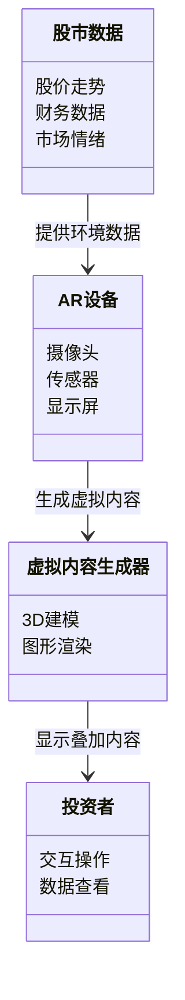
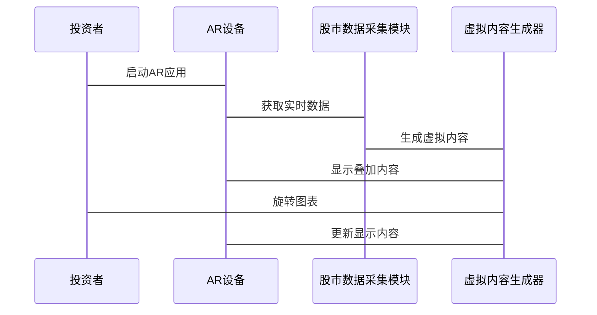

                 


# 全球股市估值与增强现实技术的关联

> 关键词：全球股市估值，增强现实技术，数据可视化，金融创新，技术融合

> 摘要：本文探讨了全球股市估值与增强现实技术之间的潜在关联，分析了增强现实技术如何通过数据可视化、交互性和沉浸式体验提升股市估值的效率与准确性。文章从理论到实践，详细阐述了增强现实技术在金融领域的应用潜力，并通过具体案例展示了其在股市估值中的实际价值。

---

# 第一部分: 全球股市估值与增强现实技术的背景介绍

## 第1章: 全球股市估值概述

### 1.1 全球股市估值的定义与重要性

#### 1.1.1 全球股市估值的定义
全球股市估值是指对某一地区或全球范围内股票市场的整体价值进行评估的过程。它通常通过市盈率（P/E ratio）、市净率（P/B ratio）等指标来衡量市场的整体健康状况和投资吸引力。

#### 1.1.2 全球股市估值的重要性
股市估值是投资者、分析师和政策制定者的重要工具。它能够帮助投资者评估市场的整体风险和收益潜力，为投资决策提供数据支持。同时，股市估值也是宏观经济分析的重要组成部分，能够反映一国或地区的经济状况。

#### 1.1.3 全球股市估值的常用方法
常用的股市估值方法包括：
1. 市盈率（P/E ratio）：股价与每股收益的比值。
2. 市净率（P/B ratio）：股价与每股净资产的比值。
3. 股息率（Dividend Yield）：股息与股价的比值。
4. 资产重估法：基于企业资产的价值进行评估。

---

### 1.2 增强现实技术的基本概念

#### 1.2.1 增强现实技术的定义
增强现实（Augmented Reality，AR）是一种将虚拟信息叠加到真实环境中的技术，通过计算机视觉、图形处理和传感器技术实现。AR的核心在于将数字信息与物理世界无缝融合，为用户提供沉浸式的交互体验。

#### 1.2.2 增强现实技术的核心特征
1. 实时性：AR需要实时捕捉环境数据并进行处理。
2. 交互性：用户可以通过手势、语音等方式与虚拟内容互动。
3. 沉浸性：AR通过叠加虚拟元素，增强用户的感官体验。
4. 可扩展性：AR可以应用于多个领域，包括教育、医疗、娱乐和金融。

#### 1.2.3 增强现实技术的应用领域
AR技术已在多个领域得到广泛应用，包括：
- 教育：虚拟教学场景。
- 医疗：手术模拟和患者数据可视化。
- 娱乐：AR游戏和沉浸式体验。
- 零售：虚拟试衣和商品展示。

---

### 1.3 全球股市估值与增强现实技术的关联

#### 1.3.1 增强现实技术在金融领域的潜力
AR技术为金融领域带来了新的可能性，特别是在数据可视化和用户交互方面。通过AR，投资者可以更直观地理解和分析复杂的金融数据。

#### 1.3.2 全球股市估值与增强现实技术的结合点
1. 数据可视化：AR可以将复杂的股市数据转化为直观的3D模型或动态图表。
2. 交互性：用户可以通过AR设备与虚拟数据进行互动，例如旋转或缩放图表以获取更多信息。
3. 实时更新：AR能够实时显示最新的股市数据，帮助投资者快速做出决策。

#### 1.3.3 未来发展趋势与可能性
随着AR技术的不断发展，其在金融领域的应用将更加广泛。未来，AR可能成为股市分析的主要工具之一，帮助投资者更高效地进行估值和决策。

---

# 第二部分: 全球股市估值与增强现实技术的核心概念

## 第2章: 全球股市估值的数学模型

### 2.1 常用的全球股市估值模型

#### 2.1.1 市盈率模型
市盈率（P/E ratio）是衡量股票价值的重要指标，公式为：
$$ P/E = \frac{股价}{每股收益} $$

#### 2.1.2 市净率模型
市净率（P/B ratio）是衡量股票价值的另一种方法，公式为：
$$ P/B = \frac{股价}{每股净资产} $$

#### 2.1.3 股息率模型
股息率是衡量股票收益能力的指标，公式为：
$$ 股息率 = \frac{每股股息}{股价} \times 100\% $$

---

### 2.2 数学模型与公式

#### 2.2.1 市盈率公式
$$ 市盈率 = \frac{股价}{每股收益} $$

#### 2.2.2 市净率公式
$$ 市净率 = \frac{股价}{每股净资产} $$

#### 2.2.3 股息率公式
$$ 股息率 = \frac{每股股息}{股价} \times 100\% $$

---

## 第3章: 增强现实技术的核心原理

### 3.1 增强现实技术的原理

#### 3.1.1 AR的基本原理
AR的核心原理是将虚拟内容与真实环境结合，通过计算机视觉和图形处理实现实时叠加。其主要步骤包括：
1. 数据采集：通过摄像头或传感器获取环境信息。
2. 数据处理：对环境数据进行分析和处理。
3. 虚拟内容生成：根据处理后的数据生成虚拟内容。
4. 融合与显示：将虚拟内容叠加到真实环境中，并通过设备呈现给用户。

#### 3.1.2 AR的关键技术
1. 计算机视觉：用于识别和跟踪环境中的物体。
2. 图形处理：用于生成和渲染虚拟内容。
3. 传感器技术：用于捕捉用户交互和环境数据。

#### 3.1.3 AR的实现步骤
1. 数据采集：通过摄像头获取真实环境的图像。
2. 特征提取：识别图像中的关键特征点。
3. 虚拟内容生成：根据特征点生成对应的虚拟内容。
4. 融合与显示：将虚拟内容叠加到真实图像中，并实时显示。

---

### 3.2 AR技术的数学模型与公式

#### 3.2.1 坐标系变换公式
$$ x' = x \cos \theta - y \sin \theta $$
$$ y' = x \sin \theta + y \cos \theta $$

#### 3.2.2 透视投影公式
$$ x' = \frac{x \cdot z}{z + d} $$
$$ y' = \frac{y \cdot z}{z + d} $$

---

# 第三部分: 增强现实技术在股市估值中的应用

## 第4章: 增强现实技术在股市数据可视化中的应用

### 4.1 股市数据的AR可视化

#### 4.1.1 股价走势的AR展示
通过AR技术，投资者可以以3D形式查看股价的动态变化，直观理解市场的波动趋势。

#### 4.1.2 财务数据的AR呈现
AR可以将企业的财务数据（如收入、利润）以虚拟图表的形式叠加到真实环境中，帮助用户快速理解企业的财务状况。

#### 4.1.3 市场情绪的AR表达
通过AR技术，市场情绪（如投资者信心）可以以颜色或动态图形的形式呈现，帮助用户感知市场的整体情绪。

---

### 4.2 增强现实技术在股市估值中的具体应用

#### 4.2.1 数据交互性
用户可以通过手势或语音与虚拟数据进行交互，例如旋转图表以查看不同角度的数据。

#### 4.2.2 实时更新
AR技术能够实时更新股市数据，确保用户获取的信息是最新的。

#### 4.2.3 沉浸式体验
通过AR设备，用户可以沉浸式地体验股市数据的变化，从而更好地理解市场的动态。

---

## 第5章: 增强现实技术在股市估值中的算法实现

### 5.1 增强现实技术的核心算法

#### 5.1.1 图像处理算法
1. 图像分割：用于识别图像中的不同区域。
2. 特征匹配：用于匹配图像中的特征点。

#### 5.1.2 虚拟内容生成算法
1. 3D建模：用于生成虚拟物体的3D模型。
2. 图形渲染：用于渲染虚拟内容并叠加到真实环境中。

---

### 5.2 增强现实技术的数学模型

#### 5.2.1 坐标系变换
$$ x' = x \cos \theta - y \sin \theta $$
$$ y' = x \sin \theta + y \cos \theta $$

#### 5.2.2 透视投影
$$ x' = \frac{x \cdot z}{z + d} $$
$$ y' = \frac{y \cdot z}{z + d} $$

---

## 第6章: 系统分析与架构设计方案

### 6.1 问题场景介绍
本章将从实际应用的角度出发，分析如何将增强现实技术应用于股市估值系统中。

### 6.2 项目介绍
本项目旨在开发一个基于AR技术的股市估值系统，帮助投资者更高效地进行数据分析和决策。

---

### 6.3 系统功能设计

#### 6.3.1 领域模型（Mermaid 类图）


---

### 6.4 系统架构设计（Mermaid 架构图）
```mermaid
container 股市估值系统 {
    股市数据采集模块
    AR数据处理模块
    虚拟内容生成模块
    用户交互模块
}
```

---

### 6.5 系统接口设计
1. 数据接口：与股市数据源（如API）连接，获取实时数据。
2. 用户接口：通过AR设备与用户交互，接收用户的操作指令。

---

### 6.6 系统交互设计（Mermaid 序列图）


---

## 第7章: 项目实战

### 7.1 环境配置
1. 安装Python和相关库（如OpenCV、PyTorch）。
2. 配置AR开发环境（如Unity或AR SDK）。

### 7.2 核心代码实现

#### 7.2.1 数据采集代码
```python
import cv2

def capture_ar_data():
    cap = cv2.VideoCapture(0)
    while True:
        ret, frame = cap.read()
        # 处理帧
        cv2.imshow('AR Data Capture', frame)
        if cv2.waitKey(1) & 0xFF == ord('q'):
            break
    cap.release()
    cv2.destroyAllWindows()
```

#### 7.2.2 虚拟内容生成代码
```python
import numpy as np

def generate_ar_content():
    # 生成虚拟图形
    vertices = np.array([...], dtype=np.float32)
    indices = np.array([...], dtype=np.uint32)
    # 渲染图形
    # (省略具体渲染代码)
```

---

### 7.3 功能模块实现

#### 7.3.1 数据处理模块
```python
import pandas as pd

def process_stock_data(data):
    # 计算市盈率
    pe_ratio = data['股价'] / data['每股收益']
    return pe_ratio
```

#### 7.3.2 AR显示模块
```python
def display_ar_content(content):
    # 将虚拟内容叠加到真实环境中
    # (省略具体显示代码)
```

---

## 第8章: 总结与展望

### 8.1 最佳实践 tips
1. 数据准确性是AR技术在股市估值中的关键，确保数据来源可靠。
2. 模型的可解释性是用户信任的基础，需注重模型的透明度。
3. 用户体验是AR技术成功的核心，优化交互设计至关重要。

### 8.2 小结
本文探讨了增强现实技术在全球股市估值中的应用潜力，通过理论分析和实践案例展示了其在数据可视化、用户交互和实时更新方面的优势。

### 8.3 注意事项
1. 数据隐私问题需高度重视。
2. AR技术的硬件依赖可能限制其广泛应用。
3. 模型的实时性和稳定性需要进一步优化。

### 8.4 拓展阅读
- 增强现实技术在金融领域的更多应用。
- 全球股市估值的其他创新方法。

---

# 结语

全球股市估值与增强现实技术的结合不仅提升了数据的可视化效果，还为投资者提供了更高效的决策工具。随着技术的不断进步，AR在金融领域的应用前景将更加广阔，为全球股市估值带来新的可能性。

