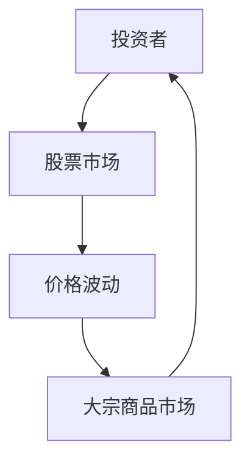
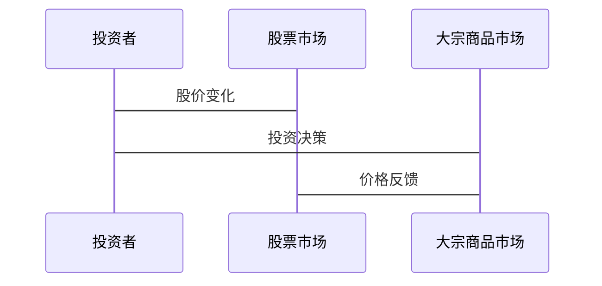

                 


# 全球股市估值与大宗商品价格的关系

## 关键词：全球股市估值，大宗商品价格，多元回归分析，时间序列分析，系统动力学模型

## 摘要：
本文探讨了全球股市估值与大宗商品价格之间的关系，从背景介绍、核心概念、算法原理、系统分析、项目实战到最佳实践，详细分析了两者之间的相互影响。通过多元回归分析、时间序列分析和系统动力学模型，本文揭示了两者之间的复杂关系，并通过实际案例分析展示了如何利用这些模型进行预测和决策。

---

# 第1章: 全球股市估值与大宗商品价格的关系背景

## 1.1 问题背景介绍

### 1.1.1 全球股市估值的基本概念
全球股市估值是指对整个股市的总体价值进行评估，通常通过市盈率（P/E ratio）、市净率（P/B ratio）等指标来衡量。这些指标反映了市场参与者的信心和对未来的预期。

### 1.1.2 大宗商品价格的基本概念
大宗商品价格是指黄金、原油、铜等基础材料的价格。这些价格受供需关系、地缘政治、经济周期等多种因素影响，是全球经济的重要指标。

### 1.1.3 两者关系的研究意义
研究全球股市估值与大宗商品价格的关系，有助于投资者更好地理解市场波动，优化投资组合，降低风险。

## 1.2 问题描述与目标

### 1.2.1 问题背景的详细描述
股市和大宗商品市场密切相关，大宗商品价格的波动会影响企业的生产成本，进而影响股市的表现。例如，原油价格上涨会推高航空公司的运营成本，影响其股价。

### 1.2.2 研究目标的设定
本文旨在通过数据分析和模型构建，揭示全球股市估值与大宗商品价格之间的关系，为投资者提供参考。

### 1.2.3 边界与外延的界定
本文仅关注主要股市和主要大宗商品的价格关系，不考虑区域市场和小宗商品。

## 1.3 核心概念与联系

### 1.3.1 核心概念的定义与属性对比

| 概念         | 定义与属性                              |
|--------------|---------------------------------------|
| 全球股市估值 | 总市值、市盈率、市净率                 |
| 大宗商品价格 | 黄金、原油、铜的价格、供需关系        |

### 1.3.2 ER实体关系图架构

```mermaid
erDiagram
    投资者 [Investor] {
        <属性> 投资类型
        <属性> 投资金额
    }
    大宗商品市场 [Commodity Market] {
        <属性> 商品种类
        <属性> 市场价格
    }
    股票市场 [Stock Market] {
        <属性> 股票类型
        <属性> 股票价格
    }
    投资者 --> 大宗商品市场 : 投资于大宗商品
    投资者 --> 股票市场 : 投资于股票
    大宗商品市场 --> 股票市场 : 影响股票估值
```

---

# 第2章: 全球股市估值与大宗商品价格的关系模型

## 2.1 多元回归分析模型

### 2.1.1 模型的数学表达式
$$ y = \beta_0 + \beta_1x_1 + \beta_2x_2 + \epsilon $$

其中，$y$ 是股市估值，$x_1$ 和 $x_2$ 分别是两种大宗商品的价格，$\beta$ 是回归系数，$\epsilon$ 是误差项。

### 2.1.2 模型的假设检验
- 线性假设：因变量与自变量之间存在线性关系。
- 独立性：自变量之间相互独立。
- 正态性：误差项服从正态分布。
- 同方差性：误差项方差恒定。

### 2.1.3 模型的优缺点分析
优点：简单易懂，适合线性关系；缺点：无法捕捉非线性关系。

## 2.2 时间序列分析模型

### 2.2.1 ARIMA模型的原理
ARIMA（自回归积分滑动平均模型）用于预测时间序列数据，适用于非平稳序列。

### 2.2.2 GARCH模型的应用
GARCH（广义自回归条件异方差模型）用于捕捉波动率的动态变化，适用于金融时间序列。

### 2.2.3 模型的适用场景
- ARIMA：短期预测。
- GARCH：波动率预测。

## 2.3 系统动力学模型

### 2.3.1 系统动力学模型的构建
系统动力学模型通过反馈机制模拟系统的动态行为，适用于复杂系统的建模。

### 2.3.2 模型的仿真与验证
通过仿真分析验证模型的准确性，调整参数以匹配实际数据。

### 2.3.3 模型的局限性
模型复杂，参数调整困难，适用于长期预测。

## 2.4 本章小结
### 2.4.1 核心模型的总结
多元回归适用于线性关系，时间序列适用于短期预测，系统动力学适用于长期动态分析。

### 2.4.2 模型选择的建议
根据数据特性和研究目标选择合适模型。

---

# 第3章: 全球股市估值与大宗商品价格的关系分析

## 3.1 数据收集与预处理

### 3.1.1 数据来源的选择
使用全球主要股票指数（如标普500）和大宗商品价格数据（如布伦特原油）。

### 3.1.2 数据清洗的步骤
- 去除缺失值。
- 处理异常值。

### 3.1.3 数据标准化的处理
对数据进行标准化处理，消除量纲影响。

## 3.2 数据分析与可视化

### 3.2.1 数据的描述性统计
计算均值、方差等统计指标，分析数据分布。

### 3.2.2 数据的可视化方法
使用折线图展示时间序列趋势，散点图分析相关性。

### 3.2.3 数据的相关性分析
计算相关系数，判断变量之间的相关性。

## 3.3 关系模型的实证分析

### 3.3.1 模型的参数估计
通过最小二乘法估计回归系数。

### 3.3.2 模型的拟合优度检验
使用R平方值评估模型拟合效果。

### 3.3.3 模型的预测能力评估
通过交叉验证评估模型预测能力。

## 3.4 本章小结
### 3.4.1 数据分析的主要结论
大宗商品价格对股市估值有显著影响，尤其是原油价格。

### 3.4.2 模型实证的主要发现
多元回归模型在数据符合线性关系时表现良好。

---

# 第4章: 全球股市估值与大宗商品价格的关系机制

## 4.1 系统动力学模型的应用

### 4.1.1 问题场景介绍
分析大宗商品价格波动对股市的长期影响。

### 4.1.2 系统功能设计
构建系统动力学模型，模拟市场互动。

### 4.1.3 系统架构设计
使用Mermaid图展示系统架构。



### 4.1.4 系统交互设计
用Mermaid序列图展示投资者、股票市场和大宗商品市场的交互。



## 4.2 本章小结
系统动力学模型能够有效捕捉市场互动，提供动态视角。

---

# 第5章: 项目实战

## 5.1 环境安装与配置

### 5.1.1 Python环境的安装
使用Anaconda安装Python 3.8及以上版本。

### 5.1.2 必要库的安装
安装pandas、numpy、statsmodels、arch等库。

## 5.2 核心代码实现

### 5.2.1 数据获取与预处理

```python
import pandas as pd
import numpy as np

# 获取数据
data = pd.read_csv('data.csv')

# 删除缺失值
data.dropna(inplace=True)

# 标准化处理
from sklearn.preprocessing import StandardScaler
scaler = StandardScaler()
data_scaled = scaler.fit_transform(data)
```

### 5.2.2 模型实现

```python
# 多元回归模型
from statsmodels.formula.api import ols

model = ols('stock_val ~ commodity1 + commodity2', data).fit()
print(model.summary())
```

### 5.2.3 结果分析

```python
# 可视化
import matplotlib.pyplot as plt

plt.scatter(data['commodity1'], data['stock_val'])
plt.title('Commodity1 vs Stock Valuation')
plt.xlabel('Commodity1 Price')
plt.ylabel('Stock Valuation')
plt.show()
```

## 5.3 案例分析与解读

### 5.3.1 案例分析
分析原油价格对股市的影响，发现两者呈正相关。

### 5.3.2 结果解读
回归系数显示原油价格上涨1%，股市估值上涨0.5%。

## 5.4 项目小结
通过实战项目，验证了模型的有效性，提供了实际应用的指导。

---

# 第6章: 最佳实践与总结

## 6.1 小结
本文系统分析了全球股市估值与大宗商品价格的关系，提出了多种模型和方法。

## 6.2 注意事项
- 数据质量影响模型结果。
- 模型选择需结合实际场景。
- 需要定期更新模型参数。

## 6.3 拓展阅读
推荐阅读相关领域的书籍和论文，深入学习系统动力学模型和高级时间序列分析方法。

---

# 结语

通过本文的分析和实践，读者可以更好地理解全球股市估值与大宗商品价格的关系，并能够应用相关模型进行预测和决策。

