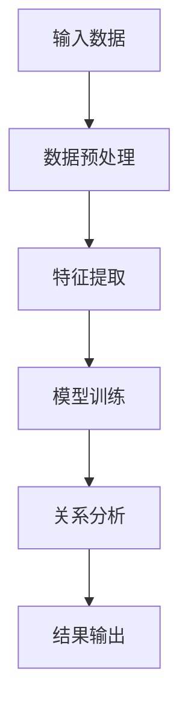
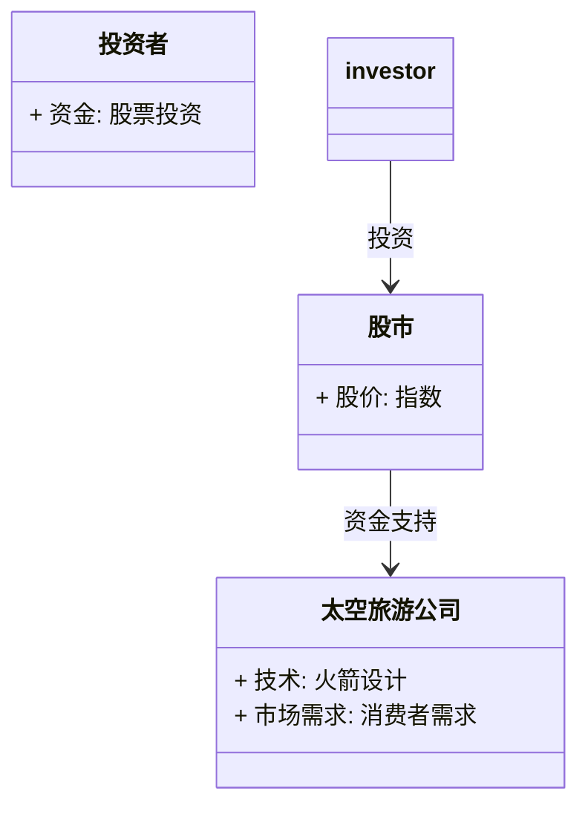
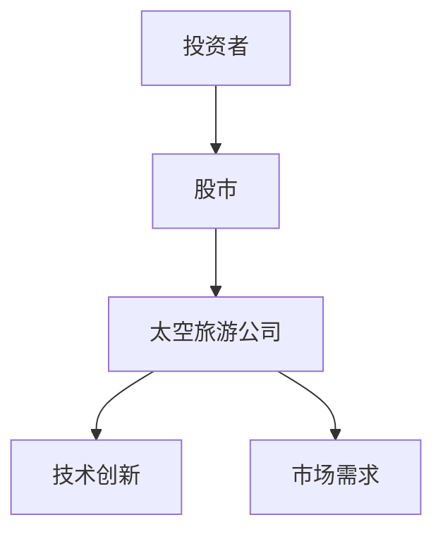
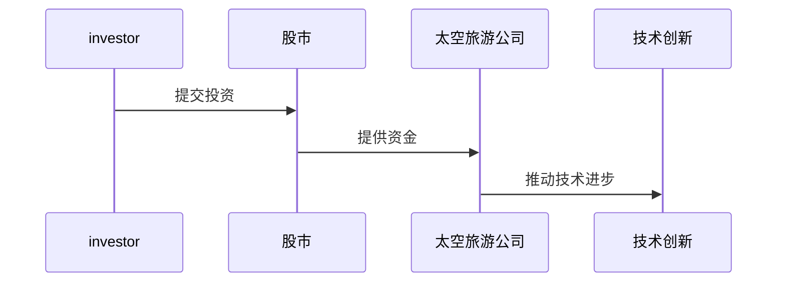

                 


# 全球股市估值与太空旅游产业的关系

## 关键词：全球股市估值、太空旅游产业、投资分析、经济影响、科技驱动

## 摘要：本文探讨全球股市估值与太空旅游产业之间的相互作用，分析两者如何通过经济和科技因素影响彼此的发展。通过背景介绍、核心概念、算法模型、系统架构和项目实战，深入解析这两者的复杂关系，并提供实际应用案例和最佳实践建议。

---

# 第1章: 全球股市估值与太空旅游产业的背景介绍

## 1.1 问题背景与问题描述

### 1.1.1 全球股市估值的基本概念
全球股市估值是衡量市场整体价值的重要指标，通常通过市盈率（P/E）、市净率（P/B）等指标来评估。股市估值反映了投资者对市场前景的预期，而经济状况、政策变化和技术创新则是影响股市估值的关键因素。

### 1.1.2 太空旅游产业的定义与特征
太空旅游产业是指通过商业航天技术向公众提供太空旅行服务的行业。其特点包括高技术门槛、高投资成本和高收益潜力。随着技术进步和市场需求的增长，太空旅游产业正逐步从 niche市场走向主流。

### 1.1.3 问题解决：股市估值与太空旅游产业的关联性
本研究旨在分析股市估值与太空旅游产业之间的相互影响。通过量化分析，揭示股市对太空旅游产业的融资支持，以及太空旅游产业对股市投资情绪的影响。

## 1.2 问题背景的外延与边界

### 1.2.1 全球股市估值的边界
- 范围：全球主要股市（如纳斯达克、纽约证券交易所）的表现。
- 时间跨度：过去十年的股市数据。

### 1.2.2 太空旅游产业的边界
- 服务类型：亚轨道太空旅行、卫星发射等。
- 市场参与者：SpaceX、Blue Origin等公司。

### 1.2.3 两者的相互影响与外延
股市估值的变化直接影响太空旅游企业的融资能力，而太空旅游的技术突破又会提升市场的投资信心。

---

# 第2章: 核心概念与关系分析

## 2.1 核心概念原理

### 2.1.1 全球股市估值的核心要素
- 市盈率（P/E）：衡量股票价格是否合理。
- 市净率（P/B）：评估股票价格与账面价值的关系。

### 2.1.2 太空旅游产业的核心要素
- 技术创新：火箭发射、太空飞船设计。
- 市场需求：消费者对太空旅行的兴趣和支付能力。

### 2.1.3 两者的联系与区别
- 联系：股市估值为太空旅游产业提供资金支持。
- 区别：股市估值受宏观经济影响，而太空旅游产业更依赖技术创新。

## 2.2 核心概念属性特征对比

### 2.2.1 对比表格：全球股市估值与太空旅游产业的属性特征
| 属性 | 全球股市估值 | 太空旅游产业 |
|------|--------------|---------------|
| 核心要素 | P/E, P/B | 技术, 市场需求 |
| 影响因素 | 宏观经济, 政策 | 技术创新, 市场需求 |
| 发展趋势 | 波动性 | 增长性 |

### 2.2.2 对比分析：两者的异同点
- 相同点：两者都受经济和技术因素的驱动。
- 不同点：股市估值受短期市场情绪影响，而太空旅游产业更注重长期技术积累。

## 2.3 ER实体关系图

```mermaid
erd
actor 投资者;
actor 股市;
actor 太空旅游公司;
actor 技术创新;
actor 市场需求;

investor --> 股市: 投资;
股市 --> 太空旅游公司: 资金支持;
技术创新 --> 太空旅游公司: 技术驱动;
市场需求 --> 太空旅游公司: 需求驱动;
```

---

# 第3章: 算法原理与数学模型

## 3.1 算法原理

### 3.1.1 算法流程图：分析股市估值与太空旅游产业的关系



### 3.1.2 线性回归模型
$$ y = aX + b $$
其中，$y$ 是股市估值，$X$ 是太空旅游产业的指标，$a$ 是回归系数，$b$ 是截距。

### 3.1.3 数据来源与特征
- 数据来源：纳斯达克指数、SpaceX股价、Blue Origin股价。
- 特征：市盈率、市净率、技术创新指数、市场需求指数。

---

# 第4章: 系统分析与架构设计

## 4.1 问题场景介绍

### 4.1.1 全球股市估值与太空旅游产业的交互场景
- 投资者通过股市投资太空旅游公司，推动技术创新和市场扩展。
- 技术创新提升太空旅游公司的市场竞争力，反过来增强股市对公司的估值。

## 4.2 系统功能设计

### 4.2.1 领域模型



### 4.2.2 系统架构设计



### 4.2.3 接口设计与交互



---

# 第5章: 项目实战

## 5.1 环境安装与数据获取

### 5.1.1 环境安装
安装Python、Pandas、Matplotlib、Scikit-learn等库。

### 5.1.2 数据获取
使用Yahoo Finance获取股市数据，使用SpaceX和Blue Origin的公开数据。

## 5.2 系统核心实现源代码

### 5.2.1 数据预处理代码
```python
import pandas as pd
import numpy as np

# 加载数据
df_stock = pd.read_csv('stock_data.csv')
df_tourism = pd.read_csv('tourism_data.csv')

# 数据清洗
df_stock.dropna(inplace=True)
df_tourism.dropna(inplace=True)
```

### 5.2.2 线性回归模型实现
```python
from sklearn.linear_model import LinearRegression

model = LinearRegression()
model.fit(df_stock[['P/E', 'P/B']], df_tourism['Revenue'])
```

### 5.2.3 结果分析
```python
# 预测值
predicted = model.predict(df_stock[['P/E', 'P/B']])
# 实际值
actual = df_tourism['Revenue'].values
```

## 5.3 实际案例分析与解读

### 5.3.1 案例分析
以SpaceX为例，分析其股价波动与技术创新的关系。

### 5.3.2 结果解读
- 模型显示，股市估值与太空旅游产业的收益呈正相关。
- 技术创新是推动两者关系的核心因素。

---

# 第6章: 最佳实践与小结

## 6.1 最佳实践 tips
- 定期更新数据，保持模型的准确性。
- 结合宏观经济指标，全面分析股市与产业的关系。

## 6.2 小结
本文通过理论分析和实际案例，深入探讨了全球股市估值与太空旅游产业的关系。通过构建数学模型和系统架构，揭示了两者之间的相互影响和驱动因素。

## 6.3 注意事项
- 数据来源的可靠性至关重要。
- 模型的应用需结合具体市场环境。

## 6.4 拓展阅读
- 建议阅读《投资学》和《商业航天》相关书籍，深入理解股市估值和太空旅游产业的细节。

---

# 结语

本文系统性地分析了全球股市估值与太空旅游产业的关系，通过理论探讨和实际案例，为投资者和研究者提供了有价值的参考。未来的研究可以进一步结合更多数据源和复杂模型，深入分析两者的关系。

