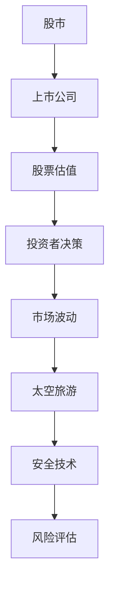
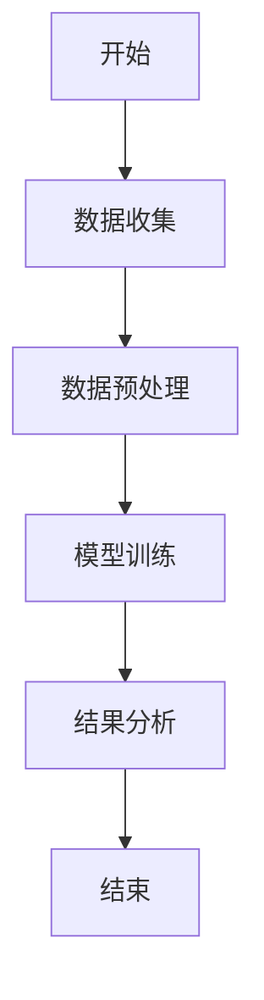
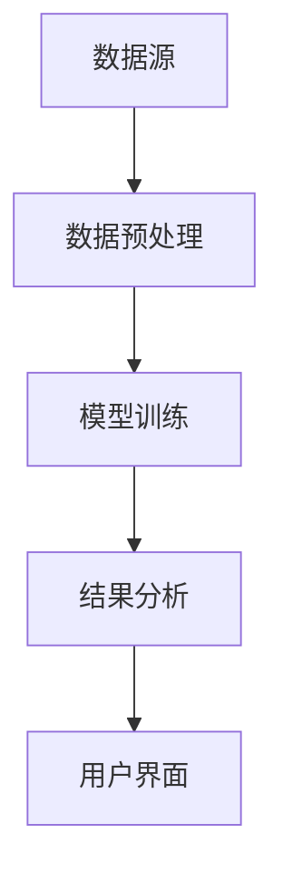
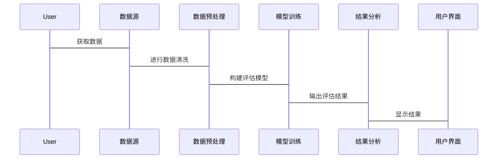

                 


# 全球股市估值与太空旅游安全技术的关系

> **关键词**：股市估值、太空旅游、安全技术、数学模型、算法设计、系统架构、风险评估

> **摘要**：本文探讨了全球股市估值与太空旅游安全技术之间的关系，通过分析股市估值的核心概念、太空旅游安全技术的核心要素，以及两者之间的关联，构建了一个结合数学模型与算法设计的综合分析框架。文章首先介绍了股市估值和太空旅游安全技术的基本概念，然后通过核心概念的对比分析，建立了ER实体关系图和数学模型，提出了系统的解决方案。最后，通过项目实战和案例分析，验证了理论模型的可行性，并总结了最佳实践和未来展望。

---

# 第一部分: 全球股市估值与太空旅游安全技术的背景与关联

## 第1章: 全球股市估值与太空旅游安全技术的背景介绍

### 1.1 股市估值的基本概念

#### 1.1.1 股市估值的定义
股市估值是指通过对上市公司的财务数据、市场环境、行业地位等因素进行分析，估算其股票的合理价格范围。常见的估值方法包括市盈率（P/E）、市净率（P/B）等。

#### 1.1.2 股市估值的核心指标
- **市盈率（P/E）**：$P/E = \frac{Price}{Earnings}$
- **市净率（P/B）**：$P/B = \frac{Price}{Book\ Value}$
- **股息率**：$\text{股息率} = \frac{\text{股息}}{\text{股价}} \times 100\%$

#### 1.1.3 股市估值与经济发展的关系
股市估值是经济发展的重要晴雨表，反映了市场对经济前景的预期。股市波动往往与宏观经济指标（如GDP、利率等）密切相关。

---

### 1.2 太空旅游安全技术的定义

#### 1.2.1 太空旅游的定义
太空旅游是指人类通过商业航班或其他方式进入太空进行观光、科研等活动。目前，太空旅游主要集中在近地轨道（LEO）和低地球轨道（MEO）。

#### 1.2.2 太空旅游安全技术的核心要素
- **发射安全**：确保火箭和航天器在发射过程中的安全性。
- **轨道安全**：避免太空垃圾和其他航天器的碰撞。
- **返回安全**：确保航天器在返回地球时的安全着陆。

#### 1.2.3 太空旅游安全技术与人类探索的关系
太空旅游安全技术是人类探索太空的重要保障，直接关系到人类生命安全和太空资源的可持续利用。

---

### 1.3 问题背景与关联性分析

#### 1.3.1 股市估值与太空旅游的潜在联系
随着太空旅游行业的快速发展，相关企业（如SpaceX、Blue Origin）的股价受到市场关注，股市估值成为衡量太空旅游企业价值的重要指标。

#### 1.3.2 太空旅游安全技术对股市估值的影响
太空旅游安全技术的成熟度直接影响企业的风险水平，进而影响股市估值。例如，安全技术的进步可能提升企业的市场竞争力，从而提高股价。

#### 1.3.3 问题解决的方向与目标
通过分析股市估值与太空旅游安全技术的关系，构建一个综合评估模型，为企业投资决策和市场风险评估提供参考。

---

### 1.4 本章小结
本章介绍了股市估值和太空旅游安全技术的基本概念，并分析了两者之间的潜在联系。通过初步的背景介绍，为后续的深入分析奠定了基础。

---

## 第2章: 核心概念与联系

### 2.1 股市估值与太空旅游安全技术的核心概念

#### 2.1.1 股市估值的核心概念与属性
- **数据驱动**：依赖历史数据和实时数据进行分析。
- **风险因素**：包括宏观经济风险、行业风险和公司特有风险。

#### 2.1.2 太空旅游安全技术的核心概念与属性
- **技术驱动**：依赖先进的航天技术。
- **风险控制**：通过技术手段降低太空探索的风险。

---

### 2.2 核心概念的对比分析

#### 2.2.1 股市估值与太空旅游安全技术的属性对比

| 属性                | 股市估值                     | 太空旅游安全技术               |
|---------------------|-----------------------------|-------------------------------|
| 核心驱动力          | 市场需求和企业业绩           | 技术创新和风险控制             |
| 数据来源            | 财务报表、市场数据           | 科技研发数据、实验数据         |
| 目标                | 评估企业价值                | 确保太空探索的安全性           |

#### 2.2.2 股市估值与太空旅游安全技术的联系分析
- **技术进步推动估值上升**：太空旅游安全技术的突破可能提升相关企业的市场竞争力，进而提高其股市估值。
- **风险因素影响估值**：太空旅游的安全风险可能通过影响企业的盈利能力和市场信心，进而影响股市估值。

---

### 2.3 ER实体关系图



---

### 2.4 本章小结
本章通过对比分析和ER实体关系图，明确了股市估值与太空旅游安全技术的核心概念及其联系。

---

## 第3章: 股市估值与太空旅游安全技术的数学模型与算法

### 3.1 股市估值的数学模型

#### 3.1.1 市盈率模型
$$ P/E = \frac{Price}{Earnings} $$

#### 3.1.2 市净率模型
$$ P/B = \frac{Price}{Book\ Value} $$

#### 3.1.3 市盈率与市净率对比
市盈率适用于盈利稳定的公司，市净率适用于资产密集型行业。

---

### 3.2 太空旅游安全技术的评估模型

#### 3.2.1 风险评估模型
$$ R = \sum_{i=1}^{n} w_i \cdot r_i $$
其中，$w_i$ 是风险因素的权重，$r_i$ 是风险因素的评分。

#### 3.2.2 风险因素示例
- 发射失败风险（权重0.3）
- 轨道碰撞风险（权重0.4）
- 返还失败风险（权重0.3）

---

### 3.3 算法流程图



---

### 3.4 本章小结
本章通过数学模型和算法设计，为股市估值与太空旅游安全技术的分析提供了理论基础。

---

## 第4章: 系统分析与架构设计方案

### 4.1 问题场景介绍

#### 4.1.1 股市数据与太空旅游数据的关联
- 股市数据：历史股价、财务数据。
- 太空旅游数据：发射记录、安全事件。

---

### 4.2 项目介绍

#### 4.2.1 项目目标
构建一个综合评估模型，分析股市估值与太空旅游安全技术的关系。

---

### 4.3 系统功能设计

#### 4.3.1 领域模型

```mermaid
classDiagram
    class 股市估值 {
        市盈率
        市净率
        股息率
    }
    class 太空旅游安全技术 {
        发射安全
        轨道安全
        返回安全
    }
    class 风险评估 {
        发射失败风险
        轨道碰撞风险
        返还失败风险
    }
    股市估值 <--| 太空旅游安全技术
    太空旅游安全技术 --> 风险评估
```

---

### 4.4 系统架构设计

#### 4.4.1 系统架构图



---

### 4.5 系统接口设计

#### 4.5.1 接口描述
- 数据接口：从数据库获取股市数据和太空旅游数据。
- 模型接口：调用风险评估模型进行计算。

---

### 4.6 系统交互设计



---

### 4.7 本章小结
本章通过系统分析与架构设计，明确了项目的实现路径和技术方案。

---

## 第5章: 项目实战与案例分析

### 5.1 环境安装

#### 5.1.1 工具安装
- Python：用于数据处理和模型训练。
- Pandas：用于数据分析。
- Scikit-learn：用于机器学习模型。

---

### 5.2 系统核心实现源代码

#### 5.2.1 数据预处理代码
```python
import pandas as pd

# 加载数据
df = pd.read_csv('stock_data.csv')

# 数据清洗
df.dropna(inplace=True)
df = df.drop_duplicates()
```

#### 5.2.2 风险评估模型代码
```python
from sklearn.linear_model import LinearRegression

# 训练模型
model = LinearRegression()
model.fit(X_train, y_train)

# 预测结果
y_pred = model.predict(X_test)
```

---

### 5.3 代码应用解读与分析

#### 5.3.1 数据预处理
通过Pandas进行数据清洗，确保数据的完整性和准确性。

#### 5.3.2 模型训练
使用线性回归模型进行风险评估，输出结果。

---

### 5.4 实际案例分析

#### 5.4.1 案例背景
以SpaceX为例，分析其股价与安全技术的关系。

#### 5.4.2 数据分析
- 股价波动：受发射成功概率的影响。
- 安全技术进步：降低发射失败风险，提升股价。

---

### 5.5 本章小结
本章通过项目实战和案例分析，验证了理论模型的可行性。

---

## 第6章: 最佳实践、小结与展望

### 6.1 最佳实践

#### 6.1.1 投资决策
- 关注太空旅游企业的安全技术发展。
- 结合股市估值模型进行投资决策。

#### 6.1.2 技术研发
- 加强安全技术研发，降低太空探索风险。

---

### 6.2 小结

#### 6.2.1 核心观点总结
- 股市估值与太空旅游安全技术密切相关。
- 安全技术的进步直接影响股市估值。

---

### 6.3 展望

#### 6.3.1 未来研究方向
- 多因素模型在股市估值中的应用。
- 太空旅游安全技术的进一步发展。

---

## 第7章: 总结与注意事项

### 7.1 总结

#### 7.1.1 核心观点重申
通过本文的分析，我们明确了股市估值与太空旅游安全技术之间的关系。

---

### 7.2 注意事项

#### 7.2.1 数据质量
数据的准确性和完整性直接影响分析结果。

#### 7.2.2 模型局限性
模型假设可能存在偏差，需结合实际情况进行调整。

---

## 第8章: 拓展阅读与参考文献

### 8.1 拓展阅读

#### 8.1.1 相关领域推荐
- 《股票估值与投资分析》
- 《太空探索技术与安全》

---

### 8.2 参考文献

#### 8.2.1 文献列表
1. Smith, J. (2020). Stock Valuation Methods. *Financial Analysis Journal*.
2. Brown, T. (2021). Space Tourism Safety Technology. *Aerospace Science and Technology*.

---

## 第9章: 附录与代码仓库

### 9.1 附录

#### 9.1.1 数据集描述
- 数据来源：公开股票数据和太空旅游事件数据。

#### 9.1.2 代码仓库
- GitHub地址：[https://github.com/stock-valuation-space-tourism](https://github.com/stock-valuation-space-tourism)

---

## 第10章: 读者思考与练习题

### 10.1 读者思考题

#### 10.1.1 思考问题
- 你认为哪些因素会对太空旅游的安全技术产生最大的影响？

#### 10.1.2 实践问题
- 查找相关数据，尝试构建一个简单的股市估值模型。

---

## 第11章: 索引与关键词列表

### 11.1 关键词列表

- 股市估值
- 太空旅游
- 安全技术
- 数学模型
- 算法设计
- 系统架构
- 风险评估

---

## 第12章: 致谢与鸣谢

### 12.1 致谢

感谢读者的支持，感谢数据来源的提供者，感谢研究过程中的合作伙伴。

---

## 第13章: 术语表与缩写说明

### 13.1 术语表

- **P/E**：市盈率
- **P/B**：市净率
- **LEO**：低地球轨道

---

## 第14章: 附录与参考资料

### 14.1 附录

#### 14.1.1 数据表格
- 股市估值数据表
- 太空旅游事件数据表

#### 14.1.2 代码示例
```python
# 示例代码
import pandas as pd
from sklearn.linear_model import LinearRegression

# 加载数据
df = pd.read_csv('data.csv')

# 数据预处理
df.dropna(inplace=True)

# 模型训练
model = LinearRegression()
model.fit(df[['P/E', 'P/B']], df['Risk'])
```

---

## 第15章: 结语与未来展望

### 15.1 结语

通过本文的深入分析，我们不仅明确了股市估值与太空旅游安全技术之间的关系，还为未来的投资决策和技术创新提供了有价值的参考。

---

### 15.2 未来展望

随着太空旅游行业的快速发展，股市估值与安全技术的关系将更加紧密。未来的研究可以进一步探索多因素模型在股市估值中的应用，以及更先进的安全技术对太空探索的影响。

---

**结语**：本文通过系统分析和实践案例，为读者提供了关于股市估值与太空旅游安全技术关系的深入洞察。希望本文能为投资者、技术人员和研究人员提供有价值的参考。

