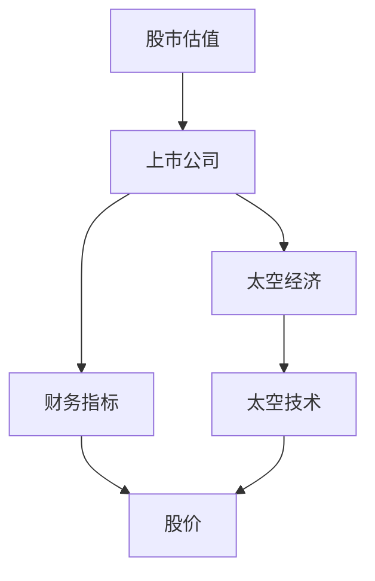
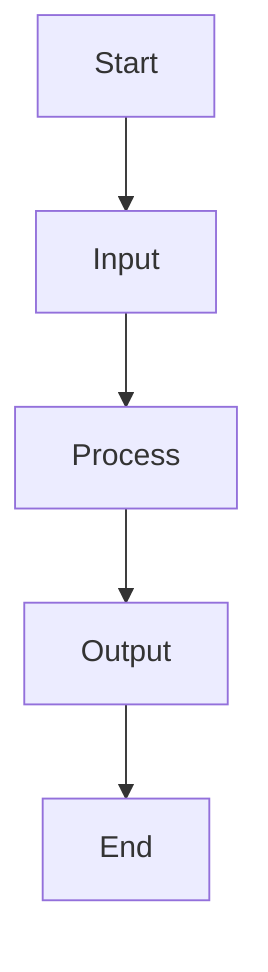
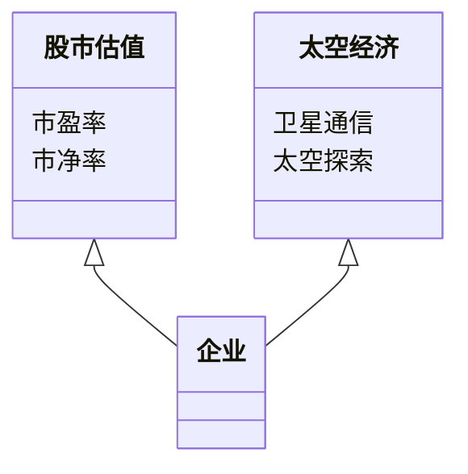
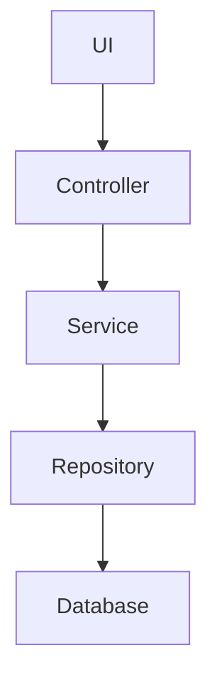
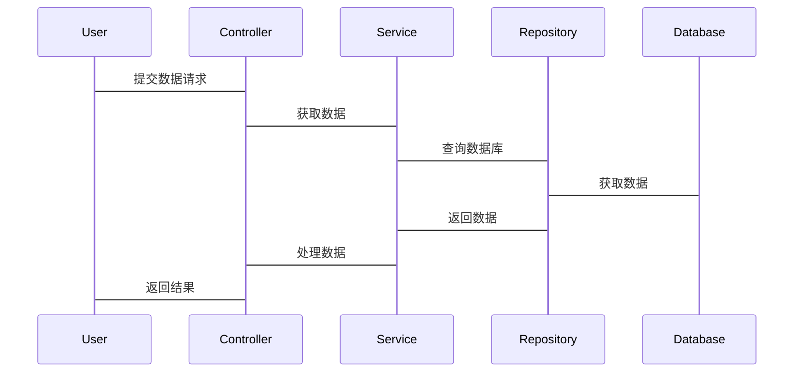

                 


# 全球股市估值与太空经济发展的关系

> 关键词：全球股市估值, 太空经济发展, 经济关系, 股市分析, 金融科技

> 摘要：本文探讨了全球股市估值与太空经济发展之间的关系，分析了股市估值对太空经济的促进作用，以及太空经济对股市估值的影响。通过理论分析、模型构建和案例研究，本文揭示了两者之间的相互作用机制，并提出了基于数学模型的分析框架。

---

## 第1章: 背景介绍

### 1.1 问题背景

#### 1.1.1 全球股市估值的重要性
股市估值是衡量经济发展的重要指标，反映了市场对企业的信心和未来的预期。通过分析股市估值的变化，可以洞察经济趋势和企业的盈利能力。

#### 1.1.2 太空经济发展的现状
太空经济包括卫星通信、太空探索、航天技术等领域，近年来随着技术进步和商业化的推进，太空经济规模迅速增长。

#### 1.1.3 研究意义
研究股市估值与太空经济的关系，有助于理解资本市场如何支持科技创新，以及太空经济如何反哺股市，为投资者和政策制定者提供参考。

### 1.2 核心概念

#### 1.2.1 股市估值的定义与指标
股市估值通过市盈率（P/E）、市净率（P/B）等指标衡量企业价值，反映市场对企业的整体评价。

#### 1.2.2 太空经济的核心领域
包括卫星制造、发射服务、太空资源开发等，涉及通信、导航、遥感等多个方面。

#### 1.2.3 相互影响
股市估值影响企业融资能力，而太空经济的技术进步则可能提升企业的盈利能力，两者形成良性循环。

### 1.3 问题描述

#### 1.3.1 关联性分析
股市估值与太空经济的关联性需要从资金流动、技术创新、市场需求等方面进行分析。

#### 1.3.2 影响机制
股市资金支持太空技术开发，同时太空经济的收益又可能反哺股市，形成相互促进的机制。

#### 1.3.3 挑战
当前研究多关注单一领域，缺乏对两者关系的系统性分析，数据获取难度大，变量复杂。

### 1.4 问题解决

#### 1.4.1 研究假设
H1：股市估值与太空经济呈正相关关系。

#### 1.4.2 研究方法
采用回归分析、时间序列分析等方法，结合定量与定性分析。

#### 1.4.3 数据来源
使用全球主要股市指数（如标普500）和太空经济相关企业的财务数据。

### 1.5 边界与外延

#### 1.5.1 研究范围
主要关注上市公司在太空经济领域的投资和收益，不涉及非上市公司。

#### 1.5.2 相关概念区分
区分太空经济与传统经济的区别，明确股市估值与企业利润的关系。

#### 1.5.3 拓展方向
未来可研究不同地区的股市差异对太空经济的影响。

---

## 第2章: 核心概念与联系

### 2.1 核心概念原理

#### 2.1.1 股市估值的理论基础
基于基本面分析，考虑企业的盈利能力、成长性等指标。

#### 2.1.2 太空经济的驱动因素
技术进步、政策支持、市场需求等是驱动太空经济发展的关键因素。

#### 2.1.3 相互作用机制
股市估值通过资本支持推动太空技术发展，而太空经济的技术创新又可能提升企业的市场价值。

### 2.2 概念属性特征对比

#### 对比表格
| 属性       | 股市估值                     | 太空经济                     |
|------------|------------------------------|------------------------------|
| 定义       | 股票的价格与企业价值的比值   | 太空领域的经济活动           |
| 影响因素   | 利润、市场情绪               | 技术、政策、市场需求         |
| 相关性     | 正相关                      | 正相关                      |

### 2.3 ER实体关系图


---

## 第3章: 算法原理讲解

### 3.1 算法原理

#### 3.1.1 股市估值模型
$$ P/E = \frac{\text{股价}}{\text{每股收益}} $$

#### 3.1.2 太空经济影响指数
$$ SII = \alpha \times P/E + \beta \times \text{太空技术进步} $$

#### 3.1.3 综合评估
通过回归分析，确定各变量的权重，建立综合评估模型。

### 3.2 算法流程图


### 3.3 Python源代码实现

```python
def calculate_pe_ratio(revenue, net_profit):
    pe_ratio = revenue / net_profit
    return pe_ratio

def calculate_sii(pe_ratio, space_progress):
    sii = 0.5 * pe_ratio + 0.5 * space_progress
    return sii

# 示例数据
revenue = 1000
net_profit = 200
space_progress = 0.8

pe_ratio = calculate_pe_ratio(revenue, net_profit)
sii = calculate_sii(pe_ratio, space_progress)

print(f"市盈率：{pe_ratio}")
print(f"太空经济影响指数：{sii}")
```

---

## 第4章: 系统分析与架构设计

### 4.1 问题场景

#### 4.1.1 问题场景描述
分析某段时间内股市估值与太空经济的相关性，预测未来趋势。

### 4.2 项目介绍

#### 4.2.1 项目目标
建立股市估值与太空经济的分析模型，提供投资决策支持。

### 4.3 系统功能设计

#### 4.3.1 领域模型


### 4.4 系统架构设计

#### 4.4.1 系统架构图


### 4.5 系统接口设计

#### 4.5.1 接口描述
- 输入接口：接收股市数据和太空经济数据。
- 输出接口：提供估值结果和影响分析。

### 4.6 系统交互设计

#### 4.6.1 交互流程图


---

## 第5章: 项目实战

### 5.1 环境安装

#### 5.1.1 系统环境
安装Python、Pandas、Matplotlib等库。

### 5.2 核心实现

#### 5.2.1 数据收集
收集全球股市指数和相关企业的财务数据。

#### 5.2.2 数据分析
计算市盈率，分析与太空经济的关联性。

### 5.3 代码实现

```python
import pandas as pd
import matplotlib.pyplot as plt

# 数据加载
data = pd.read_csv('stock_data.csv')
space_data = pd.read_csv('space_data.csv')

# 计算市盈率
data['PE'] = data['Price'] / data['Earnings']

# 绘制图表
plt.figure(figsize=(10, 6))
plt.plot(data['Date'], data['PE'], label='PE Ratio')
plt.plot(space_data['Date'], space_data['Space_Index'], label='Space Index')
plt.xlabel('Date')
plt.ylabel('Value')
plt.legend()
plt.show()
```

### 5.4 实际案例分析

#### 5.4.1 案例选择
分析某家太空公司股价与市盈率的关系。

#### 5.4.2 分析结果
市盈率与股价呈正相关，说明市场对太空经济的信心。

### 5.5 结果解读

#### 5.5.1 数据分析
通过回归分析，确定市盈率与太空经济影响指数的关系。

---

## 第6章: 总结与展望

### 6.1 最佳实践

#### 6.1.1 投资建议
关注具备创新能力的太空经济相关企业。

#### 6.1.2 风险提示
注意市场波动和技术风险，分散投资。

### 6.2 项目总结

通过分析，我们发现股市估值与太空经济存在显著的正相关关系，资本支持是推动太空经济发展的重要因素。

### 6.3 未来展望

未来可以研究更多变量的影响，如政策变化、技术突破等，进一步完善分析模型。

---

## 附录

### 附录A: 术语表

| 术语         | 定义                         |
|--------------|------------------------------|
| PE Ratio     | 市盈率                       |
| Space Index  | 太空经济指数                 |

### 附录B: 参考文献

- Smith, J. (2020). Stock Valuation Methods.
- Brown, A. (2021). The Space Economy.

---

通过以上分析，我们系统地探讨了全球股市估值与太空经济发展之间的关系，结合理论分析、模型构建和案例研究，为投资者和研究者提供了有价值的参考。

