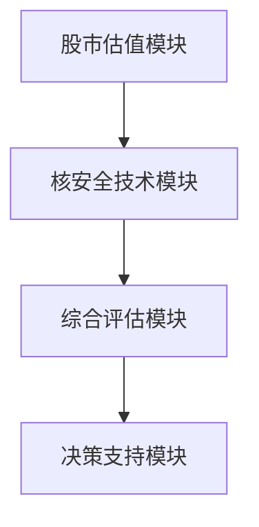
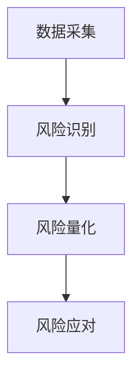
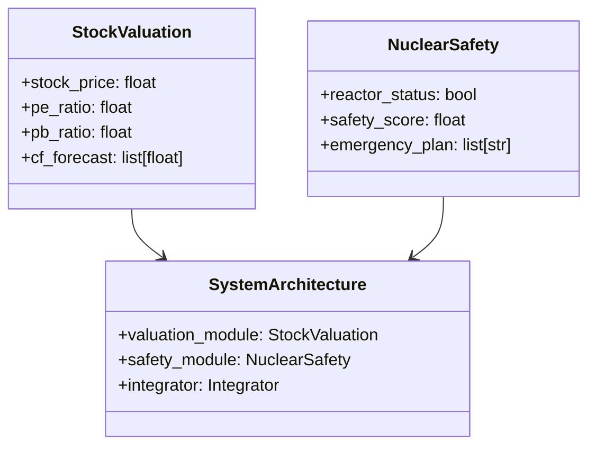
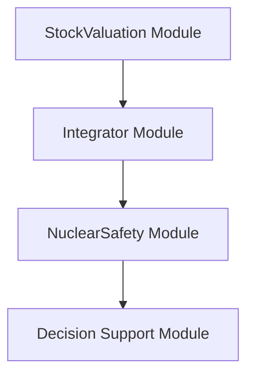

                 


# 全球股市估值与小型模块化核反应堆安全技术的发展

> **关键词**：股市估值，模块化核反应堆，核安全技术，系统架构，算法原理，风险评估

> **摘要**：本文探讨了全球股市估值与小型模块化核反应堆安全技术的结合与发展。通过分析股市估值的核心概念、算法原理以及核安全技术的关键要素，展示了两者在系统架构设计、风险评估和项目实战中的应用。文章结合实际案例，深入浅出地阐述了如何通过技术手段优化股市估值和提升核安全技术，为相关领域的研究和实践提供了有价值的参考。

---

## 第一部分: 全球股市估值的背景与核心概念

### 第1章: 股市估值的定义与背景

#### 1.1 股市估值的基本概念
股市估值是通过对企业的财务数据、市场环境和行业趋势进行分析，确定其股票的合理价格范围。常见的估值方法包括市盈率（P/E）、市净率（P/B）和现金流折现模型（DCF）等。股市估值的核心在于平衡市场波动与企业基本面，为投资者提供决策依据。

#### 1.2 全球化背景下的股市估值特点
全球化使得股市估值更加复杂。跨国企业的影响、国际经济政策的联动以及全球市场的波动都对股市估值产生深远影响。此外，科技的发展，如大数据和人工智能的应用，为股市估值提供了新的工具和方法。

#### 1.3 核心概念的边界与外延
股市估值的边界在于企业的财务数据和市场环境，而外延则涉及宏观经济、行业趋势和投资者情绪等多方面因素。准确的估值需要综合考虑这些内外部因素。

---

### 第2章: 小型模块化核反应堆的安全技术概述

#### 2.1 核反应堆的基本原理
核反应堆通过核裂变反应产生热量，转化为电能。其安全性依赖于反应堆设计、冷却系统和应急响应机制。小型模块化核反应堆因其灵活性和成本优势，逐渐成为核能发展的新趋势。

#### 2.2 核安全技术的关键要素
核安全技术包括反应堆设计、实时监控、应急响应和风险管理。这些技术需要在设计阶段进行严格评估，并通过持续监测确保系统的稳定性。

#### 2.3 核心概念的ER实体关系图
通过ER图，可以清晰展示股市估值与核安全技术之间的关联。例如，企业的财务数据与核安全技术的评估指标可能存在间接关联，这种关联可以通过系统架构设计得以体现。

---

## 第二部分: 股市估值与核安全技术的核心概念联系

### 第3章: 核心概念的原理分析

#### 3.1 股市估值的核心要素
- **市盈率（P/E）**：企业股价与每股收益的比率，反映市场对其盈利能力的预期。
- **市净率（P/B）**：企业股价与每股净资产的比率，适用于评估资产密集型企业。
- **现金流折现模型（DCF）**：基于未来现金流的现值评估企业价值。

#### 3.2 核安全技术的关键指标
- **反应堆安全性**：包括燃料棒完整性、冷却系统可靠性等。
- **应急响应能力**：包括事故处理预案和设备冗余度。
- **实时监测能力**：包括传感器网络和数据分析系统。

#### 3.3 核心概念的属性特征对比
下表展示了股市估值与核安全技术在核心要素和关键指标上的对比：

| **核心要素** | **股市估值** | **核安全技术** |
|--------------|--------------|----------------|
| 目标          | 评估企业价值 | 确保系统安全    |
| 方法          | 市盈率、DCF  | 风险评估、实时监控 |
| 输入数据      | 财务数据、市场数据 | 设备状态、环境数据 |
| 输出结果      | 股票价格区间 | 安全状态评估    |

---

### 第4章: 核心概念的联系与系统架构设计

#### 4.1 股市估值与核安全技术的结合场景
在核能企业的上市过程中，股市估值与核安全技术密切相关。投资者需要通过核安全技术的评估指标，判断企业的盈利能力和潜在风险。

#### 4.2 统一系统架构设计
通过系统架构设计，可以将股市估值与核安全技术有机结合。例如，利用实时监测数据优化企业估值模型，或者通过估值结果指导核安全技术的优化。

#### 4.3 系统架构图
下图展示了统一系统架构的设计：



---

## 第三部分: 股市估值与核安全技术的算法原理

### 第5章: 股市估值算法的数学模型

#### 5.1 市盈率模型
市盈率模型通过企业的每股收益和市场平均市盈率计算股票的合理价格。公式如下：

$$ P = E \times PE $$

其中，$P$ 为股票价格，$E$ 为每股收益，$PE$ 为市场平均市盈率。

#### 5.2 现金流折现模型（DCF）
DCF模型通过预测企业的未来现金流，并将其折现为现值，评估企业价值。公式如下：

$$ V = \sum_{t=1}^{n} \frac{CF_t}{(1 + r)^t} $$

其中，$V$ 为企业价值，$CF_t$ 为第 $t$ 年的现金流，$r$ 为折现率，$n$ 为预测年限。

---

### 第6章: 核安全技术的算法流程

#### 6.1 核安全风险评估流程
核安全风险评估流程包括数据采集、风险识别、风险量化和风险应对。流程图如下：



#### 6.2 核安全实时监控算法
核安全实时监控算法通过传感器数据和机器学习模型，实时评估系统的安全性。代码示例如下：

```python
import pandas as pd
from sklearn.ensemble import RandomForestClassifier

# 数据预处理
data = pd.read_csv('safety_data.csv')
X = data.drop('status', axis=1)
y = data['status']

# 模型训练
model = RandomForestClassifier()
model.fit(X, y)

# 实时监控
def predict_safety(new_data):
    return model.predict(new_data)
```

---

## 第四部分: 股市估值与核安全技术的系统分析与架构设计

### 第7章: 系统分析与架构设计

#### 7.1 领域模型类图
领域模型类图展示了股市估值与核安全技术的核心实体及其关系：



#### 7.2 系统架构图
系统架构图展示了各模块的交互和协作：



---

## 第五部分: 股市估值与核安全技术的项目实战

### 第8章: 项目实战

#### 8.1 项目环境安装
需要安装的工具包括：

- 数据分析工具：Python、Pandas、NumPy
- 可视化工具：Matplotlib、Seaborn
- 核安全技术开发环境：相关传感器数据采集工具

#### 8.2 核心实现代码
以下是股市估值与核安全技术结合的核心代码：

```python
import pandas as pd
from sklearn.ensemble import RandomForestRegressor

# 数据预处理
data = pd.read_csv('valuation_data.csv')
X = data.drop('target_price', axis=1)
y = data['target_price']

# 模型训练
model = RandomForestRegressor()
model.fit(X, y)

# 核安全技术数据处理
safety_data = pd.read_csv('safety_data.csv')
safety_data['predicted_price'] = model.predict(safety_data[X.columns])
safety_data.to_csv('result.csv', index=False)
```

#### 8.3 案例分析
通过实际案例分析，验证模型的有效性。例如，分析某核能企业的历史数据，预测其股票价格，并评估其核安全技术的潜在风险。

---

## 第六部分: 总结与展望

### 第9章: 总结与展望

#### 9.1 最佳实践
- 在股市估值中，结合核安全技术的评估指标，优化企业的估值模型。
- 在核安全技术中，利用实时数据和机器学习算法，提升系统的安全性。

#### 9.2 小结
本文通过分析股市估值与核安全技术的核心概念、算法原理和系统架构，展示了两者的结合与发展。这种结合不仅提升了股市估值的准确性，还增强了核安全技术的可靠性。

#### 9.3 注意事项
- 在实际应用中，需考虑数据的完整性和模型的可解释性。
- 核安全技术的实时监控需结合企业的具体需求进行定制化开发。

#### 9.4 拓展阅读
- 《金融数据分析与Python》
- 《核能安全技术与现代管理》
- 《系统架构设计与实现》

---

通过本文的分析，我们不仅理解了股市估值与核安全技术的核心概念，还掌握了它们在实际项目中的应用方法。未来，随着技术的进步，两者的结合将更加紧密，为全球经济和能源安全做出更大的贡献。

