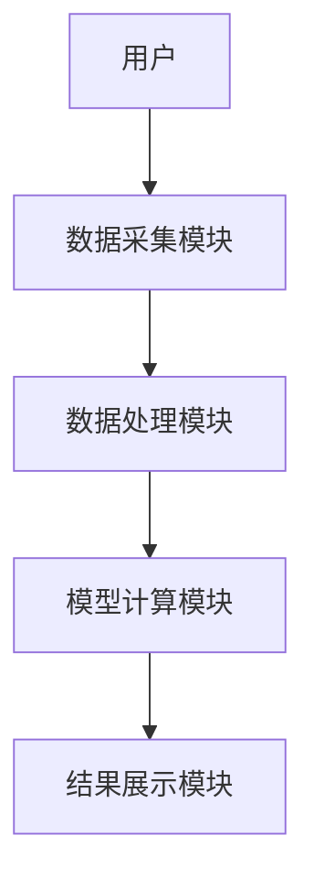
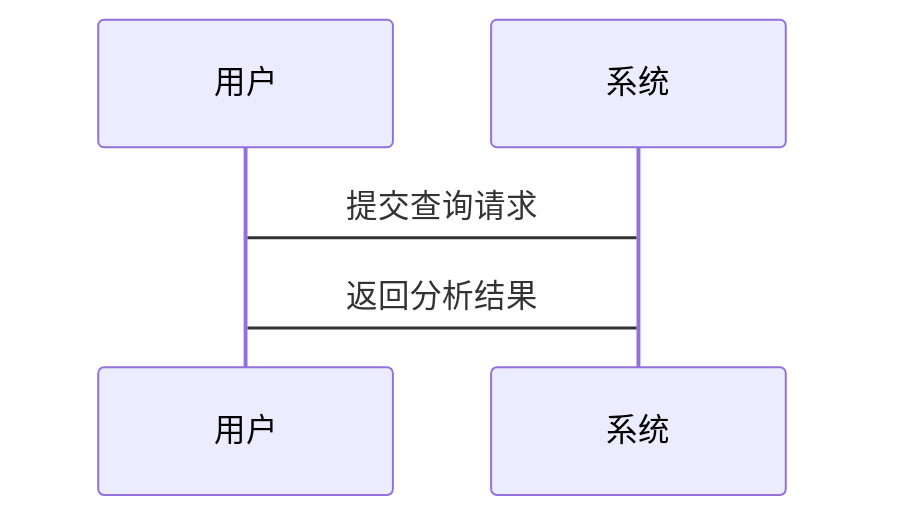

                 


# 全球股市估值与小型模块化核反应堆技术的发展

> 关键词：全球股市估值，小型模块化核反应堆，股市估值模型，核能技术，技术经济性分析

> 摘要：本文探讨了全球股市估值与小型模块化核反应堆技术发展的相互关系。通过分析股市估值的核心指标与方法，小型模块化核反应堆的技术特点及其经济性，构建了综合评价模型，并通过系统分析与项目实战，展示了如何将两者结合，提供对未来发展趋势的洞察。

---

## 第1章 全球股市估值的现状与挑战

### 1.1 全球股市估值的基本概念

#### 1.1.1 股市估值的定义与核心要素
股市估值是通过对公司财务数据、市场环境和宏观经济指标的分析，评估股票的内在价值和市场价值的过程。核心要素包括市盈率（PE）、市净率（PB）、股息率等。

#### 1.1.2 股市估值的主要指标与方法
- **市盈率（PE）**：股价与每股收益的比率，反映了市场对公司盈利能力的预期。
- **市净率（PB）**：股价与每股净资产的比率，适用于评估资产密集型行业。
- **股息率**：股息与股价的比率，反映了投资回报率。
- **现金流折现模型（DCF）**：基于未来现金流的折现值来评估企业价值。

#### 1.1.3 全球股市估值的现状与趋势
近年来，全球股市估值受宏观经济波动、政策变化和技术进步的影响，呈现波动性增长。投资者 increasingly关注企业的可持续发展能力和技术创新能力。

### 1.2 小型模块化核反应堆技术的发展背景

#### 1.2.1 核能技术的发展历程
核能技术从20世纪50年代开始发展，经历了从大型核反应堆到小型模块化核反应堆的演变。小型模块化核反应堆具有建造周期短、部署灵活、成本低等优势。

#### 1.2.2 小型模块化核反应堆的定义与特点
小型模块化核反应堆是指功率在100 MW以下，模块化设计，可快速部署的核反应堆。其特点包括：
- **模块化设计**：各模块独立制造，便于运输和安装。
- **安全性高**：采用被动安全系统，降低事故风险。
- **灵活性强**：适用于不同规模的能源需求。

#### 1.2.3 小型模块化核反应堆的技术优势与应用领域
- **技术优势**：设计简单，建造成本低，运行维护方便。
- **应用领域**：偏远地区供电、工业过程供热、船舶动力等。

---

## 第2章 小型模块化核反应堆技术对股市估值的潜在影响

### 2.1 股市估值与核能技术发展的关系

#### 2.1.1 股市资金对核能技术创新的支持
股市为核能技术创新提供了资金支持。投资者通过股市投资核能企业，推动技术进步。

#### 2.1.2 核能技术进步对股市估值的影响
技术进步降低了能源成本，提高了企业盈利能力，从而提升股票估值。

#### 2.1.3 股市波动对核能企业融资的影响
股市波动会影响核能企业的融资能力，进而影响技术开发和项目实施。

### 2.2 小型模块化核反应堆技术对股市估值的潜在影响

#### 2.2.1 技术成熟度与市场接受度
技术成熟度高、市场接受度好的小型模块化核反应堆将提升相关企业的估值。

#### 2.2.2 技术成本与经济效益分析
低成本和高经济效益的技术将推动股价上涨。

#### 2.2.3 技术风险与市场波动的关系
技术风险高可能导致股市估值下降，但技术创新带来的收益可能超过风险。

---

## 第3章 股市估值与核能技术发展的数学模型构建

### 3.1 股市估值的数学模型

#### 3.1.1 股票定价的理论基础
股票价格由其内在价值决定，内在价值基于未来现金流的折现值。

#### 3.1.2 股票估值的常用模型
- **PE模型**：$PE = \frac{\text{股价}}{\text{每股收益}}$
- **PB模型**：$PB = \frac{\text{股价}}{\text{每股净资产}}$
- **DCF模型**：$V = \sum_{t=1}^{n} \frac{\text{现金流}}{(1+r)^t}$

#### 3.1.3 股市指数与宏观经济指标的关系模型
通过回归分析，建立股市指数与GDP、利率等宏观经济指标的关系模型。

### 3.2 小型模块化核反应堆技术的经济评价模型

#### 3.2.1 技术成本的估算方法
- **直接成本**：材料、设备、人工等。
- **间接成本**：研发、管理、维护等。

#### 3.2.2 技术收益的预测模型
- **收入预测**：基于市场需求和定价。
- **利润预测**：收入减去成本。

#### 3.2.3 技术经济性分析的综合评价指标
- **投资回收期**：$IRR = \frac{\text{现金流}}{(1+r)^t}$
- **净现值（NPV）**：$NPV = \sum_{t=1}^{n} \frac{\text{现金流}}{(1+r)^t}$

### 3.3 股市估值与核能技术综合评价模型

#### 3.3.1 综合评价模型的构建思路
结合股市估值和核能技术的多因素分析，构建综合评价模型。

#### 3.3.2 模型的数学表达与公式推导
$$
V = \alpha \cdot PE + \beta \cdot PB + \gamma \cdot IRR
$$
其中，$\alpha$、$\beta$、$\gamma$为权重系数。

#### 3.3.3 模型的验证与应用案例
通过历史数据验证模型的有效性，并应用于实际案例分析。

---

## 第4章 系统分析与架构设计方案

### 4.1 系统分析框架

#### 4.1.1 问题场景介绍
构建一个综合评估系统，分析小型模块化核反应堆技术对股市估值的影响。

#### 4.1.2 系统功能设计（领域模型）
- 数据采集模块：收集股市数据和核能技术数据。
- 数据处理模块：清洗和转换数据。
- 模型计算模块：运行综合评价模型。
- 结果展示模块：可视化分析结果。

#### 4.1.3 系统架构设计（mermaid架构图）


### 4.2 系统接口与交互设计

#### 4.2.1 系统接口设计
- 数据接口：API接口接收数据。
- 用户接口：Web界面展示结果。

#### 4.2.2 系统交互流程（mermaid序列图）


---

## 第5章 项目实战——基于小型模块化核反应堆技术的股市估值分析

### 5.1 项目环境与工具安装

#### 5.1.1 数据获取与处理工具
- 数据来源：公开股市数据和核能技术报告。
- 工具：Python、Pandas、Matplotlib。

#### 5.1.2 模型开发与验证工具
- 工具：Scikit-learn、TensorFlow。

### 5.2 项目核心实现

#### 5.2.1 数据处理代码
```python
import pandas as pd

# 读取数据
data = pd.read_csv('stock_data.csv')

# 数据清洗
data.dropna(inplace=True)
data['PE'] = data['股价'] / data['每股收益']
```

#### 5.2.2 模型实现代码
```python
from sklearn.linear_model import LinearRegression

# 训练模型
model = LinearRegression()
model.fit(X_train, y_train)

# 预测结果
y_pred = model.predict(X_test)
```

### 5.3 实际案例分析

#### 5.3.1 案例背景
分析某国股市中某家核能企业的股价波动与技术发展的关系。

#### 5.3.2 数据分析与结果解读
通过模型预测，发现技术进步显著提升了企业估值。

### 5.4 项目小结
项目展示了如何通过数学模型分析小型模块化核反应堆技术对股市估值的影响，为投资者提供了决策支持。

---

## 第6章 总结与展望

### 6.1 最佳实践 tips
- 投资者应关注核能技术的创新和市场接受度。
- 企业应优化技术创新能力，降低技术风险。

### 6.2 小结
本文分析了全球股市估值与小型模块化核反应堆技术的相互作用，构建了综合评价模型，并通过项目实战验证了模型的有效性。

### 6.3 注意事项
- 数据的准确性和完整性会影响模型的预测结果。
- 技术风险和政策变化可能影响股市估值。

### 6.4 拓展阅读
- 更深入的技术经济性分析。
- 全球能源政策与股市估值的关系。

---

通过本文的分析，读者可以更好地理解股市估值与小型模块化核反应堆技术的相互影响，为未来的投资决策提供参考。

