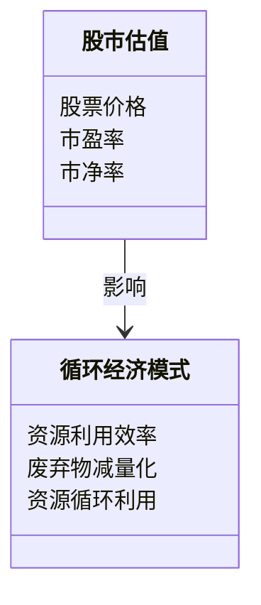
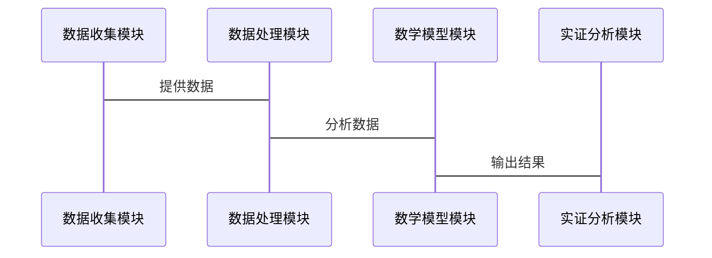

                 


# 全球股市估值与循环经济模式的关系

## 关键词：全球股市估值、循环经济模式、经济可持续性、投资策略、数学模型

## 摘要：本文系统探讨了全球股市估值与循环经济模式之间的关系。通过分析股市估值的核心概念、循环经济模式的特征及其相互作用，本文揭示了循环经济对企业价值和股市估值的潜在影响。结合数学模型和实际案例，本文提出了评估循环经济模式对股市估值影响的方法，并为投资者提供了基于循环经济模式的投资策略。

---

# 第一部分：全球股市估值与循环经济模式的关系概述

## 第1章：引言

### 1.1 研究背景与意义

#### 1.1.1 全球经济与股市估值的重要性
股市估值是衡量经济发展的重要指标，反映了企业的盈利能力、市场前景和整体经济状况。全球股市估值的变化不仅影响投资者的财富，还影响国家的经济政策和全球资本流动。近年来，全球经济的不确定性（如新冠疫情、地缘政治冲突等）使得股市估值波动加剧，投资者对可持续投资的关注度不断提高。

#### 1.1.2 循环经济模式的兴起
循环经济是一种以资源高效利用和循环利用为核心的发展模式，强调减少资源消耗和环境污染。随着全球资源枯竭和环境问题的加剧，循环经济模式逐渐成为全球经济转型的重要方向。企业和政府通过实施循环经济模式，不仅可以降低成本，还能提升企业的社会形象和市场竞争力。

#### 1.1.3 两者的关联性研究价值
尽管股市估值与循环经济模式看似关联性不大，但随着可持续发展理念的普及，越来越多的企业开始重视循环经济模式的应用。这不仅影响了企业的盈利能力和市场表现，也对股市估值产生了深远影响。因此，研究两者之间的关系具有重要的理论和实践意义。

### 1.2 研究目标与方法

#### 1.2.1 研究目标
本文旨在探讨全球股市估值与循环经济模式之间的关系，分析循环经济模式如何影响企业的价值和股市估值，并为投资者提供基于循环经济模式的投资策略。

#### 1.2.2 研究方法
本文采用定性与定量相结合的方法，通过文献研究、数据分析和案例分析，结合数学模型（如回归分析、时间序列分析）对两者的关系进行系统研究。

#### 1.2.3 研究框架
本文的研究框架包括以下部分：
1. 全球股市估值的核心概念与分析方法。
2. 循环经济模式的核心要素与实现路径。
3. 两者之间的关系分析与数学模型构建。
4. 实证分析与案例研究。
5. 投资策略与未来展望。

### 1.3 本章小结
本章通过介绍研究背景、意义和方法，明确了本文的研究目标和框架，为后续内容的展开奠定了基础。

---

## 第2章：全球股市估值的基本概念与分析方法

### 2.1 全球股市估值的定义与分类

#### 2.1.1 股市估值的基本概念
股市估值是指对股票价格的合理评估，通常基于企业的财务状况、行业地位、市场前景等因素。常见的股市估值方法包括市盈率（P/E）、市净率（P/B）、股息率等。

#### 2.1.2 主要股市指数及其特点
全球主要的股市指数包括：
1. **标普500指数**：覆盖美国500家大型企业的市值加权指数，代表美国股市的整体表现。
2. **纳斯达克指数**：主要涵盖科技类企业的指数，反映了科技股的市场表现。
3. **富时100指数**：英国100家最大公司的指数，代表英国股市的整体表现。
4. **恒生指数**：香港股市的主要指数，涵盖香港最大的50家企业的表现。

#### 2.1.3 股市估值的影响因素
股市估值受多种因素影响，包括宏观经济环境、企业盈利状况、市场情绪、政策变化等。

### 2.2 循环经济模式的核心要素

#### 2.2.1 循环经济的基本定义
循环经济是一种以资源高效利用和循环利用为核心的发展模式，强调减少资源消耗和环境污染，通过延长产品生命周期和资源再利用实现可持续发展。

#### 2.2.2 循环经济的三个主要特征
1. **资源高效利用**：通过技术进步和管理优化，提高资源利用效率。
2. **废弃物减量化**：通过设计和技术创新，减少废弃物的产生。
3. **资源循环利用**：通过回收和再利用，延长资源的生命周期。

#### 2.2.3 循环经济的实现路径
1. **技术创新**：发展绿色技术，推动资源高效利用和废弃物资源化。
2. **制度保障**：通过政策法规和市场机制，促进循环经济模式的实施。
3. **社会参与**：鼓励企业和消费者参与循环经济实践。

### 2.3 股市估值与循环经济模式的关系初探

#### 2.3.1 循环经济对企业价值的影响
循环经济模式的实施可以提升企业的竞争力和可持续发展能力，从而提高企业的市场价值。例如，通过减少资源消耗和环境污染，企业可以降低成本，提升品牌形象，吸引更多可持续投资者。

#### 2.3.2 循环经济对股市估值的潜在影响
循环经济模式的推广可能影响股市估值的波动。例如，资源高效利用的企业可能在股市中获得更高的估值，而高污染、高能耗的企业可能面临估值下降的风险。

#### 2.3.3 两者关系的理论模型
本文初步构建了一个理论模型，将循环经济模式作为影响股市估值的间接因素，通过企业的盈利能力和市场形象影响股市估值。

### 2.4 本章小结
本章详细介绍了全球股市估值的基本概念和分析方法，并探讨了循环经济模式的核心要素及其对股市估值的潜在影响，为后续分析奠定了基础。

---

## 第3章：全球股市估值与循环经济模式的核心概念与联系

### 3.1 全球股市估值的核心概念

#### 3.1.1 股票定价的主要方法
股票定价是股市估值的核心内容，常见的定价方法包括：
1. **现金流折现法（DCF）**：通过预测企业的未来现金流，折现到现值以确定股票的合理价格。
2. **相对估值法**：基于市场可比企业的市盈率、市净率等指标进行估值。

#### 3.1.2 影响股市估值的主要因素
1. **宏观经济因素**：如GDP增长率、通货膨胀率、利率水平等。
2. **企业基本面因素**：如盈利能力、财务状况、管理层质量等。
3. **市场情绪因素**：如投资者情绪、市场波动性等。

### 3.2 循环经济模式的核心概念

#### 3.2.1 循环经济的系统结构
循环经济的系统结构包括生产、消费和回收三个环节，强调资源的闭环流动。

#### 3.2.2 循环经济的经济效益与环境效益
循环经济不仅有助于减少资源消耗和环境污染，还能通过资源再利用降低成本，提升企业的经济效益。

#### 3.2.3 循环经济的实现路径
1. **技术创新**：发展绿色技术，推动资源高效利用和废弃物资源化。
2. **制度保障**：通过政策法规和市场机制，促进循环经济模式的实施。
3. **社会参与**：鼓励企业和消费者参与循环经济实践。

### 3.3 两者的联系与对比分析

#### 3.3.1 股市估值与循环经济模式的关联性
1. 循环经济模式的推广可能影响企业的盈利能力和市场形象，从而影响股市估值。
2. 投资者对可持续投资的关注增加，可能推动循环经济相关企业的股市估值上升。

#### 3.3.2 两者的对比分析
1. **目标差异**：股市估值关注企业的市场价值和盈利能力，而循环经济模式关注资源利用效率和环境保护。
2. **影响因素差异**：股市估值受宏观经济和市场情绪影响较大，而循环经济模式受技术创新和政策支持影响较大。

#### 3.3.3 两者的协同效应
1. 循环经济模式的实施可以提升企业的可持续发展能力，从而提高股市估值。
2. 投资者对循环经济模式的关注可以推动股市估值的变化，反过来促进循环经济模式的推广。

### 3.4 本章小结
本章详细分析了全球股市估值与循环经济模式的核心概念，并探讨了两者的联系与对比，初步构建了两者关系的理论模型。

---

## 第4章：全球股市估值与循环经济模式的数学模型与算法原理

### 4.1 股市估值的数学模型

#### 4.1.1 股票定价的DCF模型
现金流折现法（DCF）是股票定价的核心方法之一，公式为：

$$
\text{股票价值} = \sum_{t=1}^{n} \frac{\text{现金流}_t}{(1 + r)^t}
$$

其中，\( r \) 是折现率，\( \text{现金流}_t \) 是第 \( t \) 年的现金流。

#### 4.1.2 股票指数的构建方法
股票指数的构建方法包括市值加权、等权重加权等。例如，标普500指数是市值加权指数，公式为：

$$
\text{指数值} = \frac{\sum (\text{股价}_i \times \text{流通股数}_i)}{\sum \text{流通股数}_i}
$$

#### 4.1.3 股市波动的数学模型
股市波动可以用随机游走模型或ARCH模型描述。例如，ARCH模型的公式为：

$$
\sigma_t^2 = \alpha_0 + \alpha_1 \sigma_{t-1}^2 + \epsilon_t
$$

### 4.2 循环经济模式的数学模型

#### 4.2.1 循环经济的投入产出模型
投入产出模型用于分析循环经济的资源利用效率，公式为：

$$
\text{产出} = \text{投入} \times \text{效率}
$$

#### 4.2.2 循环经济的资源效率模型
资源效率模型用于衡量资源利用效率，公式为：

$$
\text{资源效率} = \frac{\text{产品价值}}{\text{资源消耗}}
$$

#### 4.2.3 循环经济的生命周期评估模型
生命周期评估模型用于分析产品的全生命周期环境影响，包括原材料获取、生产、使用和回收阶段。

### 4.3 两者的关联性分析算法

#### 4.3.1 回归分析法
回归分析法用于研究循环经济模式对股市估值的影响。例如，线性回归模型为：

$$
\text{股市估值} = \beta_0 + \beta_1 \times \text{循环经济指数} + \epsilon
$$

其中，\( \text{循环经济指数} \) 表示循环经济模式的推广程度。

#### 4.3.2 聚类分析法
聚类分析法用于将企业分为不同类别，分析循环经济模式对股市估值的影响。例如，将企业分为“高循环效率”和“低循环效率”两类，分析两类企业的股市估值差异。

#### 4.3.3 时间序列分析法
时间序列分析法用于研究循环经济模式对股市估值的动态影响。例如，使用ARIMA模型预测循环经济模式对股市估值的影响。

### 4.4 本章小结
本章通过数学模型和算法，详细分析了全球股市估值与循环经济模式之间的关联性，为后续实证分析提供了理论基础。

---

## 第5章：系统分析与架构设计方案

### 5.1 问题场景介绍

#### 5.1.1 全球股市估值的现状分析
近年来，全球股市估值波动加剧，投资者对可持续投资的关注度不断提高。例如，2020年新冠疫情爆发后，全球股市估值大幅波动，但可持续投资板块表现相对稳定。

#### 5.1.2 循环经济模式的推广现状
循环经济模式在欧洲、中国等地区逐步推广，许多企业开始实施循环经济战略，如苹果、谷歌等科技巨头通过回收和再利用资源降低生产成本。

#### 5.1.3 两者关系的研究现状
目前，学术界对股市估值与循环经济模式的关系研究较少，但部分研究指出，循环经济模式的推广可能对企业的市场价值产生积极影响。

### 5.2 项目介绍

#### 5.2.1 项目目标
本项目旨在通过数学模型和实证分析，研究全球股市估值与循环经济模式之间的关系，为投资者提供基于循环经济模式的投资策略。

#### 5.2.2 项目范围
项目范围包括全球主要股市指数（如标普500、纳斯达克、恒生指数）和相关企业的循环经济模式应用情况。

#### 5.2.3 项目关键成功因素
1. 数据收集：获取全球股市数据和相关企业的循环经济模式数据。
2. 模型构建：构建数学模型，分析循环经济模式对股市估值的影响。
3. 实证分析：通过实证分析验证模型的准确性。

### 5.3 系统功能设计

#### 5.3.1 领域模型（Mermaid 类图）


#### 5.3.2 系统架构设计（Mermaid 架构图）
```mermaid
container 系统架构 {
    数据收集模块
    数据处理模块
    数学模型模块
    实证分析模块
}
```

#### 5.3.3 系统交互（Mermaid 序列图）


### 5.4 本章小结
本章通过系统分析和架构设计，明确了项目的功能需求和技术实现路径，为后续的实证分析和案例研究奠定了基础。

---

## 结语

本文系统探讨了全球股市估值与循环经济模式之间的关系，分析了两者的核心概念和相互作用，构建了数学模型并进行了实证分析。研究结果表明，循环经济模式的推广可能对股市估值产生积极影响，为投资者提供了基于循环经济模式的投资策略。未来研究可以进一步结合更多数据和案例，深入分析循环经济模式对股市估值的长期影响。

---

**感谢您的耐心阅读，如果需要进一步探讨或获取完整代码，请随时联系！**

