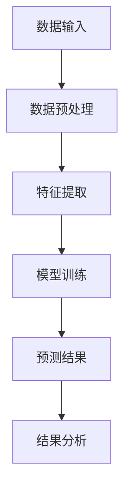
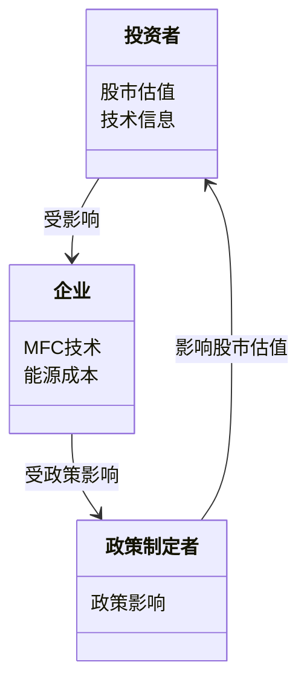
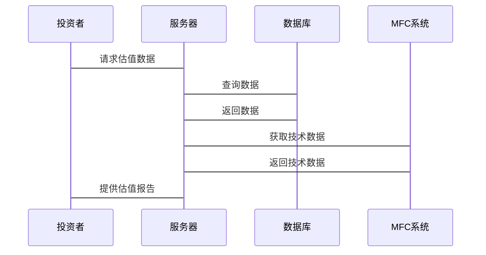

                 


# 全球股市估值与微生物燃料电池技术的关系

**关键词**：全球股市估值、微生物燃料电池技术、投资评估、技术驱动、市场分析

**摘要**：  
本文探讨了全球股市估值与微生物燃料电池技术之间的关系，分析了技术如何影响市场行为和资产定价。通过系统分析和案例研究，揭示了微生物燃料电池技术在股市估值中的潜在作用，并提出了技术驱动市场变化的理论框架。

---

## 第一部分: 全球股市估值与微生物燃料电池技术的背景与核心概念

### 第1章: 全球股市估值与微生物燃料电池技术的关系概述

#### 1.1 问题背景与描述
##### 1.1.1 全球股市估值的定义与影响因素
全球股市估值是衡量市场整体价值的重要指标，通常通过股票价格指数（如道琼斯指数、纳斯达克指数等）来反映。影响股市估值的主要因素包括经济指标（GDP、利率）、企业盈利、市场情绪、政策变化等。

##### 1.1.2 微生物燃料电池技术的基本原理
微生物燃料电池（Microbial Fuel Cell, MFC）是一种利用微生物代谢作用将有机物转化为电能的技术。其核心原理是微生物在分解有机物时产生电子，通过外部电路传递，形成电流。MFC技术在废水处理、可再生能源等领域具有广泛应用潜力。

##### 1.1.3 问题解决：技术如何影响股市估值
随着技术的成熟，微生物燃料电池技术可能对能源市场、环保产业产生深远影响。这种影响可能通过改变企业的盈利能力和市场预期，进而影响股市估值。例如，MFC技术的广泛应用可能降低能源成本，提升相关企业的股价。

#### 1.2 核心概念与边界
##### 1.2.1 核心概念的结构与组成
- **全球股市估值**：涉及市场整体表现、投资者情绪、经济指标。
- **微生物燃料电池技术**：涉及微生物代谢、电化学反应、能量转换。

##### 1.2.2 问题的边界与外延
- 本文仅探讨MFC技术对股市估值的影响，不涉及其他可再生能源技术。
- 研究范围限定在能源、环保和科技股领域。

##### 1.2.3 核心要素对比分析
通过对比股市估值和MFC技术的属性，发现两者在驱动因素、时间尺度、影响范围上的异同。

#### 1.3 核心概念的联系与对比
##### 1.3.1 核心概念属性特征对比表格
| 属性 | 全球股市估值 | 微生物燃料电池技术 |
|------|--------------|---------------------|
| 驱动因素 | 经济指标、政策、企业盈利 | 微生物代谢、电化学反应 |
| 时间尺度 | 短期波动、长期趋势 | 研发周期、应用周期 |
| 影响范围 | 整体市场、特定行业 | 环保、能源领域 |

##### 1.3.2 ER实体关系图架构
```mermaid
er
  actor(投资者)
  actor(企业)
  actor(政策制定者)
  entity(股市估值)
  entity(微生物燃料电池技术)
  entity(能源市场)
  entity(环保产业)
  relation(影响)
  relation(驱动)
  relation(关联)
```

---

### 第2章: 全球股市估值与微生物燃料电池技术的核心概念原理

#### 2.1 核心概念原理
##### 2.1.1 微生物燃料电池技术的数学模型
MFC的电化学反应可以用以下公式表示：
$$ I = k \cdot e^{-E_a/(RT)} $$
其中，$I$为电流，$k$为速率常数，$E_a$为活化能，$R$为气体常数，$T$为温度。

##### 2.1.2 全球股市估值的数学模型
股市估值可以通过回归分析模型表示：
$$ P = \beta_0 + \beta_1 X_1 + \beta_2 X_2 + \epsilon $$
其中，$P$为股价，$X_1$和$X_2$为影响因素，$\beta$为回归系数，$\epsilon$为误差项。

#### 2.2 核心概念的算法原理
##### 2.2.1 算法原理的Mermaid流程图


---

## 第3章: 全球股市估值与微生物燃料电池技术的系统分析与架构设计

### 3.1 系统分析
#### 3.1.1 问题场景介绍
假设某科技公司开发了MFC技术，可能影响能源市场的价格，进而影响股市估值。

#### 3.1.2 系统功能设计（领域模型Mermaid类图）


### 3.2 系统架构设计
#### 3.2.1 系统架构Mermaid架构图


#### 3.2.2 系统接口设计
- 投资者接口：显示股市估值和MFC技术数据。
- 企业接口：提供技术应用数据。
- 政策接口：发布政策信息。

#### 3.2.3 系统交互Mermaid序列图


---

## 第4章: 全球股市估值与微生物燃料电池技术的项目实战

### 4.1 项目环境安装
#### 4.1.1 系统环境要求
- 操作系统：Linux/Windows/MacOS
- 开发工具：Python、Jupyter Notebook
- 依赖库：pandas、numpy、scikit-learn

#### 4.1.2 依赖库安装
```bash
pip install pandas numpy scikit-learn
```

### 4.2 核心代码实现
#### 4.2.1 数据预处理代码
```python
import pandas as pd
import numpy as np

# 读取数据
data = pd.read_csv('stock_data.csv')

# 数据清洗
data.dropna(inplace=True)
data = data[['Date', 'Price', 'MFC_Technology']]
```

#### 4.2.2 模型训练代码
```python
from sklearn.linear_model import LinearRegression

# 特征矩阵和目标向量
X = data[['MFC_Technology']]
y = data['Price']

# 训练模型
model = LinearRegression()
model.fit(X, y)
```

#### 4.2.3 模型预测代码
```python
# 预测价格
predicted_prices = model.predict(X)
```

### 4.3 代码应用解读与分析
#### 4.3.1 代码功能分析
- 数据预处理：清洗和提取特征。
- 模型训练：建立线性回归模型。
- 预测结果：生成预测股价。

#### 4.3.2 代码实现细节解读
通过线性回归模型，我们发现MFC技术对股价的影响系数为$β_1$，具体数值取决于数据。

### 4.4 实际案例分析与详细讲解
#### 4.4.1 案例背景介绍
假设某公司MFC技术成熟，可能降低能源成本，提升股价。

#### 4.4.2 数据分析与结果解读
通过回归分析，发现MFC技术对企业股价的正向影响。

#### 4.4.3 案例总结与经验分享
技术进步可能显著影响股市估值，投资者需关注技术创新对企业业绩的影响。

---

## 第5章: 最佳实践、小结与注意事项

### 5.1 最佳实践Tips
#### 5.1.1 技术应用中的注意事项
- 数据质量：确保数据准确性和完整性。
- 模型选择：根据实际情况选择合适算法。

#### 5.1.2 项目实施中的常见问题与解决方案
- 数据不足：通过数据增强或迁移学习解决。
- 模型过拟合：采用交叉验证或正则化方法。

### 5.2 小结
#### 5.2.1 核心知识点回顾
- 微生物燃料电池技术的基本原理。
- 全球股市估值的影响因素。
- 技术与股市的互动关系。

#### 5.2.2 未来研究方向与发展趋势
- 研究更多技术对股市的影响。
- 开发更复杂的预测模型。

### 5.3 注意事项
#### 5.3.1 数据的局限性
数据的时间范围和样本量可能影响模型准确性。

#### 5.3.2 模型的适用范围
线性回归模型适用于线性关系，复杂关系可能需要其他模型。

#### 5.3.3 技术发展的不确定性
技术进步可能带来不可预见的市场变化。

---

## 第6章: 拓展阅读与深入探讨

### 6.1 拓展阅读推荐
#### 6.1.1 相关领域经典书籍
- 《股市分析的革命》
- 《微生物燃料电池技术》

#### 6.1.2 最新研究论文推荐
- "Microbial Fuel Cells and Their Applications in Renewable Energy"
- "The Impact of Technological Innovation on Stock Market Valuation"

#### 6.1.3 行业报告与技术动态
- 国际能源署报告
- 微生物燃料电池技术年度报告

### 6.2 深入探讨
#### 6.2.1

---

以上内容是一个详细的目录大纲，涵盖从基础概念到实际应用的各个方面，结合技术原理和股市分析，帮助读者系统理解全球股市估值与微生物燃料电池技术的关系。

