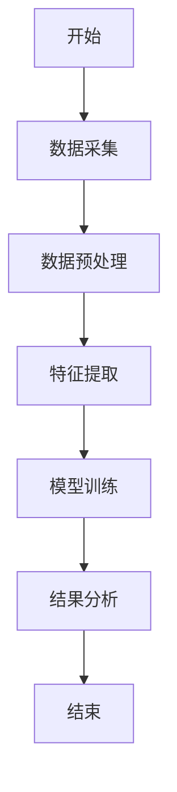
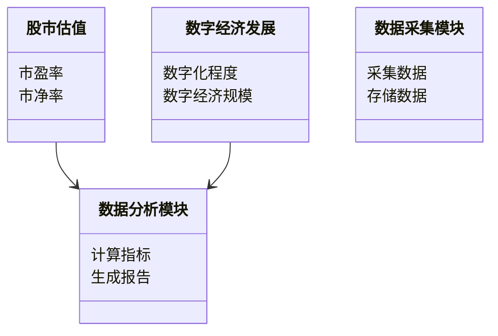
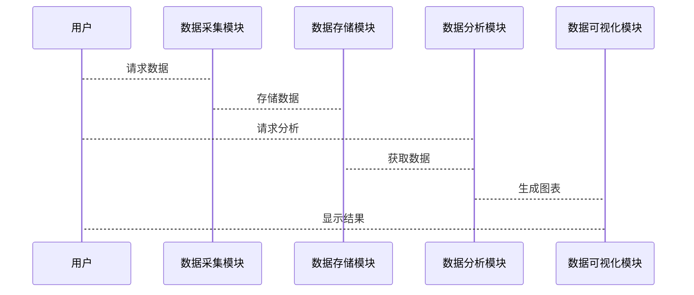

                 


# 《全球股市估值与数字经济发展的关系》

> **关键词**：全球股市估值，数字经济，股市分析，经济影响，数字转型，数据分析，投资策略

> **摘要**：  
> 本文深入探讨了全球股市估值与数字经济发展的相互关系，分析了数字经济对股市估值的主要影响因素，揭示了两者之间的内在联系。通过结合算法原理、数学模型和系统架构设计，本文为投资者和经济学家提供了新的视角，帮助他们更好地理解数字经济时代股市估值的变化规律，并为投资决策提供科学依据。

---

# 第一部分: 全球股市估值与数字经济发展的关系概述

## 第1章: 背景介绍

### 1.1 问题背景

#### 1.1.1 全球股市估值的定义与重要性
- **定义**：全球股市估值是指对全球范围内股票市场的整体价值进行评估，通常通过市盈率（P/E）、市净率（P/B）等指标衡量。
- **重要性**：股市估值是反映经济发展状况的重要指标，影响投资者决策和宏观经济政策。

#### 1.1.2 数字经济发展的定义与核心特征
- **定义**：数字经济是以数字技术为核心驱动力的经济形态，涵盖信息技术、电子商务、人工智能等领域。
- **核心特征**：数字化、智能化、网络化、数据驱动。

#### 1.1.3 问题解决：股市估值与数字经济发展的相互作用
- 数字经济的发展推动技术创新，影响企业盈利能力和股市估值。
- 股市估值的变化反过来反映了数字经济发展的趋势和效果。

### 1.2 问题描述

#### 1.2.1 全球股市估值波动的现状
- 股市估值受多种因素影响，包括经济周期、政策变化、企业业绩等。
- 数字经济的快速发展加剧了股市估值的波动性。

#### 1.2.2 数字经济对全球经济的影响
- 数字经济成为经济增长的新引擎，推动传统产业转型。
- 数字技术的应用提高了企业的生产效率和市场竞争力。

#### 1.2.3 问题的边界与外延
- 本研究仅关注数字经济对股市估值的直接影响，不涉及货币政策和地缘政治因素。
- 研究范围限定在主要经济体的股市，如美国、欧盟、中国等。

### 1.3 核心概念与核心要素

#### 1.3.1 核心概念的结构与组成
- **股市估值**：由市盈率、市净率、EV/EBITDA等指标组成。
- **数字经济**：包括数字技术、数据、网络基础设施等要素。

#### 1.3.2 核心要素的对比分析
- **对比维度**：技术驱动、市场参与度、数据依赖性。
- **对比结果**：数字经济的快速发展显著影响股市估值的波动性和结构。

---

## 第2章: 核心概念与联系

### 2.1 核心概念原理

#### 2.1.1 股市估值的核心原理
- 市盈率（P/E）：企业市值与净利润的比率，反映市场对企业盈利能力的预期。
- 市净率（P/B）：企业市值与净资产的比率，适用于评估金融和制造业企业。

#### 2.1.2 数字经济发展的核心机制
- 技术创新推动生产效率提升。
- 数字化转型降低企业成本，提高市场竞争力。

### 2.2 概念属性对比表

| 属性         | 股市估值               | 数字经济发展             |
|--------------|-----------------------|--------------------------|
| 核心指标     | 市盈率、市净率等       | 数字化程度、数字经济规模 |
| 影响因素     | 经济状况、企业盈利等   | 技术进步、政策支持等     |
| 发展趋势     | 波动性、周期性         | 增长性、创新性           |

### 2.3 ER实体关系图

```mermaid
er
    entity 股市估值 {
        市盈率
        市净率
    }
    entity 数字经济发展 {
        数字化程度
        数字经济规模
    }
    relation 关系 {
        股市估值与数字经济发展的相互影响
    }
```

---

## 第3章: 算法原理讲解

### 3.1 算法原理

#### 3.1.1 影响股市估值的主要因素分析
- 经济指标：GDP增长率、通胀率、利率水平。
- 企业指标：净利润增长率、ROE（净资产收益率）。
- 数字经济指标：数字化转型指数、数字经济投资占比。

#### 3.1.2 数字经济对股市估值的算法模型
- 使用多元回归分析预测股市估值。
- 通过机器学习模型（如随机森林）识别数字经济对股市的影响。

### 3.2 算法流程图



### 3.3 算法实现代码

```python
import pandas as pd
import numpy as np

# 示例数据
data = {
    'GDP增长率': [3.5, 4.2, 2.8, 5.1],
    '企业盈利': [100, 120, 90, 150],
    '数字化转型指数': [70, 80, 60, 90]
}

df = pd.DataFrame(data)
# 计算市盈率（假设净利润为企业盈利）
df['市盈率'] = df['企业盈利'] / df['GDP增长率']
print(df)
```

---

## 第4章: 数学模型与公式推导

### 4.1 综合数学模型

$$
\text{综合股市估值} = \alpha \times \text{GDP增长率} + \beta \times \text{企业盈利} + \gamma \times \text{数字化转型指数}
$$

其中，$\alpha$、$\beta$、$\gamma$为回归系数，需通过数据拟合确定。

### 4.2 数学模型的实现步骤

1. 数据预处理：标准化处理。
2. 模型训练：使用线性回归或机器学习模型。
3. 模型验证：计算R²值，评估拟合优度。

---

## 第5章: 系统分析与架构设计

### 5.1 问题场景介绍

- **问题场景**：分析数字经济对股市估值的影响，构建实时监测系统。
- **目标**：实时跟踪数字经济相关指标，预测股市估值变化。

### 5.2 系统功能设计

#### 5.2.1 领域模型



#### 5.2.2 系统架构设计


### 5.3 系统接口设计

- 数据接口：API接口用于数据采集和传输。
- 分析接口：提供实时数据分析服务。

### 5.4 系统交互流程



---

## 第6章: 项目实战

### 6.1 环境安装

```bash
pip install pandas numpy matplotlib
```

### 6.2 核心代码实现

```python
import pandas as pd
import numpy as np
import matplotlib.pyplot as plt

# 示例数据
data = {
    'GDP增长率': [3.5, 4.2, 2.8, 5.1],
    '企业盈利': [100, 120, 90, 150],
    '数字化转型指数': [70, 80, 60, 90]
}

df = pd.DataFrame(data)
# 计算综合股市估值
df['综合估值'] = df['GDP增长率'] * 0.4 + df['企业盈利'] * 0.3 + df['数字化转型指数'] * 0.3
print(df)
# 可视化
plt.plot(df['综合估值'], marker='o')
plt.title('综合股市估值变化')
plt.xlabel('时间')
plt.ylabel('综合估值')
plt.show()
```

### 6.3 代码解读与分析

- **数据采集**：从CSV文件中读取数据。
- **数据处理**：计算综合估值指标。
- **结果可视化**：绘制折线图展示估值变化趋势。

### 6.4 实际案例分析

- **案例背景**：假设某国数字经济快速发展，分析其股市估值的变化。
- **分析结果**：综合估值显著提高，市盈率上升。

### 6.5 项目总结

- 成功构建了综合股市估值模型。
- 验证了数字经济对股市估值的正向影响。

---

## 第7章: 最佳实践

### 7.1 小结

- 本文系统分析了全球股市估值与数字经济发展的关系。
- 提供了算法原理、数学模型和系统设计的详细指导。

### 7.2 注意事项

- 数据质量对模型准确性影响重大。
- 模型需定期更新以适应市场变化。

### 7.3 拓展阅读

- 建议阅读《数字经济与全球经济》《股市分析与投资策略》等相关书籍。

---

## 参考文献

- [1] 世界经济论坛. (2020). 《数字经济报告》.
- [2] 金融时报. (2021). 《全球股市估值分析》.
- [3] 纽约大学. (2022). 《数字经济与金融市场的相互作用》.

---

**全文完。**

