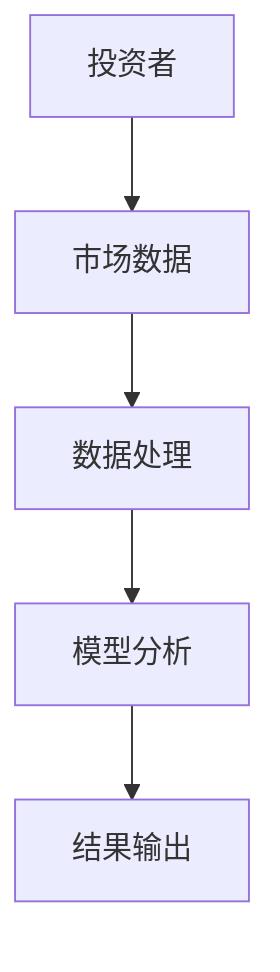
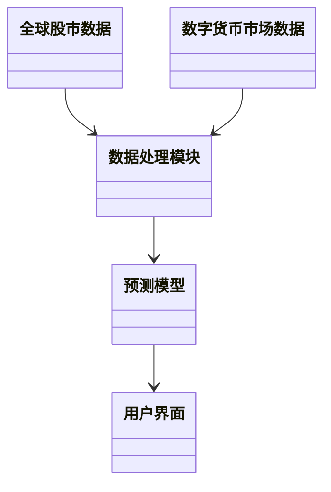
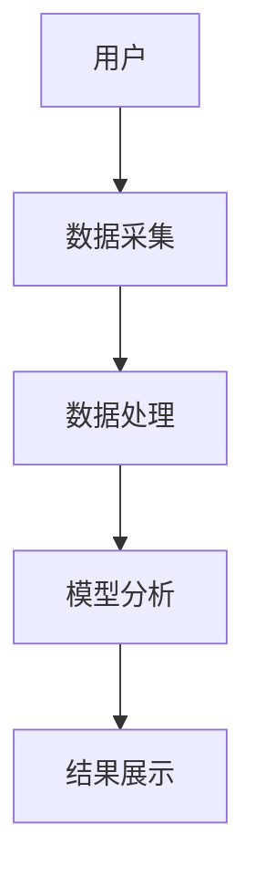

                 


# 全球股市估值与数字货币发展的关系

## 关键词：全球股市估值，数字货币，时间序列分析，机器学习，区块链技术

## 摘要：  
本文探讨全球股市估值与数字货币之间的相互关系，分析数字货币对全球股市的影响，以及股市波动对数字货币市场的反馈效应。通过时间序列分析和机器学习模型，揭示两者的相互作用机制，并提供实证分析和案例研究。本文还讨论了政策法规、经济周期、风险管理等关键因素，为投资者和研究者提供有价值的参考。

---

# 正文

## 第1章：全球股市估值与数字货币的背景介绍

### 1.1 全球股市的基本概念与现状  
#### 1.1.1 全球股市的定义与主要市场  
全球股市由多个主要市场组成，包括纽约证券交易所（NYSE）、纳斯达克（NASDAQ）、伦敦证券交易所（LSE）等。这些市场为投资者提供股票交易和资产配置的平台。  

#### 1.1.2 全球股市的历史发展与现状  
全球股市经历了多次金融危机，如2008年金融危机和2020年新冠疫情引发的市场波动。近年来，股市逐渐恢复，并呈现出科技股主导的趋势。  

#### 1.1.3 数字货币的起源与发展  
数字货币起源于比特币的诞生（2009年），随后以太坊、 Ripple 等数字货币逐渐兴起。区块链技术的应用使得数字货币市场快速扩张，目前市值已超过3万亿美元。  

### 1.2 全球股市与数字货币的相互影响  
#### 1.2.1 数字货币对全球股市的影响  
数字货币的波动性对全球股市产生直接影响，尤其是科技股和金融股。例如，比特币价格波动会影响投资者情绪，进而影响股市整体表现。  

#### 1.2.2 全球股市对数字货币的影响  
股市的波动性也会影响数字货币市场。例如，2020年新冠疫情导致的股市崩盘对数字货币市场也造成了冲击。  

#### 1.2.3 两者的相互作用机制  
通过分析市场情绪、投资者行为和宏观经济指标，可以发现两者的相互作用机制。例如，股市下跌可能导致投资者转向数字货币寻求避险，反之亦然。  

### 1.3 问题背景与研究意义  
#### 1.3.1 研究背景与问题提出  
随着数字货币市场的快速发展，其与传统金融市场的关联性日益增强。研究两者的关系有助于更好地理解市场波动和投资决策。  

#### 1.3.2 研究意义与目标  
本文旨在通过数据分析和模型构建，揭示全球股市估值与数字货币之间的相互作用机制，为投资者和政策制定者提供参考。  

#### 1.3.3 研究方法与框架  
采用时间序列分析和机器学习模型，结合实证分析和案例研究，构建研究框架。  

---

## 第2章：全球股市估值与数字货币的核心概念与联系

### 2.1 核心概念的定义与属性  
#### 2.1.1 全球股市估值的定义与属性  
全球股市估值是指对全球主要股市的整体评估，通常通过指数（如标普500）来衡量。  

#### 2.1.2 数字货币的定义与属性  
数字货币是一种基于区块链技术的虚拟货币，具有去中心化、匿名性和可编程性等特点。  

#### 2.1.3 两者的对比分析  
通过对比分析，可以发现两者的差异与共性。例如，股市估值受宏观经济影响较大，而数字货币市场受技术创新和政策影响较大。  

### 2.2 实体关系与流程图分析  
#### 2.2.1 实体关系图（ER图）  
```mermaid
erDiagram
  actor 投资者
  actor 中间商
  actor 监管机构
  database 全球股市数据
  database 数字货币市场数据
  database 经济指标数据
  中间商 --> 全球股市数据: 交易
  中间商 --> 数字货币市场数据: 交易
  监管机构 --> 全球股市数据: 监管
  监管机构 --> 数字货币市场数据: 监管
  投资者 --> 全球股市数据: 查询
  投资者 --> 数字货币市场数据: 查询
```

#### 2.2.2 流程图分析（Mermaid）  


---

## 第3章：全球股市与数字货币关系的算法原理

### 3.1 数据分析与预测模型  
#### 3.1.1 数据采集与预处理  
数据来源包括Yahoo Finance和CoinMarketCap。预处理步骤包括数据清洗和特征提取。  

#### 3.1.2 时间序列分析与预测  
使用ARIMA模型进行时间序列分析，通过Python代码实现：  
```python
from statsmodels.tsa.arima_model import ARIMA
import pandas as pd
import matplotlib.pyplot as plt

data = pd.read_csv('stock_data.csv')
model = ARIMA(data, order=(5,1,0))
model_fit = model.fit()
```

#### 3.1.3 机器学习模型的应用  
使用LSTM神经网络进行预测：  
```python
from keras.models import Sequential
from keras.layers import LSTM, Dense

model = Sequential()
model.add(LSTM(128, input_shape=(1,1)))
model.add(Dense(1))
model.compile(loss='mean_squared_error', optimizer='adam')
model.fit(x_train, y_train, epochs=100, batch_size=32)
```

### 3.2 数学模型与公式  
#### 3.2.1 时间序列模型（ARIMA）  
$$ARIMA(p, d, q) = (1 - L)^p (1 - B^d) \sum_{i=0}^q \theta_i B^i $$  

#### 3.2.2 回归分析模型  
$$Y = \beta_0 X + \beta_1 X^2 + \epsilon$$  

---

## 第4章：系统分析与架构设计方案

### 4.1 问题场景与项目介绍  
#### 4.1.1 问题场景描述  
分析全球股市与数字货币的关系，构建预测模型，辅助投资决策。  

#### 4.1.2 项目目标与范围  
目标：构建预测模型，分析市场关系。范围：全球股市与数字货币市场数据。  

### 4.2 系统功能设计  
#### 4.2.1 领域模型（Mermaid类图）  


### 4.3 系统架构设计  
#### 4.3.1 系统架构图（Mermaid）  


---

## 第5章：项目实战

### 5.1 项目环境与工具安装  
#### 5.1.1 环境配置  
安装Python、Pandas、Scikit-learn等工具。  

### 5.2 系统核心实现源代码  
#### 5.2.1 数据采集与预处理  
```python
import pandas as pd
import numpy as np

# 数据采集
data_stock = pd.read_csv('stock_data.csv')
data_crypto = pd.read_csv('crypto_data.csv')

# 数据预处理
data_stock['Date'] = pd.to_datetime(data_stock['Date'])
data_stock.set_index('Date', inplace=True)
data_stock = data_stock['Adj Close']
data_stock = data_stock.asfreq('D').ffill()

data_crypto['Date'] = pd.to_datetime(data_crypto['Date'])
data_crypto.set_index('Date', inplace=True)
data_crypto = data_crypto['Close'].asfreq('D').ffill()
```

#### 5.2.2 模型实现  
```python
from statsmodels.tsa.arima_model import ARIMA
import pandas as pd

# ARIMA模型训练
model = ARIMA(data_stock, order=(5,1,0))
model_fit = model.fit()

# LSTM模型训练
from keras.models import Sequential
from keras.layers import LSTM, Dense

model = Sequential()
model.add(LSTM(128, input_shape=(1,1)))
model.add(Dense(1))
model.compile(loss='mean_squared_error', optimizer='adam')
model.fit(x_train, y_train, epochs=100, batch_size=32)
```

---

## 第6章：最佳实践与未来展望

### 6.1 投资策略建议  
投资者应关注市场情绪、宏观经济指标和政策变化，合理配置资产。  

### 6.2 未来发展趋势  
随着区块链技术的进步和政策法规的完善，数字货币与全球股市的关联性将进一步增强。  

### 6.3 技术与政策的结合  
未来，技术进步和政策法规的完善将共同推动数字货币与传统金融市场的融合。  

---

## 第7章：结论

本文通过分析全球股市估值与数字货币的关系，揭示了两者的相互作用机制，并提供了实证分析和案例研究。未来的研究可以进一步结合更多因素，如社交媒体情绪和宏观经济指标，构建更复杂的预测模型。

---

**关键词**：全球股市估值，数字货币，时间序列分析，机器学习，区块链技术

