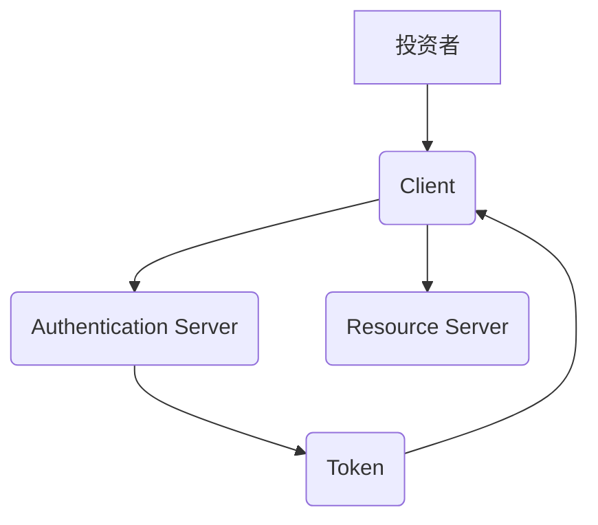
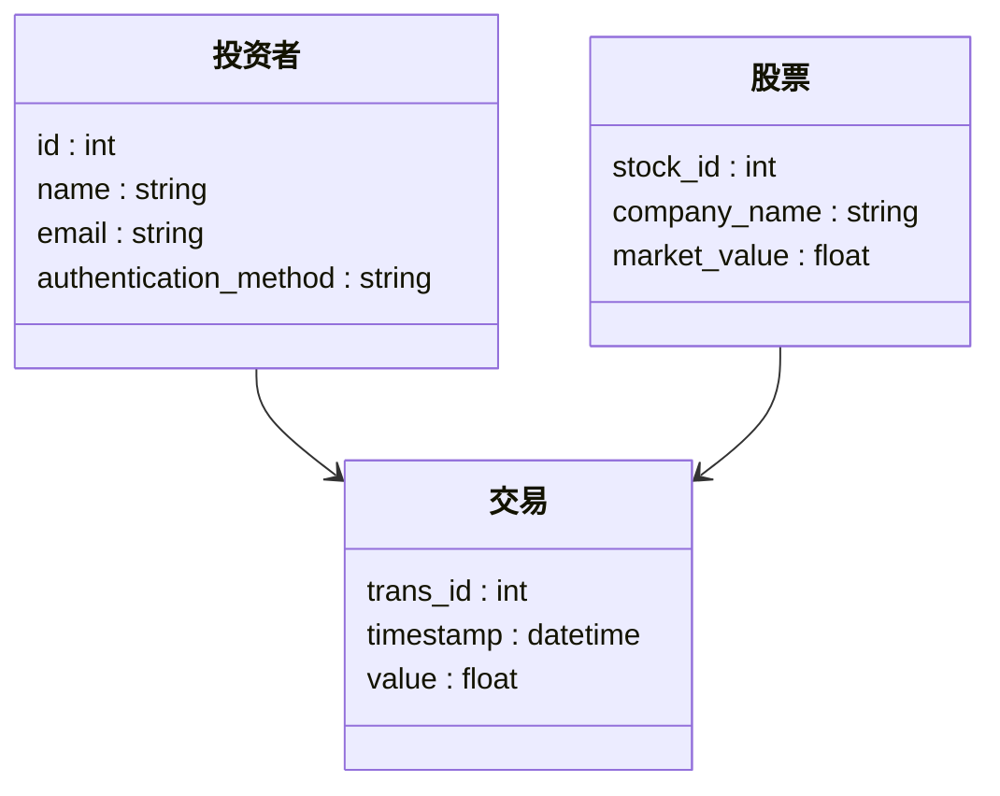
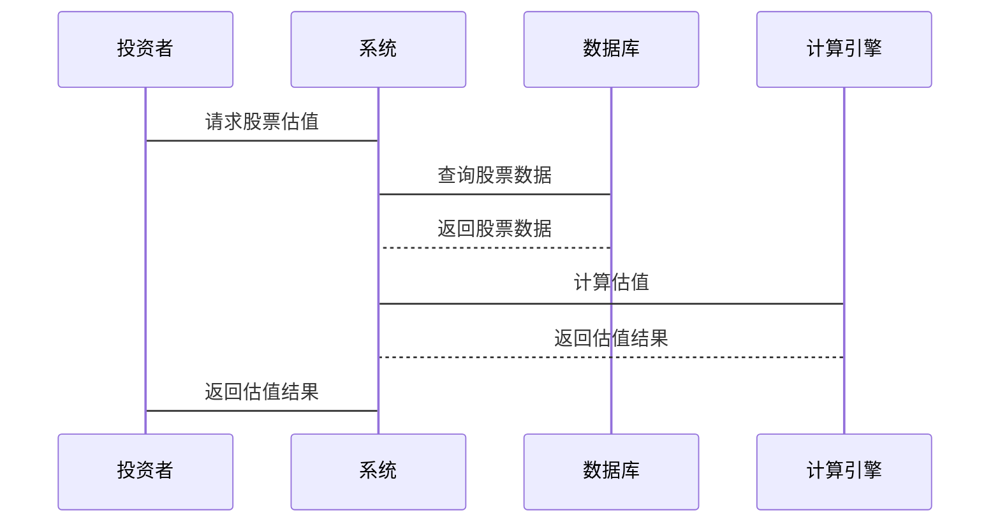

                 


# 全球股市估值与数字身份认证的关联

## 关键词：全球股市估值、数字身份认证、关联分析、算法原理、系统架构、项目实战

## 摘要：  
本文探讨了全球股市估值与数字身份认证之间的深层关联。通过分析数字身份认证技术在金融领域的应用，结合股市估值的数学模型，揭示了数字身份如何影响投资者行为和市场信任机制，进而影响股市估值。文章从背景介绍、核心概念、算法原理、系统架构、项目实战等多维度展开，深入剖析了两者的关联，并提供了实际案例和最佳实践。

---

## 第一部分：全球股市估值与数字身份认证的背景与关联

### 第1章：背景介绍

#### 1.1 全球股市估值的基本概念

##### 1.1.1 股市估值的定义与作用
股市估值是指对上市公司股票价值的评估，旨在确定其在市场上的合理价格。它通过分析财务数据、市场趋势和宏观经济指标，帮助投资者做出决策。股市估值不仅是市场的晴雨表，还是企业价值的体现。

##### 1.1.2 全球股市估值的现状与趋势
随着全球化和数字化的发展，股市估值的复杂性不断增加。投资者需要依赖更精准的数据分析和预测模型，以应对市场的波动性和不确定性。

##### 1.1.3 数字化时代对股市估值的影响
数字化技术（如大数据分析和人工智能）显著提升了股市估值的效率和准确性，但也带来了数据安全和隐私保护的新挑战。

#### 1.2 数字身份认证的定义与特点

##### 1.2.1 数字身份认证的基本概念
数字身份认证是通过技术手段验证用户身份的真实性。它确保只有合法用户可以访问敏感信息和系统，是金融安全的基础。

##### 1.2.2 数字身份认证的核心要素
数字身份认证通常包括身份标识、认证方式（如密码、生物识别）和加密技术，以确保交易的安全性。

##### 1.2.3 数字身份认证的技术发展
从传统的用户名密码到现代的多因素认证（MFA）和零信任架构，数字身份认证技术不断演进，以应对日益复杂的网络安全威胁。

#### 1.3 问题背景与问题描述

##### 1.3.1 全球股市估值的挑战
股市估值面临数据不透明、市场操纵和信息滞后等问题，这些问题影响了估值的准确性和可靠性。

##### 1.3.2 数字身份认证在金融领域的应用需求
随着金融交易的数字化，确保投资者身份的真实性和交易的合法性变得至关重要。

##### 1.3.3 问题解决的必要性与目标
通过引入数字身份认证技术，可以提高股市估值的可信度和安全性，降低市场操纵和欺诈行为的风险。

---

### 第2章：核心概念与联系

#### 2.1 核心概念原理

##### 2.1.1 股市估值的关键因素
- **财务数据**：收入、利润、资产负债表等。
- **市场趋势**：行业趋势、宏观经济指标。
- **投资者情绪**：市场参与者的心理预期。

##### 2.1.2 数字身份认证的安全机制
- **身份验证**：确认用户身份的真实性。
- **授权控制**：限制用户的访问权限。
- **加密技术**：保护数据的机密性。

##### 2.1.3 两者关联的理论基础
数字身份认证通过确保投资者身份的真实性和交易的合法性，增强了市场的信任机制，从而影响股市估值的准确性。

#### 2.2 概念属性特征对比表格

| 概念       | 股市估值                     | 数字身份认证               |
|------------|------------------------------|-----------------------------|
| 核心目标   | 评估股票价值                 | 验证用户身份真实性           |
| 关键技术   | 数据分析、机器学习          | 加密技术、多因素认证         |
| 应用场景   | 金融投资、风险管理          | 金融交易、在线支付           |
| 关联性     | 数字身份影响市场信任和交易合法性，进而影响估值   | 通过保障交易安全提高市场参与度和估值的可靠性 |

#### 2.3 ER实体关系图

```mermaid
erDiagram
    customer[投资者] {
        <属性>
        id : int
        name : string
        email : string
        authentication_method : string
    }
    stock[股票] {
        <属性>
        stock_id : int
        company_name : string
        market_value : float
    }
    transaction[交易] {
        <属性>
        trans_id : int
        timestamp : datetime
        value : float
    }
    relationship between投资者 and 股票 through 交易
```

---

## 第三部分：算法原理与数学模型

### 第3章：算法原理讲解

#### 3.1 数字身份认证的算法流程

##### 3.1.1 OAuth 2.0认证流程


##### 3.1.2 加密算法
使用哈希函数和数字签名来确保数据的完整性和真实性。例如，使用SHA-256哈希函数对用户密码进行加密。

##### 3.1.3 多因素认证
结合多种认证方式（如密码、手机验证码、生物识别）提高安全性。

#### 3.2 数学模型与公式

##### 3.2.1 股市估值模型
常用CAPM模型：
$$
E(R_i) = R_f + \beta_i (R_m - R_f)
$$
其中，$E(R_i)$ 是股票i的预期回报率，$R_f$ 是无风险利率，$\beta_i$ 是股票i的贝塔系数，$R_m$ 是市场预期回报率。

##### 3.2.2 数字签名算法
使用RSA算法对数据进行签名和验证：
$$
\text{公钥} = (n, e), \quad \text{私钥} = (n, d)
$$
签名过程：
$$
\text{签名} = \text{hash}(message)^d \mod n
$$
验证过程：
$$
\text{验证} = (\text{签名}^e \mod n) == \text{hash}(message)
$$

---

### 第4章：系统分析与架构设计方案

#### 4.1 系统功能设计

##### 4.1.1 领域模型


##### 4.1.2 系统架构


#### 4.2 系统接口设计

##### 4.2.1 HTTP API
- `/auth/login`：用户登录接口。
- `/api/stock/valuation`：获取股票估值接口。

#### 4.3 系统交互序列图



---

### 第5章：项目实战

#### 5.1 环境安装

##### 5.1.1 安装Python和必要的库
```bash
pip install flask
pip install oauth2
pip install cryptography
```

#### 5.2 核心实现源代码

##### 5.2.1 数字身份认证模块
```python
from oauth2 import Client
from cryptography.hazmat.primitives.asymmetric import padding
from cryptography.hazmat.primitives import hashes

def authenticate(client_id, client_secret, token):
    client = Client(client_id, client_secret)
    return client.authenticate(token)
```

##### 5.2.2 股市估值模块
```python
import pandas as pd
from sklearn.linear_model import LinearRegression

def calculate_valuation(dataframe):
    model = LinearRegression()
    model.fit(dataframe[['P/E', 'ROE']], dataframe['Price'])
    return model.predict(dataframe[['P/E', 'ROE']])
```

#### 5.3 代码解读与分析

##### 5.3.1 数字身份认证模块
- 使用OAuth2协议进行身份验证，确保用户身份的合法性。
- 结合加密技术（如RSA）提高安全性。

##### 5.3.2 股市估值模块
- 使用机器学习模型（如线性回归）对股票进行估值，提高预测的准确性。

#### 5.4 案例分析

##### 5.4.1 案例背景
假设我们有一个包含股票P/E、ROE和价格的数据集，需要预测股票的市场价值。

##### 5.4.2 数据分析
```python
data = pd.read_csv('stock_data.csv')
print(data.head())
```

##### 5.4.3 估值结果
```python
print(calculate_valuation(data))
```

#### 5.5 项目总结

##### 5.5.1 实施成果
- 实现了一个结合数字身份认证和股市估值的系统，提高了交易的安全性和估值的准确性。

##### 5.5.2 经验与教训
- 数字身份认证的引入显著提升了系统的安全性，但增加了系统的复杂性。
- 数据质量和模型选择对股市估值的准确性至关重要。

---

## 第六部分：最佳实践与总结

### 第6章：最佳实践

#### 6.1 小结
本文探讨了全球股市估值与数字身份认证的关联，通过理论分析和实际案例，展示了如何利用数字身份认证技术提升股市估值的安全性和准确性。

#### 6.2 注意事项
- 在实施数字身份认证时，必须确保系统的安全性和用户体验。
- 股市估值模型需要结合实际市场情况不断优化。

#### 6.3 拓展阅读
建议进一步研究区块链技术在数字身份认证和股市估值中的应用，探索更安全和透明的解决方案。

---

## 作者介绍
我是[您的姓名]，[您的职位]，在[公司/机构]负责[相关工作]。我专注于[领域]，致力于通过技术创新解决实际问题。

