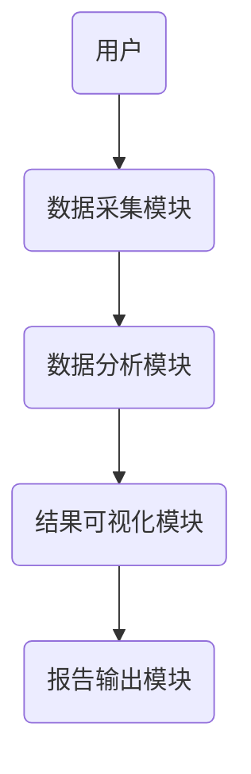

                 


# 全球股市估值与新材料研发的关系

> 关键词：全球股市估值、新材料研发、投资机会、风险管理、PEST模型、技术驱动、市场驱动

> 摘要：本文探讨了全球股市估值与新材料研发之间的关系，分析了新材料研发对股市估值的影响，以及股市资金对新材料研发的支持。通过构建PEST模型，系统分析了政策、经济、社会和技术因素对两者关系的驱动作用。结合实际案例，本文揭示了新材料研发如何通过技术进步、成本降低和市场需求推动股市估值的提升，同时也探讨了股市资金如何支持新材料研发的进程。最后，本文提出了基于PEST模型的投资策略和风险管理方法，为投资者和研究者提供了有价值的参考。

---

# 第一部分: 全球股市估值与新材料研发的背景与概述

## 第1章: 全球股市估值与新材料研发的背景

### 1.1 问题背景与重要性
#### 1.1.1 全球股市估值的定义与意义
- 全球股市估值是衡量企业价值的重要指标，反映了市场对企业的信心和预期。
- 通过分析股市估值的变化，可以洞察经济趋势和企业基本面的变化。

#### 1.1.2 新材料研发的定义与重要性
- 新材料是指具有优异性能或特殊功能的新型材料，是科技进步和工业发展的基石。
- 新材料研发对产业升级、技术创新和经济增长具有重要意义。

#### 1.1.3 两者的关联性与研究价值
- 新材料研发推动技术进步，进而影响企业盈利能力和股市估值。
- 股市估值的变化反过来为企业融资和研发投入提供支持。
- 研究两者的关系有助于理解科技与资本的互动机制。

### 1.2 问题描述与目标
#### 1.2.1 研究的核心问题
- 探讨新材料研发如何影响股市估值。
- 分析股市资金如何支持新材料研发。
- 研究两者之间的相互作用机制。

#### 1.2.2 研究目标与范围
- 量化分析新材料研发对股市估值的影响。
- 探讨政策、经济、社会和技术因素对两者关系的驱动作用。
- 提出基于PEST模型的投资策略和风险管理方法。

#### 1.2.3 研究的边界与外延
- 重点关注全球主要股市（如美股、A股）和新材料行业。
- 研究范围涵盖技术创新、市场表现和资本流动。
- 外延包括政策变化、技术突破和市场趋势。

### 1.3 核心概念与联系
#### 1.3.1 核心概念原理
- 新材料研发的核心是技术创新，而股市估值的核心是企业价值的市场定价。
- 两者的关系体现在技术进步推动企业价值提升，而资本支持推动技术创新。

#### 1.3.2 核心概念属性对比表
| 属性                | 全球股市估值          | 新材料研发            |
|---------------------|----------------------|-----------------------|
| 核心要素            | 企业价值、市场预期    | 技术创新、研发投入    |
| 影响因素            | 经济指标、政策环境    | 技术难度、研发周期    |
| 目标                | 为企业提供融资支持    | 推动技术进步            |
| 结果                | 股价波动、市值变化    | 新材料性能提升、产业化 |

#### 1.3.3 实体关系图（ER图）
```mermaid
erd
    章节1_1_3
    entity 全球股市估值 {
        <属性> 企业价值
        <属性> 市场预期
        <关系> 影响 新材料研发
    }
    entity 新材料研发 {
        <属性> 技术创新
        <属性> 研发投入
        <关系> 影响 全球股市估值
    }
```

---

# 第二部分: 全球股市估值与新材料研发的核心概念分析

## 第2章: 全球股市估值的核心要素

### 2.1 股市估值的基本原理
#### 2.1.1 股票估值的定义
- 股票估值是基于企业基本面和市场预期，对股票内在价值的评估。
- 常见的估值方法包括市盈率（PE）、市净率（PB）和现金流折现法（DCF）。

#### 2.1.2 主要估值方法
- 市盈率（PE）：市盈率=股价/每股收益。
- 市净率（PB）：市净率=股价/每股净资产。
- 现金流折现法（DCF）：通过预测企业未来现金流，折现到现值。

#### 2.1.3 影响股市估值的关键因素
- 企业盈利能力和成长性。
- 宏观经济环境和政策。
- 市场情绪和投资者预期。

### 2.2 新材料研发的核心要素
#### 2.2.1 新材料的定义与分类
- 新材料包括纳米材料、高性能复合材料、生物材料等。
- 按用途可分为结构材料、功能材料和智能材料。

#### 2.2.2 新材料研发的关键环节
- 技术研发：基础研究、实验室验证。
- 小试：中试生产、性能测试。
- 中试：产业化验证、市场推广。

#### 2.2.3 新材料研发的驱动因素
- 技术突破：新材料的研发依赖于基础科学的进步。
- 市场需求：新兴行业（如新能源、医疗）推动新材料研发。
- 政策支持：政府补贴、税收优惠。

### 2.3 新材料研发对股市估值的影响
#### 2.3.1 技术进步对估值的提升作用
- 技术创新降低生产成本，提升企业盈利能力。
- 技术领先企业在市场上具有竞争优势，股价被高估。

#### 2.3.2 成本降低对估值的影响
- 新材料研发成功后，生产成本下降，企业利润率提高。
- 成本优势使得企业市场份额扩大，进而提升估值。

#### 2.3.3 市场需求变化对估值的推动
- 新材料满足新兴行业需求，市场需求增长。
- 需求增长推动企业收入和利润增长，股价上升。

### 2.4 股市资金对新材料研发的支持
#### 2.4.1 资本市场在新材料研发中的作用
- 股市提供融资渠道，支持企业研发投入。
- 机构投资者（如风投、PE）参与新材料企业投资。

#### 2.4.2 投资者对新材料企业的估值偏好
- 投资者倾向于高成长性新材料企业，给予较高估值。
- 技术壁垒高、市场前景广的企业获得更高的市盈率。

#### 2.4.3 股市融资对新材料研发的促进
- 新材料企业通过IPO或增发筹集资金。
- 股权融资为研发提供长期资金支持。

---

# 第三部分: 全球股市估值与新材料研发的理论模型与分析框架

## 第3章: 全球股市估值与新材料研发的理论模型

### 3.1 理论模型构建
#### 3.1.1 模型构建的基本思路
- 基于PEST模型（政治、经济、社会、技术）分析影响两者关系的因素。
- 从政策、经济、社会和技术四个维度分析新材料研发和股市估值的相互作用。

#### 3.1.2 模型的数学表达
- 综合指数模型：$$ S = \alpha P + \beta E + \gamma S + \delta T $$
  - S：综合影响指数。
  - P：政策因素权重。
  - E：经济因素权重。
  - S：社会因素权重。
  - T：技术因素权重。

#### 3.1.3 模型的验证与优化
- 使用历史数据验证模型的准确性。
- 根据实际结果调整各因素的权重。

### 3.2 PEST模型分析
#### 3.2.1 政策因素
- 政府政策对新材料研发的支持力度影响企业的研发投入。
- 政策鼓励（如税收优惠）会提升投资者对新材料企业的估值。

#### 3.2.2 经济因素
- 经济增长推动新材料需求，进而影响股市估值。
- 利率水平和货币政策影响股市整体估值水平。

#### 3.2.3 社会因素
- 社会对新材料的认知和接受度影响市场需求。
- 社会环保意识提升推动绿色新材料的研发和应用。

#### 3.2.4 技术因素
- 技术突破（如新型材料的发明）直接影响企业的技术优势和估值。
- 技术扩散速度影响新材料研发的产业化进程。

### 3.3 系统架构设计
#### 3.3.1 系统功能设计
- 数据采集：收集全球股市数据和新材料研发数据。
- 数据分析：基于PEST模型进行多维度分析。
- 结果可视化：生成图表和报告，展示分析结果。

#### 3.3.2 系统架构设计


#### 3.3.3 数据接口设计
- 输入接口：全球股市数据、新材料研发数据。
- 输出接口：分析结果报告、可视化图表。

---

# 第四部分: 全球股市估值与新材料研发的案例分析与投资策略

## 第4章: 案例分析

### 4.1 苹果公司新材料研发案例
#### 4.1.1 苹果新材料研发的背景
- 苹果公司在材料科学领域的持续投入，推动了产品创新。
- 新材料的应用提升了产品性能和用户体验。

#### 4.1.2 苹果新材料研发对股市估值的影响
- 新材料应用提升了产品竞争力，推动股价上涨。
- 技术创新使得苹果在市场中保持领先地位，获得高估值。

#### 4.1.3 投资启示
- 关注企业技术研发投入和技术创新能力。
- 选择具有技术壁垒和市场前景的新材料企业。

### 4.2 特斯拉新材料研发案例
#### 4.2.1 特斯拉新材料研发的背景
- 特斯拉在电池材料和车身材料上的创新推动了电动汽车的发展。
- 新材料的应用降低了生产成本，提升了产品性能。

#### 4.2.2 特斯拉新材料研发对股市估值的影响
- 新材料研发成功降低了生产成本，提升了利润率。
- 技术领先使得特斯拉在电动汽车市场占据主导地位，股价持续上涨。

#### 4.2.3 投资启示
- 关注企业的技术研发能力和市场应用前景。
- 选择具有技术创新和产业化能力的新材料企业。

## 第5章: 投资策略与风险管理

### 5.1 投资策略
#### 5.1.1 基于PEST模型的投资策略
- 关注政策支持的新材料领域。
- 投资具有技术优势和市场前景的新材料企业。
- 分散投资风险，降低单一企业风险敞口。

#### 5.1.2 高成长新材料企业的特征
- 高研发投入占比。
- 技术创新能力强。
- 市场需求增长快。

### 5.2 风险管理
#### 5.2.1 风险识别
- 技术风险：技术研发失败的风险。
- 市场风险：市场需求不达预期的风险。
- 政策风险：政策变化影响企业发展的风险。

#### 5.2.2 风险应对策略
- 建立风险预警机制，及时发现潜在风险。
- 通过多元化投资分散风险。
- 保持对政策和技术动态的关注，及时调整投资策略。

---

# 第五部分: 总结与展望

## 第6章: 总结与展望

### 6.1 总结
- 全球股市估值与新材料研发之间存在密切的互动关系。
- 新材料研发通过技术进步和成本降低推动股市估值提升。
- 股市资金通过融资和投资支持新材料研发的进程。

### 6.2 展望
- 随着技术进步和市场需求增长，新材料研发将继续推动股市估值的变化。
- 基于PEST模型的投资策略将帮助投资者更好地把握投资机会。
- 未来研究可以进一步探讨人工智能和大数据在新材料研发和股市估值中的应用。

---

# 第六部分: 最佳实践与小结

## 第7章: 最佳实践与小结

### 7.1 最佳实践 tips
- 关注政策支持的新材料领域。
- 投资具有技术创新能力和市场前景的企业。
- 保持对行业动态和技术趋势的关注。

### 7.2 小结
- 全球股市估值与新材料研发的关系是一个复杂但重要的课题。
- 通过PEST模型可以系统地分析影响两者关系的因素。
- 投资者应结合技术和市场因素，制定科学的投资策略。

### 7.3 注意事项
- 投资有风险，需谨慎决策。
- 关注企业的财务状况和管理能力。
- 保持对市场变化的敏感性。

### 7.4 拓展阅读
- 推荐阅读《科技与资本：创新企业的估值与投资》。
- 参考《PEST分析模型在投资分析中的应用》。

---

通过以上目录和内容设计，我们可以系统地分析全球股市估值与新材料研发的关系，为投资者和研究者提供有价值的参考。

