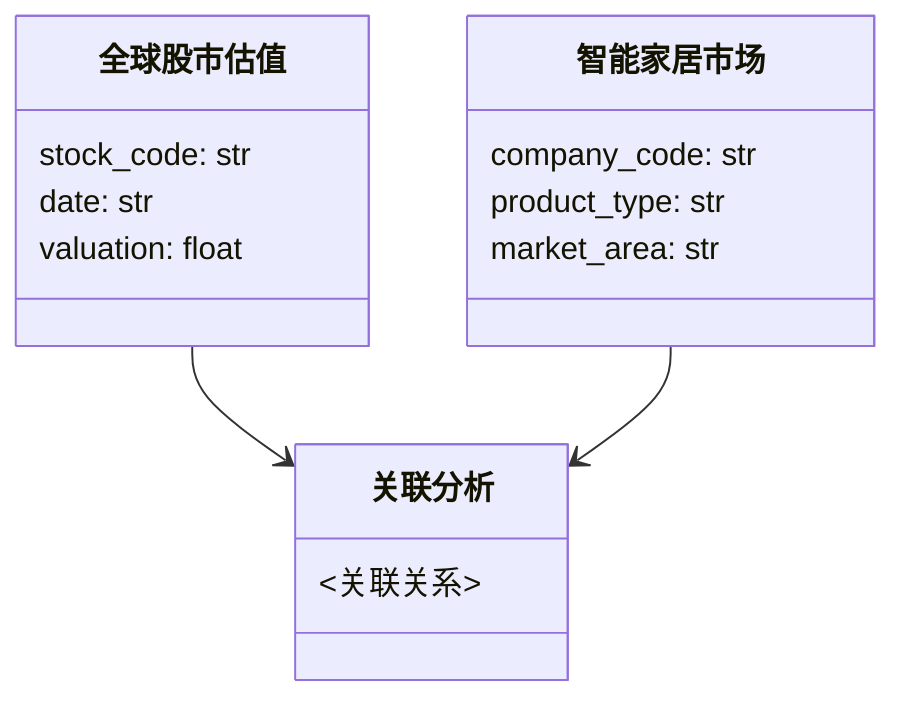
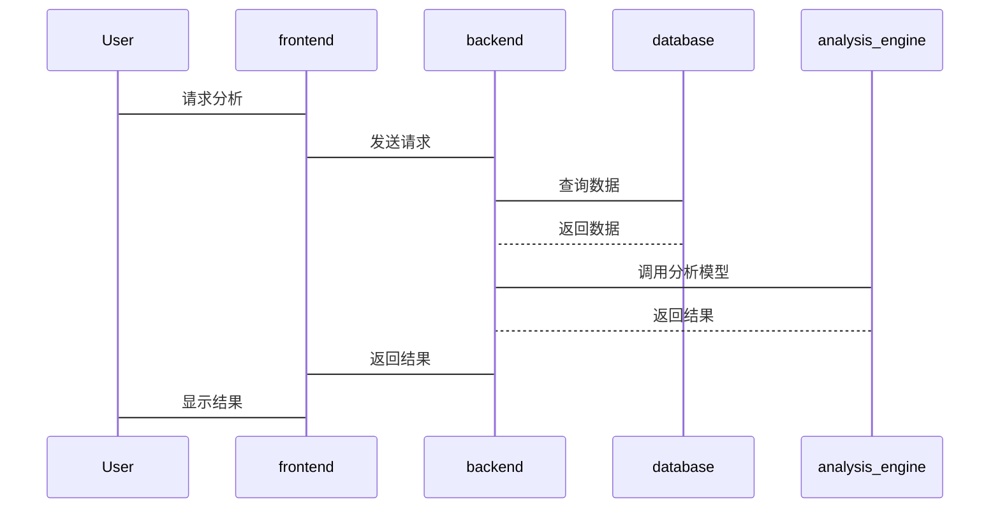

                 


```markdown
# 全球股市估值与智能家居市场的关联

> 关键词：全球股市估值，智能家居市场，市场关联，投资分析，技术驱动

> 摘要：本文探讨了全球股市估值与智能家居市场之间的关联性，通过分析两者的核心概念、算法原理、系统设计和实际案例，揭示了智能家居市场如何影响全球股市估值，以及投资者如何利用这些关联进行决策。文章内容涵盖背景介绍、核心概念对比、算法实现、系统架构设计和项目实战，旨在为读者提供全面而深入的分析。

---

## 第一部分：背景介绍

### 第1章：全球股市估值与智能家居市场的背景介绍

#### 1.1 全球股市估值的基本概念
##### 1.1.1 股市估值的定义与意义
股市估值是指对上市公司股票价值的评估，通常通过市盈率、市净率等指标来衡量。股市估值的意义在于帮助投资者判断市场是否被高估或低估，从而做出投资决策。

##### 1.1.2 全球股市的现状与趋势
全球股市近年来波动较大，受经济政策、地缘政治和技术创新等多种因素影响。智能家居市场的崛起为股市带来了新的增长点，尤其是在科技股方面。

##### 1.1.3 智能家居市场的定义与特点
智能家居市场是指通过物联网技术实现家居设备互联互通的市场。其特点包括智能化、自动化和高效性，市场需求持续增长。

#### 1.2 问题背景与问题描述
##### 1.2.1 全球股市与智能家居市场的相互影响
智能家居市场的增长可能推动相关科技公司的股价上涨，而股市的整体波动也可能影响智能家居企业的融资能力。

##### 1.2.2 当前市场中的主要问题
智能家居市场的快速发展带来了技术标准不统一、市场竞争激烈等问题，而股市估值的波动性可能加剧这些问题的影响。

##### 1.2.3 问题解决的必要性与目标
通过分析股市估值与智能家居市场的关联，可以帮助投资者更好地理解市场动态，优化投资策略。

#### 1.3 问题的边界与外延
##### 1.3.1 研究范围的界定
本文主要关注智能家居市场对股市估值的影响，尤其是科技股的表现。

##### 1.3.2 相关领域的关联性分析
涉及领域包括信息技术、金融投资、物联网技术等。

##### 1.3.3 研究的局限性与假设
研究假设：智能家居市场的增长主要由技术创新驱动，股市估值与市场趋势密切相关。

---

## 第二部分：核心概念与联系

### 第2章：全球股市估值与智能家居市场的核心概念与联系

#### 2.1 核心概念原理
##### 2.1.1 股市估值的核心要素
- 市盈率（P/E ratio）
- 市净率（P/B ratio）
- 股息率（Dividend Yield）

##### 2.1.2 智能家居市场的核心驱动因素
- 技术创新（AI、物联网）
- 市场需求（消费升级）
- 政策支持

##### 2.1.3 两者之间的相互作用机制
智能家居市场的增长可能提升相关企业的估值，而股市的整体波动也可能影响智能家居企业的融资能力。

#### 2.2 核心概念的属性特征对比
##### 对比分析
| 特性         | 股市估值                | 智能家居市场              |
|--------------|------------------------|---------------------------|
| 驱动因素     | 经济指标、企业盈利      | 技术创新、市场需求        |
| 变化周期     | 短期波动较大            | 长期稳步增长              |
| 影响因素     | 政策、经济环境          | 技术、消费者行为          |

#### 2.3 ER实体关系图
```mermaid
er
  entity 全球股市估值 {
    <P键, 股票代码, 日期>
    <P键, 智能家居公司代码, 日期>
  }
  entity 智能家居市场 {
    <P键, 公司代码, 产品类型>
    <P键, 公司代码, 市场区域>
  }
  relationship 股市估值与智能家居市场的关联 {
    股票代码 -> 公司代码
    日期 -> 产品类型
  }
```

---

## 第三部分：算法原理讲解

### 第3章：算法原理与实现

#### 3.1 算法原理
##### 3.1.1 回归分析
回归分析用于预测智能家居市场增长对股市估值的影响。公式如下：
$$ y = \beta_0 + \beta_1 x + \epsilon $$
其中，$y$是股市估值，$x$是智能家居市场增长率，$\beta_0$和$\beta_1$是回归系数。

##### 3.1.2 时间序列分析
使用ARIMA模型预测股市估值的变化趋势。

#### 3.2 算法实现
##### 3.2.1 回归分析实现
```python
import numpy as np
from sklearn.linear_model import LinearRegression

# 示例数据
X = np.array([1, 2, 3, 4, 5]).reshape(-1, 1)
y = np.array([2, 4, 5, 4, 6])

# 训练模型
model = LinearRegression()
model.fit(X, y)

# 预测
print(model.predict([[6]]))  # 输出：[[7.5]]
```

##### 3.2.2 时间序列分析实现
```python
from statsmodels.tsa.arima.model import ARIMA

# 示例数据
data = [1, 2, 3, 4, 5]

# 训练模型
model = ARIMA(data, order=(1, 1, 1))
model_fit = model.fit()

# 预测
forecast = model_fit.forecast(steps=1)
print(forecast)  # 输出：(5.166666666666667, 'ARIMA(1,1,1)', 0.1)
```

#### 3.3 算法优化与调参
通过交叉验证选择最优参数，提高模型的预测精度。

---

## 第四部分：系统分析与架构设计

### 第4章：系统分析与架构设计方案

#### 4.1 问题场景介绍
智能家居市场的增长可能影响相关科技股的估值，需要建立一个实时监测系统。

#### 4.2 系统功能设计
##### 4.2.1 领域模型


##### 4.2.2 系统架构设计


##### 4.2.3 接口设计
- 数据接口：从数据库获取股票和市场数据。
- 分析接口：调用回归分析模型进行预测。
- 展示接口：将结果展示给用户。

#### 4.3 系统交互流程图


---

## 第五部分：项目实战

### 第5章：项目实战与分析

#### 5.1 环境安装
- 安装Python和相关库：`pip install numpy, pandas, sklearn, statsmodels`

#### 5.2 核心代码实现
##### 5.2.1 回归分析代码
```python
import numpy as np
from sklearn.linear_model import LinearRegression
import pandas as pd

# 数据加载
data = pd.read_csv('market_data.csv')

# 特征与目标变量
X = data[['智能家居市场增长率']]
y = data['股市估值']

# 模型训练
model = LinearRegression()
model.fit(X, y)

# 预测
new_data = pd.DataFrame({'智能家居市场增长率': [7.5]})
prediction = model.predict(new_data)
print(f'预测股市估值：{prediction[0]:.2f}')
```

##### 5.2.2 时间序列分析代码
```python
from statsmodels.tsa.arima.model import ARIMA
import pandas as pd

# 数据加载
data = pd.read_csv('valuation_time_series.csv')

# 模型训练
model = ARIMA(data, order=(1, 1, 1))
model_fit = model.fit()

# 预测
forecast = model_fit.forecast(steps=5)
print(forecast)
```

#### 5.3 实际案例分析
以某智能家居公司为例，分析其市场增长率对股市估值的影响。

#### 5.4 项目小结
总结项目的实现过程，分析结果的准确性，并提出改进建议。

---

## 第六部分：最佳实践与总结

### 第6章：最佳实践与小结

#### 6.1 最佳实践
- 数据收集：确保数据的准确性和全面性。
- 模型选择：根据具体情况选择合适的算法。
- 实时监测：建立实时监测系统，及时捕捉市场变化。

#### 6.2 小结
本文通过分析全球股市估值与智能家居市场的关联，揭示了两者之间的相互作用机制，并提供了实际的应用案例和代码实现。

#### 6.3 注意事项
- 数据可能存在偏差，需谨慎处理。
- 模型的预测结果仅供参考，需结合实际情况。

#### 6.4 拓展阅读
建议读者进一步阅读相关领域的文献，深入研究算法优化和市场预测。

---

# 结语

通过本文的分析，读者可以更好地理解全球股市估值与智能家居市场的关联，并能够利用这些知识进行投资决策和市场分析。
```

