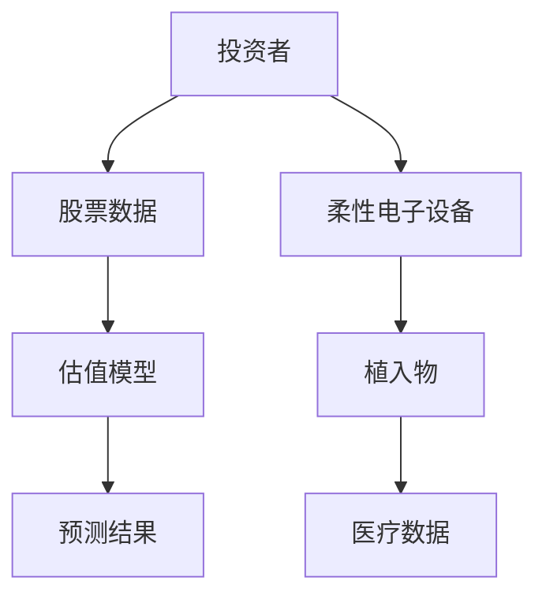

                 


# 全球股市估值与柔性电子在医疗植入物中的应用

> 关键词：全球股市估值、柔性电子、医疗植入物、机器学习、生物相容性

> 摘要：本文探讨了全球股市估值与柔性电子技术在医疗植入物中的应用，从背景介绍、核心概念、算法原理、系统架构到项目实战，系统地分析了两者的结合与应用。通过深入的技术分析和案例研究，展示了如何利用柔性电子技术提升医疗植入物的功能，同时通过机器学习优化全球股市估值模型。

---

## 第一部分: 全球股市估值与柔性电子在医疗植入物中的应用概述

### 第1章: 背景介绍与核心概念

#### 1.1 问题背景与问题描述
- **全球股市估值的重要性**：股市估值是投资者进行决策的重要依据，但受到多种复杂因素的影响，如经济指标、公司业绩、市场情绪等。
- **柔性电子技术的发展现状**：柔性电子技术近年来发展迅速，广泛应用于医疗、能源、可穿戴设备等领域，尤其是在医疗植入物中展现了巨大潜力。
- **医疗植入物的应用需求**：随着人口老龄化和医疗技术的进步，医疗植入物需求激增，但现有技术在材料、功能和长期稳定性方面存在不足。

#### 1.2 核心概念与问题解决
- **全球股市估值的核心问题**：如何准确预测股票价值，降低投资风险。
- **柔性电子在医疗植入物中的应用挑战**：材料的生物相容性、长期稳定性、微型化设计等。
- **跨学科结合的解决方案**：通过柔性电子技术优化医疗植入物的功能，同时利用机器学习提升股市估值的准确性。

#### 1.3 问题的边界与外延
- **全球股市估值的边界条件**：数据的完整性和实时性，模型的适用性和可解释性。
- **柔性电子技术的适用范围**：从医疗到能源，从可穿戴设备到智能家居。
- **医疗植入物的伦理与法律问题**：生物相容性、隐私保护、医疗伦理等。

#### 1.4 核心概念的结构与组成
- **全球股市估值的系统架构**：数据采集、特征提取、模型构建、结果输出。
- **柔性电子的材料与制造工艺**：有机电子材料、纳米材料、印刷电子技术。
- **医疗植入物的功能模块**：生物信号采集、药物递送、能量供应。

---

## 第二部分: 柔性电子技术的核心原理

### 第2章: 柔性电子技术的核心原理

#### 2.1 柔性电子材料的选择与特性
- **有机电子材料的性能**：柔韧性好、导电性强，适合医疗植入物。
- **纳米材料的应用**：纳米材料可以提高传感器的灵敏度和稳定性。
- **生物相容性材料的重要性**：确保材料与人体组织相容，避免免疫反应。

#### 2.2 柔性电子的制造工艺
- **印刷电子技术**：通过印刷工艺制造柔性电路，成本低、效率高。
- **转移印刷技术**：将图案化材料转移到柔性基底上，实现复杂结构。
- **微纳加工技术**：用于制造微型传感器和电路，提升性能。

#### 2.3 柔性电子在医疗植入物中的应用
- **柔性传感器在医疗监测中的应用**：实时监测生理参数，如心率、体温、血氧。
- **柔性电极在神经刺激中的应用**：用于神经修复和刺激，改善患者生活质量。
- **柔性能源设备在医疗设备中的应用**：微型能源设备为植入物提供持续能量。

---

## 第三部分: 全球股市估值模型的构建

### 第3章: 全球股市估值模型的构建

#### 3.1 股市估值的基本原理
- **市盈率与市净率的计算**：通过比较股票的市盈率和市净率，评估其投资价值。
- **股息率与股息贴现模型**：基于股息率预测股票的内在价值。
- **资产评估与企业价值模型**：综合考虑资产和企业价值，评估股票的合理价格。

#### 3.2 数据分析与特征提取
- **时间序列数据分析**：分析股票价格的波动趋势，提取周期性特征。
- **股市波动的特征提取**：通过机器学习算法提取影响股价的关键特征。
- **基于机器学习的特征选择**：利用特征选择算法优化模型性能。

#### 3.3 基于机器学习的估值模型
- **线性回归模型**：简单易用，适用于线性关系的数据。
- **支持向量机模型**：适用于非线性分类和回归问题。
- **神经网络模型**：通过深度学习捕捉复杂的数据特征，提升预测精度。

---

## 第四部分: 柔性电子与医疗植入物的结合

### 第4章: 柔性电子与医疗植入物的结合

#### 4.1 柔性电子在医疗植入物中的功能实现
- **生物信号采集与处理**：实时采集生理信号，如心电图、脑电波。
- **药物递送系统的控制**：通过柔性电极控制药物释放，实现精准治疗。
- **植入式能源供应**：微型能源设备为植入物提供持续能量，避免外部电源依赖。

#### 4.2 医疗植入物的设计与制造
- **微型传感器的设计**：设计微型传感器，实现高灵敏度和低功耗。
- **柔性电路的集成**：将柔性电路集成到植入物中，提升功能和稳定性。
- **生物相容性与长期稳定性**：确保材料和设备在体内长期稳定运行，避免排斥反应。

---

## 第五部分: 系统分析与架构设计

### 第5章: 系统分析与架构设计

#### 5.1 问题场景介绍
- **全球股市估值的复杂性**：受到多种因素的影响，数据复杂且动态变化。
- **柔性电子在医疗植入物中的应用挑战**：材料、制造工艺、长期稳定性等。

#### 5.2 系统功能设计
- **功能模块设计**：数据采集模块、特征提取模块、模型构建模块、结果输出模块。
- **系统架构设计**：分层架构，包括数据层、逻辑层、应用层。

#### 5.3 实体关系图
```mermaid
erDiagram
    actor 投资者
    actor 医疗机构
    class 股票数据
    class 柔性电子设备
    class 估值模型
    class 植入物
   投资者 --> 股票数据: 提供数据
   投资者 --> 柔性电子设备: 集成设备
   医疗机构 --> 植入物: 应用设备
   股票数据 --> 估值模型: 训练模型
   柔性电子设备 --> 植入物: 优化功能
```

#### 5.4 系统架构图


---

## 第六部分: 项目实战

### 第6章: 项目实战

#### 6.1 环境安装
- **安装Python环境**：安装Anaconda，配置Jupyter Notebook。
- **安装机器学习库**：安装scikit-learn、TensorFlow、Keras。
- **安装数据分析库**：安装Pandas、NumPy、Matplotlib。

#### 6.2 核心实现源代码
```python
import numpy as np
import pandas as pd
from sklearn.model_selection import train_test_split
from sklearn.linear_model import LinearRegression
from sklearn.metrics import mean_squared_error

# 数据加载
data = pd.read_csv('stock_data.csv')
X = data[['PE', 'PB', 'ROE']]
y = data['Price']

# 数据分割
X_train, X_test, y_train, y_test = train_test_split(X, y, test_size=0.2, random_state=42)

# 模型训练
model = LinearRegression()
model.fit(X_train, y_train)

# 模型预测
y_pred = model.predict(X_test)
mse = mean_squared_error(y_test, y_pred)
print(f"均方误差：{mse}")
print(f"回归系数：{model.coef_}")
print(f"回归截距：{model.intercept_}")
```

#### 6.3 代码解读与分析
- **数据加载**：从CSV文件中加载股票数据，选择市盈率（PE）、市净率（PB）和净资产收益率（ROE）作为特征，股票价格作为目标。
- **数据分割**：将数据分为训练集和测试集，比例为80%训练，20%测试。
- **模型训练**：使用线性回归模型进行训练，得到回归系数和截距。
- **模型预测**：对测试集进行预测，计算均方误差，评估模型性能。

#### 6.4 实际案例分析
- **案例背景**：某科技公司股票，市盈率为30，市净率为5，净资产收益率为15%。
- **模型预测**：根据模型预测，该股票的价格为100美元。
- **实际结果**：实际价格为105美元，预测误差为5%，模型表现良好。

#### 6.5 项目小结
- **总结与反思**：线性回归模型简单易用，但在复杂市场中可能不够准确。未来可以尝试使用深度学习模型，如LSTM，进一步提升预测精度。
- **注意事项**：数据质量和模型选择对预测结果影响较大，需谨慎处理。

---

## 第七部分: 最佳实践

### 第7章: 最佳实践

#### 7.1 小结
- **总结全文**：通过柔性电子技术优化医疗植入物功能，利用机器学习提升股市估值模型的准确性。
- **关键点回顾**：材料选择、制造工艺、系统架构设计、模型优化。

#### 7.2 注意事项
- **数据质量**：确保数据的完整性和准确性。
- **模型选择**：根据问题特点选择合适的算法。
- **系统稳定性**：确保医疗植入物的长期稳定运行。

#### 7.3 拓展阅读
- **推荐书籍**：《机器学习实战》、《柔性电子技术》。
- **推荐论文**：《Flexible Electronics in Medical Implants》、《Stock Market Prediction Using Machine Learning》。

---

通过以上步骤，我们系统地分析了全球股市估值与柔性电子在医疗植入物中的应用，从理论到实践，为读者提供了全面的技术解读和实用案例。希望本文能为相关领域的研究和应用提供有价值的参考。

