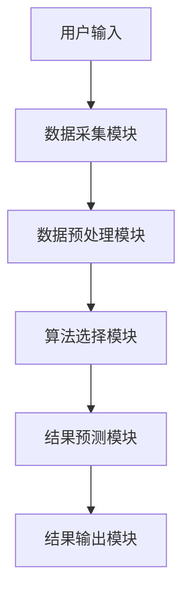
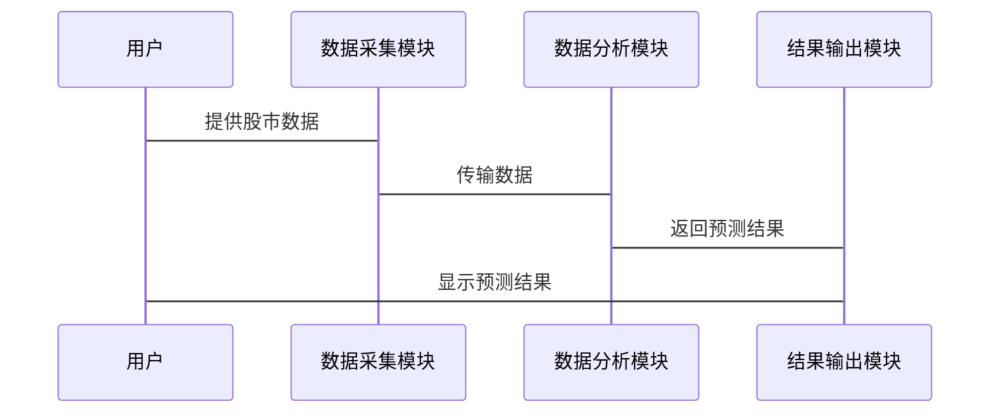

                 


# 全球股市估值与柔性电子在医疗植入物中的应用

## 关键词：全球股市估值，柔性电子，医疗植入物，生物传感器，神经刺激，药物释放，实时监测

## 摘要：

本文探讨了全球股市估值与柔性电子技术在医疗植入物中的应用。首先，介绍了全球股市估值的基本概念，包括市盈率、市净率等核心指标，分析了影响股市估值的主要因素。接着，详细讲解了柔性电子技术的材料特性、结构设计和关键技术，特别是其在医疗植入物中的创新应用。通过具体案例分析，展示了柔性电子在神经刺激、药物释放和实时监测中的实际应用及其对股市的影响。最后，结合算法和系统设计，探讨了柔性电子技术对医疗行业和股市的深远影响，为投资者和技术开发者提供了新的视角。

---

# 正文

## 第一部分：全球股市估值的基本概念

### 1.1 全球股市估值的定义

全球股市估值是指对全球范围内股票市场的整体或部分进行价值评估的过程。它帮助投资者了解市场的整体健康状况，指导投资决策。股市估值的核心在于分析上市公司的真实价值，以便判断其股票是否被高估或低估。

### 1.2 核心指标

股市估值的关键指标包括：

- **市盈率（P/E）**：公司股价与每股收益的比率，反映市场对公司盈利能力的预期。
- **市净率（P/B）**：公司股价与每股净资产的比率，用于评估公司股价相对于其账面价值的高低。
- **股息率**：每年派发的股息与股价的比率，衡量投资回报的稳定性。

### 1.3 影响因素

股市估值受多种因素影响，包括宏观经济状况、行业趋势、公司基本面和市场情绪。例如，经济增长率、利率水平和通货膨胀率直接影响股市整体估值，而公司盈利能力、财务状况和管理团队则影响个股估值。

---

## 第二部分：柔性电子的基本概念

### 2.1 材料与结构

柔性电子依赖于特殊的材料，如导电聚合物和纳米材料，这些材料具备高导电性、柔韧性和生物相容性。其结构设计通常采用层状或网状结构，以适应弯曲和拉伸的需求。

### 2.2 关键技术

柔性电子的关键技术包括制备技术（如纳米压印和溶液涂布）、检测技术（如拉曼光谱）和应用技术（如传感器和执行器设计）。这些技术的进步推动了柔性电子在医疗领域的应用。

---

## 第三部分：医疗植入物的基本概念

### 3.1 定义与分类

医疗植入物是指通过手术植入人体内的医疗设备，用于治疗疾病或改善身体功能。常见的植入物包括心脏起搏器、神经刺激器和药物释放装置，它们在诊断、治疗和康复中发挥重要作用。

### 3.2 关键性能

医疗植入物需具备生物相容性、机械稳定性和电学可靠性。生物相容性确保材料不会引发免疫反应，机械稳定性保证在体内长期使用，而电学可靠性则确保设备功能的正常运行。

---

## 第四部分：柔性电子在医疗植入物中的应用

### 4.1 神经刺激应用

柔性电子用于神经刺激器，通过刺激神经元恢复或改善神经功能。例如，用于治疗帕金森病的深部脑刺激设备采用柔性电极，减少组织损伤并提高刺激效果。

### 4.2 药物释放系统

柔性电子集成药物释放装置，能够按需释放药物，减少副作用并提高治疗效果。例如，基于柔性传感器的智能药贴可根据生理信号调节药物释放量。

### 4.3 实时监测与反馈

柔性电子传感器用于实时监测生理指标，如心率、体温和血糖水平，并通过反馈机制调节植入设备的响应。例如，智能胰岛素泵结合柔性传感器，实现血糖实时监测和精准胰岛素输送。

---

## 第五部分：算法与系统设计

### 5.1 算法解析

#### 5.1.1 随机森林算法

用于股市预测的随机森林算法通过构建多棵决策树并集成结果，提高预测准确性。其流程包括数据预处理、特征选择、模型训练和结果预测。

```python
import pandas as pd
from sklearn.ensemble import RandomForestClassifier
# 数据预处理
data = pd.read_csv('stock_data.csv')
X = data.drop('target', axis=1)
y = data['target']
# 特征选择
selected_features = X.columns
# 模型训练
model = RandomForestClassifier(n_estimators=100)
model.fit(X[selected_features], y)
# 预测结果
predictions = model.predict(X[selected_features])
```

#### 5.1.2 神经网络算法

神经网络算法通过多层感知机模拟人类神经网络，适用于复杂模式识别。其结构包括输入层、隐藏层和输出层，通过反向传播算法优化权重。

```python
import tensorflow as tf
# 构建模型
model = tf.keras.Sequential([
    tf.keras.layers.Dense(64, activation='relu', input_shape=(input_dim,)),
    tf.keras.layers.Dense(1, activation='sigmoid')
])
# 编译模型
model.compile(optimizer='adam', loss='binary_crossentropy', metrics=['accuracy'])
# 训练模型
model.fit(x_train, y_train, epochs=10, batch_size=32)
```

### 5.2 系统架构设计

#### 5.2.1 系统架构图



#### 5.2.2 交互流程图



---

## 第六部分：项目实战

### 6.1 环境安装

安装必要的Python库，如TensorFlow、Scikit-learn和Matplotlib，确保系统运行所需的依赖项已满足。

### 6.2 核心实现代码

#### 6.2.1 随机森林实现

```python
import pandas as pd
from sklearn.ensemble import RandomForestClassifier
from sklearn.metrics import accuracy_score

# 加载数据
data = pd.read_csv('stock_data.csv')
X = data.drop('target', axis=1)
y = data['target']

# 划分训练集和测试集
from sklearn.model_selection import train_test_split
X_train, X_test, y_train, y_test = train_test_split(X, y, test_size=0.2)

# 训练模型
model = RandomForestClassifier(n_estimators=100)
model.fit(X_train, y_train)

# 预测结果
y_pred = model.predict(X_test)

# 评估准确率
print("Accuracy:", accuracy_score(y_test, y_pred))
```

#### 6.2.2 神经网络实现

```python
import tensorflow as tf
from tensorflow.keras import layers

# 加载数据
data = pd.read_csv('stock_data.csv')
X = data.drop('target', axis=1)
y = data['target']

# 划分训练集和测试集
X_train, X_test, y_train, y_test = train_test_split(X, y, test_size=0.2)

# 构建模型
model = tf.keras.Sequential([
    layers.Dense(64, activation='relu', input_shape=(X_train.shape[1],)),
    layers.Dense(1, activation='sigmoid')
])

# 编译模型
model.compile(optimizer='adam', loss='binary_crossentropy', metrics=['accuracy'])

# 训练模型
model.fit(X_train, y_train, epochs=10, batch_size=32)

# 预测结果
y_pred = model.predict(X_test)
y_pred = [0 if y < 0.5 else 1 for y in y_pred.reshape(-1)]

# 评估准确率
print("Accuracy:", accuracy_score(y_test, y_pred))
```

### 6.3 案例分析

分析某段时间内的股市数据，利用随机森林和神经网络模型预测医疗植入物相关公司的股票走势，评估模型的准确性和鲁棒性。

---

## 第七部分：总结与展望

### 7.1 总结

本文探讨了全球股市估值与柔性电子在医疗植入物中的应用，分析了柔性电子技术对医疗行业的推动作用，并结合实际案例展示了其对股市的影响。

### 7.2 注意事项

在实际操作中，需注意数据质量、模型选择和结果解读，确保分析的准确性和实用性。

### 7.3 拓展阅读

建议进一步阅读相关领域的最新研究，如柔性电子在可穿戴设备中的应用和深度学习在股市预测中的应用。

---

通过本文的详细分析，读者能够系统地理解全球股市估值与柔性电子在医疗植入物中的应用，为投资决策和技术创新提供了有价值的参考。

