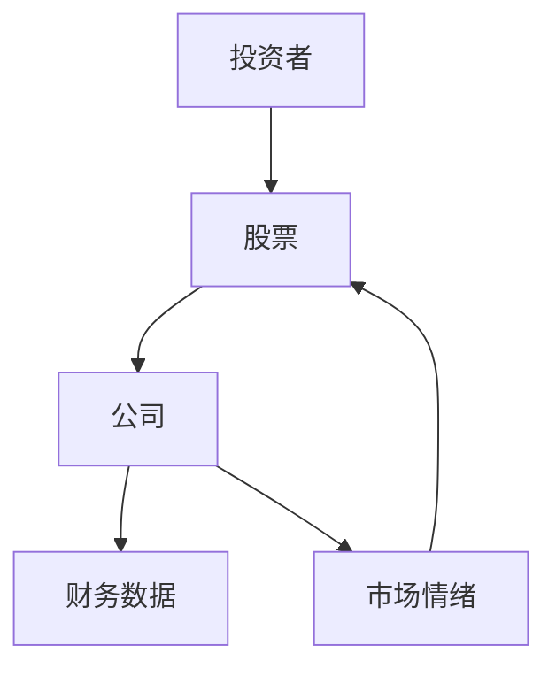
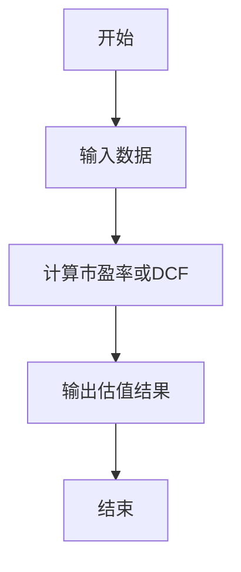

                 


# 《全球股市估值与柔性电子在可穿戴医疗设备中的应用》

## 关键词：全球股市估值，柔性电子，可穿戴医疗设备，股市分析，医疗技术

## 摘要：  
本文将从全球股市估值和柔性电子在可穿戴医疗设备中的应用两个方面展开。首先，通过分析股市估值的核心概念、算法原理和系统架构，揭示股市估值的数学模型和实际应用。其次，探讨柔性电子技术在医疗设备中的创新应用，分析其技术基础、系统设计和未来发展趋势，最后结合实际案例，探讨柔性电子在医疗设备中的应用前景和挑战。

---

## 第一部分：全球股市估值

### 第1章：全球股市估值概述

#### 1.1 股市估值的基本概念  
股市估值是通过对公司基本面、市场情绪和宏观经济指标的分析，估算股票的合理价格范围。  
- **公司基本面**：包括收入、利润、资产负债表等财务数据。  
- **市场情绪**：投资者的心理预期和行为对股价的影响。  
- **宏观经济指标**：GDP、利率、通货膨胀等对股市的整体影响。  

#### 1.2 股市估值的重要性  
- 股市估值帮助投资者做出理性决策。  
- 为公司融资和并购提供参考。  
- 为政策制定者提供经济运行的指标。  

#### 1.3 股市估值的边界与外延  
- **边界**：仅关注股票价格本身，不考虑其他金融资产。  
- **外延**：涉及宏观经济、行业分析和公司战略等更广泛领域。  

---

### 第2章：股市估值的核心概念与联系

#### 2.1 核心概念原理  
- **市盈率（P/E）**：股价与每股净利润的比值，公式为：  
  $$ P/E = \frac{\text{股价}}{\text{每股净利润}} $$  
- **市净率（P/B）**：股价与每股净资产的比值，公式为：  
  $$ P/B = \frac{\text{股价}}{\text{每股净资产}} $$  
- **现金流折现模型（DCF）**：基于未来现金流的现值计算企业价值。  

#### 2.2 概念属性特征对比表格  
| 概念      | 定义                     | 适用场景               | 优缺点               |
|-----------|--------------------------|------------------------|----------------------|
| 市盈率     | 股价与净利润的比值       | 评估企业盈利能力       | 适用于盈利稳定的公司 |
| 市净率     | 股价与净资产的比值       | 评估企业资产质量       | 适用于资产密集型行业 |
| DCF模型    | 基于未来现金流的现值     | 评估企业长期价值       | 计算复杂，依赖假设   |

#### 2.3 ER实体关系图  


---

### 第3章：股市估值的算法原理

#### 3.1 算法原理讲解  
- **市盈率计算**：以某公司为例，净利润为1元/股，股价为10元，则P/E=10/1=10。  
- **现金流折现模型**：假设公司未来5年现金流分别为100万、120万、150万、180万、200万，折现率5%，计算其现值。  

#### 3.2 算法流程图  


#### 3.3 代码实现  
```python
def calculate_pe(stock_price, earnings_per_share):
    return stock_price / earnings_per_share

def calculate_dcf(cash_flows, discount_rate):
    present_value = 0
    for i in range(len(cash_flows)):
        present_value += cash_flows[i] / (1 + discount_rate) ** (i + 1)
    return present_value
```

---

### 第4章：股市估值的系统分析与架构设计

#### 4.1 问题场景介绍  
- 股市估值的复杂性：受多种因素影响，需要综合分析。  
- 系统设计的目标：提供一个自动化、高精度的估值工具。  

#### 4.2 系统功能设计  
- **领域模型Mermaid类图**  
  ```mermaid
  classDiagram
      class 股票 {
          名称：String
          价格：Float
          市盈率：Float
      }
      class 公司 {
          资产：Float
          利润：Float
      }
      class 投资者 {
          预期收益：Float
      }
      股票 <--> 公司
      股票 <--> 投资者
  ```

- **系统架构设计Mermaid架构图**  
  ```mermaid
  rectangle 数据库 {
      存储股票数据
  }
  rectangle 算法模块 {
      计算市盈率、DCF等
  }
  rectangle 用户界面 {
      输入参数，显示结果
  }
  数据库 --> 算法模块
  算法模块 --> 用户界面
  ```

---

## 第二部分：柔性电子在可穿戴医疗设备中的应用

### 第1章：柔性电子在可穿戴医疗设备中的应用概述

#### 1.1 柔性电子的基本概念  
- **柔性电子**：基于柔性材料（如有机高分子、纳米材料）的电子设备，具有可弯曲、可拉伸的特点。  
- **可穿戴医疗设备**：贴合人体，实时监测生理指标的设备，如心率、体温、血压等。  

#### 1.2 柔性电子在医疗领域的优势  
- 穿戴舒适，便于长期监测。  
- 数据采集精准，支持远程医疗。  

---

### 第2章：柔性电子在可穿戴医疗设备中的技术基础

#### 2.1 柔性电子的材料与制造工艺  
- **材料**：聚酰亚胺（PI）、石墨烯、银纳米线等。  
- **制造工艺**：光刻、印刷、层压等。  

#### 2.2 传感器的设计与性能  
- **传感器类型**：心率、体温、血压传感器等。  
- **性能指标**：灵敏度、响应时间、耐用性。  

---

### 第3章：柔性电子在可穿戴医疗设备中的系统分析

#### 3.1 系统功能设计  
- **数据采集**：传感器收集生理数据。  
- **数据处理**：通过算法分析数据，发送警报。  
- **用户交互**：通过APP或蓝牙与手机连接，显示数据。  

#### 3.2 系统架构设计Mermaid架构图  
```mermaid
rectangle 传感器 {
    收集生理数据
}
rectangle 数据处理模块 {
    分析数据，发送警报
}
rectangle 用户界面 {
    显示数据，接收指令
}
传感器 --> 数据处理模块
数据处理模块 --> 用户界面
```

---

### 第4章：柔性电子在可穿戴医疗设备中的项目实战

#### 4.1 项目背景与目标  
- 开发一款可监测心率的柔性电子手环。  

#### 4.2 核心实现源代码  
```python
import numpy as np

def calculateHeartRate(signal):
    # 心率计算算法
    filtered_signal = np.fft.fft(signal)
    peaks = np.argwhere(filtered_signal > np.mean(filtered_signal) * 1.5)
    heart_rate = len(peaks) * 60  # 转换为每分钟
    return heart_rate
```

#### 4.3 代码应用解读与分析  
- **信号处理**：使用傅里叶变换去除噪声，提取心率信号。  
- **心率计算**：通过峰值检测计算心率。  

---

### 第5章：柔性电子在可穿戴医疗设备中的未来展望

#### 5.1 技术创新  
- 新材料的应用：如仿生皮肤、自愈合材料。  
- 智能化：结合AI算法，实现更精准的诊断。  

#### 5.2 行业发展趋势  
- 市场需求增长：慢性病患者增加，推动可穿戴设备普及。  
- 政策支持：政府鼓励智能医疗设备的发展。  

---

## 结语  
通过本文的分析，我们深入了解了全球股市估值的核心方法和柔性电子在医疗设备中的创新应用。股市估值需要结合技术分析与基本面分析，而柔性电子则为医疗设备带来了更多的可能性。未来，随着技术的进步，这两者的结合将为金融与医疗领域带来更大的变革。

