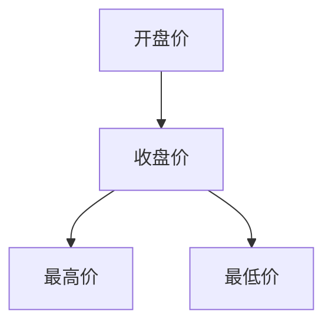
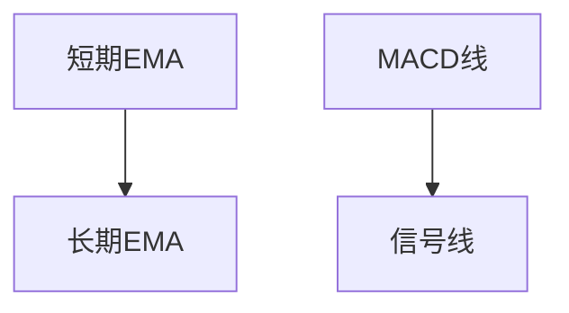
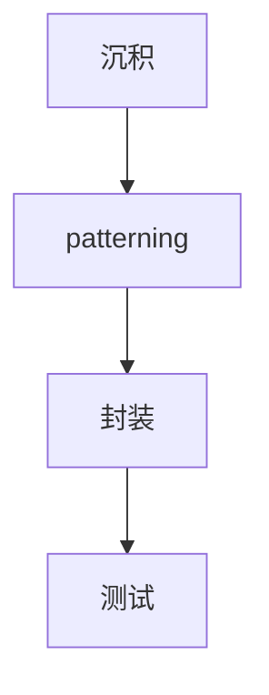

                 


# 全球股市估值与柔性电子在可穿戴设备中的应用

## 关键词：
- 全球股市估值
- 柔性电子
- 可穿戴设备
- 技术分析
- 量化投资

## 摘要：
本文探讨了全球股市估值与柔性电子在可穿戴设备中的应用。首先，从股市估值的基本概念、影响因素和技术分析的角度，分析了如何评估和预测股市走势。接着，深入探讨了柔性电子技术的材料科学、制造工艺及其在健康监测、运动追踪等可穿戴设备中的应用。最后，结合实际案例，展示了如何将柔性电子技术与量化投资策略相结合，提升股市估值的准确性和效率。

## 第一部分：全球股市估值与投资策略

### 第1章：全球股市估值概述

#### 1.1 股市估值的基本概念

股票市场的估值是投资者评估股票内在价值的重要手段。股市估值的基本概念包括市盈率（P/E）、市净率（P/B）和股息率等指标。这些指标帮助投资者判断股票是否被高估或低估。

$$ P/E = \frac{\text{股价}}{\text{每股收益}} $$

市盈率反映了市场对上市公司未来盈利的预期。市净率则衡量了股价与资产净值的关系：

$$ P/B = \frac{\text{股价}}{\text{每股净资产}} $$

股息率是衡量股票收益能力的重要指标，计算公式为：

$$ \text{股息率} = \frac{\text{股息支付率}}{\text{股价}} $$

股市估值不仅依赖于定量分析，还需要结合宏观经济环境、行业发展趋势和公司基本面等因素进行综合判断。

#### 1.2 影响股市估值的主要因素

影响股市估值的主要因素包括经济周期、利率政策、企业盈利能力和市场情绪等。经济周期的波动直接影响企业的盈利能力，从而影响股市估值。利率政策通过影响资金成本和债券收益率，间接影响股市估值。企业盈利能力和财务状况是决定股票内在价值的核心因素。市场情绪则通过投资者的心理预期影响股市的短期波动。

#### 1.3 股市估值的方法与模型

股市估值的方法主要包括基本面分析和技术分析。基本面分析侧重于企业的财务数据、行业地位和市场环境，而技术分析则通过研究价格和成交量的变化预测未来的走势。

基本面分析常用的模型包括：

1. **股息贴现模型（DDM）**：基于未来现金流的折现计算股票的内在价值。
   $$ V = \frac{D}{k - g} $$
   其中，D为预期股息，k为折现率，g为股息增长率。

2. **CAPM模型**：通过计算资本资产定价模型确定股票的预期收益。
   $$ R_i = R_f + \beta_i (R_m - R_f) $$
   其中，\( R_i \) 为股票的预期收益率，\( R_f \) 为无风险利率，\( \beta_i \) 为股票的贝塔系数，\( R_m \) 为市场预期收益率。

技术分析常用的方法包括移动平均线（MA）、相对强弱指数（RSI）和布林带等指标。这些指标帮助投资者识别价格趋势和超买超卖状态。

### 第2章：技术分析与股市估值

#### 2.1 技术分析的基本原理

技术分析通过研究历史价格数据预测未来走势。K线图是技术分析的基础工具，展示了股票的价格波动情况。K线图由开盘价、收盘价、最高价和最低价组成。

使用mermaid绘制K线图的结构：



技术分析中的移动平均线（MA）用于平滑价格波动，帮助识别趋势。常用的方法包括简单移动平均（SMA）和指数移动平均（EMA）。

#### 2.2 技术指标与股市估值

MACD指标由两条移动平均线组成，用于判断市场趋势的强度和方向。RSI指标用于衡量市场的超买超卖状态，帮助投资者判断买卖时机。

使用mermaid绘制MACD指标的结构：



#### 2.3 技术分析在实际投资中的应用

技术分析与基本面分析的结合可以提高投资决策的准确性。然而，技术分析也有其局限性，如市场波动的不可预测性和信息滞后性。

### 第3章：量化投资与算法交易

#### 3.1 量化投资的基本概念

量化投资通过数学模型和算法进行投资决策，避免了人为情绪的干扰。量化投资的核心是基于数据和算法的交易策略。

#### 3.2 算法交易的实现原理

算法交易通过编写程序自动执行交易指令，提高了交易效率和准确性。常用算法包括统计套利、高频交易和算法交易。

使用Python代码实现简单的量化交易策略：

```python
import pandas as pd
import numpy as np

data = pd.read_csv('stock_data.csv')
data['SMA_20'] = data['Close'].rolling(20).mean()
data['Signal'] = np.where(data['Close'] > data['SMA_20'], 1, -1)
data['Return'] = data['Close'].pct_change() * data['Signal'].shift(1)
```

这段代码计算了20日移动平均线，并根据价格与均线的关系生成买卖信号，最后计算了策略的收益。

## 第二部分：柔性电子在可穿戴设备中的应用

### 第3章：柔性电子的基本概念与材料

#### 3.1 柔性电子的基本概念

柔性电子是一种基于柔性基底的电子技术，具有轻薄、柔软和可穿戴的特点。柔性电子的核心材料包括有机材料、纳米材料和高分子材料。

#### 3.2 柔性电子的材料科学

材料科学是柔性电子发展的关键。有机材料如聚酰亚胺和聚乙烯醇具有良好的柔韧性和透明性。纳米材料如石墨烯和碳纳米管提高了电子器件的导电性和强度。

### 第4章：柔性电子的制造工艺与性能优化

#### 4.1 制造工艺

柔性电子的制造工艺包括沉积、 patterning 和封装等步骤。沉积工艺如蒸镀和溅射用于制备导电层， patterning工艺如光刻和喷墨打印用于形成电路图案。

使用mermaid绘制柔性电子制造工艺的流程图：



#### 4.2 性能优化

性能优化包括提高导电性、稳定性和耐用性。通过优化材料选择和制备工艺，可以提升柔性电子的性能。

### 第5章：柔性电子在可穿戴设备中的应用

#### 5.1 健康监测

柔性电子在健康监测设备中广泛应用，如心率监测、体温监测和血氧监测。这些设备通过采集生理数据，帮助用户实时了解健康状况。

#### 5.2 运动追踪

柔性电子在运动追踪设备中的应用包括计步器、心率监测和运动轨迹记录。这些设备帮助运动员优化训练效果。

#### 5.3 智能服装

柔性电子在智能服装中的应用包括智能袜子、智能手套和智能衬衫。这些服装可以监测穿着者的运动状态和生理指标。

## 总结

本文探讨了全球股市估值与柔性电子在可穿戴设备中的应用。通过技术分析和量化投资策略，投资者可以更好地进行股市估值。柔性电子技术的创新应用推动了可穿戴设备的发展，提升了健康监测和运动追踪的准确性。未来，随着技术的不断进步，股市估值和柔性电子将在更多领域展现其潜力和价值。

