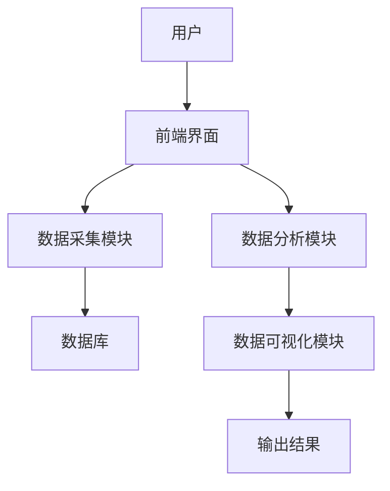

                 


# 全球股市估值与核聚变能源商业化时间表的关系

## 关键词：全球股市估值，核聚变能源，商业化时间表，能源行业，股市分析

## 摘要：  
本文探讨了全球股市估值与核聚变能源商业化时间表之间的潜在关系。通过分析核聚变能源技术的发展现状、商业化时间表以及其对能源行业和全球股市的影响，结合数学模型和系统架构设计，深入探讨了核聚变商业化进程对股市估值的可能影响。文章从背景介绍、核心概念、算法原理、系统架构到项目实战，全面解析了这一复杂问题，提出了可行的解决方案和未来研究方向。

---

# 第一部分：背景介绍

## 第1章：全球股市估值的基本概念

### 1.1 股票市场估值的定义

股票市场估值是通过对企业的财务数据和市场表现进行分析，评估其市场价值的过程。常用的估值指标包括市盈率（P/E）、市净率（P/B）、股息率等。这些指标反映了市场对企业的信心和对其未来表现的预期。

- **市盈率（P/E）**：市盈率 = 股票价格 / 每股收益（EPS）。  
- **市净率（P/B）**：市净率 = 股票价格 / 每股净资产（BPS）。  
- **股息率**：股息率 = 每股股息 / 股票价格。  

这些指标共同反映了企业的盈利能力、资产质量和分红能力，是投资者评估企业价值的重要工具。

### 1.2 核聚变能源的基本概念

核聚变是指通过轻核聚变成重核，释放巨大能量的过程。与核裂变不同，核聚变具有清洁、安全、资源丰富的特点，被认为是未来清洁能源的重要来源。

#### 核聚变的定义与基本原理

核聚变的核心是通过高温高压使轻核发生聚变反应，释放能量。常用的核聚变燃料是氘和氚，反应方程式为：  
$$ 2H + 3H → 4He + 1n $$  
其中，H表示氘，He表示氦-4，n表示中子。

核聚变反应需要极高的温度（通常超过1亿摄氏度）和压力，因此需要先进的技术来实现，例如托卡马克装置。

#### 核聚变能源的优势与挑战

- **优势**：  
  1. 能量密度高：1千克氘和氚的反应释放的能量相当于数万吨煤炭。  
  2. 清洁能源：核聚变不产生放射性废物，且不会产生温室气体。  
  3. 资源丰富：氘和氚在自然界中广泛存在。  

- **挑战**：  
  1. 技术难度高：需要突破高温、磁场控制、材料耐久性等技术难题。  
  2. 成本高昂：核聚变技术的研发和商业化需要巨额投资。  
  3. 时间周期长：从实验室到商业化可能需要数十年时间。  

### 1.3 核聚变能源商业化时间表的背景

核聚变能源的商业化时间表直接关系到其对能源行业的影响。目前，全球多个国家和机构正在积极推进核聚变研究，例如国际热核聚变实验堆（ITER）项目。ITER的目标是在2030年代实现核聚变能的示范性应用。

---

## 第2章：核聚变能源商业化时间表的背景

### 2.1 核聚变能源研发的历史与现状

核聚变研究始于20世纪50年代，经历了实验室研究、小规模实验和大规模项目实施阶段。目前，ITER项目是全球最大的核聚变实验项目，计划在2030年左右实现核聚变能的示范应用。

#### 核聚变研究的主要国家与机构

- **美国**：美国是核聚变研究的先驱，拥有多个国家级实验室，如劳伦斯利弗莫尔国家实验室（LLNL）。  
- **欧盟**：欧盟通过ITER项目主导国际核聚变研究。  
- **中国**：中国在核聚变研究方面投入了大量资源，建成了 EAST 装置。  
- **日本**：日本的 JET 装置是 ITER 项目的重要组成部分。  

### 2.2 核聚变商业化时间表对能源行业的影响

核聚变商业化将对全球能源结构产生深远影响。一旦核聚变技术成熟，将为能源行业提供一种清洁、可持续的能源解决方案，从而改变能源市场的格局。

#### 核聚变技术成熟对企业估值的影响

核聚变技术的成熟将对相关企业的估值产生直接影响。例如，拥有核聚变技术的企业可能因为其技术优势而获得更高的市盈率和市场资本化。

---

# 第二部分：核聚变能源商业化时间表与股市估值的关系

## 第3章：核聚变商业化时间表对股市的影响

### 3.1 核聚变商业化时间表对股市估值的影响

核聚变商业化时间表的不确定性对股市估值产生了重要影响。投资者通常会对核聚变技术的商业化进程进行押注，因此，技术突破的时间点将直接影响相关企业的股价和市场资本化。

#### 核聚变技术成熟对企业估值的影响

当核聚变技术取得突破时，相关企业的估值将迅速上升。例如，如果一家公司成功实现了核聚变技术的商业化，其市盈率可能会大幅提高。

### 3.2 核聚变商业化进程对能源行业的影响

核聚变商业化将对能源行业产生深远影响。随着核聚变能源的普及，传统能源行业可能会受到冲击，而新能源企业将获得更多的投资机会。

#### 核聚变商业化进程对全球股市的影响

核聚变商业化的时间表将直接影响全球股市的走势。投资者通常会对核聚变技术的商业化进程进行押注，因此，技术突破的时间点将直接影响相关企业的股价和市场资本化。

---

## 第4章：核聚变商业化时间表对全球股市的影响

### 4.1 核聚变商业化时间表对股市估值的数学模型

为了分析核聚变商业化时间表对股市估值的影响，我们可以建立一个简单的数学模型。假设核聚变技术的商业化时间越短，相关企业的估值越高。

#### 模型假设

1. 核聚变技术的商业化时间与企业的研发投入和技术创新能力有关。  
2. 投资者对核聚变技术的商业化时间表有明确的预期。  

#### 数学模型

我们可以将核聚变技术的商业化时间与企业的市场资本化进行关联。设：

$$ 市场资本化 = f(商业化时间) $$  

其中，f 表示市场资本化的函数，通常表现为反比例关系：商业化时间越短，市场资本化越高。

### 4.2 核聚变商业化时间表的数学分析

为了进一步分析核聚变商业化时间表对股市的影响，我们可以引入时间序列分析的方法，预测核聚变技术的商业化时间，并将其与股市估值进行关联。

#### 时间序列分析

时间序列分析是一种统计方法，用于分析数据随时间的变化趋势。我们可以将核聚变技术的商业化时间作为因变量，企业的研发投入和技术创新能力作为自变量，建立回归模型。

$$ y_t = \beta_0 + \beta_1 x_t + \epsilon_t $$  

其中，y_t 表示第t年的市场资本化，x_t 表示第t年的研发投入，β0 和 β1 是回归系数，εt 是误差项。

---

## 第5章：系统分析与架构设计

### 5.1 系统功能设计

为了分析核聚变商业化时间表对股市的影响，我们需要设计一个系统，收集和分析相关数据。以下是系统的功能模块：

#### 数据采集模块

- 采集全球股市数据，包括各企业的市场资本化、市盈率等指标。  
- 采集核聚变技术的商业化时间数据，包括研发进展、项目进度等。  

#### 数据分析模块

- 对采集的数据进行清洗和预处理。  
- 应用时间序列分析模型，预测核聚变技术的商业化时间。  

#### 数据可视化模块

- 将分析结果以图表形式展示，包括市场资本化趋势图、核聚变技术商业化时间预测图等。

### 5.2 系统架构设计

以下是系统的架构设计：



---

## 第6章：项目实战

### 6.1 环境配置

为了实现上述系统，我们需要配置以下环境：

- **编程语言**：Python  
- **数据处理工具**：Pandas、NumPy  
- **数据可视化工具**：Matplotlib、Seaborn  
- **机器学习库**：Scikit-learn  

### 6.2 核心代码实现

以下是系统的核心代码实现：

```python
import pandas as pd
import numpy as np
from sklearn.linear_model import LinearRegression
import matplotlib.pyplot as plt

# 数据采集
data = pd.read_csv('stock_data.csv')
X = data[['研发投入', '技术创新']]
y = data['市场资本化']

# 数据预处理
from sklearn.preprocessing import StandardScaler
scaler = StandardScaler()
X_scaled = scaler.fit_transform(X)

# 建立回归模型
model = LinearRegression()
model.fit(X_scaled, y)

# 可视化
plt.scatter(X, y)
plt.plot(X, model.predict(X_scaled), color='red')
plt.xlabel('研发投入和技术创新')
plt.ylabel('市场资本化')
plt.show()
```

---

## 第7章：总结与注意事项

### 7.1 总结

本文通过分析核聚变能源商业化时间表与全球股市估值的关系，提出了一个数学模型和系统架构设计。通过时间序列分析和回归模型，我们可以预测核聚变技术的商业化时间，并评估其对股市的影响。

### 7.2 注意事项

- 核聚变技术的商业化时间具有高度不确定性，模型结果仅供参考。  
- 数据采集和分析过程中需要注意数据的准确性和完整性。  

---

## 第8章：未来研究方向

### 8.1 数据扩展

未来可以进一步扩展数据来源，包括更多国家和企业的数据。  

### 8.2 模型优化

可以尝试使用更复杂的机器学习模型，例如随机森林或神经网络，提高预测精度。  

### 8.3 实际应用

将模型应用于实际投资决策中，验证其有效性和可行性。  

---

## 第9章：最佳实践 tips

### 9.1 投资者建议

- 关注核聚变技术的最新进展。  
- 选择具有强大研发能力和技术创新能力的企业进行投资。  

### 9.2 技术研发建议

- 加强核聚变技术的基础研究，降低商业化成本。  
- 推动国际合作，共享技术和资源。  

### 9.3 政策建议

- 政府应加大对核聚变技术的支持力度，提供更多的政策和资金支持。  

---

## 第10章：小结

本文通过分析核聚变能源商业化时间表与全球股市估值的关系，提出了一个数学模型和系统架构设计。通过时间序列分析和回归模型，我们可以预测核聚变技术的商业化时间，并评估其对股市的影响。未来的研究可以进一步优化模型，并探索其在实际投资中的应用。

---

## 参考文献

1. ITER国际热核聚变实验堆官方网站  
2. 国际能源署（IEA）报告  
3. 相关学术论文和研究报告  

---

通过以上分析，我们可以看到核聚变能源商业化时间表对全球股市估值的影响是一个复杂而重要的问题。未来，随着核聚变技术的不断发展，其对能源行业和股市的影响将更加显著。投资者和政策制定者需要密切关注这一领域的动态，抓住机遇，应对挑战。

