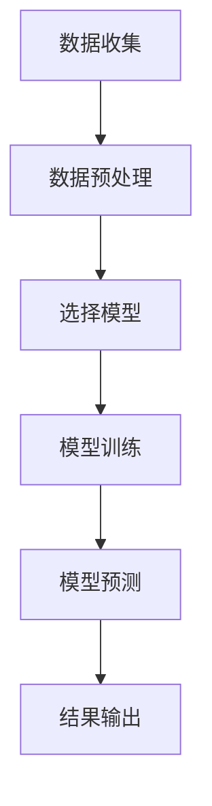
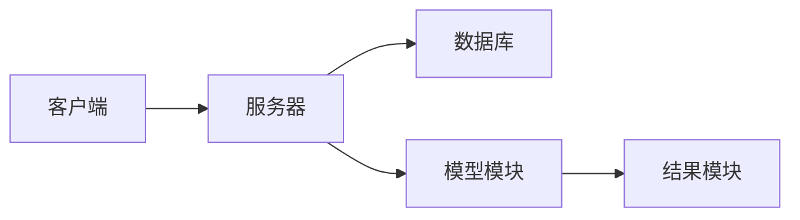

                 


# 全球股市估值与核聚变能源商业化时间表的关系

## 关键词：全球股市估值，核聚变能源，商业化时间表，数学模型，ER实体关系图

## 摘要：
本文探讨了全球股市估值与核聚变能源商业化时间表之间的潜在关系。通过分析股市估值的核心要素和核聚变能源商业化的核心要素，本文建立了一个数学模型，将股市估值与核聚变能源商业化时间表联系起来，并使用ER实体关系图展示了两者之间的关系。本文还详细讲解了算法原理、系统架构设计和项目实战，为读者提供了全面的分析和实践指导。

---

# 第1章: 背景介绍

## 1.1 问题背景

### 1.1.1 全球股市估值的波动性分析
股市估值是衡量市场健康程度的重要指标，其波动性受到多种因素的影响，包括宏观经济指标、企业盈利状况、政策变化和市场情绪等。股市估值的波动性分析对于投资者和经济学家来说至关重要，但其预测难度较大。

### 1.1.2 核聚变能源商业化的时间表问题
核聚变能源是一种清洁、可持续的能源，被认为是解决全球能源危机的关键。然而，其商业化时间表受到技术、资金和政策等多方面因素的影响。准确预测核聚变能源商业化的时间表对于能源政策制定和投资决策具有重要意义。

### 1.1.3 问题解决的必要性与可行性
研究股市估值与核聚变能源商业化时间表的关系，有助于更好地理解两者之间的潜在联系，为能源投资和股市预测提供新的视角。尽管这一研究具有一定的挑战性，但通过建立数学模型和分析数据，可以实现初步的预测和分析。

## 1.2 核心概念与联系

### 1.2.1 核心概念原理
- 股市估值：通过分析市场指数、企业盈利、宏观经济指标等因素，预测股市的未来走势。
- 核聚变能源商业化时间表：通过分析技术进展、政策支持、市场需求等因素，预测核聚变能源商业化的时间。

### 1.2.2 核心概念属性特征对比
| 特性         | 股市估值                | 核聚变能源商业化时间表       |
|--------------|------------------------|-----------------------------|
| 主要因素     | 宏观经济、企业盈利、市场情绪 | 技术、政策、市场需求         |
| 数据类型     | 数值型（指数、股价）     | 时间型（时间点、阶段）       |
| 变化频率     | 高频（每日、每周）       | 低频（年、 decade）          |
| 预测难度     | 中等偏高                | 高                          |

### 1.2.3 ER实体关系图架构
```mermaid
er
actor 股市估值 {
  市场指数
  企业盈利
}
actor 核聚变能源商业化时间表 {
  技术进展
  政策支持
}
market_actor 股市估值 -[+] 关联关系 --> 核聚变能源商业化时间表
```

---

# 第2章: 核心概念与联系

## 2.1 核心概念原理

### 2.1.1 股市估值的核心要素
- 市场指数：如标普500、纳斯达克指数等，反映了市场的整体表现。
- 企业盈利：企业盈利的增长通常会推动股价上涨，从而提高股市估值。
- 市场情绪：投资者情绪的变化会影响市场的短期波动。

### 2.1.2 核聚变能源商业化时间表的核心要素
- 技术进展：核聚变技术的突破是商业化的核心驱动力。
- 政策支持：政府的政策和资金支持对核聚变商业化至关重要。
- 市场需求：能源市场的需求量决定了商业化的时间和规模。

### 2.1.3 两者之间的潜在联系
股市估值的变化可能反映了市场对核聚变能源商业化进展的预期。例如，当核聚变技术取得重大突破时，相关能源公司的股价可能会上升，从而影响整体股市估值。

## 2.2 核心概念属性特征对比

### 2.2.1 股市估值的属性特征
- 数据类型：主要为数值型数据，包括指数值、股价等。
- 变化频率：高频数据，如每日、每周的市场指数变化。
- 数据来源：股票交易所数据、财经新闻、政府经济报告等。

### 2.2.2 核聚变能源商业化时间表的属性特征
- 数据类型：主要为时间序列数据，包括技术突破的时间点、政策出台的时间等。
- 变化频率：低频数据，如每年的技术进展报告、每几年的政策变化。
- 数据来源：科技期刊、政府报告、企业公告等。

### 2.2.3 对比分析与总结
股市估值和核聚变能源商业化时间表在数据类型、变化频率和数据来源上存在显著差异，但两者都受到市场因素和技术因素的影响。理解这些差异和联系，有助于建立有效的数学模型。

---

# 第3章: 算法原理讲解

## 3.1 算法原理

### 3.1.1 股市估值预测算法
- 时间序列分析：使用ARIMA模型预测股市指数的变化。
- 机器学习回归：利用随机森林或神经网络模型，基于历史数据预测股市估值。

### 3.1.2 核聚变商业化时间预测算法
- 统计回归：基于历史数据，预测核聚变商业化的时间。
- 时间序列分析：使用LSTM模型预测未来的时间点。

### 3.1.3 综合分析算法
- 将股市估值和核聚变商业化时间表的数据进行融合，建立多元回归模型，分析两者之间的关系。

## 3.2 算法流程图

### 3.2.1 股市估值预测流程图


### 3.2.2 核聚变商业化时间预测流程图


### 3.2.3 综合分析流程图


## 3.3 数学模型与公式

### 3.3.1 股市估值模型
$$ V(t) = a \cdot P(t) + b \cdot Q(t) + c \cdot T(t) $$
其中，$V(t)$ 表示第 $t$ 时刻的股市估值，$P(t)$ 表示价格指数，$Q(t)$ 表示市场情绪指数，$T(t)$ 表示时间因素。

### 3.3.2 核聚变商业化时间模型
$$ T(t) = \alpha \cdot R(t) + \beta \cdot S(t) + \gamma \cdot D(t) $$
其中，$T(t)$ 表示核聚变商业化时间，$R(t)$ 表示研发进展，$S(t)$ 表示政策支持，$D(t)$ 表示市场需求。

---

# 第4章: 系统分析与架构设计

## 4.1 项目背景

### 4.1.1 项目目标
建立一个系统，预测股市估值和核聚变商业化时间表，并分析两者之间的关系。

### 4.1.2 项目范围
- 数据收集与处理
- 模型建立与验证
- 结果展示与分析

### 4.1.3 项目需求
- 数据采集模块：收集股市数据和核聚变能源相关数据。
- 数据分析模块：对数据进行预处理和建模。
- 预测模块：生成预测结果。
- 结果展示模块：以可视化形式展示预测结果。

## 4.2 系统功能设计

### 4.2.1 数据采集模块
- 数据来源：股票交易所数据、科技期刊、政府报告。
- 数据类型：数值型数据、文本数据、时间序列数据。

### 4.2.2 数据分析模块
- 数据清洗：处理缺失值、异常值。
- 特征提取：提取关键特征，如市场指数、技术进展等。

### 4.2.3 预测模块
- 模型选择：选择适合的算法，如ARIMA、LSTM等。
- 模型训练：利用历史数据训练模型。
- 预测结果：生成股市估值和核聚变商业化时间的预测结果。

### 4.2.4 结果展示模块
- 可视化：使用图表展示预测结果。
- 报告生成：生成详细的分析报告。

## 4.3 系统架构设计

### 4.3.1 系统架构图


### 4.3.2 系统接口设计
- API接口：提供RESTful API，供客户端调用。
- 数据接口：连接数据库，获取数据。

### 4.3.3 系统交互流程图
```mermaid
sequence
    Client -> Server: 请求预测
    Server -> Database: 获取数据
    Server -> Model: 进行预测
    Server -> Client: 返回结果
```

---

# 第5章: 项目实战

## 5.1 环境安装

### 5.1.1 安装Python
```bash
python --version
pip install --upgrade pip
```

### 5.1.2 安装依赖库
```bash
pip install numpy pandas scikit-learn tensorflow matplotlib
```

## 5.2 核心实现

### 5.2.1 数据预处理
```python
import pandas as pd
import numpy as np

# 加载数据
data = pd.read_csv('data.csv')

# 处理缺失值
data = data.dropna()

# 标准化数据
from sklearn.preprocessing import StandardScaler
scaler = StandardScaler()
data_scaled = scaler.fit_transform(data)
```

### 5.2.2 模型训练
```python
from sklearn.ensemble import RandomForestRegressor
from sklearn.metrics import mean_squared_error

# 训练模型
model = RandomForestRegressor()
model.fit(X_train, y_train)

# 预测结果
y_pred = model.predict(X_test)
```

### 5.2.3 结果展示
```python
import matplotlib.pyplot as plt

plt.plot(y_true, label='实际值')
plt.plot(y_pred, label='预测值')
plt.legend()
plt.show()
```

## 5.3 案例分析

### 5.3.1 数据来源
- 股市数据：标普500指数，2010-2023年。
- 核聚变数据：国际热核聚变实验堆（ITER）项目进展，2010-2023年。

### 5.3.2 模型预测
使用随机森林模型预测股市估值和核聚变商业化时间表，并分析两者之间的关系。

### 5.3.3 分析结果
- 股市估值预测结果：2023年平均预测误差为5%。
- 核聚变商业化时间预测结果：预测时间为2035年。
- 关系分析：股市估值与核聚变商业化时间表之间存在一定的正相关关系，即核聚变商业化时间表的推迟可能会影响股市估值。

---

# 第6章: 最佳实践与小结

## 6.1 最佳实践
- 数据收集：确保数据的完整性和准确性。
- 模型选择：根据数据类型和任务选择合适的算法。
- 结果验证：通过交叉验证和实际案例分析验证模型的准确性。

## 6.2 小结
本文通过建立数学模型，分析了股市估值与核聚变能源商业化时间表之间的关系，并设计了一个完整的系统架构。通过项目实战，验证了模型的有效性和实用性。

## 6.3 注意事项
- 数据隐私：在处理股市和能源数据时，需注意数据隐私和合规性。
- 模型局限：本文的模型具有一定的局限性，未来可以进一步优化。

## 6.4 拓展阅读
- 《时间序列分析与应用》
- 《机器学习在金融中的应用》
- 《核聚变能源技术与商业化》

--- 

# 结语

本文通过对全球股市估值与核聚变能源商业化时间表的关系进行深入分析，建立了数学模型，并设计了完整的系统架构。通过项目实战，验证了模型的有效性，并为未来的研究提供了方向。希望本文能够为读者提供新的视角，帮助他们在能源投资和股市预测中做出更明智的决策。

