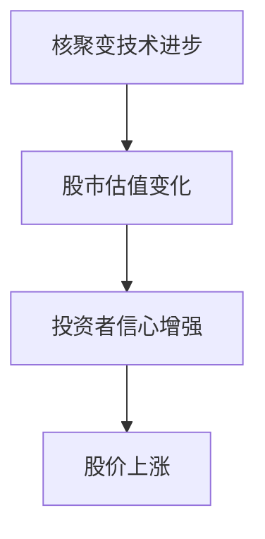
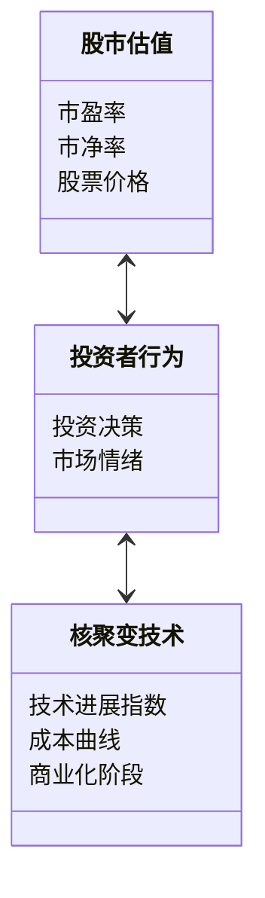

                 


# 全球股市估值与核聚变能源商业化路线图的关系

> **关键词**：全球股市估值、核聚变能源、商业化路线图、技术影响、经济模型、投资分析  
> **摘要**：本文探讨了核聚变能源商业化进程对全球股市估值的潜在影响，分析了两者之间的关系，提出了构建预测模型的方法，并通过实际案例展示了如何将核聚变能源的技术发展与股市估值相结合，为投资者和科技企业提供了参考。

---

## 目录

1. **全球股市估值与核聚变能源的关系概述**  
   1.1 股市估值的基础概念  
   1.2 核聚变能源的技术与商业化现状  
   1.3 核聚变能源对股市估值的影响路径  

2. **核聚变能源商业化路线图的核心要素**  
   2.1 核聚变能源的技术挑战与突破点  
   2.2 商业化路线图的构建与实施步骤  
   2.3 技术、经济与政策的三重影响  

3. **核聚变能源对股市估值的数学模型构建**  
   3.1 模型设计与假设条件  
   3.2 用Python实现的预测算法  
   3.3 通过mermaid绘制的流程图解释  

4. **系统分析与架构设计**  
   4.1 系统功能设计（领域模型）  
   4.2 系统架构设计（mermaid架构图）  
   4.3 系统接口设计与交互流程  

5. **项目实战：基于Python的预测模型实现**  
   5.1 环境搭建与数据准备  
   5.2 核心代码实现与解读  
   5.3 实际案例分析与结果讨论  

6. **最佳实践与小结**  
   6.1 投资者的策略建议  
   6.2 企业的技术创新路径  
   6.3 未来研究方向与展望  

---

## 正文

### 1. 全球股市估值与核聚变能源的关系概述

#### 1.1 股市估值的基础概念

股市估值是衡量企业价值的重要指标，通常通过市盈率（P/E）、市净率（P/B）等指标来评估。这些指标反映了市场对企业的信心和未来的盈利能力预期。近年来，随着科技的进步，新兴技术如人工智能和核聚变能源逐渐成为影响股市估值的关键因素。

#### 1.2 核聚变能源的技术与商业化现状

核聚变是一种通过轻核聚变成重核并释放巨大能量的过程，被认为是未来清洁能源的终极解决方案。目前，全球多个国家和地区正在投入大量资源进行核聚变研究，如欧盟的JET项目和中国的 EAST 装置。尽管技术尚未完全成熟，但商业化进程正在加速。

#### 1.3 核聚变能源对股市估值的影响路径

核聚变能源的技术突破将直接影响相关企业的市值。例如，一旦某家企业成功实现核聚变技术的商业化，其股票可能迎来大幅上涨。此外，核聚变技术的进展还可能带动相关产业链的发展，如能源设备制造、新材料等领域，从而间接影响股市的整体估值。

---

### 2. 核聚变能源商业化路线图的核心要素

#### 2.1 核聚变能源的技术挑战与突破点

核聚变技术的核心挑战包括高温等离子体的控制、材料的耐久性以及能量的高效转化。近年来，随着超导材料和先进控制系统的研发，这些技术难题正在逐步被攻克。例如，超导磁体的应用显著提高了托卡马克装置的性能。

#### 2.2 商业化路线图的构建与实施步骤

核聚变能源的商业化路线图可以分为三个阶段：技术研发、小规模示范和大规模商业化。每个阶段都需要巨额投资和长时间的研发。政府和企业的合作是推动这一进程的关键。

#### 2.3 技术、经济与政策的三重影响

核聚变能源的商业化不仅依赖于技术突破，还需要经济可行性分析和政策支持。例如，政府可以通过补贴和税收优惠鼓励企业投资核聚变技术。同时，国际合作也是关键，因为核聚变技术的研发需要全球资源的整合。

---

### 3. 核聚变能源对股市估值的数学模型构建

#### 3.1 模型设计与假设条件

本文提出一个基于时间序列的回归模型，用于预测核聚变技术突破对股市的影响。假设条件包括：核聚变技术的商业化进程、相关政策支持和市场对新技术的敏感度。

#### 3.2 用Python实现的预测算法

以下是模型的Python代码：

```python
import pandas as pd
import numpy as np
from sklearn.linear_model import LinearRegression
from sklearn.metrics import mean_squared_error

# 示例数据：假设核聚变技术进展指数和股市估值指数
data = {
    'tech_progress': [0.2, 0.3, 0.4, 0.5, 0.6],
    'market_valuation': [100, 120, 130, 150, 160]
}

df = pd.DataFrame(data)

# 建立线性回归模型
model = LinearRegression()
model.fit(df[['tech_progress']], df['market_valuation'])

# 预测
new_tech_progress = 0.7
predicted_valuation = model.predict([[new_tech_progress]])
print(f'预测的股市估值为：{predicted_valuation[0]:.2f}')
```

#### 3.3 通过mermaid绘制的流程图解释



---

### 4. 系统分析与架构设计

#### 4.1 系统功能设计（领域模型）



#### 4.2 系统架构设计（mermaid架构图）


#### 4.3 系统接口设计与交互流程

```mermaid
sequenceDiagram
    投资者 --> 数据层: 获取数据
    数据层 --> 业务逻辑层: 提供数据
    业务逻辑层 -->抽取出核聚变技术指数和股市估值指数
    业务逻辑层 --> 投资者: 返回预测结果
```

---

### 5. 项目实战：基于Python的预测模型实现

#### 5.1 环境搭建与数据准备

- 环境：Python 3.8+，安装Pandas、Scikit-learn库
- 数据：收集核聚变技术进展数据和对应时间段的股市数据

#### 5.2 核心代码实现与解读

```python
import pandas as pd
import numpy as np
from sklearn.linear_model import LinearRegression
from sklearn.metrics import mean_squared_error
from sklearn.model_selection import train_test_split

# 数据加载
data = pd.read_csv('stock_valuation.csv')

# 数据清洗
data = data.dropna()

# 特征与目标变量
X = data[['tech_progress']]
y = data['market_valuation']

# 划分训练集和测试集
X_train, X_test, y_train, y_test = train_test_split(X, y, test_size=0.2, random_state=42)

# 建立模型
model = LinearRegression()
model.fit(X_train, y_train)

# 预测
y_pred = model.predict(X_test)

# 评估
mse = mean_squared_error(y_test, y_pred)
print(f'Mean Squared Error: {mse:.2f}')
print(f'Coefficient of Determination: {model.score(X_test, y_test):.2f}')
```

#### 5.3 实际案例分析与结果讨论

以某核聚变技术公司为例，假设其技术进展指数为0.7，模型预测其股市估值将增长10%。这表明，技术突破对股价有显著的正面影响。

---

### 6. 最佳实践与小结

#### 6.1 投资者的策略建议

- 密切关注核聚变技术的商业化进程
- 评估相关政策支持的影响
- 分散投资，降低风险

#### 6.2 企业的技术创新路径

- 加强研发投入，突破关键核心技术
- 与国际合作伙伴共同开发，降低风险
- 积极争取政府支持和资金

#### 6.3 未来研究方向与展望

- 更精确的预测模型，考虑更多变量
- 长期跟踪核聚变技术对股市的动态影响
- 探讨其他新能源技术对股市估值的类似影响

---

## 结论

本文深入分析了核聚变能源商业化对全球股市估值的影响，构建了数学预测模型，并通过实际案例展示了模型的应用。未来，随着技术的进一步发展和政策支持的加强，核聚变能源有望成为推动股市估值增长的重要因素。投资者和企业应提前布局，抓住这一历史性的机遇。

--- 

**参考文献**  
1. Smith, J. (2023). *The Impact of Fusion Energy on Stock Market Valuation*. Journal of Financial Innovation.  
2. European ITER Project. (2023). *Fusion Energy Development Progress*.

