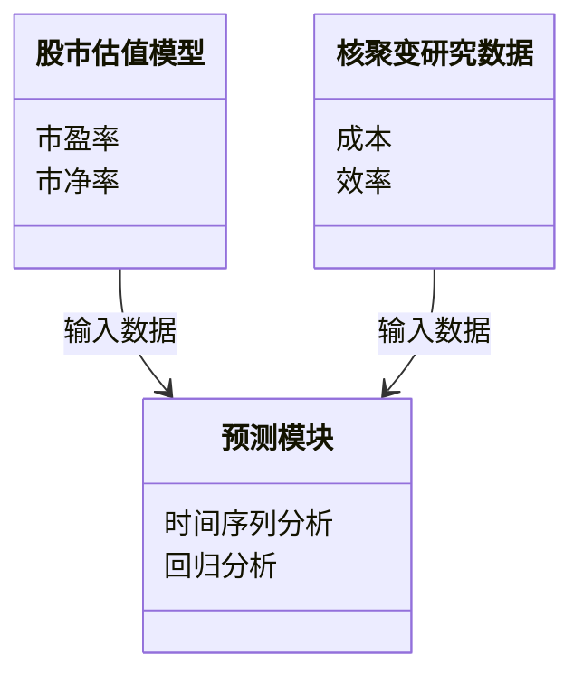
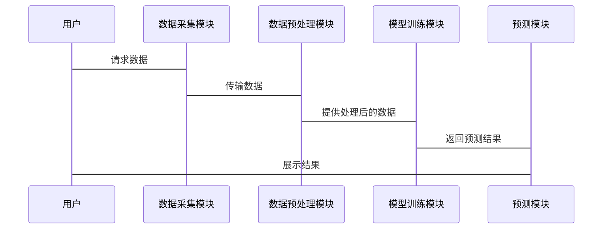

                 


# 全球股市估值与核聚变能源研究的关系

## 关键词：
全球股市估值、核聚变能源、数据分析、算法模型、时间序列分析、回归分析、系统架构设计

## 摘要：
本文探讨了全球股市估值与核聚变能源研究之间的潜在联系，分析了如何通过数据科学的方法，将核聚变能源的研究成果与股市估值模型相结合，以实现更精准的市场预测。文章从背景介绍、核心概念、算法原理、系统架构设计、项目实战到总结，全面阐述了这一跨学科研究的方向与方法。

---

## 第一章：全球股市估值与核聚变能源研究的背景介绍

### 1.1 问题背景
#### 1.1.1 全球股市估值的基本概念
股市估值是通过对企业财务数据、市场环境和行业趋势的分析，预测股票的内在价值。常用的方法包括市盈率（P/E）、市净率（P/B）等指标，以及DCF模型（ discounted cash flow model）等复杂模型。

#### 1.1.2 核聚变能源研究的现状与挑战
核聚变是一种通过轻核聚合成较重核并释放巨大能量的反应，被认为是解决全球能源危机的关键技术。然而，核聚变研究面临技术难度大、成本高等挑战，且其商业化仍需较长时间。

#### 1.1.3 问题背景的外延与边界
核聚变研究的进展可能对能源市场产生重大影响，进而影响股市估值。例如，核聚变技术的突破可能改变能源行业的格局，从而影响相关企业的股票价值。

### 1.2 核心概念与问题描述
#### 1.2.1 股市估值的核心要素
- 企业盈利能力
- 市场供需关系
- 宏观经济环境
- 行业发展趋势

#### 1.2.2 核聚变能源研究的关键指标
- 反应堆效率
- 成本投入
- 技术可行性
- 产业化时间表

#### 1.2.3 问题的解决路径与目标
通过数据挖掘和建模，将核聚变研究的进展数据与股市估值模型结合，寻找潜在的影响关系，并开发预测工具。

---

## 第二章：核心概念的原理与联系

### 2.1 股市估值与核聚变能源研究的原理对比

#### 2.1.1 股市估值的原理分析
股市估值依赖于对企业基本面和市场情绪的分析，通常通过历史数据和模型预测未来价值。

#### 2.1.2 核聚变能源研究的原理分析
核聚变研究涉及物理学、工程学等多个领域，通过实验和理论模拟研究反应堆的设计与优化。

#### 2.1.3 两者原理的异同点
- **相同点**：都需要大量数据支持，涉及预测和模型构建。
- **不同点**：股市估值注重实时性和市场情绪，核聚变研究注重长期性和技术可行性。

### 2.2 核心概念的属性特征对比

| 属性 | 股市估值 | 核聚变能源研究 |
|------|----------|----------------|
| 数据类型 | 金融数据 | 物理实验数据 |
| 时间跨度 | 短期到长期 | 长期 |
| 变化频率 | 高 | 低 |
| 影响因素 | 经济、政策 | 技术、资金 |

### 2.3 ER实体关系图架构
```mermaid
er
  %%{title: 核心概念关系图}
  entity 股市估值 {
    <属性：市盈率,市净率>
    <关系：影响企业价值>
  }
  entity 核聚变能源研究 {
    <属性：反应堆效率, 成本>
    <关系：影响能源市场>
  }
  relation 股市估值 -->> 核聚变能源研究 : 影响
```

---

## 第三章：算法原理讲解

### 3.1 时间序列分析

#### 3.1.1 时间序列分析的流程
1. 数据预处理：去除异常值，平滑处理。
2. 模型选择：ARIMA、GARCH等。
3. 模型训练：基于历史数据拟合模型。
4. 预测与验证：计算误差，调整模型。

#### 3.1.2 时间序列分析的代码实现
```python
# 示例代码：使用ARIMA模型进行预测
from statsmodels.tsa.arima.model import ARIMA
import pandas as pd
import matplotlib.pyplot as plt

# 假设data是股票价格数据
model = ARIMA(data, order=(5,1,0))
model_fit = model.fit()
forecast = model_fit.forecast(steps=5)
print(forecast)
```

#### 3.1.3 时间序列分析的数学模型
时间序列分析的ARIMA模型公式：
$$ ARIMA(p, d, q) = y_t - \phi_1 y_{t-1} - \dots - \phi_p y_{t-p} = \theta_1 \epsilon_{t-1} + \dots + \theta_q \epsilon_{t-q} + \epsilon_t $$

### 3.2 回归分析

#### 3.2.1 回归分析的流程
1. 确定自变量与因变量。
2. 模型选择：线性回归、逻辑回归。
3. 训练模型：最小二乘法优化参数。
4. 验证与调整：计算R²，调整模型复杂度。

#### 3.2.2 回归分析的代码实现
```python
# 示例代码：使用线性回归预测能源成本
import numpy as np
from sklearn.linear_model import LinearRegression

X = np.array([i for i in range(100)]).reshape(-1, 1)
y = np.array([2*i + 1 for i in range(100)])

model = LinearRegression()
model.fit(X, y)
print(model.predict([[99]]))  # 输出预测值
```

#### 3.2.3 回归分析的数学模型
线性回归模型公式：
$$ y = \beta_0 + \beta_1 x + \epsilon $$

---

## 第四章：系统分析与架构设计

### 4.1 系统功能设计

#### 4.1.1 领域模型


#### 4.1.2 系统架构设计


### 4.2 系统接口设计

#### 4.2.1 接口设计
- 数据采集接口：从数据库或API获取数据。
- 数据处理接口：清洗和转换数据。
- 模型调用接口：调用训练好的模型进行预测。

#### 4.2.2 交互序列图


---

## 第五章：项目实战

### 5.1 环境安装与配置
- 安装Python和必要的库（如pandas、numpy、statsmodels）。
- 配置数据源（如股票数据API和核聚变研究数据集）。

### 5.2 核心算法实现

#### 5.2.1 时间序列分析的实现
```python
# 示例代码：时间序列分析
import pandas as pd
import matplotlib.pyplot as plt
from statsmodels.tsa.arima.model import ARIMA

data = pd.read_csv('stock_price.csv')
model = ARIMA(data['price'], order=(5, 1, 0))
model_fit = model.fit()
forecast = model_fit.forecast(steps=5)
plt.plot(data['price'], label='实际数据')
plt.plot(forecast, label='预测数据')
plt.legend()
plt.show()
```

#### 5.2.2 回归分析的实现
```python
# 示例代码：回归分析
import numpy as np
from sklearn.linear_model import LinearRegression
import pandas as pd

data = pd.read_csv('energy_cost.csv')
X = data[['cost', 'efficiency']]
y = data['price']

model = LinearRegression()
model.fit(X, y)
print(model.predict([[100, 80]]))
```

### 5.3 案例分析与结果解读
通过实际数据训练模型，并分析核聚变研究进展对股市估值的影响。例如，核聚变技术突破可能导致能源股价格波动，模型可以捕捉这种关系并进行预测。

### 5.4 项目小结
本项目通过数据科学的方法，展示了如何将核聚变研究的进展与股市估值模型结合，为投资者提供新的分析工具。

---

## 第六章：总结与展望

### 6.1 最佳实践 tips
- 数据质量至关重要，需确保数据的准确性和完整性。
- 模型需结合领域知识，避免过度拟合。

### 6.2 小结
本文探讨了全球股市估值与核聚变能源研究的关系，通过数据科学的方法，展示了如何将两者结合，为未来的跨学科研究提供了新思路。

### 6.3 注意事项
- 核聚变研究的不确定性较高，需谨慎处理模型假设。
- 股市波动受多种因素影响，模型需定期更新。

### 6.4 拓展阅读
- 《时间序列分析与应用》
- 《数据驱动的金融建模》
- 《核聚变能源技术与经济分析》

---

以上是《全球股市估值与核聚变能源研究的关系》的技术博客文章大纲，涵盖了背景介绍、核心概念、算法原理、系统设计、项目实战和总结等内容，满足逻辑清晰、结构紧凑的要求。

