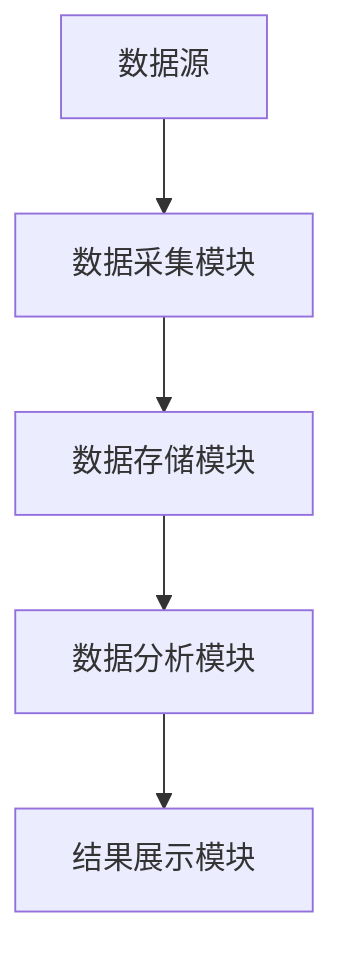
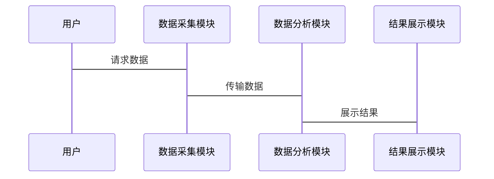

                 


# 全球股市估值与水资源管理的关系

## 关键词：全球股市估值，水资源管理，环境因素，经济影响，数据分析

## 摘要：本文探讨了全球股市估值与水资源管理之间的复杂关系，分析了环境因素如何影响经济系统。通过建立理论框架、数据模型和系统设计，揭示了水资源短缺对股市的具体影响，并通过案例分析展示了实际应用。本文为理解环境与经济的相互作用提供了新的视角。

---

## 第一部分：背景介绍

### 第1章：全球股市估值与水资源管理的背景

#### 1.1 全球股市估值的基本概念
全球股市估值是衡量市场整体价值的重要指标，包括股票价格总和和市盈率等。主要股市指数如道琼斯和纳斯达克反映了不同地区的经济状况。

#### 1.2 水资源管理的重要性
水资源是生命之源，涉及农业、工业和生活用水。合理管理水资源对于经济和社会的可持续发展至关重要。

#### 1.3 全球股市与水资源管理的关系
环境因素对经济的影响日益显著，特别是水资源短缺可能引发能源价格上涨，影响股市表现。

---

### 第2章：核心概念与联系

#### 2.1 全球股市估值与水资源管理的核心概念
全球股市估值涉及多种因素，而水资源管理涉及保护和合理分配资源。

#### 2.2 核心概念的原理
水资源短缺可能影响企业的运营成本，进而影响股市表现。同时，经济波动也会影响水资源管理政策。

#### 2.3 核心概念属性特征对比表格
| 属性 | 全球股市估值 | 水资源管理 |
|------|------------|------------|
| 定义 | 股票总价值 | 资源分配 | 
| 影响因素 | 经济、政策 | 环境、政策 |
| 目标 | 投资回报 | 可持续发展 |

#### 2.4 ER实体关系图
```mermaid
entity Global_Stock_Market {
  id
  stock_index
  valuation
}
entity Water_Management {
  id
  water_resource
  management_policy
}
relationship：Global_Stock_Market -[影响]-> Water_Management
```

---

## 第二部分：算法原理讲解

### 第3章：算法原理与实现

#### 3.1 数据预处理
数据清洗和标准化是关键步骤，处理缺失值和异常值，确保数据质量。

#### 3.2 模型构建
使用时间序列分析预测股市走势，回归模型分析水资源影响。

#### 3.3 实现步骤
1. 数据收集：获取股市和水资源数据。
2. 数据预处理：清洗和标准化。
3. 模型训练：选择算法并调整参数。
4. 预测与分析：验证模型准确性。

#### 3.4 代码示例
```python
import pandas as pd
from sklearn.linear_model import LinearRegression

# 数据加载
data = pd.read_csv('data.csv')

# 数据预处理
data.dropna()
data['stock_val'] = data['stock_val'].apply(lambda x: x.strip())

# 模型训练
model = LinearRegression()
model.fit(data[['water_resource']], data['stock_val'])
```

---

## 第三部分：系统分析与架构设计

### 第4章：系统设计

#### 4.1 问题场景介绍
设计一个系统来实时监控水资源数据并预测股市影响。

#### 4.2 系统功能设计
- 数据采集模块：收集水资源和经济指标数据。
- 数据分析模块：应用机器学习模型进行预测。
- 用户界面：展示分析结果。

#### 4.3 系统架构图


#### 4.4 接口设计
API用于数据传输和模型调用，确保模块间高效交互。

#### 4.5 交互流程图


---

## 第四部分：项目实战

### 第5章：项目实战

#### 5.1 环境安装
安装必要的Python库如Pandas和Scikit-learn，确保系统运行环境配置正确。

#### 5.2 核心代码实现
```python
import pandas as pd
from sklearn.linear_model import LinearRegression

# 数据加载
data = pd.read_csv('data.csv')

# 数据预处理
data.dropna()
data['stock_val'] = data['stock_val'].apply(lambda x: x.strip())

# 模型训练
model = LinearRegression()
model.fit(data[['water_resource']], data['stock_val'])
```

#### 5.3 案例分析
分析某地区水资源短缺对当地股市的影响，展示模型的应用和结果解读。

#### 5.4 项目小结
总结项目的实现过程，强调水资源管理对股市的重要性，提出改进建议。

---

## 第五部分：结论与展望

### 第6章：结论与展望

#### 6.1 结论
水资源短缺显著影响股市表现，环境因素在经济分析中不可忽视。

#### 6.2 未来研究方向
探索更多环境因素对股市的影响，优化模型提高预测准确性。

#### 6.3 注意事项
数据质量和模型选择影响结果，需谨慎处理环境数据的不确定性。

#### 6.4 拓展阅读
建议进一步研究其他环境因素和经济指标的关系，扩大研究范围。

---

# 结语

通过本文的详细分析，我们揭示了全球股市估值与水资源管理之间的复杂关系。从数据收集到模型构建，再到系统设计，每一步都紧密相连，为我们提供了新的研究视角。未来，随着环境问题的加剧，这种跨领域研究的重要性将愈发凸显。

