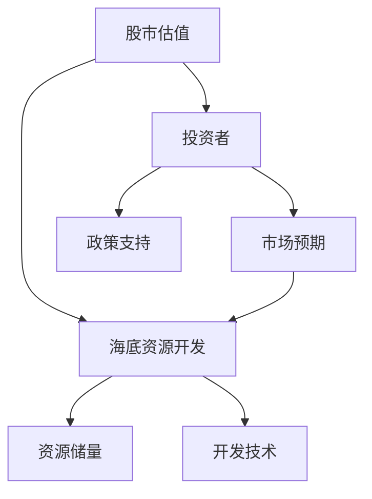
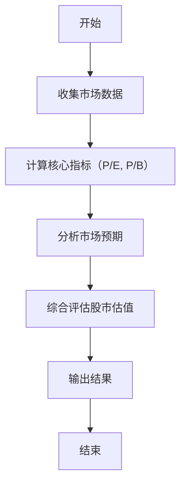
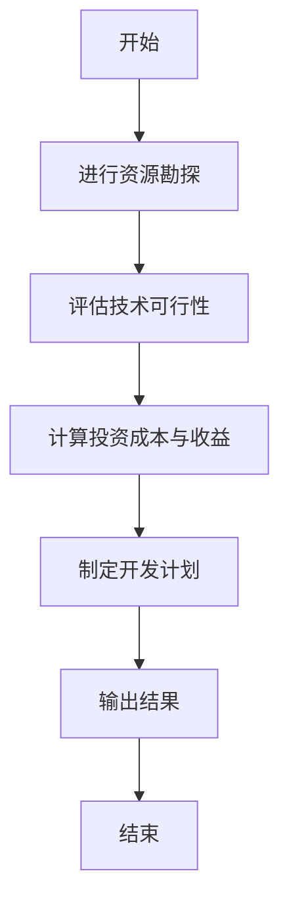
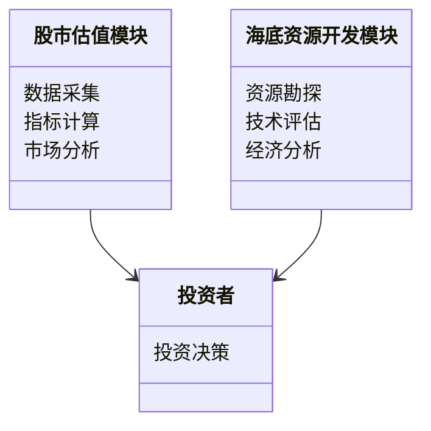
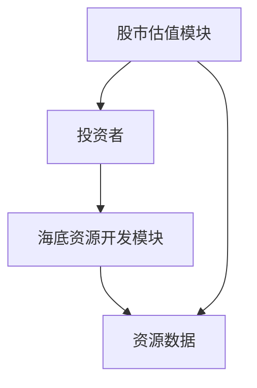

                 


# 全球股市估值与海底资源开发的关系

> 关键词：全球股市估值，海底资源开发，经济影响，资源投资，市场动态

> 摘要：本文探讨了全球股市估值与海底资源开发之间的关系，分析了股市估值的变化如何影响海底资源开发的投资决策和项目实施，以及海底资源开发的进展如何反作用于股市估值的波动。通过建立数学模型、系统分析和实际案例研究，本文揭示了两者之间的复杂互动关系，并提出了相应的投资策略和风险管理建议。

---

# 第一部分：全球股市估值与海底资源开发的背景与概念

## 第1章：全球股市估值与海底资源开发的背景介绍

### 1.1 全球股市估值的基本概念

#### 1.1.1 股市估值的定义与意义
股市估值是指对上市公司股票价值的评估，通常通过市盈率（P/E）、市净率（P/B）、市值等指标来衡量。股市估值的变化反映了市场对经济前景、企业盈利能力和整体风险的预期。股市估值不仅是投资者决策的重要依据，也是宏观经济的重要晴雨表。

#### 1.1.2 全球股市的现状与发展趋势
近年来，全球股市呈现出波动性加剧的趋势，尤其是在全球经济不确定性增加的情况下。股市估值的波动性与地缘政治、经济政策、技术创新等密切相关。同时，随着可持续发展和绿色投资理念的兴起，环保和资源开发领域的股票逐渐受到更多关注。

#### 1.1.3 股市估值的核心指标与方法
- **市盈率（P/E）**：衡量股票价格与每股收益的比例。
- **市净率（P/B）**：衡量股票价格与每股净资产的比例。
- **市值**：衡量一家公司或市场的总价值。
- **beta系数**：衡量股票相对于市场的波动性。

### 1.2 海底资源开发的基本概念

#### 1.2.1 海底资源的定义与分类
海底资源主要包括海底矿产（如金、银、铜、铀、稀土等）、天然气 hydrate、海洋生物资源（如鱼类、海藻等）以及海底可再生能源（如潮汐能、波浪能等）。海底资源的开发涉及复杂的地质、环境和工程技术挑战。

#### 1.2.2 海底资源开发的技术与挑战
海底资源开发需要先进的勘探技术（如地震勘探、海底钻探）和开采技术（如海底采矿、管道运输）。同时，海底资源开发还面临技术难题，如海底环境的复杂性、资源分布的不确定性以及开发成本高昂等问题。

#### 1.2.3 海底资源开发的经济与环境影响
海底资源开发对经济发展具有重要意义，但也可能对海洋生态系统造成破坏。因此，海底资源开发需要在经济效益和环境保护之间寻找平衡。

### 1.3 全球股市估值与海底资源开发的关系

#### 1.3.1 两者关系的初步探讨
股市估值的变化可能影响海底资源开发的投资决策，而海底资源开发的进展也可能反过来影响股市估值的变化。两者之间的关系是双向且动态的。

#### 1.3.2 问题背景与问题描述
随着全球资源需求的增长，海底资源开发的潜力越来越大，但同时也面临技术和环境的双重挑战。股市作为资金的主要来源，其估值变化直接影响海底资源开发项目的融资能力。

#### 1.3.3 问题解决的思路与方法
通过建立数学模型，分析股市估值与海底资源开发之间的互动关系，提出优化投资策略和风险管理的建议。

#### 1.3.4 边界与外延
股市估值与海底资源开发的关系受到多种因素的影响，包括全球经济形势、技术进步、政策法规、环境因素等。本文将重点分析经济和技术因素的影响。

#### 1.3.5 核心概念结构与核心要素组成
- **核心概念**：股市估值和海底资源开发。
- **核心要素**：经济因素（如市场预期、投资需求）、技术因素（如海底勘探技术）、环境因素（如生态影响）。

## 第2章：全球股市估值与海底资源开发的核心概念与联系

### 2.1 核心概念的原理分析

#### 2.1.1 股市估值的核心要素
- 市场预期：投资者对经济前景和企业盈利的预期。
- 财务表现：企业的收入、利润和资产负债情况。
- 风险偏好：投资者对风险的承受能力和偏好。

#### 2.1.2 海底资源开发的核心要素
- 资源储量：海底资源的分布和储量。
- 开发技术：海底勘探和开采的技术水平。
- 成本与收益：开发项目的投资成本和预期收益。

#### 2.1.3 两者的共同特征与差异
- **共同特征**：两者都受到经济和技术因素的影响，且都具有较高的不确定性。
- **差异**：股市估值是基于市场预期的抽象指标，而海底资源开发是具体的物理过程。

### 2.2 核心概念的属性特征对比

#### 2.2.1 股市估值的属性特征
- **动态性**：股市估值随时间波动。
- **市场性**：受市场参与者行为影响。
- **不确定性**：受多种不可控因素影响。

#### 2.2.2 海底资源开发的属性特征
- **技术依赖性**：依赖于技术水平。
- **环境敏感性**：对环境有较大影响。
- **长期性**：开发周期长，回报周期长。

#### 2.2.3 对比分析与总结
股市估值的变化是市场行为的结果，而海底资源开发是技术与环境的结合。两者通过投资关系相互影响，但其本质和影响因素有显著差异。

### 2.3 实体关系图（ER图）架构

#### 2.3.1 股市估值与海底资源开发的实体关系
- **股市估值**：投资者、市场预期、财务指标。
- **海底资源开发**：资源储量、开发技术、成本与收益。
- **关联关系**：投资行为、技术进步、政策支持。

#### 2.3.2 关系类型与属性
- **投资行为**：投资者通过股市投资海底资源开发项目。
- **技术进步**：技术进步推动海底资源开发，同时影响股市估值。
- **政策支持**：政策支持影响股市估值和海底资源开发的可行性。

#### 2.3.3 ER图的Mermaid流程图



---

## 第3章：全球股市估值与海底资源开发的数学模型与算法原理

### 3.1 数学模型的建立

#### 3.1.1 股市估值的数学模型
股市估值可以通过回归分析模型来预测，考虑的因素包括市场预期、企业盈利能力和风险偏好。

#### 3.1.2 海底资源开发的数学模型
海底资源开发的经济收益可以通过净现值（NPV）模型进行评估，考虑的因素包括投资成本、开发周期和资源储量。

#### 3.1.3 两者的关联模型
通过建立联立方程组，分析股市估值变化对海底资源开发投资的影响，以及海底资源开发进展对股市估值的反馈效应。

### 3.2 算法原理的详细讲解

#### 3.2.1 股市估值算法的流程图



#### 3.2.2 海底资源开发算法的流程图



#### 3.2.3 算法的数学推导与公式

股市估值模型：

$$
\text{预期股市收益} = \alpha \times \text{市场预期} + \beta \times \text{企业盈利}
$$

海底资源开发模型：

$$
\text{净现值} = \sum_{t=1}^{n} \frac{\text{现金流}}{(1 + r)^t}
$$

其中，$r$ 是贴现率，与股市估值相关。

### 3.3 举例说明与实际应用

#### 3.3.1 股市估值的典型案例
假设某科技公司在海底资源开发领域有重大突破，市场预期其盈利将大幅增长，导致其股票市盈率上升。

#### 3.3.2 海底资源开发的典型案例
某国家计划开发海底稀土资源，股市中相关企业的股票价格可能因政策支持而上涨。

#### 3.3.3 两者的关联案例分析
分析某次股市波动对海底资源开发项目的影响，以及海底资源开发进展对股市估值的反馈效应。

---

## 第4章：全球股市估值与海底资源开发的系统分析与架构设计

### 4.1 问题场景介绍

#### 4.1.1 股市估值与海底资源开发的结合场景
投资者通过股市投资海底资源开发项目，股市估值的变化直接影响投资决策和项目融资。

#### 4.1.2 系统目标与需求分析
目标：建立一个综合分析股市估值与海底资源开发关系的系统。
需求：整合股市数据和海底资源开发数据，分析两者之间的互动关系。

### 4.2 系统功能设计

#### 4.2.1 股市估值模块功能设计
- 数据采集：实时采集股市数据。
- 指标计算：计算市盈率、市净率等指标。
- 市场分析：分析市场预期和风险偏好。

#### 4.2.2 海底资源开发模块功能设计
- 资源勘探：分析海底资源储量。
- 技术评估：评估海底开发技术的可行性。
- 经济分析：计算投资成本和收益。

#### 4.2.3 两者的交互功能设计
- 投资决策：根据股市估值变化调整海底资源开发投资。
- 反馈机制：分析海底资源开发进展对股市估值的反馈效应。

### 4.3 系统架构设计

#### 4.3.1 系统架构的Mermaid类图



#### 4.3.2 系统架构的Mermaid架构图



#### 4.3.3 系统接口设计与交互流程
- 接口1：股市估值模块与投资者的交互接口。
- 接口2：海底资源开发模块与投资者的交互接口。
- 交互流程：投资者根据股市估值变化调整海底资源开发投资。

### 4.4 项目实战

#### 4.4.1 环境安装与配置
- 数据源：获取全球股市数据和海底资源开发数据。
- 工具链：安装数据分析工具（如Python、Excel）和可视化工具（如Matplotlib）。

#### 4.4.2 系统核心实现

##### 股市估值模块实现
```python
import pandas as pd
import numpy as np

# 数据采集
data = pd.read_csv('stock_data.csv')
# 计算市盈率
data['PE'] = data['Price'] / data['Earnings']
# 市场分析
market_trend = data['PE'].rolling(20).mean().plot()
```

##### 海底资源开发模块实现
```python
import pandas as pd
import numpy as np

# 数据采集
resource_data = pd.read_csv('ocean_resources.csv')
# 资源储量评估
resource储量 = resource_data['储量'].sum()
# 经济分析
net_present_value = np.npv(discount_rate, cash_flows)
```

#### 4.4.3 代码应用解读与分析
- 股市估值模块：通过数据采集和指标计算，评估股市的总体估值。
- 海底资源开发模块：通过资源储量评估和经济分析，评估海底资源开发的可行性。

#### 4.4.4 实际案例分析
分析某次股市波动对海底资源开发项目的影响，验证模型的准确性。

---

## 第5章：全球股市估值与海底资源开发的总结与展望

### 5.1 项目总结

#### 5.1.1 核心发现
股市估值的变化对海底资源开发的投资决策有重要影响，而海底资源开发的进展对股市估值的反馈效应同样不可忽视。

#### 5.1.2 最佳实践 tips
- 投资者应关注海底资源开发的技术进步和政策支持。
- 企业应加强与金融机构的合作，优化融资策略。

#### 5.1.3 项目小结
通过系统分析和实际案例研究，本文揭示了股市估值与海底资源开发之间的互动关系，并提出了相应的优化策略。

### 5.2 展望与未来研究方向

#### 5.2.1 未来研究方向
- 更深入地研究技术和环境因素对两者关系的影响。
- 探索更多的数学模型和算法，提高预测精度。

#### 5.2.2 总结全文
本文通过系统的分析和实际案例研究，全面探讨了全球股市估值与海底资源开发的关系，为投资者和企业提供了重要的参考。

---

以上是《全球股市估值与海底资源开发的关系》的完整目录大纲和部分内容的详细描述。

