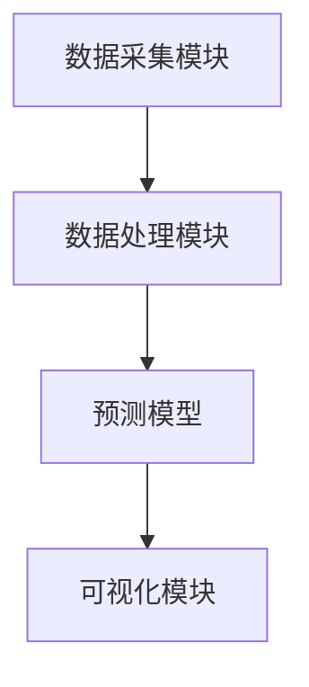
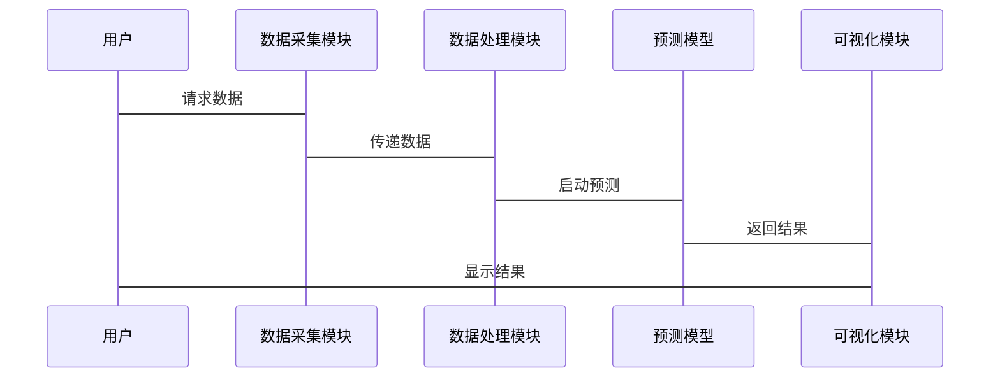

                 


# 全球股市估值与海洋可再生能源并网技术的关系

> 关键词：全球股市估值，海洋可再生能源，并网技术，时间序列分析，机器学习，深度学习，系统架构

> 摘要：本文探讨了全球股市估值与海洋可再生能源并网技术之间的关系，通过数据分析、建模与系统设计，揭示了两者之间的潜在联系，并提出了基于机器学习和深度学习的预测方法，以及系统的架构设计与实现方案。

---

# 第1章 背景介绍

## 1.1 问题背景

### 1.1.1 全球股市估值的基本概念
- 股市估值的定义与影响因素
- 全球化视角下的股市波动

### 1.1.2 海洋可再生能源并网技术的发展现状
- 海洋可再生能源的类型与特点
- 并网技术的核心挑战

### 1.1.3 问题解决的必要性与目标
- 理解两者关系的重要性
- 研究目标与预期成果

## 1.2 问题描述

### 1.2.1 全球股市估值波动的复杂性
- 市场波动的多因素分析
- 技术与经济双重影响

### 1.2.2 海洋可再生能源并网技术的挑战
- 技术瓶颈与经济性问题
- 并网对能源稳定性的影响

### 1.2.3 问题的边界与外延
- 研究范围的界定
- 可能的扩展方向

## 1.3 核心概念结构与组成

### 1.3.1 核心要素分析
- 股市数据与能源数据的采集
- 并网技术与市场波动的关联性

### 1.3.2 概念属性特征对比表格
| 属性 | 股市估值 | 海洋可再生能源并网技术 |
|------|----------|-----------------------|
| 时间跨度 | 短期波动与长期趋势 | 技术研发周期与市场渗透 |
| 影响因素 | 经济指标、政策、市场情绪 | 自然资源、技术、政策支持 |
| 数据类型 | 数值型（指数、价格） | 数值型（功率、效率） |

### 1.3.3 ER实体关系图
```mermaid
er
actor 海洋能源, 股市数据
实体 股市指数, 海洋能源数据
关联 海洋能源影响股市, 股市波动影响能源投资
```

---

# 第2章 全球股市估值与海洋可再生能源并网技术的核心概念与联系

## 2.1 核心概念原理

### 2.1.1 海洋可再生能源的波动性分析
- 自然条件（风力、潮汐）对能源输出的影响
- 技术瓶颈对能源供应稳定性的影响

### 2.1.2 全球股市估值的波动性分析
- 市场情绪、宏观经济指标对股市的影响
- 重大事件对股市的冲击

### 2.1.3 两者之间的潜在联系
- 能源价格波动对股市的影响
- 投资者情绪与能源技术发展的互动

## 2.2 概念属性特征对比

### 2.2.1 海洋可再生能源属性特征
- 数据采集的复杂性
- 技术的地域依赖性

### 2.2.2 全球股市估值属性特征
- 数据的实时性
- 市场的全球性与局部性

### 2.2.3 对比分析
- 数据关联性：海洋能源数据对股市的影响路径
- 技术关联性：技术创新对股市估值的推动作用

## 2.3 ER实体关系图

```mermaid
er
实体 股市指数
属性 股价指数、交易量、市盈率
实体 海洋能源数据
属性 风速、潮汐能、发电量
关系 海洋能源数据影响股市指数
```

---

# 第3章 数据采集与处理

## 3.1 数据采集

### 3.1.1 海洋可再生能源数据采集方法
- 数据来源：传感器、气象站
- 数据预处理：缺失值处理、异常值剔除

### 3.1.2 全球股市数据采集方法
- 数据来源：股票交易所API、金融数据库
- 数据清洗：处理缺失值、标准化

### 3.1.3 数据清洗与预处理
- 数据格式统一
- 数据归一化处理

## 3.2 数据分析与建模

### 3.2.1 数据分析方法
- 时间序列分析：识别趋势与周期性
- 统计分析：相关性分析、回归分析

### 3.2.2 数据建模方法
- 机器学习模型：随机森林、支持向量机
- 时间序列模型：ARIMA、LSTM

### 3.2.3 数据可视化
- 折线图：显示数据趋势
- 散点图：显示变量之间的关系

---

# 第4章 算法原理与数学模型

## 4.1 算法原理

### 4.1.1 机器学习算法原理
- 线性回归：预测股市趋势
- 支持向量机：分类能源数据

### 4.1.2 时间序列分析算法原理
- ARIMA模型：预测未来趋势
- LSTM网络：捕捉时间依赖性

### 4.1.3 深度学习算法原理
- 卷积神经网络（CNN）：处理多维数据
- Transformer：捕捉长距离依赖

## 4.2 数学模型与公式

### 4.2.1 时间序列模型公式
$$ ARIMA(p, d, q) $$
$$ y_t = \phi y_{t-1} + \theta \epsilon_{t-1} + \epsilon_t $$

### 4.2.2 机器学习模型公式
$$ y = w x + b $$
$$ w = \text{优化权重} $$

### 4.2.3 深度学习模型公式
$$ \text{LSTM单元} = \text{cell} \rightarrow \text{output} $$

## 4.3 算法实现与案例分析

### 4.3.1 算法实现步骤
- 数据预处理
- 模型训练
- 结果评估

### 4.3.2 案例分析
- 使用LSTM预测股市指数
- 使用随机森林分析能源数据

---

# 第5章 系统分析与架构设计

## 5.1 问题场景介绍

### 5.1.1 系统需求分析
- 实时数据采集与处理
- 预测模型部署

### 5.1.2 系统功能设计
- 数据采集模块
- 预测模块
- 可视化模块

## 5.2 系统架构设计

### 5.2.1 系统架构图展示


### 5.2.2 模块划分与功能分配
- 数据采集模块：实时获取数据
- 数据处理模块：清洗与转换
- 预测模型：训练与预测
- 可视化模块：展示结果

## 5.3 系统交互设计

### 5.3.1 系统交互流程图


---

# 第6章 项目实战

## 6.1 环境安装

### 6.1.1 环境配置
- Python版本：3.8以上
- 依赖库安装：numpy、pandas、keras、tensorflow

## 6.2 系统核心实现源代码

### 6.2.1 数据采集代码
```python
import pandas as pd
import numpy as np

# 采集股市数据
def fetch_stock_data():
    # 示例代码，实际需要根据API实现
    pass

# 采集海洋能源数据
def fetch_renewable_energy_data():
    # 示例代码，实际需要根据传感器数据实现
    pass
```

### 6.2.2 预测模型代码
```python
from keras.models import Sequential
from keras.layers import LSTM, Dense

# LSTM模型构建
model = Sequential()
model.add(LSTM(50, input_shape=(timesteps, features)))
model.add(Dense(1))
model.compile(optimizer='adam', loss='mean_squared_error')
```

## 6.3 案例分析与结果展示

### 6.3.1 案例分析
- 数据清洗与特征选择
- 模型训练与验证
- 结果分析与优化

## 6.4 项目小结

### 6.4.1 小结
- 项目实现的关键点
- 可能的改进方向

### 6.4.2 注意事项
- 数据质量的重要性
- 模型选择的合理性

---

# 第7章 最佳实践

## 7.1 小结

### 7.1.1 核心内容总结
- 数据分析与建模的关键步骤
- 系统设计与实现的核心要素

## 7.2 注意事项

### 7.2.1 数据处理
- 数据清洗的重要性
- 数据标准化的必要性

### 7.2.2 模型选择
- 算法适用性分析
- 超参数调优

## 7.3 拓展阅读

### 7.3.1 相关文献推荐
- 时间序列分析经典书籍
- 机器学习在金融领域的应用

### 7.3.2 技术前沿
- 最新算法进展
- 行业发展趋势

---

# 总结

通过本文的分析与实践，我们揭示了全球股市估值与海洋可再生能源并网技术之间的复杂关系，并提出了一套完整的解决方案。未来的研究可以进一步探索更多变量的影响，优化模型性能，为能源与金融领域的结合提供更多的可能性。

