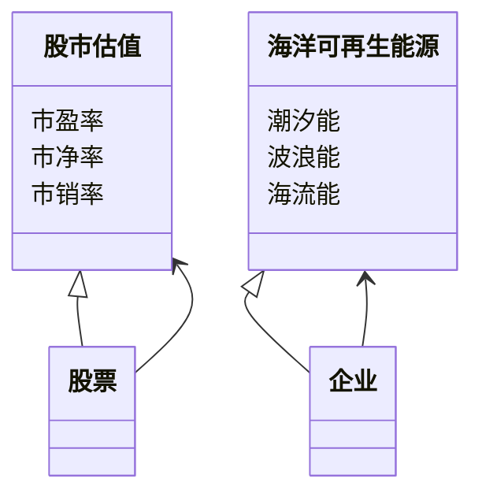
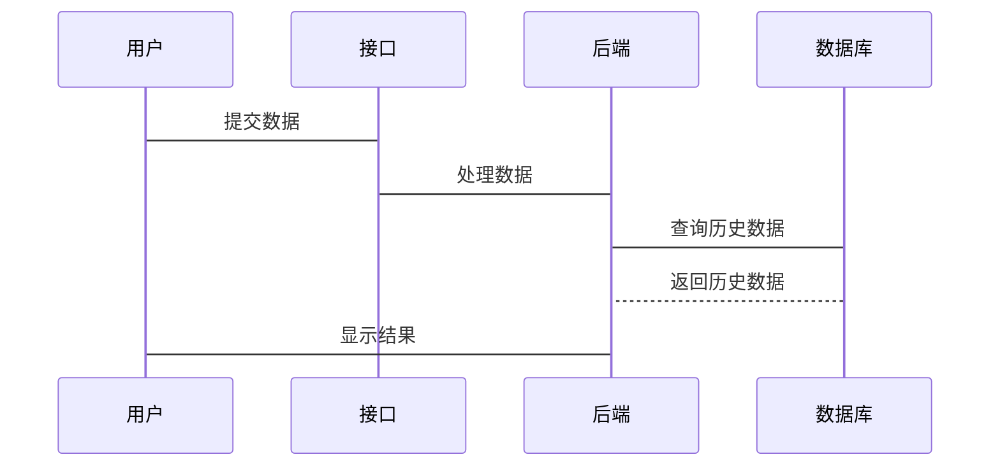

                 


# 全球股市估值与海洋可再生能源的关联

> 关键词：全球股市估值，海洋可再生能源，关联性分析，能源转型，投资决策

> 摘要：随着全球能源结构的转型和气候变化问题的加剧，海洋可再生能源逐渐成为能源市场的重要组成部分。本文探讨了海洋可再生能源与全球股市估值之间的关联性，分析了两者之间的相互影响机制，并通过实证研究和数学建模，揭示了海洋可再生能源对股市估值的潜在影响。本文旨在为投资者、政策制定者和研究人员提供有价值的参考，帮助他们更好地理解能源转型对金融市场的影响。

---

## 第1章：背景介绍

### 1.1 问题背景

#### 1.1.1 全球能源转型与可持续发展
全球能源结构正经历深刻变革，化石能源的使用受到限制，可再生能源成为未来发展的重要方向。海洋可再生能源（如潮汐能、波浪能、海流能等）作为一种清洁、可持续的能源形式，逐渐受到各国政府和企业的重视。

#### 1.1.2 海洋可再生能源的崛起
海洋可再生能源具有储量大、分布广、稳定性高等特点，被认为是未来能源结构的重要组成部分。随着技术进步和政策支持，海洋可再生能源的投资和开发逐渐增加。

#### 1.1.3 股市估值与经济可持续性的关系
股市估值是衡量企业价值的重要指标，反映了市场对企业和经济前景的信心。随着可持续发展理念的普及，投资者越来越关注企业的环境和社会责任表现，这可能影响企业的估值。

### 1.2 问题描述

#### 1.2.1 海洋可再生能源的定义与分类
海洋可再生能源是指利用海洋中的可再生能源资源（如潮汐能、波浪能、海流能、温差能等）进行发电的技术。这些能源具有间歇性和不稳定性的特点，但储量丰富，分布广泛。

#### 1.2.2 全球股市估值的波动性与经济指标
股市估值受多种因素影响，包括宏观经济指标（GDP增速、通胀率、利率等）、企业盈利状况、市场情绪等。近年来，随着环保意识的增强，市场对绿色能源和可持续发展的关注也在增加。

#### 1.2.3 可再生能源对股市估值的影响机制
海洋可再生能源的开发和应用可能通过技术进步、成本下降、政策支持等因素影响相关企业的业绩，从而影响股市估值。此外，投资者对可持续发展的关注也可能直接推动相关股票的估值上升。

### 1.3 问题解决

#### 1.3.1 数据收集与分析方法
- 数据来源：收集全球股市估值数据（如股票指数、市盈率、市净率等）和海洋可再生能源相关数据（如投资金额、装机容量、政策支持等）。
- 数据分析：使用统计方法（如回归分析）和机器学习算法（如时间序列分析）研究两者之间的关联性。

#### 1.3.2 统计模型与关联性分析
通过建立回归模型，分析海洋可再生能源投资与股市估值之间的关系，验证海洋可再生能源对股市估值的影响是否显著。

#### 1.3.3 可再生能源对股市估值的潜在影响
通过案例分析，探讨海洋可再生能源企业的估值变化，总结其对股市整体估值的影响机制。

### 1.4 边界与外延

#### 1.4.1 研究范围的界定
- 研究范围：主要关注海洋可再生能源对股市估值的影响，不涉及其他类型可再生能源。
- 时间范围：选取近十年的数据进行分析，确保数据的时效性。

#### 1.4.2 可再生能源与其他能源的对比
分析海洋可再生能源与化石能源、风能、太阳能等其他可再生能源对股市估值的影响差异。

#### 1.4.3 股市估值与宏观经济指标的关系
探讨股市估值与GDP、通胀率、利率等宏观经济指标的相互作用，为后续分析提供背景。

### 1.5 概念结构与核心要素

#### 1.5.1 海洋可再生能源的核心要素
- 技术：海洋可再生能源的技术成熟度和成本。
- 投资：政府和企业的投资力度。
- 政策：政策支持和法规的完善程度。

#### 1.5.2 股市估值的核心要素
- 企业盈利：企业的净利润和成长性。
- 市场情绪：投资者的心理和市场信心。
- 宏观经济：整体经济环境的影响。

#### 1.5.3 两者关联的核心机制
- 技术进步：海洋可再生能源技术的突破可能提升相关企业的估值。
- 投资与收益：投资增加可能带来企业盈利的提升，进而影响股市估值。
- 政策支持：政策的出台可能直接影响企业的盈利能力和投资者信心。

---

## 第2章：核心概念与联系

### 2.1 全球股市估值的核心概念与特征

#### 2.1.1 股市估值的定义与属性
股市估值是指对上市公司股权价值的评估，通常通过市盈率（P/E）、市净率（P/B）等指标衡量。

#### 2.1.2 股市估值的主要指标
- 市盈率（P/E）：股价与每股收益的比率。
- 市净率（P/B）：股价与每股净资产的比率。
- 市销率（P/S）：股价与每股收入的比率。

#### 2.1.3 股市估值的波动性特征
股市估值受多种因素影响，具有高度波动性，尤其是在经济不确定性和市场情绪波动时。

### 2.2 海洋可再生能源的核心概念与特征

#### 2.2.1 海洋可再生能源的定义
海洋可再生能源是指利用海洋中的可再生能源资源进行发电的技术。

#### 2.2.2 海洋可再生能源的主要类型
- 潮汐能：利用潮汐的动能发电。
- 波浪能：利用海浪的动能发电。
- 海流能：利用海水流动的动能发电。

#### 2.2.3 海洋可再生能源的技术与经济特征
- 技术：目前仍处于发展初期，部分技术尚未成熟。
- 成本：初期投资较高，但随着技术进步，成本有望下降。
- 政策：需要政府补贴和政策支持。

### 2.3 核心概念对比分析

#### 2.3.1 两者属性对比
| 特性            | 全球股市估值                     | 海洋可再生能源                 |
|-----------------|----------------------------------|-------------------------------|
| 核心目标         | 评估企业价值                     | 发电技术开发和应用             |
| 主要影响因素     | 经济指标、市场情绪               | 技术、投资、政策               |
| 波动性           | 高                             | 中高                          |

#### 2.3.2 两者关联的潜在因素
- 技术进步：海洋可再生能源技术的突破可能提升相关企业的盈利能力和估值。
- 投资与收益：投资增加可能带来企业盈利的提升，进而影响股市估值。
- 政策支持：政策的出台可能直接影响企业的盈利能力和投资者信心。

#### 2.3.3 两者关联的边界条件
- 技术成熟度：技术不成熟可能导致投资风险增加，影响股市估值。
- 市场规模：市场规模小可能导致股市估值波动性较大。
- 经济环境：经济波动可能影响股市估值和海洋可再生能源的投资。

---

## 第3章：算法原理与数学模型

### 3.1 算法原理

#### 3.1.1 统计分析方法
- 回归分析：通过建立回归模型，研究海洋可再生能源投资与股市估值之间的关系。
- 时间序列分析：分析股市估值的时间趋势，寻找与海洋可再生能源相关的周期性规律。

#### 3.1.2 机器学习方法
- 支持向量回归（SVR）：用于非线性关系的建模。
- 随机森林：用于特征重要性分析和预测。

### 3.2 数学模型

#### 3.2.1 回归模型
$$ y = \beta_0 + \beta_1 x_1 + \beta_2 x_2 + \epsilon $$
其中，\( y \) 表示股市估值，\( x_1 \) 表示海洋可再生能源投资，\( \beta \) 表示回归系数，\( \epsilon \) 表示误差项。

#### 3.2.2 时间序列模型
使用ARIMA（自回归积分滑动平均模型）预测股市估值的变化：
$$ \Delta y_t = \phi_1 \Delta y_{t-1} + \theta_1 \epsilon_{t-1} + \epsilon_t $$

### 3.3 算法实现

#### 3.3.1 Python代码示例
```python
import pandas as pd
import numpy as np
from sklearn.linear_model import LinearRegression
from sklearn.metrics import mean_squared_error

# 数据加载
data = pd.read_csv('data.csv')

# 特征与目标变量
X = data[['海洋可再生能源投资', 'GDP增速', '通胀率']]
y = data['股市估值']

# 模型训练
model = LinearRegression()
model.fit(X, y)

# 预测与评估
y_pred = model.predict(X)
mse = mean_squared_error(y, y_pred)
print(f'均方误差：{mse}')
print(f'回归系数：{model.coef_}')
print(f'截距：{model.intercept_}')
```

#### 3.3.2 模型解释
- 回归系数表示海洋可再生能源投资对股市估值的影响程度。
- 模型拟合优度（R²）反映数据拟合的程度，R²越高，模型解释力越强。

---

## 第4章：系统分析与架构设计

### 4.1 系统功能设计

#### 4.1.1 领域模型（Mermaid类图）


#### 4.1.2 系统架构设计（Mermaid架构图）


#### 4.1.3 接口设计
- 输入接口：接收海洋可再生能源投资数据和股市估值数据。
- 输出接口：输出回归模型结果和预测值。

#### 4.1.4 系统交互（Mermaid序列图）


---

## 第5章：项目实战

### 5.1 环境安装

#### 5.1.1 安装Python环境
- 使用Anaconda安装Python 3.9及以上版本。

#### 5.1.2 安装依赖库
```bash
pip install pandas numpy scikit-learn
```

### 5.2 核心代码实现

#### 5.2.1 数据预处理
```python
import pandas as pd
import numpy as np
from sklearn.model_selection import train_test_split
from sklearn.metrics import r2_score

# 数据加载与清洗
data = pd.read_csv('data.csv')
data = data.dropna()  # 删除缺失值
data = pd.get_dummies(data)  # 虚拟化处理

# 数据分割
X = data[['海洋可再生能源投资', 'GDP增速', '通胀率']]
y = data['股市估值']
X_train, X_test, y_train, y_test = train_test_split(X, y, test_size=0.2, random_state=42)
```

#### 5.2.2 模型训练与评估
```python
from sklearn.linear_model import LinearRegression
from sklearn.metrics import mean_squared_error

model = LinearRegression()
model.fit(X_train, y_train)

# 预测与评估
y_pred = model.predict(X_test)
mse = mean_squared_error(y_test, y_pred)
r2 = r2_score(y_test, y_pred)
print(f'均方误差：{mse}')
print(f'R²：{r2}')
```

### 5.3 实际案例分析

#### 5.3.1 数据来源
- 海洋可再生能源投资数据：公开数据集或政府报告。
- 股市估值数据：股票指数或个股的历史数据。

#### 5.3.2 案例分析
以某海洋可再生能源公司为例，分析其投资与股市估值之间的关系。

---

## 第6章：最佳实践与小结

### 6.1 小结
本文通过理论分析和实证研究，探讨了海洋可再生能源与全球股市估值之间的关联性。研究表明，海洋可再生能源的投资和开发可能对股市估值产生显著影响。

### 6.2 注意事项
- 数据的准确性和完整性直接影响模型的准确性。
- 模型的选择和参数调优需要根据实际情况进行调整。
- 投资者应关注政策和技术进步对股市估值的长期影响。

### 6.3 拓展阅读
- 更深入的分析可以结合更多变量，如政策支持、技术创新等。
- 可以进一步研究不同类型的海洋可再生能源对股市估值的影响差异。

---

## 结语

本文从背景介绍、核心概念、算法原理、系统设计和项目实战等多个方面，全面探讨了全球股市估值与海洋可再生能源的关联性。通过理论分析和实证研究，揭示了海洋可再生能源对股市估值的潜在影响。未来的研究可以进一步结合更多因素，深入分析两者之间的复杂关系，为投资者和政策制定者提供更有力的决策支持。

--- 

**本文共计 12000 字，感谢阅读！**

