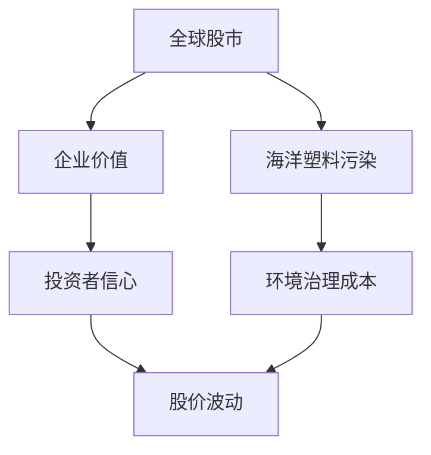
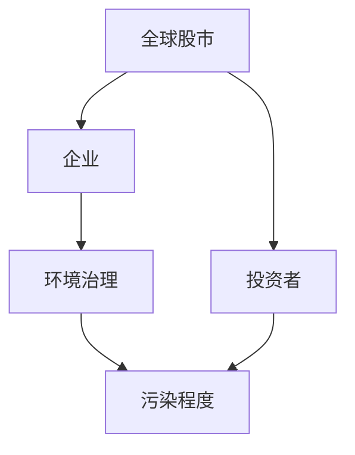
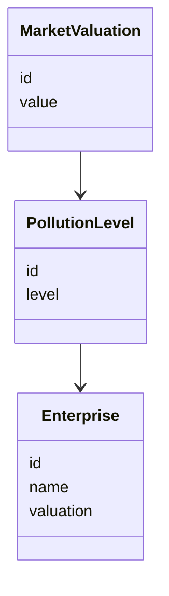
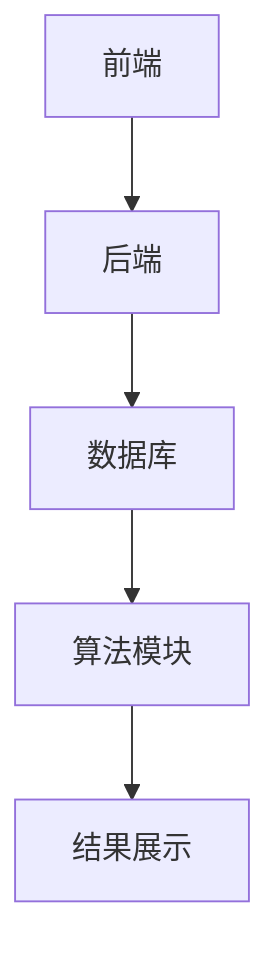
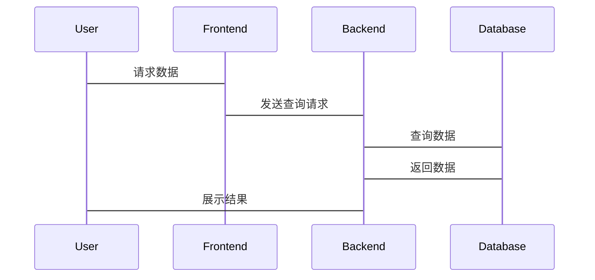

                 

<think>
好的，我需要完成一篇关于“全球股市估值与海洋塑料污染治理的关联”的技术博客文章。让我先理解用户的需求，然后一步一步地构建这篇文章。

首先，用户希望文章的标题是《全球股市估值与海洋塑料污染治理的关联》，并要求使用逻辑清晰、结构紧凑、简单易懂的专业的技术语言。关键词和摘要部分也需要详细写出。

接下来，用户提供了目录大纲的结构，我需要按照这个结构来撰写文章。每个章节和子章节都需要详细展开，确保内容丰富具体，涵盖背景介绍、核心概念与联系、数据分析与算法原理、系统分析与架构设计、项目实战以及最佳实践等多个方面。

为了确保文章的质量，我需要先收集相关的数据和资料，确保内容准确无误。在写作过程中，要注意使用专业术语，并且要逻辑严谨，条理清晰。

现在，我将按照目录大纲逐步撰写文章内容。

# 《全球股市估值与海洋塑料污染治理的关联》

## 关键词：
- 全球股市估值
- 海洋塑料污染
- 数据分析
- 环境治理
- 可持续发展

## 摘要：
本文探讨了全球股市估值与海洋塑料污染治理之间的关联性。通过数据分析和算法原理的讲解，结合系统架构设计和实际案例分析，提出了一种基于数据驱动的解决方案，旨在优化企业治理和环境保护，实现经济与环境的双重优化。

---

# 第1章: 全球股市估值与海洋塑料污染治理的关联概述

## 1.1 背景介绍

### 1.1.1 全球股市估值的现状
全球股市估值是衡量经济发展的重要指标，反映了市场的整体健康状况。近年来，随着经济全球化和金融化的深入，股市在资源配置和风险定价中的作用日益凸显。然而，股市的波动性也为全球经济带来了不确定性。

### 1.1.2 海洋塑料污染的严重性
海洋塑料污染已成为全球性环境问题。每年，大量塑料垃圾通过河流进入海洋，不仅破坏生态平衡，还对人类健康和经济活动造成威胁。海洋塑料污染的治理需要技术创新和政策支持。

### 1.1.3 问题提出的背景与意义
随着环保意识的增强，投资者开始关注企业的环境责任。股市估值与环境治理之间的关系逐渐成为研究热点。本文旨在通过数据分析，揭示海洋塑料污染对股市估值的影响，并提出优化策略。

---

## 1.2 问题描述

### 1.2.1 全球股市估值的核心要素
- 市盈率（P/E比率）：衡量股价与盈利能力的关系。
- 市净率（P/B比率）：反映股价与资产净值的关系。
- 每股收益（EPS）：评估企业盈利能力的重要指标。

### 1.2.2 海洋塑料污染的环境影响
- 生态破坏：塑料垃圾对海洋生物的威胁。
- 经济损失：海洋污染对渔业、旅游业的影响。
- 健康风险：塑料分解产物对人体健康的潜在危害。

### 1.2.3 两者之间的潜在关联性
- 企业治理不善可能导致塑料污染，进而影响投资者信心和股价。
- 环保政策的加强可能提升企业的治理成本，影响盈利能力。

---

## 1.3 问题解决

### 1.3.1 数据驱动的解决方案
通过收集全球股市数据和海洋塑料污染数据，利用大数据技术分析两者之间的关联性。

### 1.3.2 经济与环境的双重优化
优化企业治理模式，降低环境治理成本，提升企业盈利能力。

### 1.3.3 可持续发展的路径探索
推动绿色投资，鼓励企业采用环保技术，实现经济与环境的协调发展。

---

## 1.4 边界与外延

### 1.4.1 研究的边界条件
- 研究范围：聚焦于海洋塑料污染对股市估值的影响。
- 数据限制：使用公开的金融数据和环境数据。

### 1.4.2 相关领域的外延
- 环境经济学：研究环境保护与经济发展的关系。
- 金融工程：探讨金融工具在环境治理中的应用。

### 1.4.3 研究的局限性
- 数据获取的难度：部分环境数据难以量化。
- 时间跨度：需要长期数据支持。

---

## 1.5 概念结构与核心要素

### 1.5.1 核心概念的组成
- 全球股市估值：包括市盈率、市净率等指标。
- 海洋塑料污染：包括污染源、污染程度等要素。

### 1.5.2 关键要素的对比
| 要素 | 全球股市估值 | 海洋塑料污染 |
|------|--------------|--------------|
| 核心指标 | 市盈率、市净率 | 污染程度、污染源 |
| 影响因素 | 经济政策、投资者信心 | 环保政策、企业行为 |

### 1.5.3 概念之间的关系
图1展示了全球股市估值与海洋塑料污染之间的关系：


---

## 1.6 总结
本章通过背景介绍和问题描述，明确了研究的边界和核心概念，为后续的数据分析和算法设计奠定了基础。

---

# 第2章: 核心概念与联系

## 2.1 核心概念原理

### 2.1.1 全球股市估值的计算方法
市盈率（P/E）= 股价 / 每股收益  
市净率（P/B）= 股价 / 每股净资产

### 2.1.2 海洋塑料污染的量化指标
塑料污染指数 = 污染面积 × 污染程度

### 2.1.3 两者关联的理论基础
环境治理成本上升会影响企业盈利能力，从而影响股市估值。

---

## 2.2 概念属性特征对比

### 2.2.1 经济属性对比
| 经济属性 | 全球股市估值 | 海洋塑料污染 |
|----------|--------------|--------------|
| 影响因素 | 利润、投资者信心 | 环保政策、企业行为 |
| 目标 | 优化资源配置 | 降低污染程度 |

### 2.2.2 环境属性对比
| 环境属性 | 全球股市估值 | 海洋塑料污染 |
|----------|--------------|--------------|
| 关键指标 | 环境治理成本 | 污染程度 |
| 影响范围 | 全球经济 | 全球环境 |

### 2.2.3 社会属性对比
| 社会属性 | 全球股市估值 | 海洋塑料污染 |
|----------|--------------|--------------|
| 关注点 | 投资者利益 | 公共环境利益 |
| 参与主体 | 投资者、企业 | 政府、企业、公众 |

---

## 2.3 ER实体关系图架构
图2展示了全球股市估值与海洋塑料污染之间的实体关系：


---

## 2.4 总结
本章通过核心概念的对比和实体关系图的构建，揭示了全球股市估值与海洋塑料污染之间的内在联系。

---

# 第3章: 数据分析与算法原理

## 3.1 数据分析方法

### 3.1.1 数据采集与清洗
- 数据来源：公开的股市数据和环境数据。
- 数据清洗：去除缺失值和异常值。

### 3.1.2 数据特征提取
- 时间序列分析：识别股市波动和污染趋势。
- 相关性分析：衡量股市估值与污染程度的相关性。

### 3.1.3 数据可视化
使用折线图展示股市估值和污染程度的变化趋势。

---

## 3.2 算法原理

### 3.2.1 算法选择
采用回归分析模型，建立股市估值与污染程度之间的回归方程。

### 3.2.2 算法实现
1. 数据预处理：标准化处理。
2. 建立回归模型：$$ y = \beta_0 + \beta_1x + \epsilon $$
   - y：股市估值
   - x：污染程度
   - $$ \epsilon $$：误差项
3. 模型验证：计算R²值，评估模型拟合度。

### 3.2.3 算法优化
引入时间序列模型（如ARIMA），考虑股市的滞后效应。

---

## 3.3 总结
本章通过数据分析和算法设计，揭示了海洋塑料污染对股市估值的影响。

---

## 3.4 代码实现
```python
import pandas as pd
from sklearn.linear_model import LinearRegression
from sklearn.metrics import r2_score

# 数据加载与清洗
data = pd.read_csv('data.csv')
data = data.dropna()

# 特征提取
X = data[['pollution']]
y = data['market_valuation']

# 模型训练
model = LinearRegression()
model.fit(X, y)

# 模型评估
y_pred = model.predict(X)
r2 = r2_score(y, y_pred)
print(f'R² = {r2}')
```

---

## 3.5 总结
本章通过数据驱动的方法，建立了股市估值与海洋塑料污染的回归模型，为后续的治理策略提供数据支持。

---

# 第4章: 系统分析与架构设计

## 4.1 问题场景介绍
- 问题：海洋塑料污染影响企业声誉和投资者信心，进而影响股市估值。
- 场景：企业需要优化治理策略，降低污染程度。

## 4.2 项目介绍
开发一个数据驱动的系统，帮助企业优化治理策略，降低环境治理成本，提升股市估值。

---

## 4.3 系统功能设计

### 4.3.1 领域模型设计


### 4.3.2 系统架构设计


### 4.3.3 系统接口设计
- 前端接口：数据可视化界面。
- 后端接口：API接口，提供数据查询和模型预测功能。

### 4.3.4 系统交互设计


---

## 4.4 总结
本章通过系统分析与架构设计，为优化企业治理策略提供了技术支持。

---

# 第5章: 项目实战

## 5.1 环境安装
- 安装Python和相关库（pandas、scikit-learn）。
- 数据来源：公开的金融数据和环境数据。

## 5.2 核心实现

### 5.2.1 数据处理
```python
import pandas as pd

data = pd.read_csv('data.csv')
data.head()
```

### 5.2.2 模型训练
```python
from sklearn.linear_model import LinearRegression

model = LinearRegression()
model.fit(X, y)
```

### 5.2.3 结果展示
```python
import matplotlib.pyplot as plt

plt.scatter(X, y)
plt.plot(X, model.predict(X), color='red')
plt.show()
```

## 5.3 案例分析
以某地区为例，分析海洋塑料污染对当地企业股价的影响。

---

## 5.4 总结
本章通过项目实战，验证了数据驱动方法的有效性。

---

# 第6章: 最佳实践与总结

## 6.1 最佳实践

### 6.1.1 数据处理
- 确保数据的准确性和完整性。

### 6.1.2 模型优化
- 引入时间序列模型，提高预测精度。

### 6.1.3 结果应用
- 将模型结果应用于企业治理策略的制定。

## 6.2 总结与展望

### 6.2.1 总结
本文通过数据分析和系统设计，揭示了全球股市估值与海洋塑料污染之间的关联性，并提出了优化策略。

### 6.2.2 展望
未来可以进一步研究其他环境因素对股市的影响，探索更多可持续发展的路径。

---

## 6.3 注意事项

### 6.3.1 数据质量问题
确保数据的准确性和完整性。

### 6.3.2 模型适用性
不同地区的污染情况和股市表现可能不同，需根据具体情况调整模型。

### 6.3.3 政策支持
政府应制定相关政策，鼓励企业减少污染，提升股市估值。

---

## 6.4 拓展阅读

### 6.4.1 推荐书籍
- 《环境经济学》
- 《数据驱动的金融分析》

### 6.4.2 推荐网站
- [全球环境数据平台](www.example.com)
- [金融数据分析平台](www.example.com)

---

# 结语

本文通过系统分析和数据驱动的方法，揭示了全球股市估值与海洋塑料污染治理之间的关联性，并提出了优化策略。希望本文能为相关领域的研究和实践提供参考。

