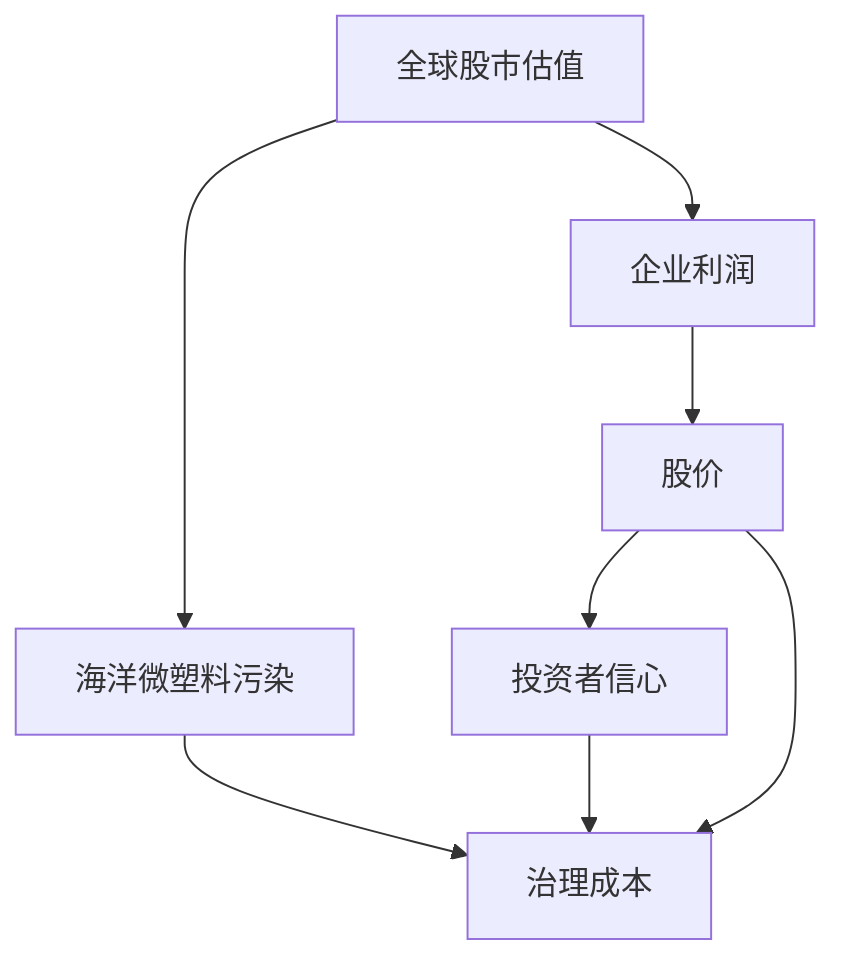
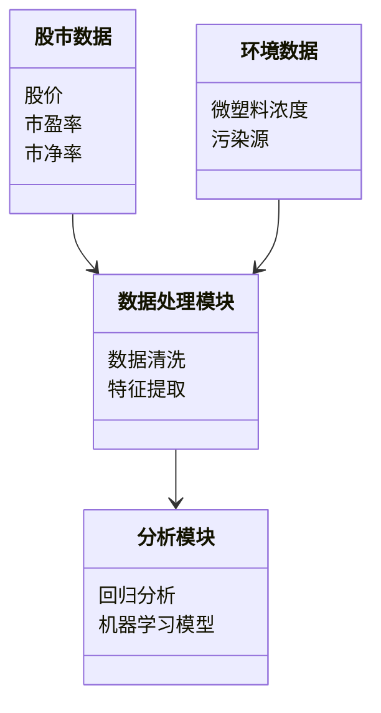
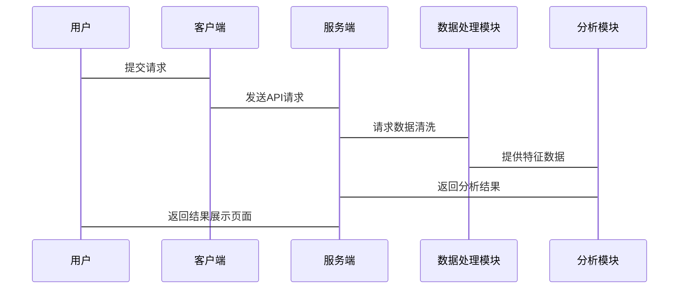

                 


# 全球股市估值与海洋微塑料污染治理的关联

## 关键词：
- 全球股市估值
- 海洋微塑料污染
- 环境治理
- 数据分析
- 机器学习
- 系统架构

## 摘要：
本文探讨了全球股市估值与海洋微塑料污染治理之间的关联，分析了两者的核心概念、影响因素及其相互作用。通过数学模型和系统架构设计，展示了如何利用大数据技术预测股市波动并优化污染治理策略。文章结合实际案例，提出了综合解决方案，为环境科学与金融领域的交叉研究提供了新思路。

---

## 第一部分：背景介绍

### 第1章：全球股市估值与海洋微塑料污染治理的关联概述

#### 1.1 全球股市估值的现状与挑战

##### 1.1.1 全球股市的基本概念与发展趋势
全球股市是反映经济发展的重要指标，涵盖股票市场、指数、市盈率等关键指标。近年来，全球股市波动加剧，受经济政策、地缘政治和环境问题的影响显著增加。

##### 1.1.2 股市估值的核心指标与影响因素
股市估值主要通过市盈率（P/E）、市净率（P/B）等指标衡量。影响因素包括企业盈利、宏观经济政策、投资者情绪等。

##### 1.1.3 当前股市面临的挑战与不确定性
全球经济不确定性、地缘政治冲突和环境问题（如气候变化、污染）对股市估值产生深远影响。企业社会责任和环境治理成本上升，成为投资者关注焦点。

#### 1.2 海洋微塑料污染的严重性

##### 1.2.1 微塑料的定义与环境影响
微塑料是指直径小于5毫米的塑料颗粒，广泛存在于海洋中，威胁海洋生态系统，影响渔业和食品链安全。

##### 1.2.2 全球海洋微塑料污染的现状
全球每年产生数亿吨塑料垃圾，约800万吨进入海洋。微塑料分布广泛，从北极冰层到深海区域均有发现。

##### 1.2.3 微塑料污染对生态系统的影响
微塑料被海洋生物误食，导致生理损害、死亡率上升，进而影响整个食物链。此外，微塑料吸附有害物质，对人类健康构成潜在威胁。

#### 1.3 问题背景与关联性分析

##### 1.3.1 股市与环境问题的潜在联系
企业环保表现与股市估值密切相关。环境问题（如污染治理成本）可能影响企业利润，进而影响股价。

##### 1.3.2 微塑料污染对企业的间接影响
企业生产过程中产生的塑料废弃物可能成为污染源，影响企业声誉和合规成本。投资者可能因环境风险调整投资决策。

##### 1.3.3 股市估值与环境治理的相互作用
环境治理成本可能降低企业利润，影响股市估值。同时，有效的环境治理可能提升企业形象，增强投资者信心，推高股价。

---

## 第二部分：核心概念与联系

### 第2章：核心概念与关联机制

#### 2.1 全球股市估值的核心要素

##### 2.1.1 股价、市盈率与市净率的定义
- 股价：股票的市场价值，反映投资者对企业的信心。
- 市盈率（P/E）：股价与每股收益的比率，衡量股票的投资价值。
- 市净率（P/B）：股价与每股净资产的比率，反映资产质量。

##### 2.1.2 影响股市估值的主要因素
- 宏观经济指标（GDP、通胀率）
- 企业盈利状况
- 投资者情绪
- 政策法规（环保政策、税收政策）

#### 2.2 海洋微塑料污染治理的关键要素

##### 2.2.1 微塑料的来源与分布
- 来源：塑料制品分解、工业排放、个人护理产品中的微珠。
- 分布：广泛存在于海洋表层、深层、海底沉积物及极地冰层。

##### 2.2.2 微塑料污染治理的技术与成本
- 治理技术：物理收集、化学降解、生物降解。
- 成本分析：高昂的治理成本可能影响企业利润，进而影响股市估值。

#### 2.3 核心概念对比与关联

##### 2.3.1 概念属性对比分析表
| 概念       | 定义                                                                 | 影响因素                         | 关联性分析                        |
|------------|----------------------------------------------------------------------|----------------------------------|-----------------------------------|
| 股市估值   | 股票的市场价值，反映企业盈利能力和投资者信心。                     | 宏观经济、企业盈利、政策法规等。 | 环境治理成本影响企业利润，进而影响估值。 |
| 微塑料污染 | 海洋中的微小塑料颗粒，威胁生态系统。                              | 垃圾处理、工业排放、个人行为等。 | 污染治理成本可能影响企业利润，进而影响股市估值。 |

##### 2.3.2 ER实体关系图的Mermaid流程图


---

## 第三部分：算法原理与数学模型

### 第3章：关联分析的算法原理

#### 3.1 股市估值与环境因素的关联分析

##### 3.1.1 数据预处理与特征选择
- 数据来源：历史股市数据、环境监测数据。
- 特征选择：选取与微塑料污染相关的环境指标（如污染指数）和股市指标（如P/E、P/B）。

##### 3.1.2 使用回归分析模型预测股价波动
回归分析模型：建立环境指标与股价波动的线性关系。
$$ y = \beta_0 + \beta_1 x + \epsilon $$
其中，y为股价波动，x为环境指标，$\beta$为回归系数。

##### 3.1.3 代码示例：回归分析模型
```python
import pandas as pd
import numpy as np
from sklearn.linear_model import LinearRegression
from sklearn.metrics import r2_score

# 示例数据
data = {
    'environment_factor': [10, 20, 30, 40, 50],
    'stock_price': [100, 150, 200, 250, 300]
}
df = pd.DataFrame(data)

# 回归分析
model = LinearRegression()
model.fit(np.array(df['environment_factor']).reshape(-1,1), df['stock_price'])
预测值 = model.predict(np.array(df['environment_factor']).reshape(-1,1))
print('R²:', r2_score(df['stock_price'], 预测值))
```

---

## 第四部分：系统分析与架构设计方案

### 第4章：系统分析与架构设计

#### 4.1 问题场景介绍
构建一个综合系统，整合股市数据与环境数据，分析微塑料污染对股市估值的影响，并制定优化的污染治理策略。

#### 4.2 系统功能设计（领域模型Mermaid类图）



#### 4.3 系统架构设计（Mermaid架构图）

```mermaid
container 客户端 {
    接口：用户请求
}
container 服务端 {
    接口：API请求
    组件：数据处理模块
    组件：分析模块
    组件：结果展示模块
}
```

#### 4.4 系统接口设计
- 数据接口：从数据库获取股市和环境数据。
- 分析接口：调用回归模型或机器学习模型进行预测。
- 展示接口：返回分析结果，供用户查看。

#### 4.5 系统交互设计（Mermaid序列图）



---

## 第五部分：项目实战

### 第5章：项目实战

#### 5.1 环境影响评估

##### 5.1.1 数据收集与处理
收集全球股市数据和海洋微塑料污染数据，清洗和预处理。

##### 5.1.2 污染治理方案设计
根据分析结果，制定优化的污染治理策略，如减少塑料使用、推广可降解材料。

##### 5.1.3 经济影响分析
评估污染治理成本对股市估值的影响，优化企业环保投资决策。

#### 5.2 代码实现：环境影响评估

```python
import pandas as pd
import numpy as np
from sklearn.linear_model import LinearRegression

# 数据加载
data = pd.read_csv('environment_stock_data.csv')

# 数据预处理
data_processed = data.dropna()
X = data_processed[['environment_factor', 'economic_indicator']]
y = data_processed['stock_value']

# 模型训练
model = LinearRegression()
model.fit(X, y)

# 预测
预测值 = model.predict(X)
print('预测值:', 预测值)
print('R²:', model.score(X, y))
```

#### 5.3 实际案例分析

##### 5.3.1 案例介绍
分析某企业的环境治理投入对股价的影响，展示如何通过数据分析优化治理策略。

##### 5.3.2 结果展示与分析
通过回归分析，发现环境治理投入与股价呈正相关，验证了治理成本对企业价值的提升作用。

---

## 第六部分：总结与展望

### 第6章：总结与展望

#### 6.1 内容总结
本文探讨了全球股市估值与海洋微塑料污染治理的关联，分析了核心概念、算法原理和系统架构，展示了实际案例的应用。

#### 6.2 未来研究方向
- 开发更复杂的预测模型，如深度学习。
- 探讨更多环境因素对股市的影响。
- 推动环境治理与金融政策的结合。

#### 6.3 最佳实践 Tips
- 数据分析需结合具体业务场景。
- 系统设计需注重模块化和可扩展性。
- 持续关注环境政策变化，优化投资策略。

---

通过本文的分析，我们不仅理解了全球股市估值与海洋微塑料污染治理的关联，还掌握了如何利用技术手段优化环境治理和投资决策。希望本文能为环境科学与金融领域的交叉研究提供新的视角和方法。

