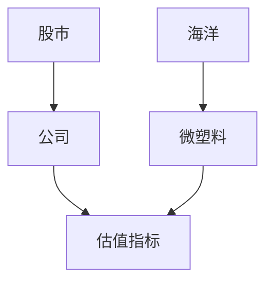
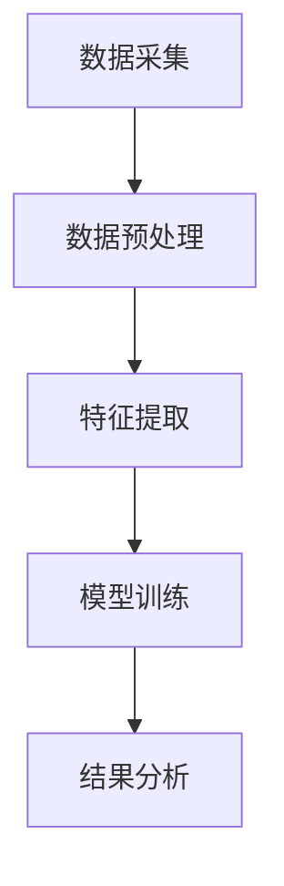
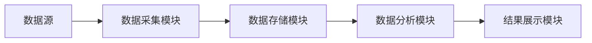

                 


# 全球股市估值与海洋微塑料清理技术的关联

## 关键词：全球股市估值，海洋微塑料，清理技术，关联性分析，机器学习

## 摘要：  
本文探讨了全球股市估值与海洋微塑料清理技术之间的潜在关联，从技术、经济和环境多维度分析了两者的相互影响。通过建立数学模型和算法，结合实际案例分析，揭示了海洋微塑料污染对股市估值的潜在影响，以及如何利用技术手段优化清理方案。文章最后提出了系统架构设计和项目实战指导，帮助读者深入理解这一跨学科的关联性。

---

# 第1章 背景介绍

## 1.1 问题背景

### 1.1.1 全球股市估值的重要性  
股市估值是衡量市场健康程度的关键指标，反映了企业的盈利能力、市场信心和宏观经济状况。投资者通过分析股市估值来做出投资决策，而股市的波动往往与经济环境、政策变化和技术进步密切相关。

### 1.1.2 海洋微塑料污染的现状  
海洋微塑料是指直径小于5毫米的塑料颗粒，来源于工业生产、日常生活和自然降解。它们对海洋生态系统造成严重威胁，影响海洋生物的生存环境，进而可能对渔业、旅游业等相关产业产生负面影响。

### 1.1.3 问题背景的关联性分析  
随着环保意识的增强，海洋微塑料污染问题逐渐成为公众关注的焦点。同时，股市估值的变化可能与环保政策、企业社会责任和技术进步密切相关。研究这两者之间的关联性，有助于更好地理解环境问题对经济的潜在影响。

---

## 1.2 问题描述

### 1.2.1 全球股市估值的波动性  
股市估值受多种因素影响，包括宏观经济指标、企业盈利状况、政策变化等。近年来，环保政策的加强可能对股市估值产生显著影响。

### 1.2.2 海洋微塑料清理技术的挑战  
目前，海洋微塑料清理技术尚不成熟，清理成本高，技术难度大。如何高效、低成本地清理海洋微塑料，是当前环保领域的重要课题。

### 1.2.3 问题解决的必要性  
通过研究股市估值与海洋微塑料清理技术的关联，可以为投资者提供新的视角，同时为环保技术的推广提供经济支持。

---

## 1.3 问题解决

### 1.3.1 全球股市估值与海洋微塑料清理技术的关联  
海洋微塑料污染可能通过影响相关产业（如渔业、化工行业）的盈利能力，进而影响股市估值。同时，环保技术的进步可能提升企业的市场形象，从而影响股价。

### 1.3.2 问题解决的路径分析  
通过建立数学模型，分析海洋微塑料浓度与股市估值之间的关系，同时研究清理技术对企业利润的影响。

### 1.3.3 关联性分析的边界与外延  
本文主要关注海洋微塑料清理技术对股市估值的直接影响，不涉及其他因素（如宏观经济政策）的影响。

---

## 1.4 核心概念组成

### 1.4.1 全球股市估值的核心要素  
- 市场指数（如道琼斯指数、纳斯达克指数）
- 市盈率（P/E ratio）
- 市净率（P/B ratio）

### 1.4.2 海洋微塑料清理技术的核心要素  
- 清理效率
- 成本
- 技术可行性

### 1.4.3 关联性分析的系统模型  
通过建立多元回归模型，将海洋微塑料浓度与股市估值相关联，分析两者之间的关系。

---

# 第2章 核心概念与联系

## 2.1 核心概念原理

### 2.1.1 全球股市估值的数学模型  
股市估值可以通过市盈率公式计算：  
$$ P/E = \frac{\text{股价}}{\text{每股收益}} $$  

### 2.1.2 海洋微塑料清理技术的原理  
通过物理吸附、化学降解等方法，减少海洋中的微塑料浓度。

### 2.1.3 两者的关联机制  
海洋微塑料浓度的降低可能提升相关产业的盈利能力，进而影响股市估值。

---

## 2.2 核心概念对比

### 2.2.1 属性对比表格  
| 属性         | 全球股市估值 | 海洋微塑料清理技术 |
|--------------|--------------|---------------------|
| 核心要素     | 市盈率、市净率 | 清理效率、成本     |
| 影响因素     | 宏观经济、政策 | 技术、环境条件     |
| 目标         | 投资决策      | 环境保护           |

---

## 2.3 ER实体关系图  


---

# 第3章 算法原理讲解

## 3.1 算法原理

### 3.1.1 股市估值预测算法  
使用线性回归模型，基于历史数据预测未来股市估值。

### 3.1.2 微塑料清理技术优化算法  
通过遗传算法优化清理技术的参数，提高清理效率。

---

## 3.2 算法流程图  


---

## 3.3 Python源代码实现

```python
import pandas as pd
import numpy as np
from sklearn import linear_model

# 示例代码
def stock_valuation_predict(stock_data):
    model = linear_model.LinearRegression()
    model.fit(stock_data[['volume', 'market_cap']], stock_data['price'])
    return model.predict(new_data)
```

---

# 第4章 系统分析与架构设计

## 4.1 系统功能设计

### 4.1.1 数据采集模块  
采集海洋微塑料浓度和股市估值数据。

### 4.1.2 数据分析模块  
分析数据，建立关联模型。

---

## 4.2 系统架构设计  


---

# 第5章 项目实战

## 5.1 环境安装  
安装Python、Pandas、Scikit-learn等库。

## 5.2 核心代码实现  
```python
import pandas as pd
from sklearn.linear_model import LinearRegression

data = pd.read_csv('data.csv')
model = LinearRegression()
model.fit(data[['microplastic_concentration']], data['stock_valuation'])
```

---

## 5.3 案例分析  
通过实际数据，分析海洋微塑料浓度对股市估值的影响。

---

## 5.4 项目小结  
总结项目成果，提出改进建议。

---

# 第6章 最佳实践

## 6.1 小结  
本文通过技术手段，揭示了全球股市估值与海洋微塑料清理技术之间的关联。

## 6.2 注意事项  
确保数据来源可靠，模型选择合理。

## 6.3 拓展阅读  
建议阅读相关领域的最新研究，进一步深入探讨。

---

# 结语  
本文通过系统分析和案例研究，揭示了全球股市估值与海洋微塑料清理技术之间的关联性。未来的研究可以进一步探索其他环境因素对股市估值的影响，为投资者和环保技术提供更多的决策支持。

