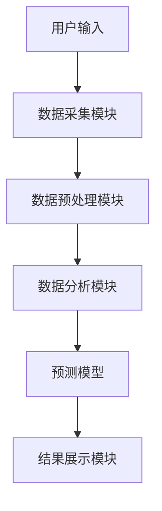

                 


```markdown
# 全球股市估值与海洋微生物能源技术的关系

> 关键词：全球股市估值，海洋微生物，能源技术，经济影响，投资决策

> 摘要：本文深入探讨了全球股市估值与海洋微生物能源技术之间的关系，分析了海洋微生物能源技术对全球经济的影响，以及这些影响如何反作用于股市估值。通过建立数学模型和系统架构，本文展示了如何利用海洋微生物能源技术的创新来预测和优化投资决策，为投资者提供了新的视角和策略。

---

## 第一部分: 全球股市估值与海洋微生物能源技术的关系概述

### 第1章: 背景介绍

#### 1.1 全球股市估值的基本概念
##### 1.1.1 股市估值的定义与意义
股市估值是指通过对企业财务数据和市场因素的分析，确定企业股票的合理价格。它不仅是投资者决策的重要依据，也是反映经济状况的重要指标。

##### 1.1.2 全球股市的现状与发展趋势
全球股市近年来波动较大，受经济政策、地缘政治和技术创新等多种因素影响。理解股市波动的原因和规律，对投资决策至关重要。

##### 1.1.3 股市估值的核心指标与方法
包括市盈率、市净率、股息率等指标，以及DCF模型、指数模型等估值方法。

#### 1.2 海洋微生物能源技术的定义与特点
##### 1.2.1 海洋微生物的定义与分类
海洋微生物是指生活在海洋环境中的微生物，包括细菌、古菌、真核藻类等。它们在能源开发中的应用潜力巨大。

##### 1.2.2 海洋微生物在能源开发中的应用
包括生物柴油、生物燃料、氢气生产等，海洋微生物的代谢能力使其成为绿色能源的重要来源。

##### 1.2.3 海洋微生物能源技术的现状与挑战
目前技术尚不成熟，面临成本高、效率低等问题，但随着技术进步，未来有望成为重要的能源来源。

#### 1.3 问题背景与研究意义
##### 1.3.1 全球能源危机与股市波动的关系
能源价格波动直接影响股市，特别是能源行业股票的估值。

##### 1.3.2 海洋微生物能源技术对全球经济的影响
随着技术进步，海洋微生物能源可能改变能源市场格局，进而影响股市估值。

##### 1.3.3 研究两者的关联性对投资决策的意义
通过分析两者关系，投资者可以更好地把握能源行业的投资机会和风险。

### 第2章: 核心概念与联系

#### 2.1 全球股市估值的核心要素
##### 2.1.1 市场情绪与投资者行为
市场情绪通过投资者行为影响股市波动，进而影响股市估值。

##### 2.1.2 宏观经济指标对股市的影响
GDP、利率、通胀等宏观经济指标通过影响企业业绩和市场信心，影响股市估值。

##### 2.1.3 行业动态与企业业绩
行业动态如能源行业的技术创新，直接影响企业的盈利能力，进而影响股市估值。

#### 2.2 海洋微生物能源技术的核心原理
##### 2.2.1 微生物代谢与能源转化机制
海洋微生物通过代谢活动将有机物转化为能源物质，如生物柴油、生物燃料等。

##### 2.2.2 海洋微生物在能源开发中的优势
包括资源丰富、环境友好、可再生等，但目前技术仍需突破。

##### 2.2.3 技术瓶颈与突破方向
包括提高能源转化效率、降低成本、优化微生物培养条件等。

#### 2.3 两者的关联性分析
##### 2.3.1 能源技术创新对股市的影响
技术创新可能提升企业盈利能力，推动股价上涨，进而影响股市估值。

##### 2.3.2 全球能源市场波动对海洋微生物技术发展的推动作用
能源价格波动可能促使企业加大对海洋微生物能源技术的投资。

##### 2.3.3 技术进步对股市估值的潜在影响
技术创新可能提升企业的市场竞争力，进而影响其股票估值。

---

## 第三部分: 算法原理与数学模型

### 第3章: 算法原理

#### 3.1 算法原理
##### 3.1.1 股市估值预测模型
建立基于海洋微生物能源技术进展的股市估值预测模型，分析两者关系。

##### 3.1.2 海洋微生物能源技术影响股市的路径分析
通过分析海洋微生物能源技术对企业利润和股价的影响路径，建立模型。

#### 3.2 数学模型
##### 3.2.1 基于回归分析的股市估值模型
$$ \text{股票价值} = \beta_0 + \beta_1 \times \text{能源技术影响} + \epsilon $$

##### 3.2.2 能源技术对股市的影响力评估模型
$$ \text{影响力指数} = \sum_{i=1}^{n} w_i \times x_i $$

##### 3.2.3 优化模型
$$ \max \text{收益} - \text{风险} $$

### 第4章: 系统架构设计

#### 4.1 系统架构
##### 4.1.1 系统功能模块
包括数据采集、数据分析、模型预测、结果展示等模块。

##### 4.1.2 系统交互流程
用户输入数据，系统分析处理，输出预测结果和投资建议。

#### 4.2 系统架构图


### 第5章: 项目实战

#### 5.1 环境安装
安装必要的数据处理和分析工具，如Python、Pandas、Matplotlib等。

#### 5.2 核心实现
编写代码实现数据采集、处理、分析和预测功能。

##### 5.2.1 数据采集
使用API获取全球股市数据和海洋微生物能源技术相关数据。

##### 5.2.2 数据处理
对数据进行清洗、转换和特征提取。

##### 5.2.3 模型训练
基于机器学习算法训练预测模型。

#### 5.3 代码实现
```python
import pandas as pd
import numpy as np
from sklearn.linear_model import LinearRegression

# 示例数据
data = {
    '能源技术影响': [0.1, 0.2, 0.3, 0.4, 0.5],
    '股票价值': [100, 110, 120, 130, 140]
}
df = pd.DataFrame(data)

# 建立回归模型
model = LinearRegression()
model.fit(df[['能源技术影响']], df['股票价值'])

# 预测
new_data = pd.DataFrame({'能源技术影响': [0.6]})
prediction = model.predict(new_data)
print(f'预测股票价值为: {prediction[0]:.2f}')
```

#### 5.4 案例分析
以某能源公司为例，分析海洋微生物能源技术对其股票估值的影响。

### 第6章: 最佳实践与总结

#### 6.1 最佳实践
##### 6.1.1 数据收集与处理
确保数据的准确性和完整性。

##### 6.1.2 模型选择与优化
选择合适的算法，并不断优化模型。

##### 6.1.3 投资决策
结合模型预测结果，制定合理的投资策略。

#### 6.2 总结与展望
总结研究发现，展望未来研究方向，如更复杂的模型和更广泛的数据应用。

#### 6.3 注意事项
提醒读者在实际投资中需考虑更多因素，模型结果仅供参考。

#### 6.4 拓展阅读
推荐相关领域的书籍和论文，供读者深入研究。

---

## 第四部分: 结语

通过本文的分析，我们深入探讨了全球股市估值与海洋微生物能源技术之间的关系，展示了如何利用技术创新和数据分析来优化投资决策。希望本文能为投资者和研究人员提供新的视角和方法。

---

## 附录

### 附录A: 参考文献

### 附录B: 数据源说明

### 附录C: 代码库链接
```bash
https://github.com/username/repo
```

---

通过以上目录结构，文章将系统地分析全球股市估值与海洋微生物能源技术之间的关系，结合理论分析和实际案例，为读者提供全面而深入的见解。
```

