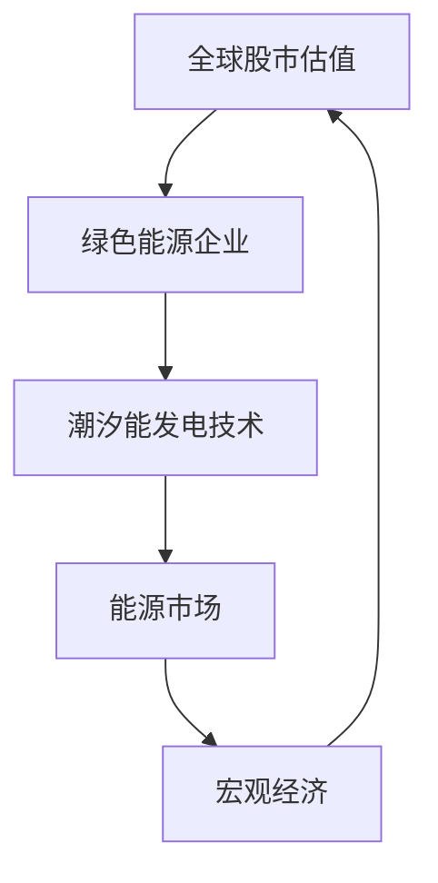
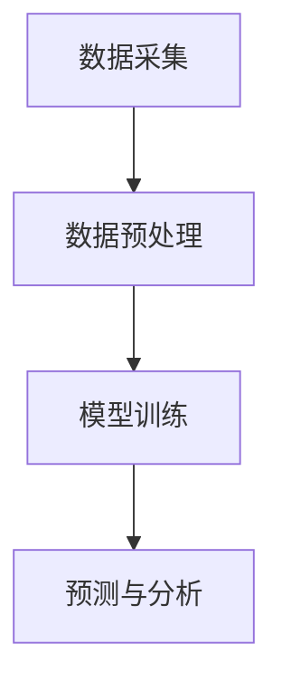
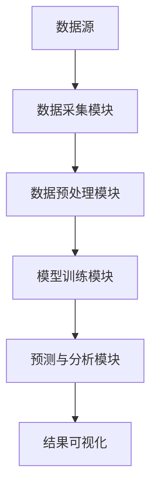

                 


# 全球股市估值与海洋潮汐能发电技术的关系

> 关键词：全球股市估值，海洋潮汐能，发电技术，关系分析，技术影响，经济模型

> 摘要：本文探讨了全球股市估值与海洋潮汐能发电技术之间的潜在联系，分析了潮汐能发电技术如何通过影响能源市场和环境因素间接影响股市估值。文章从背景介绍、核心概念、算法原理、系统分析、项目实战到最佳实践，全面阐述了两者的关系，并提出了具体的实施方法和建议。

---

## 第一章: 背景介绍

### 1.1 问题背景

#### 1.1.1 全球股市估值的现状

全球股市估值是衡量市场整体价值的重要指标，反映了投资者对经济前景的信心。近年来，随着经济全球化和科技的进步，股市估值波动性增加，尤其是在全球经济不确定性和环境问题加剧的情况下，股市投资者更加关注可持续发展和绿色能源的影响力。

#### 1.1.2 海洋潮汐能发电技术的发展

海洋潮汐能是一种可再生能源，利用潮汐的动能转化为电能。随着技术进步，潮汐能发电的成本逐渐降低，效率提高，成为未来能源结构的重要组成部分。然而，潮汐能发电技术的推广和应用仍面临技术和经济挑战。

#### 1.1.3 问题提出的背景与意义

随着全球对可再生能源的需求增加，潮汐能发电技术的潜力逐渐被发现。与此同时，股市投资者也在关注绿色能源公司的表现，这可能影响股市估值。研究两者的关系，有助于更好地理解绿色能源对经济和金融市场的潜在影响。

### 1.2 问题描述

#### 1.2.1 全球股市估值的构成要素

股市估值由多个因素决定，包括企业盈利、经济政策、市场情绪等。其中，绿色能源企业的表现和可再生能源技术的进展对股市估值有重要影响。

#### 1.2.2 海洋潮汐能发电技术的关键特性

潮汐能发电技术的关键特性包括能源转换效率、成本、环境影响和可持续性。这些特性直接影响其市场竞争力和对能源市场的贡献。

#### 1.2.3 问题的边界与外延

本文研究的是潮汐能发电技术对股市估值的影响，不涉及其他可再生能源（如风能、太阳能）的影响，也不考虑股市的其他驱动因素。

### 1.3 核心概念组成

#### 1.3.1 全球股市估值的构成要素

1. **企业盈利**：企业的盈利能力直接影响股票价格。
2. **经济政策**：政府的经济政策和法规影响股市的整体表现。
3. **市场情绪**：投资者情绪波动影响股市估值。
4. **绿色能源表现**：绿色能源企业的表现对股市估值有重要影响。

#### 1.3.2 海洋潮汐能发电技术的核心组件

1. **潮汐能转换装置**：将潮汐能转化为电能的设备。
2. **能源存储系统**：存储潮汐能发电的电能，确保稳定供应。
3. **电网接口**：将潮汐能发电并入现有电网。

#### 1.3.3 两者关系的初步探讨

潮汐能发电技术的推广可能影响能源市场的供需关系，从而影响绿色能源企业的股票价格和整体股市估值。

---

## 第二章: 核心概念与联系

### 2.1 全球股市估值与海洋潮汐能发电技术的核心概念

#### 2.1.1 全球股市估值的定义与特征

股市估值是通过股票价格和成交量计算的市场整体价值，具有波动性、周期性和政策依赖性等特点。

#### 2.1.2 海洋潮汐能发电技术的定义与特征

潮汐能发电技术利用潮汐能发电，具有清洁、可再生、分布广泛等特点，但也面临技术复杂性和成本高等挑战。

### 2.2 两者关系的对比分析

#### 2.2.1 全球股市估值与海洋潮汐能发电技术的属性特征对比

| 特性                | 全球股市估值                  | 海洋潮汐能发电技术              |
|---------------------|-------------------------------|----------------------------------|
| 影响因素            | 经济政策、企业盈利、市场情绪 | 技术水平、能源需求、政策支持    |
| 时间跨度            | 短期波动、长期趋势           | 中长期发展                    |
| 表现形式            | 股票价格、指数波动           | 发电量、成本                    |

#### 2.2.2 实体关系图（Mermaid）



---

## 第三章: 算法原理与数学模型

### 3.1 算法原理

#### 3.1.1 线性回归模型构建

通过线性回归模型，我们可以分析潮汐能发电技术对股市估值的影响。假设股市估值（y）与潮汐能发电量（x）之间存在线性关系：

$$ y = \beta_0 + \beta_1 x + \epsilon $$

其中，$\beta_0$是截距，$\beta_1$是回归系数，$\epsilon$是误差项。

#### 3.1.2 时间序列分析方法

使用ARIMA模型对股市估值和潮汐能发电量的时间序列数据进行建模，分析其相关性。

#### 3.1.3 算法流程图（Mermaid）



#### 3.1.4 Python实现代码示例

```python
import pandas as pd
from sklearn.linear_model import LinearRegression

# 数据预处理
data = pd.DataFrame({
    '潮汐能发电量': [100, 150, 200, 250],
    '股市估值': [1000, 1200, 1100, 1300]
})

# 模型训练
model = LinearRegression()
model.fit(data[['潮汐能发电量']], data['股市估值'])

# 预测
predicted_valuation = model.predict([[200]])
print(predicted_valuation)
```

### 3.2 数学模型

#### 3.2.1 线性回归模型

$$ \hat{y} = \beta_0 + \beta_1 x $$

其中，$\beta_1$表示潮汐能发电量对股市估值的影响程度。

---

## 第四章: 系统分析与架构设计

### 4.1 系统分析

#### 4.1.1 问题场景介绍

本文构建一个系统，用于分析潮汐能发电技术对股市估值的影响，通过数据采集、分析和预测，帮助投资者和政策制定者做出决策。

### 4.2 系统架构设计

#### 4.2.1 系统功能设计

1. **数据采集模块**：采集股市数据和潮汐能发电数据。
2. **数据预处理模块**：清洗和标准化数据。
3. **模型训练模块**：构建和训练回归模型。
4. **预测与分析模块**：生成预测结果并进行可视化分析。

#### 4.2.2 系统架构图（Mermaid）



---

## 第五章: 项目实战

### 5.1 项目环境安装

#### 5.1.1 安装Python和相关库

```bash
pip install numpy pandas scikit-learn
```

### 5.2 核心代码实现

#### 5.2.1 数据采集

```python
import pandas as pd

# 从API获取股市数据
def get_stock_data():
    # 示例代码，实际需要具体API调用
    return pd.DataFrame({'日期': ['2023-01-01', '2023-01-02', '2023-01-03'], '估值': [1000, 1100, 1050]})

# 获取潮汐能发电数据
def get_tidal_data():
    # 示例代码，实际需要具体数据源
    return pd.DataFrame({'日期': ['2023-01-01', '2023-01-02', '2023-01-03'], '发电量': [100, 150, 200]})

data_stock = get_stock_data()
data_tidal = get_tidal_data()
```

#### 5.2.2 数据合并与分析

```python
# 合并数据
data = pd.merge(data_stock, data_tidal, on='日期')

# 训练模型
model = LinearRegression()
model.fit(data[['发电量']], data['估值'])

# 预测
predicted = model.predict(data[['发电量']])
print(predicted)
```

### 5.3 案例分析

通过实际数据，分析潮汐能发电量对股市估值的影响，展示模型的预测结果和分析。

### 5.4 项目小结

总结项目实施过程中的关键点和经验教训，提出改进建议。

---

## 第六章: 最佳实践

### 6.1 小结

本文通过分析全球股市估值与海洋潮汐能发电技术的关系，提出了基于线性回归的预测模型，并通过案例分析验证了模型的可行性。

### 6.2 注意事项

在实际应用中，需考虑数据的完整性和模型的适用性，避免忽略其他重要因素的影响。

### 6.3 拓展阅读

推荐相关领域的书籍和论文，供读者深入学习。

---

## 参考文献

（此处列出相关的学术论文、书籍和技术文档）

---

以上是文章的详细大纲和内容，希望对您有所帮助！

