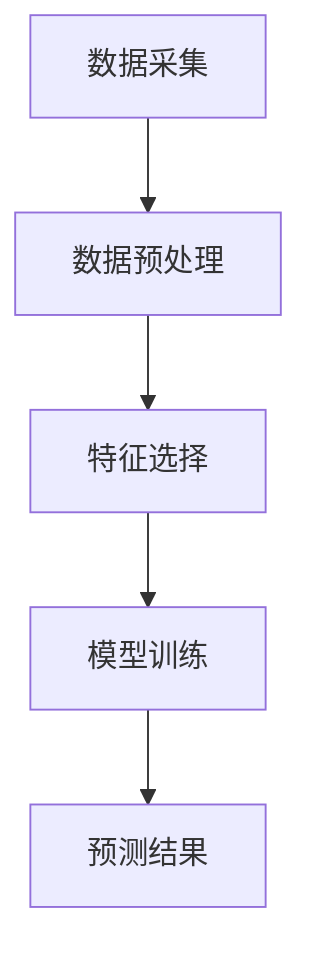
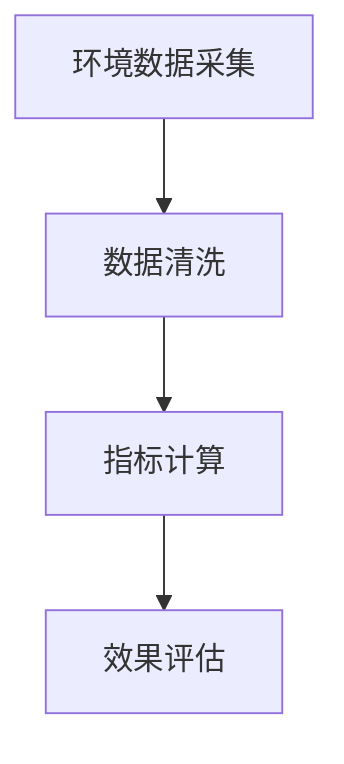

                 


# 全球股市估值与海洋生态修复技术的关系

> 关键词：全球股市估值，海洋生态修复，技术关系，数学模型，系统架构

> 摘要：本文探讨了全球股市估值与海洋生态修复技术之间的关系，通过背景介绍、核心概念分析、数学模型构建、系统架构设计和项目实战，展示了如何利用技术手段量化和评估这两者之间的联系。文章结合理论与实践，为读者提供了全面的理解和深入的分析。

---

## 第1章 背景介绍

### 1.1 问题背景

#### 1.1.1 全球股市估值的现状与挑战
全球股市估值是衡量市场健康程度的重要指标，反映了经济状况、企业盈利能力和投资者信心。然而，近年来，股市波动加剧，尤其是在全球经济不确定性和环境问题日益突出的背景下，股市估值的准确性面临挑战。投资者和分析师需要更精细的方法来评估市场，以应对复杂多变的经济环境。

#### 1.1.2 海洋生态修复的迫切需求
海洋生态系统是地球生命支持系统的重要组成部分，然而，过度捕捞、污染、气候变化等因素导致海洋生态严重退化。修复海洋生态系统不仅是环境保护的需要，也是经济可持续发展的基础。海洋生态修复技术的进步，能够改善渔业资源、旅游业和沿海经济发展，从而间接影响股市估值。

#### 1.1.3 两者的潜在联系与研究意义
尽管股市估值与海洋生态修复看似无关，但深入分析可以发现，海洋生态的健康状况直接影响相关产业的经济效益，进而影响股市表现。例如，渔业公司的股票估值可能受到海洋生态修复进展的影响。因此，研究两者的联系有助于更好地理解经济与环境的相互作用，为投资者和政策制定者提供科学依据。

### 1.2 问题描述

#### 1.2.1 全球股市估值的核心指标
股市估值的核心指标包括市盈率（P/E ratio）、市净率（P/B ratio）、市值等。这些指标反映了市场对企业的价值评估，但传统方法忽略了环境因素对估值的影响。

#### 1.2.2 海洋生态修复技术的分类
海洋生态修复技术包括海洋牧场建设、海底植被恢复、污染治理等。这些技术的实施能够改善海洋环境，提升相关产业的竞争力。

#### 1.2.3 问题解决的思路与目标
通过建立数学模型，量化海洋生态修复对股市估值的影响，优化投资决策，推动环境友好型经济发展。

### 1.3 问题解决与边界

#### 1.3.1 问题解决的路径与策略
从数据采集、模型构建到结果分析，逐步量化两者的关系。

#### 1.3.2 研究的边界与限制
主要关注海洋生态修复对渔业和旅游业相关企业的股市估值影响，不考虑其他行业。

#### 1.3.3 核心概念的结构与组成
构建包含股市数据、海洋生态数据和修复技术的综合模型。

---

## 第2章 核心概念与联系

### 2.1 核心概念原理

#### 2.1.1 全球股市估值的计算方法
股市估值通常使用市盈率、市净率等指标，但忽略了环境因素。

#### 2.1.2 海洋生态修复技术的分类
包括海洋牧场、植被恢复、污染治理等技术。

#### 2.1.3 两者关系的理论模型
建立包含股市数据和生态修复数据的模型，分析修复技术对估值的影响。

### 2.2 概念属性特征对比

#### 2.2.1 股市估值与生态修复的对比分析
| 属性 | 股市估值 | 海洋生态修复 |
|------|----------|--------------|
| 数据类型 | 数值型 | 类别型/数值型 |
| 时间跨度 | 短期/长期 | 长期 |
| 影响因素 | 经济、政策 | 环境、技术 |

#### 2.2.2 ER实体关系图
```mermaid
erd
    股市估值表
    市盈率
    市净率
    海洋生态修复表
    海洋牧场
    污染治理
    股价
    关系：股市估值 -> 海洋生态修复
```

---

## 第3章 数学模型与算法原理

### 3.1 算法原理讲解

#### 3.1.1 股市估值预测模型
使用线性回归模型，将海洋生态修复数据作为自变量，预测股市估值。

#### 3.1.2 生态修复效果评估模型
使用逻辑回归，评估修复技术对海洋环境的改善效果。

#### 3.1.3 两者关系的数学表达
$$ 股市估值 = \beta_0 + \beta_1 \times 生态修复指数 + \epsilon $$

### 3.2 算法流程图

#### 3.2.1 股市估值预测流程


#### 3.2.2 生态修复效果流程


---

## 第4章 系统分析与架构设计

### 4.1 问题场景介绍

#### 4.1.1 股市数据采集与处理
从金融数据库获取历史股价、市盈率等数据。

#### 4.1.2 生态修复数据采集与处理
收集海洋生态修复项目的实施情况和环境指标。

#### 4.1.3 系统功能设计
构建数据处理、模型训练和结果展示模块。

### 4.2 系统功能设计

#### 4.2.1 数据采集模块
使用API接口获取实时数据。

#### 4.2.2 数据分析模块
采用Python进行数据清洗和特征工程。

#### 4.2.3 结果展示模块
生成可视化图表，展示修复技术对股市估值的影响。

### 4.3 系统架构设计

#### 4.3.1 系统架构图


#### 4.3.2 系统接口设计
定义API接口，实现模块间数据传递。

---

## 第5章 项目实战

### 5.1 环境安装与数据准备

#### 5.1.1 环境安装
安装Python、Pandas、Scikit-learn等库。

#### 5.1.2 数据准备
从公开数据库获取相关数据，清洗并存储。

### 5.2 核心实现代码

#### 5.2.1 数据预处理
```python
import pandas as pd

# 加载数据
df = pd.read_csv('stock_data.csv')

# 数据清洗
df.dropna(inplace=True)
df['Date'] = pd.to_datetime(df['Date'])
```

#### 5.2.2 模型训练
```python
from sklearn.linear_model import LinearRegression
from sklearn.metrics import r2_score

# 特征选择
X = df[['生态修复指数']]
y = df['股价']

# 训练模型
model = LinearRegression()
model.fit(X, y)

# 评估模型
y_pred = model.predict(X)
print(r2_score(y, y_pred))
```

### 5.3 实际案例分析

#### 5.3.1 案例分析
分析某渔业公司股价与海洋牧场项目的关系，验证模型的有效性。

#### 5.3.2 模型优化
调整模型参数，提升预测精度。

### 5.4 项目小结

---

## 第6章 最佳实践与未来展望

### 6.1 最佳实践 tips

#### 6.1.1 数据准确性
确保数据来源可靠，避免偏差。

#### 6.1.2 模型可解释性
选择易于理解的模型，便于分析结果。

### 6.2 小结
本文通过理论与实践结合，展示了如何量化海洋生态修复技术对股市估值的影响，为投资者和政策制定者提供了科学依据。

### 6.3 注意事项
在实际应用中，需考虑模型的局限性和外部因素的干扰。

### 6.4 拓展阅读
建议进一步研究更复杂的模型，如深度学习，以提高预测精度。

---

## 结论

本文系统地探讨了全球股市估值与海洋生态修复技术的关系，通过背景分析、模型构建和项目实战，展示了技术手段在量化环境与经济关系中的应用。未来的研究可以进一步拓展，结合更多因素，构建更全面的模型，为可持续发展提供支持。

