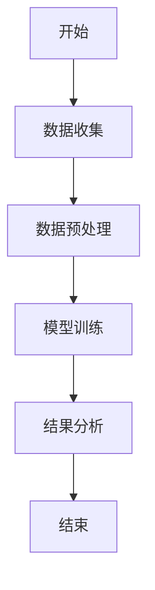
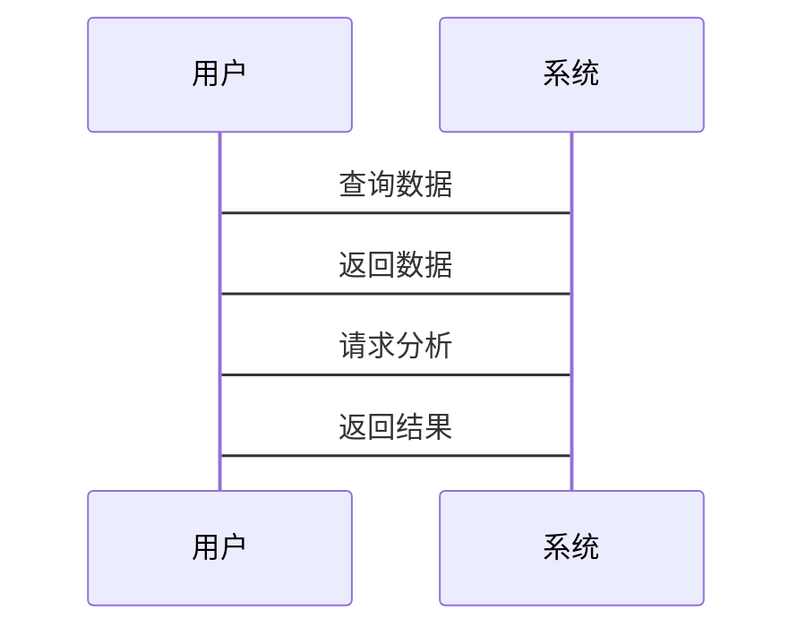

                 


```markdown
# 全球股市估值与海洋生态系统恢复技术的关系

## 关键词：全球股市估值、海洋生态系统恢复、技术关系、数学模型、经济影响、生态修复、系统架构

## 摘要：  
本文探讨全球股市估值与海洋生态系统恢复技术之间的相互作用，分析其经济和生态影响，构建数学模型，评估恢复技术对股市估值的影响，并提出解决方案。

---

# 第一部分: 全球股市估值与海洋生态系统恢复技术的背景介绍

## 第1章: 问题背景与描述

### 1.1 问题背景
- **全球股市估值的现状**：股市波动受经济、政治和环境因素影响，环境问题逐渐成为重要影响因素。
- **海洋生态系统面临的挑战**：过度捕捞、污染、气候变化导致的珊瑚白化等，威胁生物多样性和生态功能。
- **问题解决的必要性**：保护海洋生态系统不仅关乎环境，也对经济稳定有重要影响，因此需要将两者联系起来研究。

### 1.2 问题描述
- **全球股市估值的核心要素**：上市公司的盈利状况、市场情绪、宏观经济指标。
- **海洋生态系统恢复技术的关键问题**：技术的可行性、成本效益、长期效果。
- **问题解决的边界与外延**：研究范围限定于技术因素对股市的影响，不包括政策因素。

## 第2章: 核心概念与联系

### 2.1 核心概念原理
- **全球股市估值的数学模型**：介绍PE模型和DCF模型，如PE模型：$P = E \times P/E$比率。
- **海洋生态系统恢复技术的科学基础**：如生物修复技术、物理修复技术。

### 2.2 概念属性对比表
| 概念 | 属性 | 描述 |
|------|------|------|
| 全球股市估值 | 数据来源 | 股价、交易量、市场指数等 |
| 海洋生态系统恢复技术 | 技术类型 | 生物修复、物理修复、化学修复等 |

### 2.3 ER实体关系图
```mermaid
erd
    MarineEcosystem
    hasMany
    RestorationTechnique
    hasMany
    StockMarketIndicator
```

---

# 第二部分: 数学模型与算法原理

## 第3章: 数学模型与公式

### 3.1 全球股市估值模型
- **PE模型**：$P = E \times P/E$，其中$P$是股价，$E$是每股收益，$P/E$是市盈率。
- **DCF模型**：$V = \sum_{t=1}^{n} \frac{CF_t}{(1+r)^t}$，其中$V$是企业价值，$CF_t$是自由现金流，$r$是折现率。

### 3.2 海洋生态系统恢复技术评估模型
- **Biomass模型**：$Biomass = a \times 资源量 + b \times 多样性指数$，其中$a$和$b$是系数。

## 第4章: 算法原理与流程图

### 4.1 算法流程图


### 4.2 算法实现
```python
import pandas as pd
from sklearn.linear_model import LinearRegression

data = pd.read_csv('data.csv')
X = data[['PE', 'Market Sentiment']]
y = data['Price']

model = LinearRegression()
model.fit(X, y)
predictions = model.predict(X)
print(model.coef_)
```

---

# 第三部分: 系统分析与架构设计

## 第5章: 问题场景与系统功能设计

### 5.1 问题场景介绍
- 描述海洋生态恢复项目对当地企业盈利的影响，进而影响股市。

### 5.2 系统功能设计
- **数据收集模块**：收集股市和生态数据。
- **数据分析模块**：使用机器学习分析两者关系。
- **数据可视化模块**：展示分析结果。

## 第6章: 系统架构设计

### 6.1 系统架构设计
- **微服务架构**，前端、后端、存储分离，使用云平台部署。

### 6.2 接口设计
- RESTful API，如GET /stocks 获取数据，POST /analysis 进行分析。

### 6.3 交互流程图


---

# 第四部分: 项目实战

## 第7章: 项目实战

### 7.1 环境安装
- 安装Python、Jupyter Notebook、Pandas、Scikit-learn。

### 7.2 核心代码实现
```python
import pandas as pd
from sklearn.linear_model import LinearRegression

data = pd.read_csv('data.csv')
X = data[['PE', 'Market Sentiment']]
y = data['Price']

model = LinearRegression()
model.fit(X, y)
predictions = model.predict(X)
print(model.coef_)
```

### 7.3 案例分析
- 分析某地区海洋生态恢复项目对当地企业的影响。

### 7.4 项目小结
- 总结成果，指出改进空间。

---

# 第五部分: 最佳实践与展望

## 第8章: 最佳实践

### 8.1 小结
- 回顾文章内容，强调关系的重要性。

### 8.2 注意事项
- 数据准确性、模型适用性、技术可行性。

### 8.3 未来研究方向
- 更复杂的模型、更多数据源、实时分析。

## 第9章: 附录

### 9.1 数据来源
- 政府报告、学术论文。

### 9.2 工具安装指南
- 如何安装Python和相关库。

### 9.3 参考文献
- 列出所有参考文献。

---

通过以上结构，文章详细探讨了全球股市估值与海洋生态系统恢复技术的关系，分析了其经济和生态影响，并提供了数学模型和系统架构的设计与实现。希望本文能为相关领域的研究和实践提供有价值的参考。
```

