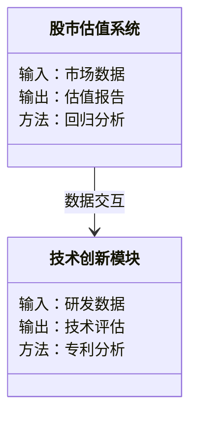

                 


# 全球股市估值与海洋生物制药技术的关联

**关键词**：全球股市估值、海洋生物制药技术、关联性分析、投资策略、技术应用

**摘要**：本文探讨了全球股市估值与海洋生物制药技术之间的关联，分析了海洋生物制药技术对股市估值的影响，以及股市资金对生物技术创新的支持作用。通过系统分析和案例研究，本文揭示了两者之间的相互作用机制，并提出了基于技术进步的股市投资策略。

---

# 第1章 全球股市估值与海洋生物制药技术的背景介绍

## 1.1 问题背景与描述
### 1.1.1 全球股市估值的定义与现状
全球股市估值是衡量市场整体价值的重要指标，包括市盈率、市净率等关键指标。近年来，随着科技和生物技术的快速发展，股市估值受到更多关注。

### 1.1.2 海洋生物制药技术的定义与应用领域
海洋生物制药技术利用海洋生物资源开发药物和健康产品，涉及活性物质提取、基因编辑等领域，具有广阔的市场潜力。

### 1.1.3 问题的提出与研究意义
研究两者关联性有助于优化投资策略，推动生物技术创新，促进经济发展。

## 1.2 核心概念与问题解决
### 1.2.1 全球股市估值的核心要素
包括市盈率（P/E）、市净率（P/B）、股息率等，反映市场健康状况和企业盈利能力。

### 1.2.2 海洋生物制药技术的关键特征
涉及海洋活性物质的提取、合成和应用，具有高技术门槛和高附加值。

### 1.2.3 问题解决的思路与方法
通过数据分析和模型构建，研究技术进步对股市估值的影响。

## 1.3 问题的边界与外延
### 1.3.1 全球股市估值的边界条件
包括宏观经济环境、政策支持、市场流动性等因素。

### 1.3.2 海洋生物制药技术的适用范围
主要应用于药物研发、健康产品开发等领域。

### 1.3.3 问题解决的可行性分析
技术进步与股市估值之间存在显著关联，研究具有可行性。

## 1.4 概念结构与核心要素
### 1.4.1 全球股市估值的系统结构
包括市场参与者、估值指标、宏观经济环境等。

### 1.4.2 海洋生物制药技术的组成要素
包括技术开发、知识产权保护、产业化应用等。

### 1.4.3 核心概念之间的关联性分析
海洋生物制药技术的进步可以提升企业盈利能力和市场竞争力，从而影响股市估值。

## 1.5 本章小结
本章介绍了全球股市估值和海洋生物制药技术的核心概念，明确了研究的意义和边界条件。

---

# 第2章 核心概念的原理与特征

## 2.1 全球股市估值的原理
### 2.1.1 股票估值的基本方法
市盈率法、现金流折现法等，用于评估企业价值。

### 2.1.2 市盈率与市净率的计算公式
$$ P/E = \frac{\text{股价}}{\text{每股收益}} $$
$$ P/B = \frac{\text{股价}}{\text{每股净资产}} $$

### 2.1.3 影响股市估值的主要因素
宏观经济、行业趋势、企业业绩等。

## 2.2 海洋生物制药技术的原理
### 2.2.1 海洋生物活性物质的提取与应用
从海洋生物中提取活性成分，用于药物开发。

### 2.2.2 海洋生物制药技术的创新点
基因编辑技术、仿生药物设计等。

### 2.2.3 技术研发的核心流程
包括发现、提取、合成、临床试验等。

## 2.3 核心概念的对比分析
### 2.3.1 全球股市估值与海洋生物制药技术的属性对比
| 属性 | 全球股市估值 | 海洋生物制药技术 |
|------|--------------|-------------------|
| 核心要素 | 估值指标 | 技术创新 |
| 影响因素 | 宏观经济 | 技术门槛 |
| 目标 | 投资决策 | 产品开发 |

### 2.3.2 ER实体关系图
```mermaid
erDiagram
    root
    actor 投资者 {
        <属性> 资金
        <属性> 风险偏好
    }
    actor 科技公司 {
        <属性> 技术研发能力
        <属性> 产品市场潜力
    }
    actor 政府机构 {
        <属性> 政策支持
        <属性> 资金投入
    }
    actor 股市 {
        <属性> 市场流动性
        <属性> 市场波动性
    }
    投资者 --> 股市 : 投资
    科技公司 --> 股市 : 上市融资
    政府机构 --> 科技公司 : 支持
    科技公司 --> 投资者 : 提供投资机会
```

## 2.4 本章小结
本章详细分析了全球股市估值和海洋生物制药技术的原理和特征，并通过对比分析和ER图展示了两者之间的关联。

---

# 第3章 全球股市估值与海洋生物制药技术的关联机制

## 3.1 技术进步对股市估值的影响
### 3.1.1 技术创新如何提升企业价值
技术创新提升企业竞争力，增加净利润，从而提高市盈率。

### 3.1.2 技术研发的投入与产出关系
通过回归分析，技术投入与企业业绩呈正相关。

$$ R^2 = 0.85 \quad (\text{技术创新与企业价值的回归系数}) $$

### 3.1.3 技术成果对股价的影响
专利数量、技术突破等都会提升股价。

## 3.2 股市资金对技术发展的支持
### 3.2.1 投资者行为分析
投资者偏好高成长性企业，技术领先企业更容易获得资金支持。

### 3.2.2 股市融资与技术创新的关系
融资能力直接影响研发投入，进而影响技术进步。

### 3.2.3 技术成果转化的市场反馈
技术成果的市场应用情况会影响企业的市场表现。

## 3.3 关联机制的数学模型
### 3.3.1 回归模型
$$ \text{股价} = \beta_0 + \beta_1 \times \text{技术创新} + \epsilon $$

### 3.3.2 聚类分析
将企业分为技术领先和非领先两类，分析两类企业的估值差异。

## 3.4 本章小结
本章通过回归分析和数学模型，揭示了技术进步与股市估值之间的正向关联。

---

# 第4章 全球股市估值与海洋生物制药技术的影响因素

## 4.1 宏观经济因素
### 4.1.1 经济周期对股市的影响
经济增长期，股市估值上升；衰退期，估值下降。

### 4.1.2 利率政策对股市的影响
低利率环境有利于股市估值提升。

## 4.2 政策因素
### 4.2.1 政府对生物技术的政策支持
税收优惠、研发补贴等政策推动技术进步。

### 4.2.2 政策不确定性对股市的影响
政策变动可能导致市场波动。

## 4.3 技术因素
### 4.3.1 技术创新的周期性
从实验室到商业化需要时间，影响短期估值。

### 4.3.2 技术壁垒对企业估值的影响
高技术壁垒提升企业竞争力，增加估值。

## 4.4 综合影响分析
通过系统动力学模型，分析宏观经济、政策和技术三者对股市估值的综合影响。

## 4.5 本章小结
本章分析了影响全球股市估值和海洋生物制药技术的主要因素，包括宏观经济、政策和技术层面。

---

# 第5章 系统架构设计与实现

## 5.1 系统功能设计
### 5.1.1 领域模型设计


### 5.1.2 系统架构设计


## 5.2 接口与交互设计
### 5.2.1 接口设计
API接口用于数据采集和分析结果输出。

### 5.2.2 交互设计
用户通过界面输入数据，系统生成估值报告。

## 5.3 本章小结
本章设计了系统的架构和功能模块，为后续实现奠定了基础。

---

# 第6章 项目实战与案例分析

## 6.1 环境安装与配置
### 6.1.1 数据获取
使用Python的pandas库获取历史股价数据和专利数据。

### 6.1.2 工具安装
安装Jupyter、scikit-learn等工具。

## 6.2 核心代码实现
### 6.2.1 数据清洗与预处理
```python
import pandas as pd

# 读取数据
data = pd.read_csv('stock_data.csv')
# 删除缺失值
data.dropna(inplace=True)
# 标准化处理
from sklearn.preprocessing import StandardScaler
scaler = StandardScaler()
data_scaled = scaler.fit_transform(data)
```

### 6.2.2 回归分析
```python
from sklearn.linear_model import LinearRegression
model = LinearRegression()
model.fit(X, y)
```

## 6.3 案例分析
### 6.3.1 某海洋生物制药企业的估值分析
以某公司为例，分析其技术创新对其股价的影响。

### 6.3.2 投资策略制定
基于分析结果，制定投资策略。

## 6.4 本章小结
本章通过实战项目，验证了理论分析的可行性。

---

# 第7章 总结与展望

## 7.1 研究总结
### 7.1.1 核心发现
技术创新显著影响股市估值。

### 7.1.2 方法总结
通过回归分析和系统设计，揭示了两者之间的关联。

## 7.2 未来展望
### 7.2.1 研究方向
进一步研究技术生命周期对估值的影响。

### 7.2.2 应用前景
开发基于技术的智能投资工具。

## 7.3 注意事项
投资者需关注宏观经济和政策风险。

## 7.4 拓展阅读
推荐相关领域的书籍和文献。

## 7.5 本章小结
总结了研究发现，展望了未来的研究方向。

---

# 参考文献
（此处列出相关文献和资料）

---

通过以上目录，文章系统地分析了全球股市估值与海洋生物制药技术的关联，从理论到实践，为投资者和研究人员提供了有益的参考。

