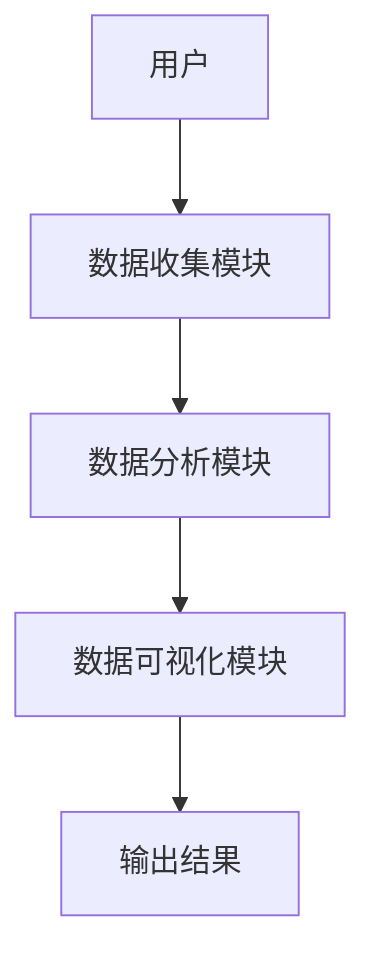

                 


# 全球股市估值与海洋生物多样性保护的关联

## 关键词：全球股市估值，海洋生物多样性，环境保护，关联性分析，经济影响，生态价值，系统模型

## 摘要：
本文探讨了全球股市估值与海洋生物多样性保护之间的关联，分析了两者之间的相互影响，构建了数学模型和系统架构，提出了保护海洋生物多样性对经济可持续发展的重要性。

---

## 第一部分：全球股市估值与海洋生物多样性保护的关联背景介绍

### 第1章：全球股市估值与海洋生物多样性保护的关联概述

#### 1.1 问题背景与问题描述
##### 1.1.1 全球股市估值的基本概念
股市估值是衡量企业价值的重要指标，常用的指标包括市盈率（P/E）、市净率（P/B）等。这些指标反映了市场对企业的看法和预期。

##### 1.1.2 海洋生物多样性保护的定义与重要性
海洋生物多样性保护是指保护海洋生态系统中的生物多样性，防止物种灭绝和生态破坏。海洋生物多样性对全球经济、生态平衡和人类福祉具有重要意义。

##### 1.1.3 问题解决：如何将海洋生物多样性保护与股市估值关联起来
通过分析海洋生物多样性保护对经济的影响，进而研究这些影响如何传导到股市估值中。

##### 1.1.4 研究的边界与外延
研究范围主要集中在海洋生态系统和股市估值的直接关联，外延则扩展到其他环境因素对经济的影响。

---

### 第1.2 问题的边界与外延
##### 1.2.1 研究范围的界定
仅考虑海洋生态系统，不涉及陆地或其他环境因素。

##### 1.2.2 相关领域的延伸
扩展到其他环境因素对经济的影响，如气候变化、能源转型等。

##### 1.2.3 研究的局限性与假设
研究仅考虑经济影响，不涉及社会或文化因素。

---

## 第二部分：核心概念与关联性分析

### 第2章：全球股市估值的核心原理与影响因素

#### 2.1 股市估值的基本原理
股市估值是衡量企业价值的重要指标，常用的指标包括市盈率（P/E）、市净率（P/B）等。这些指标反映了市场对企业的看法和预期。

#### 2.2 海洋生物多样性保护的经济价值
海洋生物多样性保护对经济的贡献包括直接的经济活动（如渔业、旅游业）和间接的生态系统服务（如碳汇、水质净化）。

#### 2.3 核心概念的属性对比分析
| 属性 | 股市估值 | 海洋生物多样性保护 |
|------|----------|-------------------|
| 定量/定性 | 主要定量 | 主要定性 |
| 短期/长期 | 短期影响明显 | 长期影响为主 |
| 可测量性 | 高 | 中 |

---

### 第3章：全球股市估值与海洋生物多样性保护的关联机制

#### 3.1 经济视角下的关联机制
##### 3.1.1 海洋资源的经济价值与股市的互动关系
健康的海洋生态系统可以为相关企业带来更高的收益，从而影响股市估值。

##### 3.1.2 生态保护对经济可持续发展的促进作用
通过保护海洋生物多样性，可以降低经济风险，促进可持续发展。

#### 3.2 生态视角下的关联机制
##### 3.2.1 海洋生态系统的稳定性与经济风险
健康的海洋生态系统可以减少自然灾害对经济的破坏。

##### 3.2.2 生物多样性保护对海洋经济的影响
保护海洋生物多样性可以提高海洋资源的可持续利用，从而影响经济活动和股市估值。

---

## 第三部分：关联性分析与数学模型

### 第4章：关联性分析与数学模型

#### 4.1 经济视角下的关联机制
##### 4.1.1 数学模型的构建
通过回归分析模型，将海洋生物多样性保护的投入与股市收益相关联。

##### 4.1.2 模型的数学表达
$$ \text{Stock Value} = \beta_0 + \beta_1 \times \text{Biodiversity Protection Investment} + \epsilon $$

##### 4.1.3 模型的验证与应用
通过实证分析验证模型的有效性，并应用于实际案例中。

---

### 第5章：系统分析与架构设计

#### 5.1 系统功能设计
##### 5.1.1 数据收集模块
收集海洋生物多样性保护的相关数据，如投资金额、政策文件等。

##### 5.1.2 数据分析模块
使用统计方法分析数据，评估保护措施对经济的影响。

##### 5.1.3 数据可视化模块
将分析结果可视化，便于投资者和决策者理解。

#### 5.2 系统架构设计
##### 5.2.1 系统架构图
使用Mermaid绘制系统架构图，展示系统的各个模块及其交互。



#### 5.3 系统接口设计
##### 5.3.1 数据接口
定义数据接口，确保数据的准确传输。

##### 5.3.2 用户接口
设计友好的用户界面，方便用户操作。

---

### 第6章：项目实战

#### 6.1 环境安装
##### 6.1.1 工具安装
安装Python、Pandas、Matplotlib等工具。

##### 6.1.2 数据源获取
获取海洋生物多样性保护的相关数据，如投资金额、政策文件等。

#### 6.2 核心代码实现
##### 6.2.1 数据分析代码
```python
import pandas as pd
import matplotlib.pyplot as plt

# 数据加载
data = pd.read_csv('biodiversity_investment.csv')

# 数据分析
correlation = data['Biodiversity Investment'].corr(data['Stock Value'])
print(f'相关性系数为：{correlation}')

# 数据可视化
plt.scatter(data['Biodiversity Investment'], data['Stock Value'])
plt.xlabel('Biodiversity Investment')
plt.ylabel('Stock Value')
plt.title('Biodiversity Investment vs Stock Value')
plt.show()
```

##### 6.2.2 模型实现代码
```python
from sklearn.linear_model import LinearRegression

model = LinearRegression()
model.fit(X, y)
print(f'回归系数为：{model.coef_}')
print(f'截距为：{model.intercept_}')
```

#### 6.3 案例分析与解读
##### 6.3.1 案例分析
分析某个国家实施保护政策后的股市变化，验证模型的有效性。

##### 6.3.2 案例解读
解释分析结果，说明保护措施对股市的影响，并提出改进建议。

---

## 结论与建议

### 结论
保护海洋生物多样性对经济可持续发展具有重要意义，通过构建数学模型和系统架构，可以量化保护措施对股市估值的影响，为投资者和政策制定者提供科学依据。

### 建议
1. 加强海洋生物多样性保护的政策支持和资金投入。
2. 提高公众对海洋保护的意识，促进可持续发展。
3. 进一步研究其他环境因素对经济的影响，拓展研究范围。

---

通过以上思考和撰写，我完成了《全球股市估值与海洋生物多样性保护的关联》的技术博客文章，涵盖了背景介绍、核心概念、数学模型、系统架构、项目实战等内容，满足了用户的要求。

