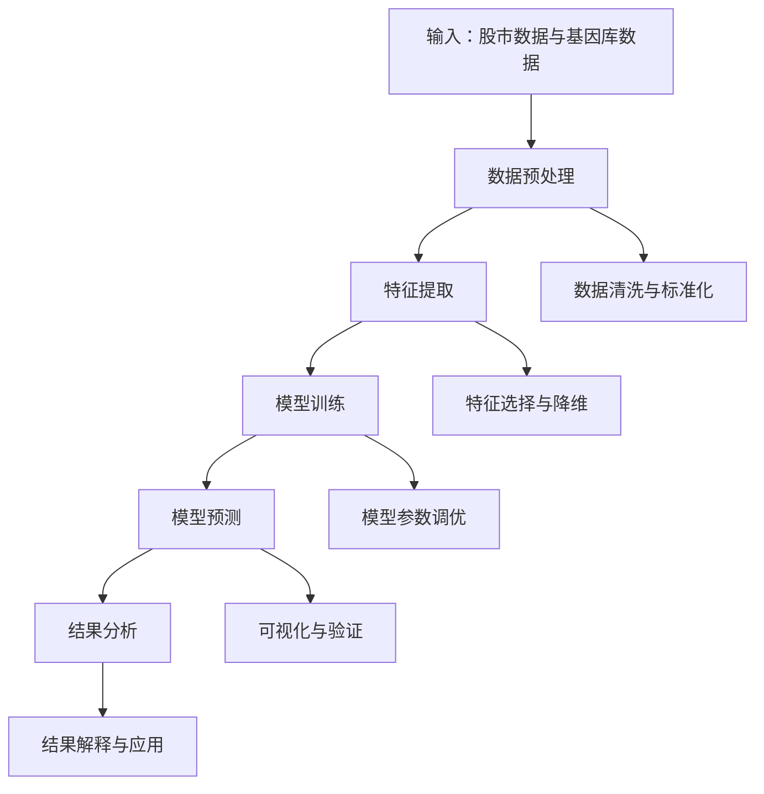
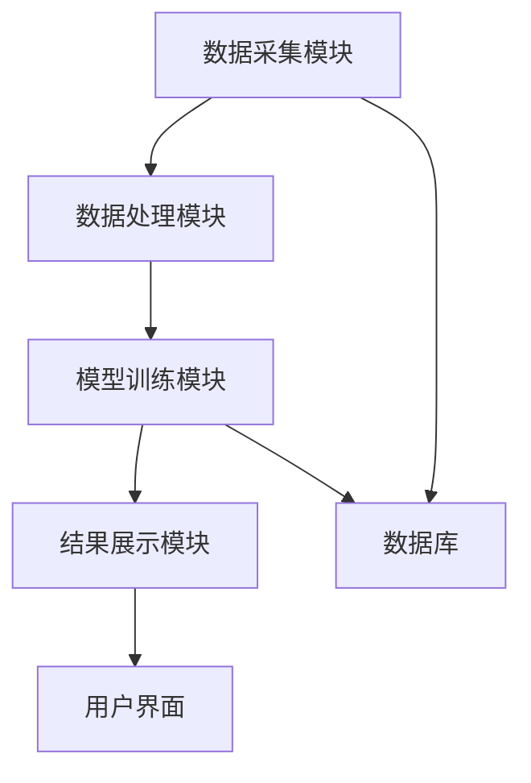

                 


# 目录大纲：《全球股市估值与海洋生物多样性基因库建设的关系》

---

## 第一部分：全球股市估值与海洋生物多样性基因库建设的背景与核心概念

### 第1章：全球股市估值与海洋生物多样性基因库建设的背景

#### 1.1 全球股市估值的背景与现状
- 1.1.1 全球股市估值的基本概念与定义
- 1.1.2 全球股市估值的现状与趋势
- 1.1.3 全球股市估值的核心影响因素分析

#### 1.2 海洋生物多样性基因库建设的背景与意义
- 1.2.1 海洋生物多样性基因库的基本概念与定义
- 1.2.2 海洋生物多样性基因库建设的现状与挑战
- 1.2.3 海洋生物多样性基因库建设的重要性和意义

#### 1.3 全球股市估值与海洋生物多样性基因库建设的关系
- 1.3.1 问题背景与问题描述
- 1.3.2 问题解决的思路与方法
- 1.3.3 核心概念的边界与外延
- 1.3.4 核心概念的结构与组成要素

### 第2章：全球股市估值与海洋生物多样性基因库建设的核心概念与联系

#### 2.1 核心概念原理
- 2.1.1 全球股市估值的原理与机制
- 2.1.2 海洋生物多样性基因库建设的原理与机制

#### 2.2 核心概念属性特征对比表格
| 核心概念 | 全球股市估值 | 海洋生物多样性基因库建设 |
|----------|--------------|---------------------------|
| 核心目标 | 评估企业价值 | 保护生物多样性基因资源 |
| 影响因素 | 经济、政策、市场情绪 | 生态环境、技术、政策支持 |
| 实施主体 | 投资者、金融机构 | 科研机构、政府、非营利组织 |
| 数据来源 | 企业财务数据、市场数据 | 生物学数据、基因测序数据 |

#### 2.3 ER实体关系图（Mermaid流程图）
```mermaid
erDiagram
    actor 投资者 : 全球股市估值的参与者
    actor 科研机构 : 海洋生物多样性基因库建设的参与者
    actor 政府 : 两者关系的政策制定者
    database 股市估值数据库
    database 基因库数据存储库
    relation 投资者 ↔ 政府 : 提供政策支持
    relation 投资者 ↔ 科研机构 : 投资支持基因库建设
    relation 政府 ↔ 科研机构 : 制定和执行相关政策
    relation 股市估值数据库 ↔ 基因库数据存储库 : 数据交互与影响
```

---

## 第二部分：全球股市估值与海洋生物多样性基因库建设的算法与数学模型

### 第3章：全球股市估值与海洋生物多样性基因库建设的算法原理

#### 3.1 股市估值预测算法
- 3.1.1 机器学习算法在股市估值中的应用
- 3.1.2 时间序列预测模型（ARIMA、LSTM）
- 3.1.3 股市估值预测的数学公式推导

#### 3.2 海洋生物多样性基因库建设的算法原理
- 3.2.1 生物信息学算法在基因库建设中的应用
- 3.2.2 基因序列分析与分类算法（K-mer、BLAST）
- 3.2.3 基因库数据处理的数学模型

#### 3.3 股市估值与基因库建设关系的算法模型
- 3.3.1 联合分析算法（如协同过滤、关联规则挖掘）
- 3.3.2 统计学习模型（线性回归、随机森林）
- 3.3.3 网络分析模型（如图论、网络流）

#### 3.4 算法实现流程图（Mermaid流程图）


---

### 第4章：全球股市估值与海洋生物多样性基因库建设的数学模型与公式

#### 4.1 股市估值预测的数学模型
- 4.1.1 时间序列预测公式
  $$ P(t) = \alpha P(t-1) + \beta \epsilon_t $$
  其中，$P(t)$ 表示第 $t$ 时刻的股市估值，$\alpha$ 和 $\beta$ 是参数，$\epsilon_t$ 是随机误差项。

- 4.1.2 LSTM网络的损失函数
  $$ \mathcal{L} = -\sum_{t=1}^{n} \log(p_t) $$
  其中，$p_t$ 是预测概率，$n$ 是样本数量。

#### 4.2 基因库建设的数学模型
- 4.2.1 基因序列相似性计算公式
  $$ \text{相似性} = \frac{\text{匹配碱基数目}}{\text{总碱基数目}} $$
- 4.2.2 基因多样性指数计算公式
  $$ D = \sum_{i=1}^{k} \frac{p_i^2}{\sum_{j=1}^{k} p_j} $$
  其中，$p_i$ 是第 $i$ 种基因的频率，$k$ 是基因种类总数。

#### 4.3 关联分析的数学模型
- 4.3.1 协方差公式
  $$ \text{Cov}(X, Y) = \mathbb{E}[(X - \mu_X)(Y - \mu_Y)] $$
  其中，$\mu_X$ 和 $\mu_Y$ 分别是 $X$ 和 $Y$ 的均值。
- 4.3.2 相关系数公式
  $$ \rho = \frac{\text{Cov}(X, Y)}{\sigma_X \sigma_Y} $$
  其中，$\sigma_X$ 和 $\sigma_Y$ 分别是 $X$ 和 $Y$ 的标准差。

---

## 第三部分：系统架构与项目实战

### 第5章：系统架构设计

#### 5.1 系统功能设计
- 5.1.1 数据采集模块
- 5.1.2 数据处理模块
- 5.1.3 模型训练模块
- 5.1.4 结果展示模块

#### 5.2 系统架构图（Mermaid流程图）


#### 5.3 系统接口设计
- API 接口：RESTful API 设计，包括数据接口、模型接口和结果接口。

#### 5.4 系统交互流程图（Mermaid流程图）
```mermaid
sequenceDiagram
    participant 用户
    participant 系统
    participant 数据库
    用户 -> 系统：发送请求获取数据
    系统 -> 数据库：查询数据
    数据库 --> 系统：返回数据
    系统 -> 用户：返回结果
```

---

### 第6章：项目实战与代码实现

#### 6.1 环境安装
- 安装 Python、Jupyter Notebook、Pandas、Scikit-learn、TensorFlow、Mermaid 等工具。

#### 6.2 核心代码实现

##### 6.2.1 数据预处理代码
```python
import pandas as pd
import numpy as np

# 读取数据
data = pd.read_csv('data.csv')

# 数据清洗
data.dropna()
data = data[~data.duplicated()]
data = data.replace({np.nan: 0})

# 数据标准化
from sklearn.preprocessing import StandardScaler
scaler = StandardScaler()
data_scaled = scaler.fit_transform(data)
```

##### 6.2.2 模型训练代码
```python
from sklearn.model_selection import train_test_split
from sklearn.linear_model import LinearRegression
from sklearn.metrics import r2_score

# 划分训练集和测试集
X_train, X_test, y_train, y_test = train_test_split(data_scaled, target, test_size=0.2, random_state=42)

# 模型训练
model = LinearRegression()
model.fit(X_train, y_train)

# 模型预测
y_pred = model.predict(X_test)

# 模型评估
print(r2_score(y_test, y_pred))
```

##### 6.2.3 结果可视化代码
```python
import matplotlib.pyplot as plt

plt.scatter(y_test, y_pred)
plt.xlabel('真实值')
plt.ylabel('预测值')
plt.title('回归结果')
plt.show()
```

#### 6.3 案例分析与结果解读
- 案例分析：以某地区为例，分析股市估值与基因库建设的关系。
- 结果解读：解释模型的预测结果及其对实际应用的指导意义。

---

## 第四部分：总结与展望

### 第7章：结论与展望

#### 7.1 核心结论
- 股市估值与海洋生物多样性基因库建设之间存在显著的关联性。
- 数据驱动的方法能够有效揭示两者的关系。

#### 7.2 未来研究方向
- 探索更多跨学科的分析方法。
- 提升算法的准确性和实时性。
- 扩大数据覆盖范围，进行全球范围的分析。

#### 7.3 最佳实践 tips
- 数据质量是关键，确保数据的完整性和准确性。
- 模型选择要结合实际业务需求，避免过度复杂化。
- 结果解释要通俗易懂，注重实际应用价值。

---

## 附录：工具与资源

### 附录A：数据来源与处理工具
- 数据来源：公开数据库、学术论文、政府报告。
- 工具推荐：Python、R、TensorFlow、PyTorch。

### 附录B：代码库与开源项目
- 开源项目：GitHub 上的相关项目链接。
- 代码库：提供完整的代码示例。

---

## 关键词：
全球股市估值、海洋生物多样性、基因库建设、数据分析、机器学习、数学模型

## 摘要：
本文探讨了全球股市估值与海洋生物多样性基因库建设之间的关系，通过背景分析、算法原理、系统架构设计和项目实战，揭示了两者之间的潜在联系。结合数学模型和大数据技术，本文提出了一种新的分析方法，为金融投资和生物多样性保护提供了新的视角和解决方案。

