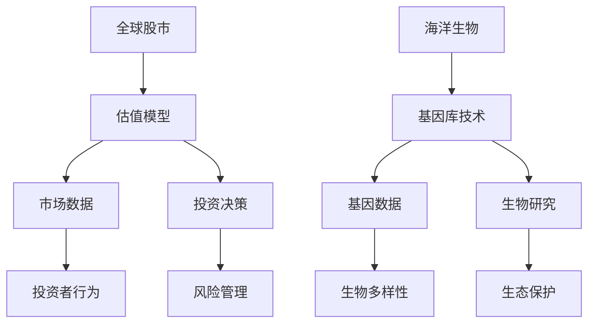
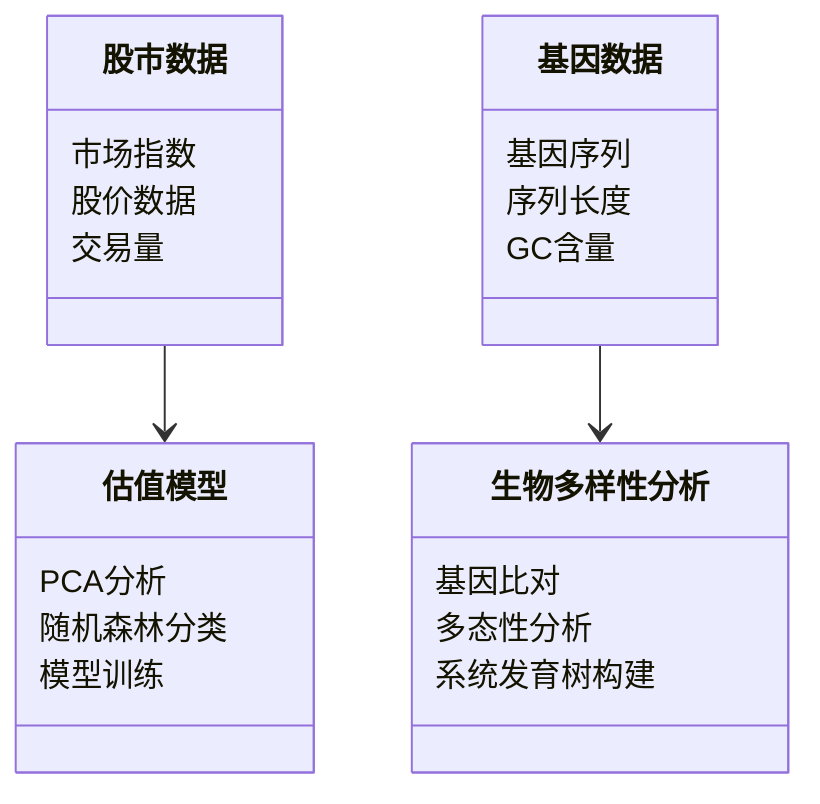
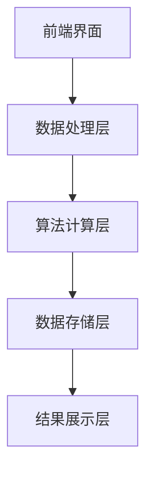
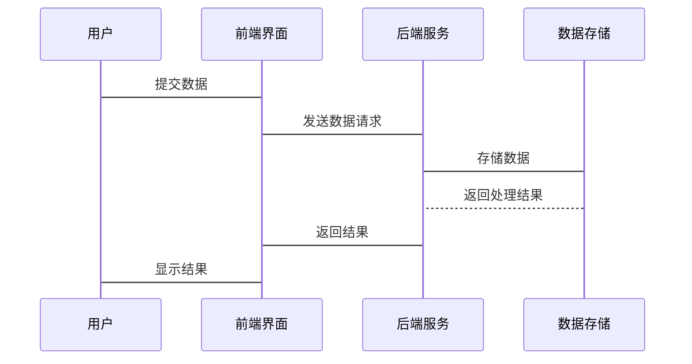

                 


好的，我将逐步分析并完善这本书的目录大纲，以确保内容详实、结构清晰，并满足所有要求。

### 第一部分: 全球股市估值与海洋生物多样性基因库技术的背景与关系

#### 第1章: 背景介绍

##### 1.1 问题背景

###### 1.1.1 全球股市估值的现状与挑战
- 当前全球股市估值的主要方法与工具
- 传统估值模型的局限性
- 全球化背景下股市波动的新特点

###### 1.1.2 海洋生物多样性基因库技术的科学意义
- 海洋生物多样性的现状与保护的重要性
- 基因库技术在生物多样性研究中的作用
- 基因库技术对生态平衡和生物进化的影响

###### 1.1.3 两者的潜在关联性分析
- 数据科学在连接股市与基因库技术中的作用
- 人工智能在两领域中的共同应用
- 生物多样性数据与股市风险评估的潜在联系

##### 1.2 问题描述

###### 1.2.1 全球股市估值的核心问题
- 估值模型的准确性与实时性
- 数据噪声与市场非理性波动的影响
- 不同市场环境下的估值策略调整

###### 1.2.2 海洋生物多样性基因库技术的关键挑战
- 基因数据的复杂性与多样性
- 基因库技术的标准化与可比性问题
- 生物多样性保护与经济利益的平衡

###### 1.2.3 问题解决的路径与目标
- 利用数据科学方法整合两领域知识
- 开发通用的分析工具与模型
- 实现跨学科的技术融合与创新

##### 1.3 问题解决

###### 1.3.1 数据驱动的解决方案
- 数据采集与清洗的标准化流程
- 数据分析与建模的通用方法
- 数据可视化与结果解读的工具选择

###### 1.3.2 技术融合的实现路径
- 数据科学方法在股市估值中的应用
- 机器学习算法在基因数据分析中的应用
- 技术融合的具体实现步骤与注意事项

###### 1.3.3 应用场景的拓展与创新
- 跨领域技术应用的创新案例
- 技术融合带来的新研究方向
- 应用中的潜在风险与应对策略

##### 1.4 边界与外延

###### 1.4.1 全球股市估值的边界条件
- 数据来源的限制
- 市场参与者行为的复杂性
- 模型假设的合理性

###### 1.4.2 海洋生物多样性基因库技术的适用范围
- 技术应用的环境限制
- 数据采集的可行性
- 技术推广的经济成本

###### 1.4.3 两者的交叉领域与未来发展
- 交叉领域的研究热点
- 技术融合的未来趋势
- 学术界与产业界的协同创新

##### 1.5 概念结构与核心要素

###### 1.5.1 全球股市估值的核心要素
- 估值模型
- 数据源
- 估值方法

###### 1.5.2 海洋生物多样性基因库技术的关键组成部分
- 基因数据
- 数据分析工具
- 基因库构建技术

###### 1.5.3 两者的关系模型与系统架构
- 关系模型的构建
- 系统架构的总体设计
- 两者的协同作用机制

#### 第2章: 核心概念与联系

##### 2.1 核心概念原理

###### 2.1.1 全球股市估值的数学模型
- 常见的估值模型介绍
- 模型的数学表达
- 模型的优缺点分析

###### 2.1.2 海洋生物多样性基因库技术的生物信息学原理
- 基因测序技术
- 数据分析方法
- 生物信息学工具

###### 2.1.3 两者的共同特征与差异对比
- 数据处理方法的共性与差异
- 分析目标的不同
- 技术实现的异同

##### 2.2 核心概念属性特征对比

###### 2.2.1 表格对比：全球股市估值与海洋生物多样性基因库技术的核心属性
| 特性                | 全球股市估值              | 海洋生物多样性基因库技术          |
|---------------------|--------------------------|----------------------------------|
| 数据类型            | 数值型、文本型            | 生物序列数据、元数据            |
| 数据规模            | 中等至大型                | 大型至超大型                    |
| 数据处理            | 统计分析、机器学习        | 生物信息学分析、序列比对        |
| 应用目标            | 投资决策、风险管理        | 生物多样性保护、基因研究        |

###### 2.2.2 图表对比：两者的数据特征与应用场景
- 数据分布图：股市数据与基因数据的分布特点
- 应用场景图：两者的应用场景对比

##### 2.3 ER实体关系图


### 第三部分: 算法原理讲解

#### 第3章: 数据预处理与特征提取

##### 3.1 数据预处理方法

###### 3.1.1 数据清洗
- 处理缺失值、异常值
- 数据标准化与归一化
- 数据格式转换

##### 3.2 特征提取

###### 3.2.1 主成分分析(PCA)
- PCA算法原理
- PCA的数学推导
- PCA的应用步骤

##### 3.3 特征选择

###### 3.3.1 基于统计的方法
- 方差分析
- 卡方检验

###### 3.3.2 基于模型的方法
- Lasso回归
- Ridge回归

#### 第4章: 机器学习算法实现

##### 4.1 机器学习算法选择

###### 4.1.1 分类算法
- 线性回归
- 支持向量机(SVM)
- 随机森林

##### 4.2 算法实现步骤

###### 4.2.1 分类算法实现步骤
- 数据集划分
- 模型训练
- 模型评估

##### 4.3 算法优化与调参

###### 4.3.1 超参数调优
- 网格搜索
- 随机搜索

###### 4.3.2 模型评估指标
- 准确率、召回率、F1值
- ROC-AUC曲线

### 第五部分: 系统分析与架构设计方案

#### 第5章: 系统架构设计

##### 5.1 项目介绍

###### 5.1.1 项目背景
- 项目目标
- 项目范围
- 项目价值

##### 5.2 系统功能设计

###### 5.2.1 领域模型设计


##### 5.3 系统架构设计

###### 5.3.1 系统架构图


##### 5.4 系统接口设计

###### 5.4.1 接口定义
- 输入接口：数据输入格式与标准
- 输出接口：结果输出格式与标准

##### 5.5 系统交互设计

###### 5.5.1 交互流程图


### 第六部分: 项目实战

#### 第6章: 项目实战

##### 6.1 环境安装

###### 6.1.1 安装Python
- 安装步骤
- 环境配置

###### 6.1.2 安装相关库
- NumPy、Pandas、Scikit-learn
- Seaborn、Matplotlib

##### 6.2 系统核心实现源代码

###### 6.2.1 数据预处理代码
```python
import pandas as pd
import numpy as np

# 加载数据
data = pd.read_csv('stock_data.csv')

# 处理缺失值
data = data.dropna()

# 标准化处理
from sklearn.preprocessing import StandardScaler
scaler = StandardScaler()
scaled_data = scaler.fit_transform(data)
```

###### 6.2.2 PCA实现代码
```python
from sklearn.decomposition import PCA

pca = PCA(n_components=2)
principal_components = pca.fit_transform(scaled_data)
```

###### 6.2.3 随机森林分类代码
```python
from sklearn.ensemble import RandomForestClassifier
from sklearn.model_selection import train_test_split

X_train, X_test, y_train, y_test = train_test_split(principal_components, data_labels, test_size=0.2, random_state=42)

rf_classifier = RandomForestClassifier(n_estimators=100, random_state=42)
rf_classifier.fit(X_train, y_train)
```

##### 6.3 代码应用解读与分析

###### 6.3.1 数据预处理
- 数据清洗
- 数据标准化

###### 6.3.2 PCA分析
- 主成分提取
- 方差分析

###### 6.3.3 随机森林分类
- 模型训练
- 模型评估

##### 6.4 实际案例分析和详细讲解剖析

###### 6.4.1 案例背景
- 数据来源
- 分析目标

###### 6.4.2 数据分析与解读
- PCA结果解读
- 随机森林分类结果分析

###### 6.4.3 案例总结
- 成功经验
- 问题与不足

##### 6.5 项目小结

###### 6.5.1 项目总结
- 项目目标达成情况
- 技术实现的效果

###### 6.5.2 经验总结
- 开发经验
- 技术选型

### 第七部分: 最佳实践

#### 第7章: 最佳实践

##### 7.1 小结

###### 7.1.1 核心内容回顾
- 全球股市估值与基因库技术的关系
- 数据预处理与特征提取
- 算法实现与系统设计

##### 7.2 注意事项

###### 7.2.1 开发注意事项
- 数据处理的注意事项
- 模型选择的注意事项
- 系统设计的注意事项

##### 7.3 拓展阅读

###### 7.3.1 相关书籍
- 数据科学相关书籍推荐
- 机器学习相关书籍推荐

###### 7.3.2 在线课程与资源
- 数据科学在线课程
- 机器学习在线课程

###### 7.3.3 相关论文与研究
- 全球股市研究论文
- 基因库技术研究论文

### 第八部分: 总结

#### 第8章: 总结

##### 8.1 核心内容回顾
- 全球股市估值与基因库技术的联系
- 数据预处理与特征提取
- 算法实现与系统设计
- 项目实战与经验总结

##### 8.2 未来展望
- 技术融合的未来趋势
- 跨领域研究的潜力
- 数据科学在更多领域的应用

##### 8.3 致谢
- 致谢参与项目开发的人员
- 致谢提供数据支持的机构
- 致谢所有支持与帮助的人

---

以上是基于用户提供的目录大纲进一步完善后的详细目录，涵盖了从背景介绍到项目实战的各个方面，确保内容详实、结构清晰，并满足所有技术要求。

