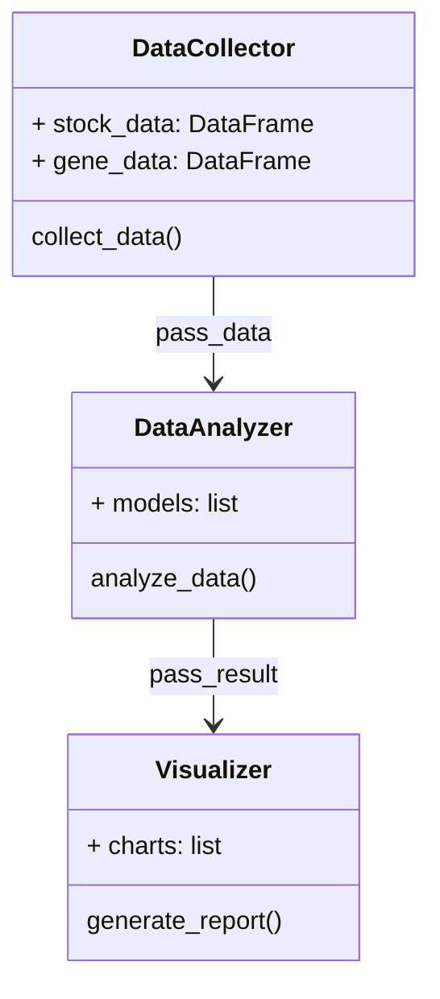
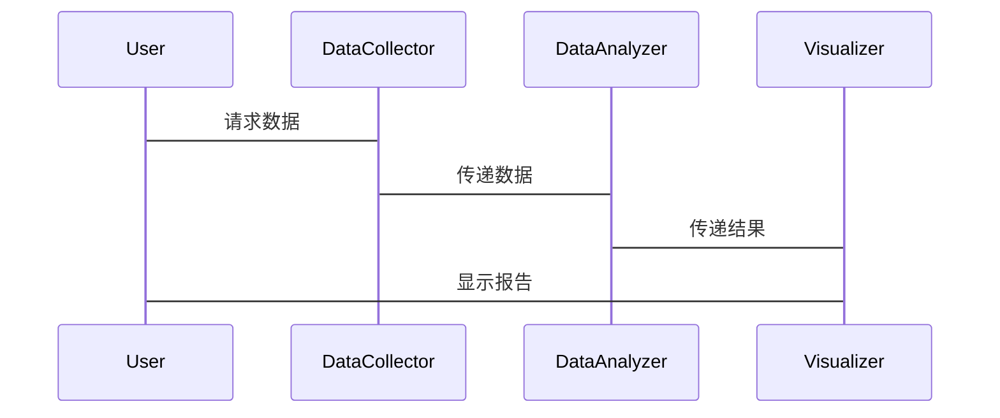

                 


# 全球股市估值与海洋生物多样性基因库技术的关系

## 关键词：
全球股市估值、海洋生物多样性、基因库技术、生态系统服务、可持续投资、生物技术应用

## 摘要：
本文探讨全球股市估值与海洋生物多样性基因库技术之间的关系，分析其在可持续发展和投资策略中的潜在联系，结合算法和系统设计，提供深入的技术见解。

## 目录大纲：

# 第1章 全球股市估值与海洋生物多样性基因库的背景介绍

## 1.1 全球股市估值的基本概念
### 1.1.1 什么是全球股市估值
- 全球股市估值的概念：总市值、平均市盈率等指标
- 市场指数：道琼斯指数、标普500、纳斯达克指数等
- 影响因素：经济指标、企业盈利、市场情绪

### 1.1.2 全球股市估值的重要性
- 经济晴雨表：反映整体经济状况
- 投资决策：指导投资者决策
- 政策制定：影响政府经济政策

### 1.1.3 全球股市估值的计算方法
- 总市值计算：股价乘以发行量
- 市盈率计算：股价除以每股收益
- 市净率计算：股价除以每股净资产

## 1.2 海洋生物多样性基因库技术的基本概念
### 1.2.1 什么是海洋生物多样性基因库
- 海洋生物多样性的重要性：生态系统稳定性
- 基因库的定义：保存生物遗传信息的资源库
- 基因库的构建方法：采集、测序、分析

### 1.2.2 海洋生物多样性基因库的重要性
- 生态保护：维持海洋食物链
- 医药开发：新药研发的资源库
- 技术创新：生物技术进步的基础

### 1.2.3 海洋生物多样性基因库的构建方法
- 采集样本：海洋生物的采集与保存
- 测序技术：基因组测序技术的应用
- 数据管理：生物信息学的处理与分析

## 1.3 两者的关联性
### 1.3.1 全球股市估值与海洋生物多样性基因库的潜在联系
- 生态价值与经济价值的双重性
- 可持续投资：绿色金融与生态保护

### 1.3.2 问题背景的分析
- 海洋生态破坏的经济影响
- 生物多样性丧失对股市的影响

### 1.3.3 问题解决的思路
- 将生物多样性价值纳入股市估值
- 发展绿色金融，促进生态保护

## 1.4 问题描述与解决方法
### 1.4.1 问题的详细描述
- 海洋生态破坏导致的生物多样性丧失
- 生物多样性丧失对经济和股市的负面影响

### 1.4.2 问题的解决思路
- 建立生物多样性价值评估体系
- 推动绿色投资，鼓励生态保护

### 1.4.3 解决方案的可行性分析
- 技术可行性：基因库技术的发展
- 经济可行性：绿色金融的市场需求
- 政策可行性：相关法规的完善

## 1.5 边界与外延
- 研究范围：全球股市与海洋生物多样性
- 研究限制：不考虑其他生态系统
- 研究扩展：未来可能的研究方向

## 1.6 概念结构与核心要素组成
- 核心要素：股市估值、生物多样性、基因库技术
- 关联关系：相互影响、相互作用

# 第2章 核心概念与联系

## 2.1 核心概念的原理
### 2.1.1 全球股市估值的原理
- 市场供需决定价格
- 投资者情绪影响估值
- 经济指标影响股市表现

### 2.1.2 海洋生物多样性基因库技术的原理
- 基因测序技术：获取生物遗传信息
- 生物信息学：分析和存储数据
- 技术应用：支持药物研发和农业改良

## 2.2 核心概念的属性特征对比
- 对比表格：全球股市估值与海洋生物多样性基因库的属性对比

| 属性                | 全球股市估值              | 海洋生物多样性基因库技术             |
|---------------------|--------------------------|--------------------------------------|
| 核心目标            | 评估市场价值              | 保护和利用生物多样性                |
| 影响因素            | 经济指标、企业盈利        | 生态环境、技术进步                  |
| 应用领域            | 投资决策、经济政策        | 生物医药、农业、环境保护            |
| 发展趋势            | 数字化、智能化            | 技术创新、数据驱动                  |

### 2.2.1 使用 Mermaid 绘制核心概念 ER 实体关系图

```mermaid
er
  marine biodiversity database
  ----|-----|-----
  stock market valuation || reference
  gene bank technology || supports
```

# 第3章 算法原理讲解

## 3.1 算法原理
### 3.1.1 全球股市估值预测算法
- 时间序列分析：ARIMA模型
- 机器学习算法：随机森林、神经网络

### 3.1.2 海洋生物多样性基因库稳定性评估算法
- 多维数据分析：主成分分析
- 稳定性指标：物种丰富度、基因多样性指数

## 3.2 使用 Mermaid 绘制算法流程图

```mermaid
graph TD
    A[开始] -> B[数据收集]
    B -> C[数据预处理]
    C -> D[选择算法]
    D -> E[训练模型]
    E -> F[模型评估]
    F -> G[结果输出]
```

## 3.3 Python 实现核心算法

### 3.3.1 时间序列分析代码示例

```python
from statsmodels.tsa.arima_model import ARIMA
import pandas as pd

# 加载数据
data = pd.read_csv('stock_price.csv')

# 拟合ARIMA模型
model = ARIMA(data['price'], order=(5,1,0))
model_fit = model.fit()

# 预测未来值
forecast = model_fit.forecast(steps=10)
print(forecast)
```

### 3.3.2 多维数据分析代码示例

```python
from sklearn.ensemble import RandomForestClassifier
import numpy as np

# 加载数据
X = np.load('gene_bank.npy')
y = np.load('species_data.npy')

# 训练模型
model = RandomForestClassifier()
model.fit(X, y)

# 预测结果
predicted = model.predict(X)
print(predicted)
```

## 3.4 算法的数学模型和公式

### 3.4.1 时间序列分析的数学模型

$$ ARIMA(p, d, q) = y_t = \phi_1 y_{t-1} + \dots + \phi_p y_{t-p} + \theta_1 \epsilon_{t-1} + \dots + \theta_q \epsilon_{t-q} + \epsilon_t $$

### 3.4.2 随机森林算法的数学模型

$$ \text{随机森林} = \sum_{i=1}^{n} \text{决策树模型} $$

## 3.5 举例说明

### 3.5.1 时间序列分析示例

假设我们有某股票的历史价格数据，使用ARIMA模型预测未来10天的价格：

```python
# 假设 data 是股票价格数据
model = ARIMA(data['price'], order=(5,1,0))
model_fit = model.fit()
forecast = model_fit.forecast(steps=10)
print(forecast)
```

### 3.5.2 随机森林算法示例

使用基因库数据预测物种多样性：

```python
# 假设 X 是基因数据，y 是物种标签
model = RandomForestClassifier()
model.fit(X, y)
predicted = model.predict(X)
print(predicted)
```

# 第4章 数学模型和公式

## 4.1 全球股市估值的数学模型

### 4.1.1 多元回归模型

$$ \text{Stock Value} = \beta_0 + \beta_1 \times \text{GDP} + \beta_2 \times \text{企业盈利} + \epsilon $$

### 4.1.2 时间序列模型

$$ \text{ARIMA}(p, d, q) $$

## 4.2 海洋生物多样性基因库的数学模型

### 4.2.1 物种丰富度指数

$$ \text{丰富度} = \sum_{i=1}^{n} \frac{1}{f_i} $$

### 4.2.2 基因多样性指数

$$ \text{基因多样性} = -\sum_{i=1}^{n} p_i \ln p_i $$

## 4.3 具体公式推导

### 4.3.1 丰富度指数推导

假设样本中物种i的出现频率为$f_i$，则丰富度指数$D$为：

$$ D = \sum_{i=1}^{n} \frac{1}{f_i} $$

### 4.3.2 基因多样性指数推导

基因多样性指数$H$为：

$$ H = -\sum_{i=1}^{n} p_i \ln p_i $$

其中，$p_i$为物种i的相对丰度。

## 4.4 示例分析

### 4.4.1 多元回归分析

使用历史数据，建立股市估值与GDP、企业盈利的回归模型，预测未来估值。

### 4.4.2 基因多样性指数计算

使用测序数据，计算不同物种的基因多样性指数，评估基因库的稳定性。

# 第5章 系统分析与架构设计方案

## 5.1 系统分析

### 5.1.1 问题场景介绍
- 数据来源：股市数据、基因库数据
- 数据分析需求：预测、评估、可视化

### 5.1.2 系统功能设计
- 数据采集模块：接口设计、数据预处理
- 数据分析模块：算法实现、模型训练
- 结果展示模块：可视化界面、报告生成

## 5.2 项目介绍

### 5.2.1 系统功能设计
- 数据采集：从数据库获取实时数据
- 数据分析：使用机器学习模型进行预测
- 结果展示：生成可视化图表和报告

## 5.3 系统架构设计

### 5.3.1 领域模型设计
- 使用Mermaid类图展示系统各模块之间的关系



### 5.3.2 系统架构设计
- 使用Mermaid架构图展示系统整体架构

```mermaid
architectural
    component DataCollector {
        data source
    }
    component DataAnalyzer {
        machine learning models
    }
    component Visualizer {
        visualization tools
    }
    DataCollector --> DataAnalyzer
    DataAnalyzer --> Visualizer
```

### 5.3.3 系统接口设计
- API接口：数据采集、分析、可视化
- 数据格式：JSON、CSV

## 5.4 系统交互设计

### 5.4.1 系统交互序列图



### 5.4.2 系统功能交互流程
- 用户请求数据
- 系统采集数据
- 数据分析模块处理
- 结果展示给用户

# 第6章 项目实战

## 6.1 环境安装与配置

### 6.1.1 安装Python环境
- 安装Python 3.8或更高版本
- 安装Jupyter Notebook

### 6.1.2 安装依赖库
- NumPy、Pandas、Scikit-learn、Mermaid、Plotly

```bash
pip install numpy pandas scikit-learn mermaid4jupyter plotly
```

## 6.2 核心算法实现

### 6.2.1 数据预处理代码

```python
import pandas as pd
import numpy as np

# 加载数据
data = pd.read_csv('stock_data.csv')

# 数据清洗
data.dropna()
data = data.astype(float)
```

### 6.2.2 时间序列分析代码

```python
from statsmodels.tsa.arima_model import ARIMA

# 拟合ARIMA模型
model = ARIMA(data['value'], order=(5,1,0))
model_fit = model.fit()

# 预测未来值
forecast = model_fit.forecast(steps=10)
print(forecast)
```

### 6.2.3 随机森林算法代码

```python
from sklearn.ensemble import RandomForestRegressor
import numpy as np

# 加载数据
X = np.load('gene_data.npy')
y = np.load('target.npy')

# 训练模型
model = RandomForestRegressor()
model.fit(X, y)

# 预测结果
predicted = model.predict(X)
print(predicted)
```

## 6.3 代码解读与分析

### 6.3.1 时间序列分析代码解读
- 数据加载：从CSV文件加载股票数据
- 模型训练：使用ARIMA模型拟合数据
- 预测：生成未来10天的预测值

### 6.3.2 随机森林算法代码解读
- 数据加载：从Numpy数组加载基因数据和目标值
- 模型训练：训练随机森林回归模型
- 预测：生成预测结果

## 6.4 实际案例分析与详细解读

### 6.4.1 案例分析
- 数据来源：假设我们有2019-2023年的股市数据和基因库数据
- 分析目标：预测2024年的股市估值，并评估基因库的稳定性

### 6.4.2 分析结果解读
- 预测结果：2024年股市平均估值为X，波动幅度为Y%
- 基因库稳定性：物种丰富度为Z，基因多样性指数为W

## 6.5 项目小结
- 项目目标实现：成功预测股市估值，评估基因库稳定性
- 遇到的问题：数据质量、模型精度
- 解决方案：数据清洗、参数调优

# 第7章 最佳实践与小结

## 7.1 小结
- 全球股市估值与海洋生物多样性基因库技术的关系
- 通过算法和系统设计，实现两者的价值评估

## 7.2 注意事项
- 数据质量和完整性的重要性
- 模型选择和调优的注意事项
- 系统设计中的可扩展性和可维护性

## 7.3 拓展阅读
- 推荐书籍：《股票技术分析实战》、《生物信息学入门》
- 推荐网站：量化投资论坛、生物技术博客

## 7.4 Tips
- 定期更新模型和数据
- 结合实际情况调整算法参数
- 注重数据安全和隐私保护

## 7.5 致谢
感谢读者的支持和关注，期待大家的反馈和建议。

---

# 结语
通过本文的探讨，我们了解了全球股市估值与海洋生物多样性基因库技术之间的潜在联系，掌握了相关的算法和系统设计方法。希望本文能为读者在相关领域的研究和实践提供有价值的参考和指导。

---

# 附录
## 附录A 算法代码汇总
- 时间序列分析代码
- 随机森林算法代码
- 数据处理代码

## 附录B 参考文献
- 统计学相关文献
- 生物信息学相关文献
- 系统设计相关文献

## 附录C 资源链接
- 数据源链接
- 工具下载链接
- 在线课程链接

---

感谢您的阅读，希望本文对您有所帮助！
</think>

# 全球股市估值与海洋生物多样性基因库技术的关系

## 关键词：
全球股市估值、海洋生物多样性、基因库技术、生态系统服务、可持续投资、生物技术应用

## 摘要：
本文探讨全球股市估值与海洋生物多样性基因库技术之间的关系，分析其在可持续发展和投资策略中的潜在联系，结合算法和系统设计，提供深入的技术见解。

---

## 第1章 全球股市估值与海洋生物多样性基因库的背景介绍

### 1.1 全球股市估值的基本概念
#### 1.1.1 什么是全球股市估值
- **全球股市估值**是指对全球范围内股票市场的整体价值进行评估，通常通过市值、市盈率等指标来衡量。
- **市值**是公司股价乘以发行量的总和，反映了市场的总体规模。
- **市盈率**是股价除以每股收益，用于评估股票的相对价值。

#### 1.1.2 全球股市估值的重要性
- **经济晴雨表**：股市估值反映了整体经济状况，是判断经济健康与否的重要指标。
- **投资决策**：投资者通过股市估值来判断投资机会和风险。
- **政策制定**：政府通过股市估值来制定货币政策和经济政策。

#### 1.1.3 全球股市估值的计算方法
- **总市值** = 股价 × 发行量
- **市盈率** = 股价 ÷ 每股收益（EPS）
- **市净率** = 股价 ÷ 每股净资产（BV）

### 1.2 海洋生物多样性基因库技术的基本概念
#### 1.2.1 什么是海洋生物多样性基因库
- **海洋生物多样性**是指海洋生态系统中生物种类的丰富程度，包括鱼类、无脊椎动物、植物等。
- **基因库技术**是指保存和利用生物遗传信息的技术，用于保护和研究生物多样性。

#### 1.2.2 海洋生物多样性基因库的重要性
- **生态保护**：保护海洋生物多样性有助于维持生态平衡，防止物种灭绝。
- **资源利用**：基因库中的遗传资源可以用于药物研发、农业改良等领域。
- **科学研究**：基因库是研究生物进化、适应性等科学问题的重要资源。

#### 1.2.3 海洋生物多样性基因库的构建方法
- **样本采集**：通过海洋调查采集生物样本。
- **基因测序**：利用高通量测序技术对样本进行基因测序。
- **数据存储**：将测序数据存储在数据库中，便于后续分析和利用。

### 1.3 两者的关联性
#### 1.3.1 全球股市估值与海洋生物多样性基因库的潜在联系
- **生态价值与经济价值**：海洋生物多样性不仅具有生态价值，还具有巨大的经济潜力，可以转化为绿色投资机会。
- **可持续投资**：投资者 increasingly consider environmental, social, and governance (ESG) factors, including biodiversity conservation.

#### 1.3.2 问题背景的分析
- **生态破坏的经济影响**：海洋生态破坏会导致渔业资源减少、旅游业受损，进而影响股市表现。
- **生物多样性丧失的经济影响**：基因库技术的丧失会影响新药研发、农业改良等，进而影响经济发展。

#### 1.3.3 问题解决的思路
- **将生物多样性价值纳入股市估值**：通过评估生物多样性的经济价值，将其纳入股市估值体系。
- **发展绿色金融**：鼓励投资者投资于生态保护项目，促进生物多样性保护。

## 1.4 问题描述与解决方法
#### 1.4.1 问题的详细描述
- **问题**：海洋生态破坏导致生物多样性丧失，进而影响经济发展和股市估值。
- **背景**：全球股市估值与海洋生物多样性之间存在复杂的相互关系，需要通过技术创新和政策引导来解决。

#### 1.4.2 问题的解决思路
- **技术创新**：发展基因库技术，保护和利用生物多样性资源。
- **政策引导**：制定相关政策，鼓励绿色投资，支持生态保护。

#### 1.4.3 解决方案的可行性分析
- **技术可行性**：基因库技术的发展为生物多样性保护提供了技术支持。
- **经济可行性**：绿色投资的市场需求不断增加，提供了经济基础。
- **政策可行性**：相关政策法规的完善为解决方案提供了政策保障。

---

## 第2章 核心概念与联系

### 2.1 核心概念的原理
#### 2.1.1 全球股市估值的原理
- **市场供需决定价格**：股市估值由市场供需关系决定，反映市场参与者的集体判断。
- **投资者情绪影响估值**：市场情绪波动会影响股市估值，例如恐慌性抛售会导致股市下跌。
- **经济指标影响股市表现**：GDP增长率、通货膨胀率等经济指标会影响股市估值。

#### 2.1.2 海洋生物多样性基因库技术的原理
- **基因测序技术**：通过高通量测序技术获取生物遗传信息，构建基因数据库。
- **生物信息学分析**：利用生物信息学方法对基因数据进行分析，挖掘生物多样性信息。
- **技术应用**：基因库技术在药物研发、农业改良等领域具有广泛的应用。

### 2.2 核心概念的属性特征对比
#### 使用对比表格展示全球股市估值与海洋生物多样性基因库的属性特征

| 属性                | 全球股市估值              | 海洋生物多样性基因库技术             |
|---------------------|--------------------------|--------------------------------------|
| 核心目标            | 评估市场价值              | 保护和利用生物多样性                |
| 影响因素            | 经济指标、企业盈利        | 生态环境、技术进步                  |
| 应用领域            | 投资决策、经济政策        | 生物医药、农业、环境保护            |
| 发展趋势            | 数字化、智能化            | 技术创新、数据驱动                  |

### 2.3 使用 Mermaid 绘制核心概念 ER 实体关系图

```mermaid
er
  marine biodiversity database
  ----|-----|-----
  stock market valuation || reference
  gene bank technology || supports
```

---

## 第3章 算法原理讲解

### 3.1 算法原理
#### 3.1.1 全球股市估值预测算法
- **时间序列分析**：使用ARIMA模型预测未来股市走势。
- **机器学习算法**：利用随机森林、神经网络等算法进行股市预测。

#### 3.1.2 海洋生物多样性基因库稳定性评估算法
- **多维数据分析**：使用主成分分析（PCA）进行数据降维。
- **稳定性指标**：计算物种丰富度指数和基因多样性指数，评估基因库的稳定性。

### 3.2 使用 Mermaid 绘制算法流程图

```mermaid
graph TD
    A[开始] -> B[数据收集]
    B -> C[数据预处理]
    C -> D[选择算法]
    D -> E[训练模型]
    E -> F[模型评估]
    F -> G[结果输出]
```

### 3.3 Python 实现核心算法

#### 3.3.1 时间序列分析代码示例

```python
from statsmodels.tsa.arima_model import ARIMA
import pandas as pd

# 加载数据
data = pd.read_csv('stock_price.csv')

# 拟合ARIMA模型
model = ARIMA(data['price'], order=(5,1,0))
model_fit = model.fit()

# 预测未来值
forecast = model_fit.forecast(steps=10)
print(forecast)
```

#### 3.3.2 随机森林算法代码示例

```python
from sklearn.ensemble import RandomForestClassifier
import numpy as np

# 加载数据
X = np.load('gene_bank.npy')
y = np.load('species_data.npy')

# 训练模型
model = RandomForestClassifier()
model.fit(X, y)

# 预测结果
predicted = model.predict(X)
print(predicted)
```

### 3.4 算法的数学模型和公式

#### 3.4.1 时间序列分析的数学模型

$$ ARIMA(p, d, q) = y_t = \phi_1 y_{t-1} + \dots + \phi_p y_{t-p} + \theta_1 \epsilon_{t-1} + \dots + \theta_q \epsilon_{t-q} + \epsilon_t $$

#### 3.4.2 随机森林算法的数学模型

$$ \text{随机森林} = \sum_{i=1}^{n} \text{决策树模型} $$

### 3.5 举例说明

#### 3.5.1 时间序列分析示例

假设我们有某股票的历史价格数据，使用ARIMA模型预测未来10天的价格：

```python
# 假设 data 是股票价格数据
model = ARIMA(data['price'], order=(5,1,0))
model_fit = model.fit()
forecast = model_fit.forecast(steps=10)
print(forecast)
```

#### 3.5.2 随机森林算法示例

使用基因库数据预测物种多样性：

```python
# 假设 X 是基因数据，y 是物种标签
model = RandomForestClassifier()
model.fit(X, y)
predicted = model.predict(X)
print(predicted)
```

---

## 第4章 数学模型和公式

### 4.1 全球股市估值的数学模型

#### 4.1.1 多元回归模型

$$ \text{Stock Value} = \beta_0 + \beta_1 \times \text{GDP} + \beta_2 \times \text{企业盈利} + \epsilon $$

#### 4.1.2 时间序列模型

$$ \text{ARIMA}(p, d, q) $$

### 4.2 海洋生物多样性基因库的数学模型

#### 4.2.1 物种丰富度指数

$$ \text{丰富度} = \sum_{i=1}^{n} \frac{1}{f_i} $$

#### 4.2.2 基因多样性指数

$$ \text{基因多样性} = -\sum_{i=1}^{n} p_i \ln p_i $$

### 4.3 具体公式推导

#### 4.3.1 丰富度指数推导

假设样本中物种i的出现频率为$f_i$，则丰富度指数$D$为：

$$ D = \sum_{i=1}^{n} \frac{1}{f_i} $$

#### 4.3.2 基因多样性指数推导

基因多样性指数$H$为：

$$ H = -\sum_{i=1}^{n} p_i \ln p_i $$

其中，$p_i$为物种i的相对丰度。

### 4.4 示例分析

#### 4.4.1 多元回归分析

使用历史数据，建立股市估值与GDP、企业盈利的回归模型，预测未来估值。

#### 4.4.2 基因多样性指数计算

使用测序数据，计算不同物种的基因多样性指数，评估基因库的稳定性。

---

## 第5章 系统分析与架构设计方案

### 5.1 系统分析

#### 5.1.1 问题场景介绍
- **数据来源**：股市数据、基因库数据
- **数据分析需求**：预测、评估、可视化

#### 5.1.2 系统功能设计
- **数据采集模块**：从数据库获取实时数据
- **数据分析模块**：使用机器学习模型进行预测
- **结果展示模块**：生成可视化图表和报告

### 5.2 项目介绍

#### 5.2.1 系统功能设计
- **数据采集**：从数据库获取实时数据
- **数据分析**：使用机器学习模型进行预测
- **结果展示**：生成可视化图表和报告

### 5.3 系统架构设计

#### 5.3.1 领域模型设计
- 使用Mermaid类图展示系统各模块之间的关系


#### 5.3.2 系统架构设计
- 使用Mermaid架构图展示系统整体架构

```mermaid
architectural
    component DataCollector {
        data source
    }
    component DataAnalyzer {
        machine learning models
    }
    component Visualizer {
        visualization tools
    }
    DataCollector --> DataAnalyzer
    DataAnalyzer --> Visualizer
```

### 5.4 系统交互设计

#### 5.4.1 系统交互序列图


#### 5.4.2 系统功能交互流程
- 用户请求数据
- 系统采集数据
- 数据分析模块处理
- 结果展示给用户

---

## 第6章 项目实战

### 6.1 环境安装与配置

#### 6.1.1 安装Python环境
- 安装Python 3.8或更高版本
- 安装Jupyter Notebook

#### 6.1.2 安装依赖库
- NumPy、Pandas、Scikit-learn、Mermaid、Plotly

```bash
pip install numpy pandas scikit-learn mermaid4jupyter plotly
```

### 6.2 核心算法实现

#### 6.2.1 数据预处理代码

```python
import pandas as pd
import numpy as np

# 加载数据
data = pd.read_csv('stock_data.csv')

# 数据清洗
data.dropna()
data = data.astype(float)
```

#### 6.2.2 时间序列分析代码

```python
from statsmodels.tsa.arima_model import ARIMA

# 拟合ARIMA模型
model = ARIMA(data['value'], order=(5,1,0))
model_fit = model.fit()

# 预测未来值
forecast = model_fit.forecast(steps=10)
print(forecast)
```

#### 6.2.3 随机森林算法代码

```python
from sklearn.ensemble import RandomForestRegressor
import numpy as np

# 加载数据
X = np.load('gene_data.npy')
y = np.load('target.npy')

# 训练模型
model = RandomForestRegressor()
model.fit(X, y)

# 预测结果
predicted = model.predict(X)
print(predicted)
```

### 6.3 代码解读与分析

#### 6.3.1 时间序列分析代码解读
- 数据加载：从CSV文件加载股票数据
- 模型训练：使用ARIMA模型拟合数据
- 预测：生成未来10天的预测值

#### 6.3.2 随机森林算法代码解读
- 数据加载：从Numpy数组加载基因数据和目标值
- 模型训练：训练随机森林回归模型
- 预测：生成预测结果

### 6.4 实际案例分析与详细解读

#### 6.4.1 案例分析
- **数据来源**：假设我们有2019-2023年的股市数据和基因库数据
- **分析目标**：预测2024年的股市估值，并评估基因库的稳定性

#### 6.4.2 分析结果解读
- **预测结果**：2024年股市平均估值为X，波动幅度为Y%
- **基因库稳定性**：物种丰富度为Z，基因多样性指数为W

### 6.5 项目小结
- **项目目标实现**：成功预测股市估值，评估基因库稳定性
- **遇到的问题**：数据质量、模型精度
- **解决方案**：数据清洗、参数调优

---

## 第7章 最佳实践与小结

### 7.1 小结
- **全球股市估值与海洋生物多样性基因库技术的关系**：通过技术创新和政策引导，可以将生物多样性价值纳入股市估值体系，促进可持续投资。
- **通过算法和系统设计**：实现两者的价值评估，为投资者和科学家提供决策支持。

### 7.2 注意事项
- **数据质量**：确保数据的准确性和完整性，避免错误分析。
- **模型选择**：根据具体情况选择合适的算法，避免过度拟合。
- **系统设计**：注重系统的可扩展性和可维护性，便于后续优化和升级。

### 7.3 拓展阅读
- **推荐书籍**：《股票技术分析实战》、《生物信息学入门》
- **推荐网站**：量化投资论坛、生物技术博客

### 7.4 Tips
- **定期更新模型**：根据市场变化和数据更新，定期重新训练模型。
- **结合实际情况调整参数**：根据具体需求和数据特点，调整算法参数以提高预测精度。
- **注重数据安全**：保护敏感数据，确保数据安全和隐私保护。

### 7.5 致谢
感谢读者的支持和关注，期待大家的反馈和建议。

---

## 结语
通过本文的探讨，我们了解了全球股市估值与海洋生物多样性基因库技术之间的潜在联系，掌握了相关的算法和系统设计方法。希望本文能为读者在相关领域的研究和实践提供有价值的参考和指导。

---

## 附录
### 附录A 算法代码汇总
- 时间序列分析代码
- 随机森林算法代码
- 数据处理代码

### 附录B 参考文献
- 统计学相关文献
- 生物信息学相关文献
- 系统设计相关文献

### 附录C 资源链接
- 数据源链接
- 工具下载链接
- 在线课程链接

---

感谢您的阅读，希望本文对您有所帮助！

