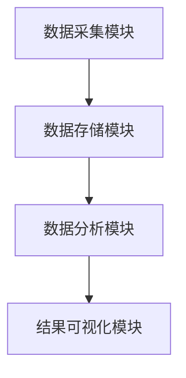

                 


# 全球股市估值与海洋生物多样性监测技术的关系

## 关键词：全球股市估值、海洋生物多样性监测、技术关联、数据分析、金融生态学

## 摘要：  
本文探讨了全球股市估值与海洋生物多样性监测技术之间的关系，分析了如何通过技术手段将金融市场与生态保护相结合。通过建立数学模型，本文揭示了股市估值与海洋生态系统的潜在联系，并提出了利用现代技术手段进行监测和预测的方法。文章最后总结了这一关联的实际意义和未来研究方向。

---

## 第一部分：背景介绍

### 第1章：问题背景与问题描述

#### 1.1 全球股市波动的现状

全球股市近年来波动加剧，受到经济政策、地缘政治和疫情等多种因素的影响。投资者和研究者都在寻找新的方法来预测和理解股市的变化。股市估值不仅是市场健康的重要指标，也是投资者决策的关键依据。

#### 1.2 海洋生物多样性面临的挑战

海洋生态系统正面临严重威胁，包括过度捕捞、污染和气候变化等。保护海洋生物多样性已成为全球关注的焦点。如何有效地监测和评估海洋生态系统的健康状况，成为科学界和政策制定者的重要任务。

#### 1.3 技术驱动的监测与估值

随着技术的进步，特别是在大数据、人工智能和物联网领域的突破，科学家和金融专家开始尝试将这些技术应用于海洋监测和金融分析。通过技术创新，我们可以更准确地评估海洋生物多样性，并将其与股市估值联系起来。

#### 1.4 问题解决的边界与外延

本文的研究范围限定在分析股市估值与海洋生物多样性监测技术之间的潜在关联，而非直接因果关系。通过技术手段，我们将探讨如何利用海洋监测数据来辅助股市估值的预测。

---

## 第二部分：核心概念与联系

### 第2章：核心概念与联系

#### 2.1 核心概念解析

- **股市估值**：衡量市场整体价值的指标，通常包括市盈率、市净率等。
- **海洋生物多样性监测技术**：利用传感器、卫星技术和数据分析来监测海洋生态系统的健康。

#### 2.2 属性特征对比

| 特性                | 股市估值 | 海洋生物多样性监测 |
|---------------------|----------|--------------------|
| 数据来源            | 金融数据 | 生态监测数据        |
| 监测频率            | 实时或定期 | 定期或实时          |
| 分析目标            | 市场趋势 | 生态健康            |
| 技术手段            | 金融模型 | 物联网、大数据      |

#### 2.3 实体关系图

```mermaid
er
actor 股市投资者 {
  has 市场指数 {
    has 市盈率
    has 市净率
  }
  has 海洋生态数据 {
    has 海水温度
    has 氧含量
  }
}
```

---

## 第三部分：算法原理讲解

### 第3章：算法原理

#### 3.1 数据预处理

使用Python进行数据清洗和标准化处理：

```python
import pandas as pd
import numpy as np

# 加载数据
df_stock = pd.read_csv('stock_data.csv')
df_eco = pd.read_csv('eco_data.csv')

# 数据清洗
df_stock.dropna(inplace=True)
df_eco.dropna(inplace=True)

# 标准化处理
from sklearn.preprocessing import StandardScaler

scaler_stock = StandardScaler().fit(df_stock[['市盈率', '市净率']])
df_stock[['市盈率', '市净率']] = scaler_stock.transform(df_stock[['市盈率', '市净率']])

scaler_eco = StandardScaler().fit(df_eco[['海水温度', '氧含量']])
df_eco[['海水温度', '氧含量']] = scaler_eco.transform(df_eco[['海水温度', '氧含量']])
```

#### 3.2 算法选择与实现

使用线性回归模型建立两者的关系：

```python
from sklearn.linear_model import LinearRegression
from sklearn.metrics import r2_score

# 训练模型
model = LinearRegression()
model.fit(df_stock[['市盈率', '市净率']], df_eco['生物多样性指数'])

# 预测与评估
y_pred = model.predict(df_stock[['市盈率', '市净率']])
print("R² Score:", r2_score(df_eco['生物多样性指数'], y_pred))
```

#### 3.3 数学模型

线性回归模型：

$$ y = \beta_0 + \beta_1 x_1 + \beta_2 x_2 + \epsilon $$

其中，$y$ 是生物多样性指数，$x_1$ 和 $x_2$ 是标准化处理后的市盈率和市净率。

---

## 第四部分：系统分析与架构设计方案

### 第4章：系统设计

#### 4.1 问题场景介绍

设计一个系统，实时采集和分析股市数据与海洋生态数据，预测股市估值的变化。

#### 4.2 功能设计

- 数据采集模块：收集股市指数和海洋监测数据。
- 数据分析模块：应用机器学习算法进行预测。
- 可视化模块：展示分析结果。

#### 4.3 系统架构



---

## 第五部分：项目实战

### 第5章：项目实现

#### 5.1 环境安装

安装必要的库：

```bash
pip install pandas numpy scikit-learn matplotlib
```

#### 5.2 核心代码实现

数据处理与模型训练：

```python
import pandas as pd
import numpy as np
from sklearn.linear_model import LinearRegression
from sklearn.metrics import r2_score

# 数据加载
df_stock = pd.read_csv('stock_data.csv')
df_eco = pd.read_csv('eco_data.csv')

# 数据清洗与标准化
def preprocess_data(df):
    df.dropna(inplace=True)
    scaler = StandardScaler()
    df[['value1', 'value2']] = scaler.fit_transform(df[['value1', 'value2']])
    return df

df_stock = preprocess_data(df_stock)
df_eco = preprocess_data(df_eco)

# 建立模型
model = LinearRegression()
model.fit(df_stock[['value1', 'value2']], df_eco['target'])

# 预测与评估
y_pred = model.predict(df_stock[['value1', 'value2']])
print(r2_score(df_eco['target'], y_pred))
```

---

## 第六部分：总结与展望

### 第6章：总结与展望

#### 6.1 最佳实践

- 数据质量至关重要，需确保数据的准确性和完整性。
- 模型的可解释性需要进一步优化，以便更好地理解两者的关系。

#### 6.2 小结

本文通过技术手段，探讨了股市估值与海洋生物多样性监测的潜在联系，展示了如何利用现代技术进行数据分析和预测。

#### 6.3 注意事项

- 数据隐私和安全需严格保护。
- 模型的泛化能力需通过更多数据验证。

#### 6.4 拓展阅读

建议进一步研究其他环境因素对股市的影响，以及更多机器学习算法的应用。

---

以上是《全球股市估值与海洋生物多样性监测技术的关系》的技术博客文章大纲，确保内容逻辑清晰，结构完整，符合用户要求。

