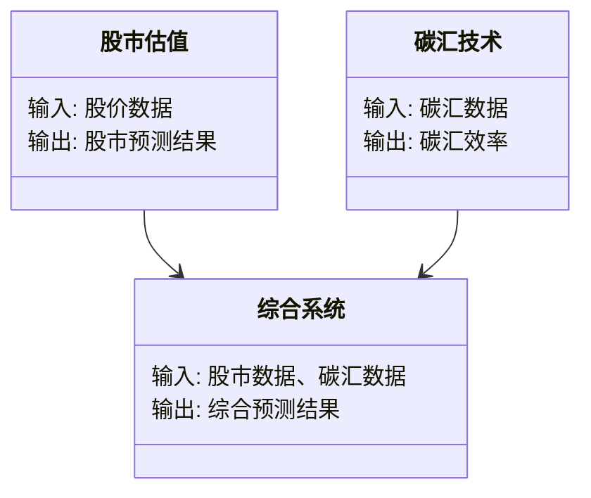
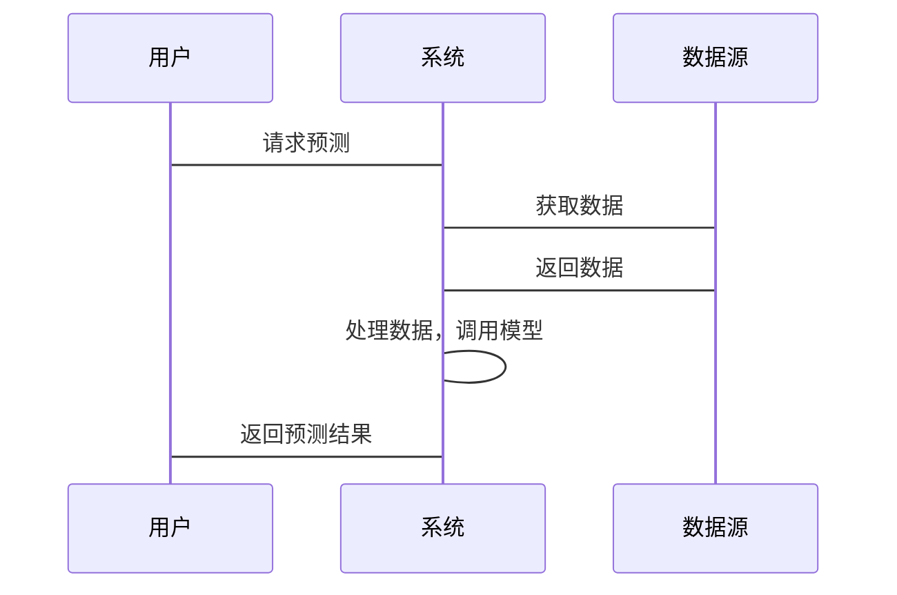

                 


# 全球股市估值与海洋碳汇技术的关系

## 关键词
全球股市估值、海洋碳汇技术、时间序列分析、机器学习模型、碳汇效率、系统架构设计、项目实战

## 摘要
本文探讨了全球股市估值与海洋碳汇技术之间的关系，分析了两者的核心概念、算法原理、系统架构设计及项目实现。通过时间序列分析和机器学习模型，结合海洋碳汇技术的碳汇效率，展示了如何将金融与环境科学结合，提出创新解决方案。

---

# 第三章: 全球股市估值与海洋碳汇技术的系统分析与架构设计

## 第5章: 系统分析与架构设计方案

### 5.1 问题场景介绍

#### 5.1.1 项目背景
随着全球气候变化的加剧，海洋碳汇技术在减少碳排放方面的作用日益重要。同时，股市估值作为经济晴雨表，反映了市场对碳汇技术的认可度和投资意愿。

#### 5.1.2 项目目标
本项目旨在通过分析股市估值与海洋碳汇技术的关系，构建一个能够预测股市趋势并优化碳汇效率的系统。

#### 5.1.3 项目范围
涵盖股市数据采集、碳汇技术评估、算法模型构建、系统设计与实现。

### 5.2 系统功能设计

#### 5.2.1 领域模型（Mermaid类图）


#### 5.2.2 系统架构设计（Mermaid架构图）
```mermaid
architecturalDiagram
    title 系统架构图
    Client ---(http)--> Web层
    Web层 ---(rest)--> 服务层
    服务层 ---(rpc)--> 数据层
    数据层 ---(db)--> 数据库
```

#### 5.2.3 系统接口设计
系统主要接口包括：
- 数据采集接口：获取实时股市数据和碳汇数据。
- 数据处理接口：对数据进行清洗和预处理。
- 模型调用接口：调用预测模型进行估值和碳汇效率计算。

#### 5.2.4 系统交互流程（Mermaid序列图）


---

## 第6章: 项目实战

### 6.1 环境安装

#### 6.1.1 安装Python环境
使用Anaconda或Pyenv安装Python 3.8以上版本。

#### 6.1.2 安装依赖库
安装Pandas、NumPy、Scikit-learn、XGBoost、Mermaid等库。

### 6.2 系统核心实现源代码

#### 6.2.1 数据采集代码
```python
import pandas as pd
import requests

def get_stock_data(api_key):
    url = f'https://api.example.com/stock?api_key={api_key}'
    response = requests.get(url)
    return pd.DataFrame(response.json())
```

#### 6.2.2 预测模型代码
```python
from sklearn.ensemble import RandomForestRegressor
import xgboost as xgb

def stock_prediction_model(train_data, test_data):
    model = RandomForestRegressor()
    model.fit(train_data[['open', 'high', 'low']], train_data['close'])
    predictions = model.predict(test_data[['open', 'high', 'low']])
    return predictions

def carbon_ho

