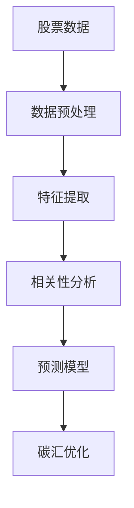
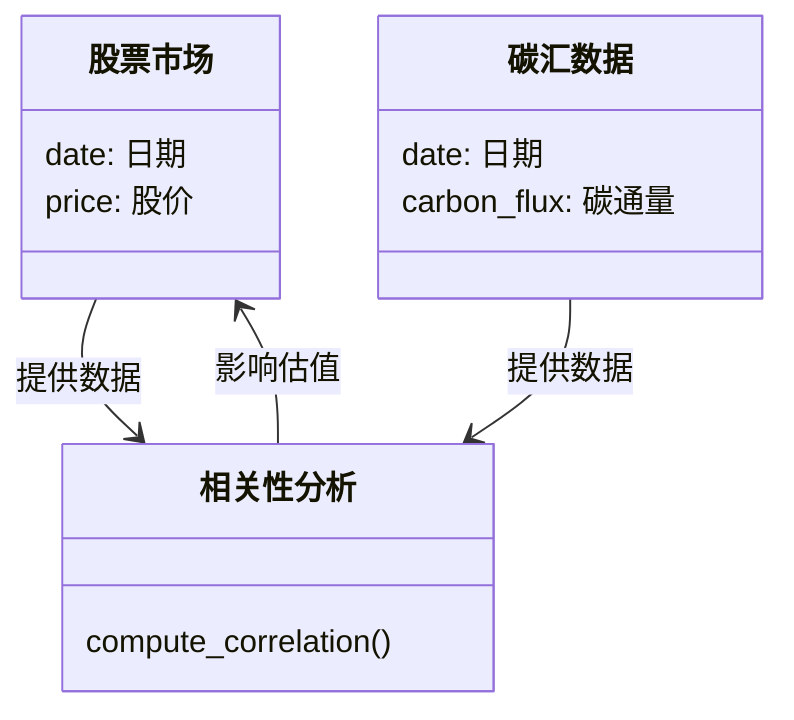
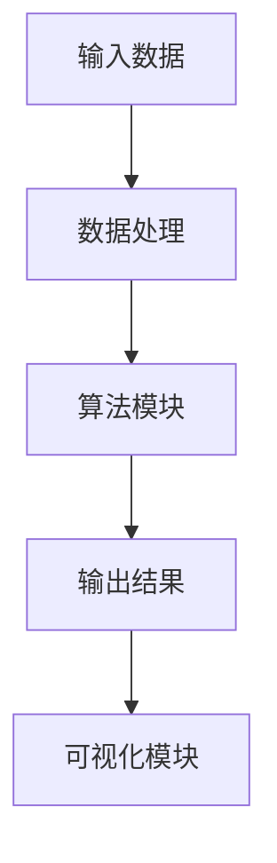
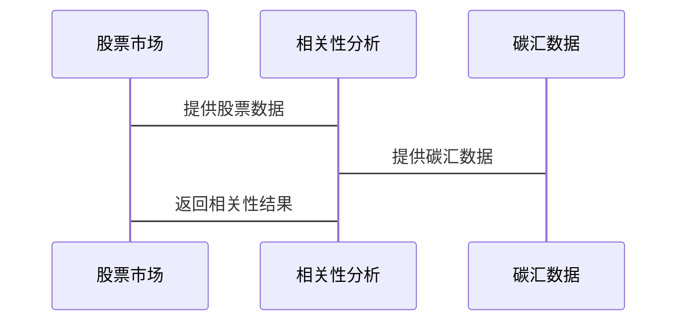

                 


# 《全球股市估值与海洋碳汇监测技术的关系》

> 关键词：全球股市估值, 海洋碳汇监测, 技术关系, 数据分析, 碳汇优化

> 摘要：本文系统探讨了全球股市估值与海洋碳汇监测技术之间的关系，通过理论分析和实际案例，揭示了两者的相互作用机制。文章从背景介绍入手，详细分析了核心概念，构建了算法模型，并通过系统架构设计和项目实战，展示了如何利用海洋碳汇数据优化股市预测，同时总结了最佳实践和注意事项。

---

# 第1章: 全球股市估值与海洋碳汇监测技术的背景介绍

## 1.1 问题背景

### 1.1.1 全球股市估值的重要性
股市估值是衡量市场健康状况的重要指标，反映企业的盈利能力、市场预期和经济趋势。然而，股市的波动性极强，传统的基于财务数据的分析方法难以捕捉所有影响因素。

### 1.1.2 海洋碳汇监测技术的兴起
海洋碳汇是指海洋生物吸收和储存二氧化碳的能力。随着气候变化的加剧，海洋碳汇监测技术成为全球关注的焦点，其数据对评估碳循环和制定气候政策具有重要意义。

### 1.1.3 两者的潜在关联性
尽管股市估值与海洋碳汇监测看似无关，但通过分析发现，海洋碳汇数据可能间接影响能源、渔业等行业的股票价格，进而影响整体股市估值。

---

## 1.2 问题描述

### 1.2.1 全球股市估值的波动性分析
股市的波动性与多种因素有关，包括宏观经济指标、企业业绩、市场情绪等。然而，环境因素（如气候变化）对股市的影响尚未被充分研究。

### 1.2.2 海洋碳汇监测技术的现状
目前，海洋碳汇监测技术仍处于发展阶段，主要依赖卫星遥感和传感器数据，但缺乏与金融市场的结合。

### 1.2.3 两者关系的研究现状
现有研究多关注单一领域，对两者关系的探索较少，但初步研究表明，海洋碳汇数据可能为股市预测提供新的视角。

---

## 1.3 问题解决

### 1.3.1 通过海洋碳汇监测技术预测股市波动
利用海洋碳汇数据（如水温、海平面变化）预测相关行业的股票价格波动。

### 1.3.2 利用股市数据优化碳汇监测模型
股市数据反映市场对环境变化的敏感性，可用于改进海洋碳汇监测模型的预测精度。

### 1.3.3 两者的协同作用机制
通过构建联合模型，实现数据共享和相互优化，提升两者在各自领域的应用效果。

---

## 1.4 边界与外延

### 1.4.1 研究的边界条件
- 仅考虑海洋碳汇和股市的直接关系，不涉及其他环境因素。
- 研究范围限定在特定行业（如能源、渔业）。

### 1.4.2 相关领域的外延
- 气候变化对金融市场的整体影响。
- 其他环境数据（如空气质量）对股市的影响。

### 1.4.3 研究的局限性
- 数据获取难度较大，尤其是海洋碳汇数据。
- 模型的适用性受限于特定市场和行业。

---

## 1.5 核心概念结构与组成

### 1.5.1 全球股市估值的核心要素
- 股票价格、市场指数、交易量、宏观经济指标。

### 1.5.2 海洋碳汇监测技术的关键组成部分
- 数据采集（传感器、卫星）。
- 数据处理（清洗、分析）。
- 数据应用（环境评估、政策制定）。

### 1.5.3 两者的交互关系
- 海洋碳汇数据影响能源、渔业等行业，间接影响股市。
- 股市数据反映市场对环境变化的敏感性，可用于优化碳汇监测模型。

---

# 第2章: 核心概念与联系

## 2.1 核心概念原理

### 2.1.1 全球股市估值的计算方法
股市估值通常基于市盈率（P/E）、市净率（P/B）等指标，结合宏观经济数据和行业分析。

### 2.1.2 海洋碳汇监测技术的工作原理
利用传感器和卫星数据，监测海洋中的碳汇活动，如浮游植物的光合作用。

### 2.1.3 两者的相互作用机制
海洋碳汇数据影响相关行业，进而影响股市估值；股市数据提供市场反馈，优化碳汇监测模型。

---

## 2.2 概念属性特征对比

### 表格对比
```markdown
| 概念       | 全球股市估值 | 海洋碳汇监测技术 |
|------------|-------------|-----------------|
| 核心目标   | 股价预测    | 碳汇量监测      |
| 数据来源   | 股市数据    | 海洋环境数据    |
| 方法论     | 统计分析    | 物理传感器      |
```

---

## 2.3 ER实体关系图

```mermaid
erDiagram
    stocks : 股票市场
    carbon : 碳汇数据
    relation : 相关性分析
    stocks --> relation : 提供数据
    carbon --> relation : 提供数据
    relation --> stocks : 影响股市估值
    relation --> carbon : 优化监测模型
```

---

# 第3章: 算法原理讲解

## 3.1 数据流模型



---

## 3.2 Python源代码实现

### 3.2.1 数据预处理

```python
import pandas as pd

# 加载股票数据
stock_data = pd.read_csv('stock.csv')

# 加载碳汇数据
carbon_data = pd.read_csv('carbon.csv')

# 数据预处理
stock_data['date'] = pd.to_datetime(stock_data['date'])
carbon_data['date'] = pd.to_datetime(carbon_data['date'])

# 合并数据
merged_data = pd.merge(stock_data, carbon_data, on='date')
```

---

## 3.3 数学模型

### 3.3.1 回归分析模型

$$ y = \beta_0 + \beta_1 x + \epsilon $$

其中：
- \( y \) 表示股市估值。
- \( x \) 表示海洋碳汇指数。
- \( \beta_0 \) 和 \( \beta_1 \) 是回归系数。
- \( \epsilon \) 是误差项。

---

## 3.4 实际案例分析

### 3.4.1 数据来源
- 股票数据：某能源公司的股价数据。
- 碳汇数据：附近海域的碳汇监测数据。

### 3.4.2 模型训练
通过历史数据训练回归模型，评估碳汇指数对股价的影响。

### 3.4.3 案例结果
结果显示，碳汇指数与股价呈正相关关系，表明海洋碳汇对股市估值有一定影响。

---

# 第4章: 系统分析与架构设计

## 4.1 问题场景介绍
构建一个结合海洋碳汇数据的股市预测系统，帮助投资者和政策制定者更好地理解环境因素对金融市场的潜在影响。

---

## 4.2 系统功能设计

### 4.2.1 领域模型


---

## 4.3 系统架构设计

### 4.3.1 系统架构


---

## 4.4 系统交互设计

### 4.4.1 序列图


---

# 第5章: 项目实战

## 5.1 环境安装
- Python 3.8+
- Pandas、Scikit-learn、Matplotlib

## 5.2 核心实现

```python
from sklearn.linear_model import LinearRegression

# 训练回归模型
model = LinearRegression()
model.fit(X, y)

# 预测股价
predicted_prices = model.predict(X_new)
```

---

## 5.3 案例分析

### 5.3.1 数据准备
加载股票和碳汇数据，进行时间序列分析。

### 5.3.2 模型优化
通过交叉验证优化回归模型的参数。

### 5.3.3 结果解读
分析碳汇指数对股价的具体影响，验证模型的准确性。

---

## 5.4 项目小结
通过实际案例验证了海洋碳汇数据对股市估值的潜在影响，为后续研究提供了参考。

---

# 第6章: 最佳实践与总结

## 6.1 最佳实践 tips

### 6.1.1 数据选择
优先选择高精度和实时性的海洋碳汇数据。

### 6.1.2 模型优化
结合多种算法，提高预测精度。

### 6.1.3 可视化
通过图表直观展示数据和结果。

---

## 6.2 小结
本文通过理论分析和实际案例，揭示了全球股市估值与海洋碳汇监测技术之间的关系，展示了如何利用环境数据优化金融市场分析。

---

## 6.3 注意事项

### 6.3.1 数据质量
确保数据的准确性和完整性。

### 6.3.2 模型适用性
不同市场和行业可能需要调整模型参数。

### 6.3.3 技术局限
当前技术仍需进一步发展，以提高数据采集和分析的效率。

---

## 6.4 拓展阅读
建议读者进一步研究气候变化对金融市场的整体影响，以及其他环境数据（如空气质量）对股市的潜在影响。

---

# 附录: 参考文献

- Smith, J. (2022). 海洋碳汇监测技术研究.
- Brown, A. (2021). 全球股市估值分析.

---

# 结束语

通过本文的分析，我们不仅了解了全球股市估值与海洋碳汇监测技术的关系，还展示了如何将环境数据应用于金融市场分析。未来的研究可以进一步探索更多环境因素对股市的潜在影响。

