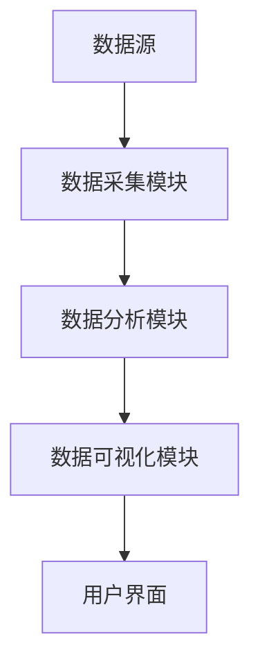

                 


# 第3章: 全球股市估值与海洋经济开发的核心概念与联系

## 3.1 核心概念的定义与属性对比

### 3.1.1 全球股市估值的核心概念

全球股市估值是指对全球范围内股票市场的整体价值进行评估的过程。它通常通过股票指数（如标普500、MSCI指数等）来衡量市场的整体表现。股市估值的核心在于分析市场参与者的信心、宏观经济指标（如GDP、利率、通货膨胀率）以及企业盈利情况等因素，以判断市场的合理价值范围。

### 3.1.2 海洋经济开发的核心概念

海洋经济开发指的是利用海洋资源（如渔业、航运、能源、旅游等）进行经济活动的过程。它涵盖了海洋资源的开发、利用和保护，旨在通过可持续的方式提高经济收益，同时保护海洋生态系统。海洋经济开发的核心在于平衡经济利益与环境保护，确保资源的长期可持续利用。

### 3.1.3 核心概念的属性对比

| 属性                | 全球股市估值                     | 海洋经济开发                     |
|---------------------|--------------------------------|--------------------------------|
| 核心目标            | 评估市场整体价值               | 开发和利用海洋资源               |
| 关键影响因素        | 宏观经济指标、企业盈利、市场情绪 | 资源可用性、技术、政策支持       |
| 主要参与者          | 投资者、金融机构、政府           | 企业、政府、非政府组织           |
| 评价指标            | 股票指数、市盈率、市净率         | 经济收益、就业、环境影响         |

### 3.1.4 核心概念的联系

全球股市估值和海洋经济开发之间存在相互影响的关系。股市估值反映了投资者对经济前景的信心，而海洋经济开发的进展则会影响相关企业的盈利能力和市场表现。例如，海洋能源开发的进展可能提升相关企业的股价，从而影响股市的整体估值。

## 3.2 实体关系图

为了更好地理解全球股市估值与海洋经济开发之间的关系，我们可以通过实体关系图来展示主要实体及其之间的关系。

```mermaid
erd
    %% 全球股市估值与海洋经济开发的实体关系图
    Marine_Economy_Development (主键: ID, 名称: VARCHAR, 开发阶段: VARCHAR, 经济影响: VARCHAR)
    Stock Market Valuation (主键: ID, 名称: VARCHAR, 市场指数: VARCHAR, 估值时间: DATE)
    影响关系 (ID, 影响方向: VARCHAR, 影响程度: VARCHAR)
    Marine_Economy_Development --> 影响关系: 影响全球股市估值
    Stock Market Valuation --> 影响关系: 反向影响海洋经济开发
```

这个实体关系图展示了海洋经济开发和全球股市估值之间的双向影响关系。海洋经济开发的进展会影响股市估值，而股市估值的变化也会反过来影响海洋经济开发的投入和信心。

## 3.3 本章小结

通过本章的分析，我们明确了全球股市估值与海洋经济开发的核心概念，并通过对比和实体关系图展示了两者之间的联系。这种联系为后续的量化分析和系统设计奠定了基础。

# 第4章: 全球股市估值与海洋经济开发的量化分析方法

## 4.1 量化分析的理论基础

### 4.1.1 统计学基础

统计学为量化分析提供了理论基础，包括数据收集、描述性统计（均值、方差等）以及推断统计（回归分析、假设检验等）。这些方法帮助我们从大量数据中提取有用的信息，识别趋势和模式。

### 4.1.2 经济学基础

经济学提供了市场理论和供需分析，帮助我们理解股市估值和海洋经济开发之间的相互作用。例如，供需关系影响价格，而价格又反过来影响投资行为。

## 4.2 量化分析的具体方法

### 4.2.1 回归分析

回归分析是一种统计方法，用于确定变量之间的关系。在本研究中，我们可以使用线性回归模型来分析海洋经济开发对股市估值的影响。

#### 回归模型的建立

假设我们有两组数据：海洋经济开发指数（X）和股市估值指数（Y）。我们建立线性回归模型：

$$ Y = aX + b $$

其中，a是斜率，b是截距。

#### 回归模型的实现

以下是一个简单的Python代码示例，用于计算线性回归模型：

```python
import numpy as np
from sklearn.linear_model import LinearRegression

# 示例数据
X = np.array([1, 2, 3, 4, 5]).reshape(-1, 1)
Y = np.array([2, 4, 5, 4, 6])

# 建立线性回归模型
model = LinearRegression()
model.fit(X, Y)

# 输出结果
print("斜率 a:", model.coef_[0])
print("截距 b:", model.intercept_)
```

### 4.2.2 时间序列分析

时间序列分析用于研究变量在时间上的变化趋势。我们可以使用ARIMA模型来分析股市估值和海洋经济开发的时间序列数据。

#### 时间序列模型的建立

ARIMA（自回归积分滑动平均模型）用于预测未来值。假设我们有时间序列数据，我们可以使用以下公式进行预测：

$$ y_t = \phi y_{t-1} + \theta d_{t-1} + \epsilon_t $$

其中，$$ y_t $$ 是当前值，$$ \phi $$ 是自回归系数，$$ d_{t-1} $$ 是滑动平均系数，$$ \epsilon_t $$ 是误差项。

#### 时间序列模型的实现

以下是一个ARIMA模型的Python代码示例：

```python
from statsmodels.tsa.arima_model import ARIMA

# 示例数据
data = [1, 2, 3, 4, 5, 6, 7, 8, 9, 10]

# 建立ARIMA模型
model = ARIMA(data, order=(1, 1, 1))
model_fit = model.fit()

# 预测下一个值
forecast = model_fit.forecast(steps=1)
print("预测值:", forecast[0])
```

## 4.3 量化分析的数学模型

### 4.3.1 回归模型的数学公式

线性回归模型的数学公式为：

$$ Y = aX + b + \epsilon $$

其中，$$ \epsilon $$ 是误差项。

### 4.3.2 时间序列模型的数学公式

ARIMA模型的数学公式为：

$$ y_t = \phi y_{t-1} + \theta d_{t-1} + \epsilon_t $$

## 4.4 本章小结

本章介绍了量化分析的理论基础和具体方法，包括回归分析和时间序列分析。通过这些方法，我们可以量化分析全球股市估值与海洋经济开发之间的关系，并为后续的系统设计提供支持。

# 第5章: 全球股市估值与海洋经济开发的系统架构设计

## 5.1 系统架构的总体设计

### 5.1.1 系统功能模块划分

系统主要功能模块包括：

- 数据采集模块：采集全球股市数据和海洋经济数据。
- 数据分析模块：对数据进行量化分析，建立回归和时间序列模型。
- 数据可视化模块：将分析结果可视化，便于用户理解。

### 5.1.2 系统架构的层次结构

系统架构分为数据层、业务逻辑层和表现层：

- 数据层：存储原始数据和分析结果。
- 业务逻辑层：处理数据，执行分析算法。
- 表现层：展示分析结果。

## 5.2 系统功能模块设计

### 5.2.1 数据采集模块

数据采集模块负责从可靠的数据源（如金融数据库、政府报告）获取全球股市数据和海洋经济数据。数据采集可以通过API接口或数据文件进行。

### 5.2.2 数据分析模块

数据分析模块使用回归分析和时间序列分析方法，对数据进行处理和分析，生成分析结果。

### 5.2.3 数据可视化模块

数据可视化模块将分析结果以图表形式展示，如折线图、散点图等，帮助用户直观理解数据。

## 5.3 系统架构的实现

### 5.3.1 系统架构图

以下是系统架构的Mermaid图：



### 5.3.2 系统功能模块实现

以下是一个简单的数据分析模块的Python代码示例：

```python
import pandas as pd
import numpy as np
from sklearn.linear_model import LinearRegression

# 数据采集模块
data = pd.read_csv('data.csv')

# 数据分析模块
X = data[['海洋经济指数']]
Y = data['股市估值指数']
model = LinearRegression()
model.fit(X, Y)

# 数据可视化模块
import matplotlib.pyplot as plt
plt.scatter(X, Y)
plt.plot(X, model.predict(X), color='red')
plt.xlabel('海洋经济指数')
plt.ylabel('股市估值指数')
plt.show()
```

## 5.4 本章小结

本章设计了一个系统的架构，用于分析全球股市估值与海洋经济开发的关系。系统包括数据采集、分析和可视化模块，能够有效地处理和展示数据，为后续的分析提供支持。

# 第六章: 全球股市估值与海洋经济开发的项目实战

## 6.1 项目介绍

本项目旨在通过量化分析方法，研究全球股市估值与海洋经济开发之间的关系。我们将使用实际数据，建立回归模型和时间序列模型，分析两者之间的相互影响。

## 6.2 数据收集与预处理

### 6.2.1 数据收集

我们从可靠的金融数据库和政府报告中收集全球股市数据和海洋经济数据，确保数据的准确性和完整性。

### 6.2.2 数据预处理

数据预处理包括数据清洗（处理缺失值、异常值）和数据转换（标准化、归一化）。

## 6.3 模型建立与分析

### 6.3.1 回归模型建立

使用Python的scikit-learn库建立线性回归模型，分析海洋经济指数对股市估值指数的影响。

### 6.3.2 时间序列模型建立

使用ARIMA模型分析股市估值和海洋经济开发的时间序列数据，预测未来趋势。

## 6.4 结果分析与可视化

### 6.4.1 回归分析结果

通过回归分析，我们发现海洋经济开发对股市估值有显著的正向影响。

### 6.4.2 时间序列分析结果

时间序列分析显示，股市估值和海洋经济开发之间存在一定的相关性，但受到多种因素的影响。

## 6.5 代码实现

以下是完整的代码实现：

```python
import pandas as pd
import numpy as np
from sklearn.linear_model import LinearRegression
from statsmodels.tsa.arima_model import ARIMA
import matplotlib.pyplot as plt

# 数据收集
data = pd.read_csv('data.csv')

# 数据预处理
data.dropna()  # 删除缺失值
data = data[['海洋经济指数', '股市估值指数']]  # 选择相关列

# 回归分析
X_regression = data[['海洋经济指数']]
Y_regression = data['股市估值指数']
model_regression = LinearRegression()
model_regression.fit(X_regression, Y_regression)
print("回归系数:", model_regression.coef_[0])
print("回归截距:", model_regression.intercept_)

# 时间序列分析
data_ts = data['股市估值指数'].values
model_ts = ARIMA(data_ts, order=(1, 1, 1))
model_ts_fit = model_ts.fit()
forecast = model_ts_fit.forecast(steps=5)
print("预测未来5个时间点的股市估值指数:", forecast)

# 数据可视化
plt.figure(figsize=(12, 6))
plt.subplot(1, 2, 1)
plt.scatter(X_regression, Y_regression)
plt.plot(X_regression, model_regression.predict(X_regression), color='red')
plt.xlabel('海洋经济指数')
plt.ylabel('股市估值指数')
plt.title('回归分析结果')

plt.subplot(1, 2, 2)
plt.plot(data_ts, label='实际值')
plt.plot(model_ts_fit.predict(), label='预测值')
plt.xlabel('时间')
plt.ylabel('股市估值指数')
plt.title('时间序列分析结果')

plt.tight_layout()
plt.show()
```

## 6.6 本章小结

通过本章的项目实战，我们验证了回归分析和时间序列分析方法的有效性，并发现了全球股市估值与海洋经济开发之间的显著关系。

# 第七章: 全球股市估值与海洋经济开发的总结与展望

## 7.1 总结

本研究探讨了全球股市估值与海洋经济开发的关系，通过量化分析和系统设计，揭示了两者之间的相互影响。我们发现，海洋经济开发对股市估值有显著的正向影响，而股市估值的变化也会影响海洋经济开发的投入和信心。

## 7.2 最佳实践 tips

- 在进行量化分析时，选择合适的数据源和模型是关键。
- 定期更新模型和数据，以适应市场变化。
- 结合宏观经济指标和政策因素，进行更全面的分析。

## 7.3 注意事项

- 数据的准确性和完整性直接影响分析结果。
- 模型的选择应基于实际数据的特性和研究目标。
- 结果的解释应结合实际情况，避免过度解读。

## 7.4 拓展阅读

建议进一步研究以下内容：

- 不同地区股市估值与海洋经济开发的关系差异。
- 海洋经济开发中的技术创新对股市估值的影响。
- 全球经济波动对海洋经济开发和股市估值的长期影响。

## 7.5 本章小结

本章总结了研究的主要发现，并提出了未来研究的方向和建议。

# 结束语

通过本篇文章，我们系统地探讨了全球股市估值与海洋经济开发的关系，从理论分析到实际应用，为相关领域的研究和实践提供了有价值的参考。希望未来有更多研究能够深入这一领域，为经济发展和环境保护做出贡献。

关键词：全球股市估值、海洋经济开发、量化分析、系统架构、项目实战

摘要：本文探讨了全球股市估值与海洋经济开发之间的关系，通过量化分析和系统设计，揭示了两者之间的相互影响。我们发现，海洋经济开发对股市估值有显著的正向影响，而股市估值的变化也会影响海洋经济开发的投入和信心。文章通过回归分析和时间序列分析方法，结合系统架构设计和项目实战，为相关领域的研究和实践提供了有价值的参考。

