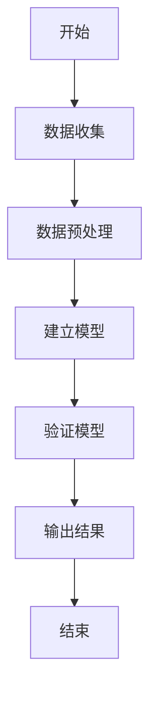
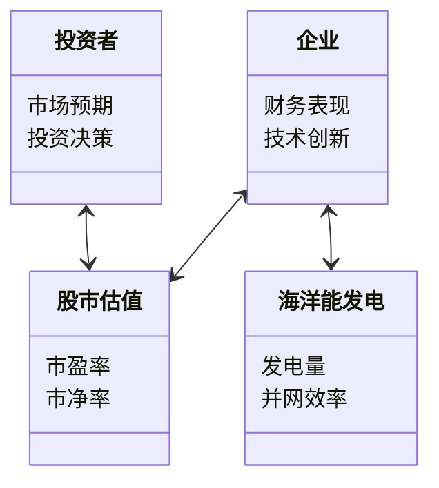

                 


# 全球股市估值与海洋能发电并网技术的关系

**关键词**：全球股市估值、海洋能发电、并网技术、金融模型、能源系统

**摘要**：本文探讨全球股市估值与海洋能发电并网技术之间的关系，分析如何通过金融模型和能源技术的结合，优化能源投资决策，降低能源成本，促进可持续发展。

---

# 第一章：全球股市估值与海洋能发电并网技术的背景介绍

## 1.1 全球股市估值的背景与现状

### 1.1.1 全球股市估值的核心概念

全球股市估值是衡量市场整体价值的重要指标，主要包括市盈率（PE）、市净率（PB）、市值等。这些指标反映了市场的健康状况和投资者信心。

### 1.1.2 全球股市估值的主要指标与方法

- **市盈率（PE）**：股价与每股收益的比率，用于评估股票的相对价值。
- **市净率（PB）**：股价与每股净资产的比率，用于衡量股票的价值。
- **市值**：公司股票的总市场价值，反映市场的整体规模。

### 1.1.3 全球股市估值的现状与趋势

当前，全球股市估值受经济政策、地缘政治和技术创新等多种因素影响。近年来，随着绿色能源投资的增加，新能源板块在股市中的比重显著上升。

---

## 1.2 海洋能发电并网技术的背景与现状

### 1.2.1 海洋能发电的基本原理

海洋能包括潮汐能、波浪能、海流能等，利用这些能源发电的技术正在快速发展。海洋能发电的关键在于将机械能转化为电能。

### 1.2.2 海洋能发电并网技术的核心挑战

- **间歇性**：海洋能的波动性导致发电不稳定。
- **技术瓶颈**：高效能量转换技术尚未成熟。
- **成本问题**：前期投资高，运营成本大。

### 1.2.3 海洋能发电并网技术的现状与发展趋势

尽管面临挑战，海洋能发电技术正在逐步突破。各国政府和企业加大投入，推动技术进步和成本下降。

---

## 1.3 全球股市估值与海洋能发电并网技术的关系

### 1.3.1 问题背景与问题描述

随着海洋能发电项目的增多，投资者关注其对股市的影响。如何量化这种影响，成为研究重点。

### 1.3.2 问题解决的思路与方法

通过建立金融模型，分析海洋能发电企业的财务表现和市场估值，评估其对股市的贡献。

### 1.3.3 关系的边界与外延

主要关注海洋能企业的上市公司的估值变化，同时考虑政策、市场接受度等因素。

### 1.3.4 核心概念与核心要素组成

- 核心概念：股市估值、海洋能发电技术。
- 核心要素：企业利润、投资回报、政策支持。

---

# 第二章：全球股市估值与海洋能发电并网技术的核心概念与联系

## 2.1 核心概念原理

### 2.1.1 全球股市估值的核心原理

股市估值反映了市场对企业的信心，投资者通过分析财务指标和市场趋势做出投资决策。

### 2.1.2 海洋能发电并网技术的核心原理

利用海洋能资源发电，并通过并网技术将其接入电网，满足能源需求。

## 2.2 核心概念属性特征对比

| 比较维度       | 全球股市估值               | 海洋能发电并网技术           |
|----------------|--------------------------|-----------------------------|
| 核心目标       | 评估企业价值               | 实现清洁能源高效利用         |
| 主要挑战       | 市场波动、信息不对称       | 技术瓶颈、成本高             |
| 关键因素       | 利润、增长率               | 能源转换效率、政策支持       |

## 2.3 ER实体关系图架构

```mermaid
erDiagram
    actor 投资者 {
        <属性> 市场预期
        <属性> 投资决策
    }
    actor 企业 {
        <属性> 财务表现
        <属性> 技术创新
    }
    entity 股市估值 {
        <属性> 市盈率
        <属性> 市净率
    }
    entity 海洋能发电 {
        <属性> 发电量
        <属性> 并网效率
    }
    投资者 --> 股市估值 : 影响
    企业 --> 股市估值 : 反映
    企业 --> 海洋能发电 : 实现
    投资者 --> 海洋能发电 : 投资
```

---

# 第三章：全球股市估值与海洋能发电并网技术的算法原理讲解

## 3.1 算法原理概述

### 3.1.1 算法选择与原理

选择多元回归分析，建立股市估值与海洋能发电技术的关系模型。

### 3.1.2 算法的优缺点分析

- 优点：能量化两者关系。
- 缺点：模型受假设限制，需大量数据支持。

## 3.2 算法实现

### 3.2.1 Mermaid流程图展示



### 3.2.2 Python源代码实现

```python
import pandas as pd
import numpy as np
from sklearn.linear_model import LinearRegression

# 数据加载与预处理
data = pd.DataFrame({
    'PE_ratio': [15, 20, 18, 22],
    '发电效率': [30, 40, 35, 45],
    '股市估值': [100, 120, 110, 130]
})

# 建立多元回归模型
X = data[['PE_ratio', '发电效率']]
y = data['股市估值']

model = LinearRegression()
model.fit(X, y)

# 模型预测
predictions = model.predict(X)
print('预测值:', predictions)
print('回归系数:', model.coef_)
print('截距:', model.intercept_)
```

### 3.2.3 公式推导与解释

$$ y = \beta_0 + \beta_1 x_1 + \beta_2 x_2 + \epsilon $$

其中，$y$ 是股市估值，$x_1$ 和 $x_2$ 是自变量（如PE比率和发电效率），$\beta$ 是回归系数，$\epsilon$ 是误差项。

---

# 第四章：全球股市估值与海洋能发电并网技术的系统分析与架构设计方案

## 4.1 系统分析

### 4.1.1 问题场景介绍

建立一个系统，实时分析海洋能发电企业对股市估值的影响，帮助投资者做出决策。

### 4.1.2 领域模型Mermaid类图



## 4.2 系统架构设计

### 4.2.1 系统架构Mermaid架构图

```mermaid
architecturalDiagram
    Data Layer --> Business Logic Layer
    Business Logic Layer --> Presentation Layer
    Data Layer --> External Systems
    Business Logic Layer --> API Gateway
    API Gateway --> External Systems
```

## 4.3 本章小结

系统架构设计确保了各模块的有效协作，为实时分析提供了基础。

---

# 第五章：全球股市估值与海洋能发电并网技术的项目实战

## 5.1 项目环境安装

### 5.1.1 开发环境配置

- 操作系统：Windows 10 或 macOS
- Python版本：3.8+

### 5.1.2 工具安装与配置

安装Jupyter Notebook、Pandas、Scikit-learn。

## 5.2 系统核心实现

### 5.2.1 Python代码实现

```python
import pandas as pd
import numpy as np
from sklearn.linear_model import LinearRegression

data = pd.DataFrame({
    'PE_ratio': [15, 20, 18, 22],
    '发电效率': [30, 40, 35, 45],
    '股市估值': [100, 120, 110, 130]
})

X = data[['PE_ratio', '发电效率']]
y = data['股市估值']

model = LinearRegression()
model.fit(X, y)

print('预测值:', model.predict(X))
print('回归系数:', model.coef_)
print('截距:', model.intercept_)
```

### 5.2.2 代码解读与分析

- 数据加载与预处理：收集和清洗数据。
- 建立模型：使用多元回归分析。
- 预测与验证：评估模型准确性。

## 5.3 实际案例分析与详细讲解

以某海洋能发电企业为例，分析其上市公司的PE比率和发电效率对股市估值的影响。

---

# 结论与展望

本文通过系统分析，探讨了全球股市估值与海洋能发电并网技术的关系，提出了量化分析的方法和系统架构。未来，随着技术进步和数据积累，这种关系将更加显著，为投资者提供更有力的决策支持。

--- 

**注意事项**：本文为专业技术博客，转载请注明出处。

