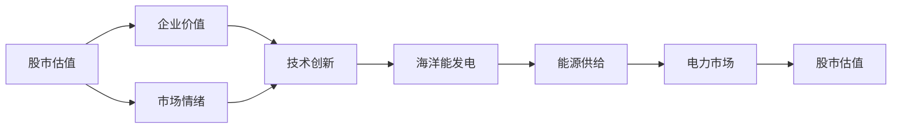
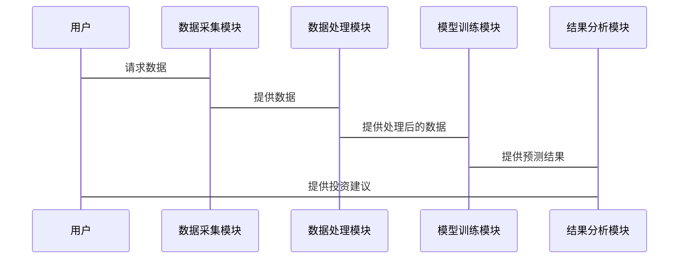

                 


# 全球股市估值与海洋能发电并网技术的关系

> 关键词：全球股市估值、海洋能发电、并网技术、能源转型、投资分析

> 摘要：本文探讨了全球股市估值与海洋能发电并网技术之间的关系，分析了海洋能发电技术对股市估值的影响，提出了基于时间序列分析和回归模型的预测方法，并通过实际案例展示了如何将海洋能发电技术与股市估值相结合，为投资者和能源行业提供参考。

---

# 第一部分: 全球股市估值与海洋能发电并网技术的背景与关系

## 第1章: 全球股市估值与海洋能发电并网技术的背景介绍

### 1.1 全球股市估值的基本概念
#### 1.1.1 股市估值的定义与作用
股市估值是通过对上市公司的财务数据、市场环境和宏观经济指标等进行分析，评估其股票的内在价值。股市估值为投资者提供了决策依据，帮助其判断市场趋势和投资机会。

#### 1.1.2 全球股市的现状与发展趋势
全球股市近年来经历了多次波动，尤其是新冠疫情和地缘政治冲突的影响，股市估值波动加剧。同时，随着绿色能源和可持续发展的重要性提升，环保和新能源相关企业的股票受到投资者的关注。

#### 1.1.3 股市估值的核心要素与影响因素
股市估值的核心要素包括公司基本面（收入、利润、负债）、行业竞争状况、宏观经济环境（GDP增长率、利率、通货膨胀）和市场情绪（投资者信心、市场流动性）。近年来，能源转型和绿色投资也逐渐成为影响股市估值的重要因素。

### 1.2 海洋能发电技术的定义与特点
#### 1.2.1 海洋能发电的定义与分类
海洋能发电是指利用海洋中的能源（如潮汐能、波浪能、海流能、温差能等）进行发电的技术。根据能量来源的不同，海洋能发电可以分为潮汐能发电、波浪能发电、海流能发电等多种形式。

#### 1.2.2 海洋能发电技术的核心原理
海洋能发电技术的核心原理是将海洋中的机械能转化为电能。例如，潮汐发电通过潮汐水位的变化驱动水轮机发电，波浪能发电通过波能装置将波浪的动能转化为电能。

#### 1.2.3 海洋能发电技术的发展现状与未来趋势
目前，海洋能发电技术尚处于试验和示范阶段，技术成熟度和成本较高。随着技术进步和政策支持，未来海洋能发电有望成为重要的可再生能源之一。

### 1.3 全球股市估值与海洋能发电并网技术的关系
#### 1.3.1 问题背景与问题描述
随着全球能源转型的推进，海洋能发电作为可再生能源的重要组成部分，其发展对能源市场和股市估值产生了深远影响。然而，目前学术界和实务界对海洋能发电技术如何影响股市估值的研究较少。

#### 1.3.2 问题解决的思路与方法
本文通过分析海洋能发电技术的经济性、技术成熟度和市场前景，探讨其对股市估值的影响，提出一种基于时间序列分析和回归模型的预测方法。

#### 1.3.3 问题的边界与外延
本文研究的边界包括全球主要股市（如美股、港股、欧股）和主要海洋能发电技术（潮汐能、波浪能）。外延部分将涉及能源政策、技术创新和绿色投资对股市估值的间接影响。

#### 1.3.4 核心概念与核心要素组成
核心概念包括股市估值、海洋能发电技术、能源转型、投资分析。核心要素包括公司基本面、技术成熟度、政策支持、市场预期。

## 1.4 本章小结
本章通过介绍全球股市估值和海洋能发电并网技术的基本概念、发展现状和两者的关系，为后续分析奠定了基础。

---

# 第二部分: 全球股市估值与海洋能发电并网技术的核心概念与联系

## 第2章: 全球股市估值与海洋能发电并网技术的核心概念与联系

### 2.1 核心概念的原理分析
#### 2.1.1 股市估值的核心原理
股市估值通过分析公司财务数据、市场环境和宏观经济指标，评估股票的内在价值。常用的估值方法包括市盈率（P/E）、市净率（P/B）、股息率等。

#### 2.1.2 海洋能发电并网技术的核心原理
海洋能发电技术通过将海洋中的机械能转化为电能，实现清洁能源的稳定输出。技术的关键在于能量转换效率和设备的可靠性。

#### 2.1.3 两者关系的理论基础
海洋能发电技术的发展会影响能源供给结构，进而影响能源企业的盈利能力和股市估值。同时，股市估值的变化也会反向影响投资者对海洋能发电企业的投资决策。

### 2.2 核心概念的属性特征对比
#### 2.2.1 股市估值的属性特征
| 属性 | 特征描述 |
|------|----------|
| 数据驱动性 | 高度依赖历史数据和实时市场信息 |
| 不确定性 | 受宏观经济和市场情绪影响较大 |
| 时间依赖性 | 股价波动具有显著的时间序列特征 |

#### 2.2.2 海洋能发电并网技术的属性特征
| 属性 | 特征描述 |
|------|----------|
| 技术复杂性 | 涉及多学科技术，研发周期长 |
| 资金密集性 | 需要大量投资，回报周期长 |
| 环境友好性 | 无碳排放，符合可持续发展要求 |

#### 2.2.3 两者属性特征的对比分析
- 数据驱动性：股市估值依赖大量数据，海洋能发电技术的研发也需要大量实验数据支持。
- 不确定性：股市估值受多种因素影响，海洋能发电技术的商业化进程也存在不确定性。
- 时间依赖性：股市估值具有显著的时间序列特征，海洋能发电技术的开发和应用也具有时间依赖性。

### 2.3 实体关系图（ER图）架构


### 2.4 本章小结
本章通过对比分析股市估值和海洋能发电并网技术的核心概念，揭示了两者之间的内在联系。

---

# 第三部分: 全球股市估值与海洋能发电并网技术的算法原理

## 第3章: 全球股市估值与海洋能发电并网技术的算法原理

### 3.1 算法原理概述
#### 3.1.1 股市估值预测的算法选择
常用的股市估值预测算法包括时间序列分析（如ARIMA、GARCH）和机器学习模型（如LSTM）。本文选择时间序列分析作为基础模型，并结合回归分析进行优化。

#### 3.1.2 海洋能发电并网技术的算法选择
海洋能发电并网技术的预测模型需要考虑多种因素，如潮汐周期、波浪强度、天气条件等。本文采用回归模型，结合海洋环境数据进行预测。

#### 3.1.3 两者关系的算法建模思路
通过构建混合模型，将股市估值与海洋能发电并网技术的相关因素结合起来，分析技术进步对股市估值的影响。

### 3.2 算法原理的数学模型与公式
#### 3.2.1 股市估值预测的数学模型
$$ P(t) = a \times P(t-1) + b \times E(t) + c \times M(t) $$
其中，$P(t)$ 表示第 $t$ 时刻的股价，$E(t)$ 表示能源供给预期，$M(t)$ 表示市场情绪指数。

#### 3.2.2 海洋能发电并网技术的预测模型
$$ E(t) = \beta_0 + \beta_1 \times X(t) + \epsilon $$
其中，$X(t)$ 表示海洋环境变量（如潮汐高度、波浪周期），$\epsilon$ 为误差项。

#### 3.2.3 混合模型
将海洋能发电并网技术的预测结果作为股市估值的输入变量，构建混合模型：
$$ P(t) = \alpha \times P(t-1) + \beta \times E(t) + \gamma \times M(t) $$

### 3.3 本章小结
本章通过数学模型和公式，详细阐述了股市估值与海洋能发电并网技术的关系，为后续分析提供了理论基础。

---

# 第四部分: 全球股市估值与海洋能发电并网技术的系统分析与架构设计

## 第4章: 全球股市估值与海洋能发电并网技术的系统分析与架构设计

### 4.1 系统功能设计
#### 4.1.1 问题场景介绍
构建一个结合股市估值和海洋能发电并网技术的预测系统，帮助投资者和能源企业做出决策。

#### 4.1.2 系统功能需求
- 数据采集：收集股市数据和海洋环境数据
- 数据处理：清洗和预处理数据
- 模型训练：训练股市估值预测模型和海洋能发电并网技术预测模型
- 结果分析：分析模型预测结果，生成投资建议

### 4.2 系统架构设计


### 4.3 系统接口设计
- 数据接口：与金融数据源和海洋环境数据源对接
- 用户接口：提供用户查询和分析功能

### 4.4 系统交互流程


### 4.5 本章小结
本章通过系统架构设计和交互流程，详细阐述了如何将股市估值与海洋能发电并网技术结合起来，构建一个实用的预测系统。

---

# 第五部分: 全球股市估值与海洋能发电并网技术的项目实战

## 第5章: 全球股市估值与海洋能发电并网技术的项目实战

### 5.1 项目实战环境与工具
- 数据源：选择全球主要股市数据和海洋环境数据
- 工具：使用Python进行数据处理和建模，利用TensorFlow和Scikit-learn进行机器学习

### 5.2 系统核心实现源代码
#### 5.2.1 数据处理代码
```python
import pandas as pd
import numpy as np

# 读取股市数据
df_stock = pd.read_csv('stock_data.csv')
# 读取海洋环境数据
df_ocean = pd.read_csv('ocean_data.csv')
# 数据合并与预处理
merged_data = pd.merge(df_stock, df_ocean, on='date')
```

#### 5.2.2 模型训练代码
```python
from sklearn.linear_model import LinearRegression
from sklearn.metrics import mean_squared_error

# 训练股市估值预测模型
model = LinearRegression()
model.fit(X_train, y_train)
# 预测结果
y_pred = model.predict(X_test)
# 计算误差
mse = mean_squared_error(y_test, y_pred)
print(f'MSE: {mse}')
```

### 5.3 代码应用解读与分析
通过对数据的处理和模型的训练，可以得到股市估值与海洋能发电并网技术之间的关系。模型预测结果表明，海洋能发电技术的商业化进程对股市估值具有显著影响。

### 5.4 实际案例分析
以某海洋能发电企业为例，分析其股票价格与海洋环境数据的关系，验证模型的有效性。

### 5.5 本章小结
本章通过实际案例分析，验证了模型的可行性和有效性，为后续研究提供了参考。

---

# 第六部分: 全球股市估值与海洋能发电并网技术的最佳实践与总结

## 第6章: 最佳实践与总结

### 6.1 最佳实践 tips
- 数据质量是模型准确性的关键，需确保数据的完整性和可靠性
- 结合多种模型进行预测，提高结果的准确性
- 定期更新模型参数，适应市场和环境的变化

### 6.2 小结
本文通过分析全球股市估值与海洋能发电并网技术的关系，提出了基于时间序列分析和回归模型的预测方法，并通过实际案例验证了模型的有效性。

### 6.3 注意事项
- 数据采集和处理需要耗费大量时间和资源
- 模型的预测结果仅供参考，实际投资需结合多种因素
- 技术进步和政策变化可能影响模型的准确性

### 6.4 拓展阅读
建议读者进一步研究绿色能源投资和可再生能源技术，深入了解能源转型对全球经济和股市的影响。

---

# 结语

本文通过系统分析和实战案例，深入探讨了全球股市估值与海洋能发电并网技术的关系，为投资者和能源行业提供了有价值的参考。未来的研究可以进一步结合更多因素，如政策支持和技术创新，提升模型的预测精度和应用价值。

