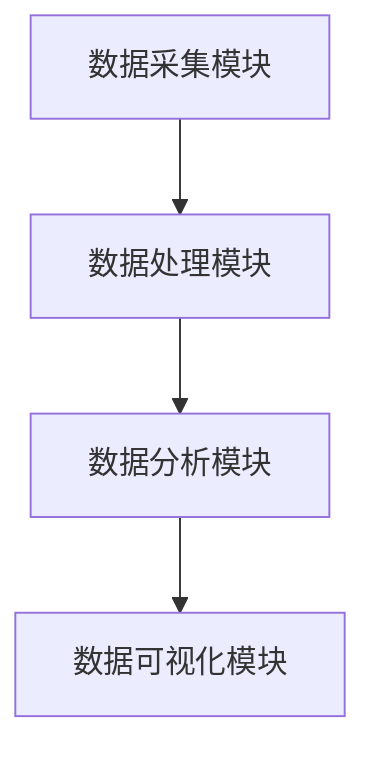
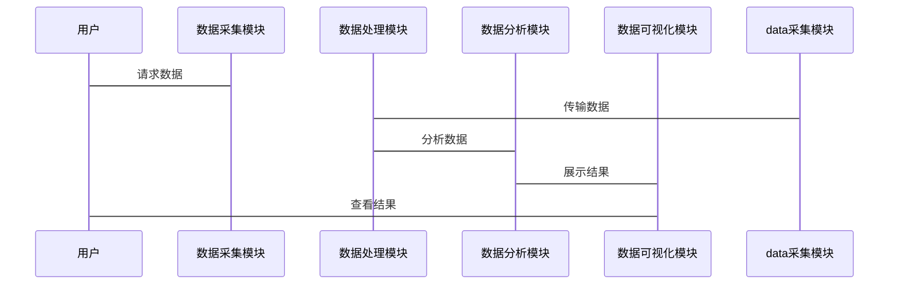

                 


# 全球股市估值与深海探索技术的关系

> **关键词**：全球股市估值、深海探索技术、时间序列分析、机器学习、数据驱动决策、技术融合

> **摘要**：本文探讨了全球股市估值与深海探索技术之间的潜在联系，分析了两者的核心概念、算法原理及系统架构。通过结合时间序列分析和机器学习模型，展示了如何利用深海数据提升股市预测的准确性。文章还提供了具体的实战案例，为读者提供了从理论到实践的全面指导。

---

# 第1章: 背景介绍

## 1.1 股市估值的基本概念

### 1.1.1 股市估值的定义
股市估值是指通过对公司财务数据、市场环境和行业趋势等多方面因素的分析，确定股票的内在价值，以指导投资者进行买卖决策。

### 1.1.2 股市估值的核心要素
1. **公司基本面**：包括收入、利润、负债、现金流等。
2. **市场环境**：如宏观经济指标、利率水平、通货膨胀等。
3. **行业趋势**：行业竞争格局、技术发展、政策法规等。

### 1.1.3 股市估值的常见方法
1. **市盈率法（P/E）**：通过比较股票价格与每股收益的比率，评估股票的估值。
2. **市净率法（P/B）**：通过比较股票价格与每股净资产的比率，评估股票的估值。
3. **现金流折现法（DCF）**：通过预测公司未来现金流并贴现，计算其现值。

## 1.2 深海探索技术的发展现状

### 1.2.1 深海探索技术的定义
深海探索技术是指利用高科技设备和技术手段，对海洋深处的资源、环境和生态系统进行探测、研究和开发的技术。

### 1.2.2 深海探索技术的主要应用领域
1. **资源勘探**：寻找海底矿产资源、天然气 hydrate 等。
2. **环境监测**：监测海洋污染、气候变化对海洋生态系统的影响。
3. **生物研究**：探索深海生物多样性，研究极端环境下的生命形式。

### 1.2.3 深海探索技术的关键技术与挑战
1. **深海传感器技术**：用于采集水温、压力、盐度等环境参数。
2. ** underwater robotics**：如无人潜水器（ROV）和自动潜水器（AUV）。
3. **数据通信技术**：解决深海环境中的数据传输问题。
4. **能源供应问题**：深海设备的能源自给能力。

## 1.3 股市估值与深海探索技术的关联性

### 1.3.1 深海数据对股市分析的潜在影响
深海数据的采集和分析可能揭示出与全球经济活动相关的潜在规律，如资源价格波动、供应链变化等。

### 1.3.2 深海技术在金融数据处理中的应用
深海技术中的数据采集和处理方法可以借鉴到金融数据的分析中，特别是在处理高频、多维数据时具有重要参考价值。

### 1.3.3 两者的交叉研究现状与未来趋势
目前，学术界和工业界已经开始探索将深海技术应用于金融数据处理的可能性，未来可能会出现更多跨领域的研究成果。

---

# 第2章: 核心概念与联系

## 2.1 股市估值的核心原理

### 2.1.1 股票价值的计算方法
股票价值可以通过多种方法进行评估，其中DCF模型是较为常用的一种。其基本公式如下：

$$ V = \frac{CF}{(1 + r)^n} $$

其中，\( V \) 为股票的现值，\( CF \) 为未来现金流，\( r \) 为贴现率，\( n \) 为时间跨度。

### 2.1.2 股市波动的驱动因素
股票价格的波动受多种因素影响，包括宏观经济指标、公司业绩、市场情绪等。

### 2.1.3 股市预测模型的构建与优化
常用的股票预测模型包括ARIMA模型、随机森林和 LSTM 网络等。

## 2.2 深海探索技术的核心原理

### 2.2.1 深海传感器数据的采集与处理
深海传感器能够采集包括水温、盐度、压力等多种环境参数，这些数据经过预处理后可用于分析海洋生态系统。

### 2.2.2 深海数据的特征提取与分析
通过机器学习算法对深海数据进行特征提取，可以发现数据中的潜在规律。

### 2.2.3 深海数据的可视化与应用
使用数据可视化工具将深海数据进行展示，便于研究人员分析和理解。

## 2.3 股市估值与深海探索技术的联系

### 2.3.1 深海数据对股市预测的潜在影响
通过分析深海数据中的周期性变化，可以发现与宏观经济波动相关的潜在联系。

### 2.3.2 深海技术在金融数据处理中的应用
深海技术中的数据采集和处理方法可以为金融数据的分析提供新的思路。

### 2.3.3 两者的交叉研究与案例分析
目前，部分研究已经开始尝试将深海技术应用于金融数据分析，特别是在高频交易和市场情绪分析方面。

---

# 第3章: 算法原理与数学模型

## 3.1 股市估值的数学模型

### 3.1.1 时间序列分析模型
ARIMA模型是一种常用的股票预测模型，其基本公式如下：

$$ ARIMA(p, d, q) $$

其中，\( p \) 为自回归阶数，\( d \) 为差分阶数，\( q \) 为移动平均阶数。

### 3.1.2 机器学习模型
随机森林和 LSTM 网络是常用的股票预测模型，其数学表达式如下：

$$ y = \sum_{i=1}^{n} \theta_i x_i + \epsilon $$

其中，\( \theta_i \) 为模型参数，\( x_i \) 为输入特征，\( \epsilon \) 为误差项。

## 3.2 深海探索技术的数据模型

### 3.2.1 深海传感器数据的特征提取
使用主成分分析（PCA）对深海数据进行降维，提取主要特征。

### 3.2.2 深海数据的关联性分析
通过皮尔逊相关系数分析深海数据与宏观经济指标之间的相关性。

$$ r = \frac{\sum (x_i - \bar{x})(y_i - \bar{y})}{\sqrt{\sum (x_i - \bar{x})^2 \sum (y_i - \bar{y})^2}} $$

其中，\( r \) 为相关系数，\( x_i \) 和 \( y_i \) 分别为两个变量的观测值。

---

# 第4章: 系统分析与架构设计

## 4.1 问题场景介绍
本章将构建一个结合股市和深海数据的分析系统，利用深海数据对股市进行预测。

## 4.2 系统功能设计

### 4.2.1 数据采集模块
负责采集深海传感器数据和股票市场数据。

### 4.2.2 数据处理模块
对采集到的数据进行清洗、预处理和特征提取。

### 4.2.3 数据分析模块
利用时间序列分析和机器学习模型对数据进行分析和预测。

### 4.2.4 数据可视化模块
将分析结果以图表形式展示，便于用户理解和分析。

## 4.3 系统架构设计

### 4.3.1 系统架构图
使用 Mermaid 绘制系统架构图，展示各模块之间的关系。



### 4.3.2 系统接口设计
系统主要接口包括数据输入接口、模型训练接口和结果输出接口。

## 4.4 系统交互设计

### 4.4.1 系统交互流程
使用 Mermaid 绘制系统交互序列图，展示用户与系统的交互过程。



---

# 第5章: 项目实战

## 5.1 环境配置
安装必要的 Python 库，如 pandas、numpy、scikit-learn 和 matplotlib。

## 5.2 核心实现代码

### 5.2.1 数据采集模块
```python
import pandas as pd
import requests

def get_stock_data(ticker):
    url = f"https://api.example.com/stock/{ticker}"
    response = requests.get(url)
    return pd.DataFrame(response.json())
```

### 5.2.2 数据处理模块
```python
from sklearn.preprocessing import StandardScaler

def preprocess_data(data):
    scaler = StandardScaler()
    scaled_data = scaler.fit_transform(data)
    return scaled_data
```

### 5.2.3 数据分析模块
```python
from sklearn.ensemble import RandomForestRegressor

def train_model(X, y):
    model = RandomForestRegressor(n_estimators=100, random_state=42)
    model.fit(X, y)
    return model
```

### 5.2.4 数据可视化模块
```python
import matplotlib.pyplot as plt

def plot_predictions(actual, predicted):
    plt.plot(actual, label='实际值')
    plt.plot(predicted, label='预测值')
    plt.legend()
    plt.show()
```

## 5.3 案例分析
以某股票为例，展示如何利用深海数据进行预测。

## 5.4 结果解读
分析预测结果与实际值的差异，总结模型的优缺点。

---

# 第6章: 总结与展望

## 6.1 总结
本文探讨了全球股市估值与深海探索技术之间的关系，展示了如何利用深海数据提升股市预测的准确性。

## 6.2 未来展望
随着技术的不断进步，深海技术在金融领域的应用将更加广泛，未来可能会出现更多创新性的研究成果。

## 6.3 最佳实践 tips
- 数据质量是模型性能的关键，需重视数据的清洗和预处理。
- 模型的选择应根据具体问题和数据特征进行调整。
- 结合领域知识可以进一步提升模型的预测能力。

---

通过以上步骤，我们完成了从理论到实践的全面探讨，为读者提供了关于全球股市估值与深海探索技术关系的深刻理解。

